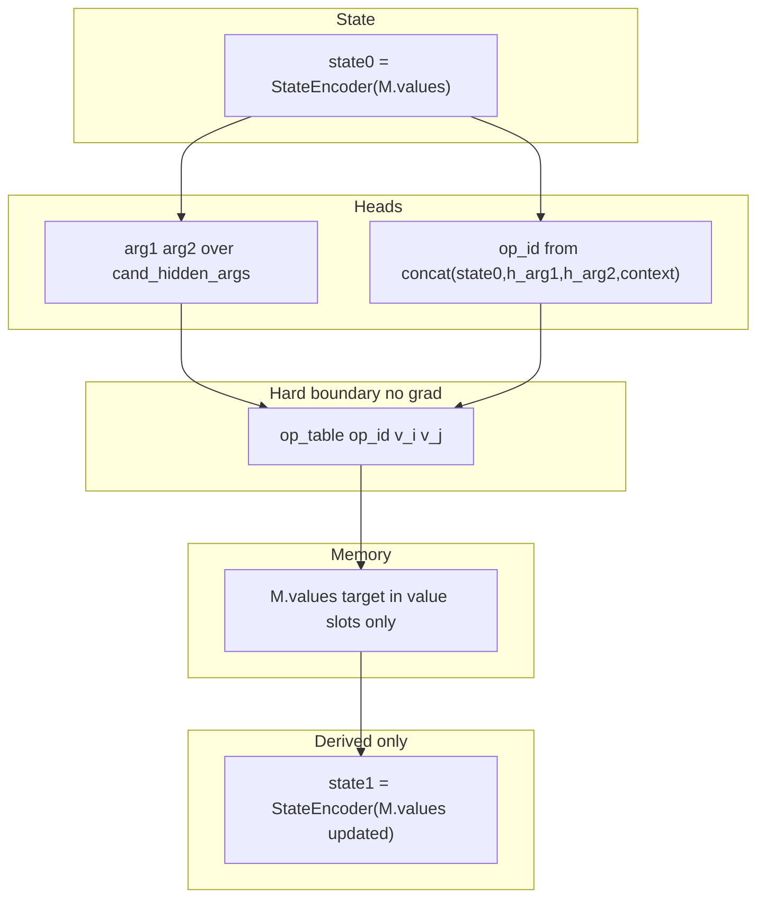

# ExecutionBlock refactor — aligned with [executionblockiterations.md](executionblockiterations.md)

This plan **supersedes** the earlier scratch-slot FSM sketch. It follows the **hard corrections** spec: **no backward compatibility**, **no compatibility layers**, **no unused paths**.

## Objective (final invariant)

```
state₀ = derived from memory (values only)
→ (op, arg_indices) via learned heads
→ deterministic execution (op_table)
→ memory update (single source of truth)
→ state₁ = derived from updated memory (NOT written)
```

## Non-negotiable rules (from spec)

1. **`ExecutionMemory.values` is the ONLY source of numeric truth** for execution.
2. **All math MUST run through `op_table`** — no learned soft-mix arithmetic ([`FourOpMixGradFn`](resources/models/GRIM-text/Layers/ExecutionBlock/execution_block_GPU.cu) / [`kernelFourOpMixForward`](resources/models/GRIM-text/Layers/ExecutionBlock/execution_block_GPU.cu) removed).
3. **State is never written directly** — only **`StateEncoder(M.values[, mask])`** produces `state0` / `state1`.
4. **Scratch slots are NOT state storage** — auxiliary only (routing context, intermediate embeddings, op/context hints). They **must not** store numeric truth, act as execution sources, or appear in arg candidate sets.
5. **Exactly ONE write path for values** — into **value slots** `[S .. V-1]` only.

Violation = incorrect implementation (fail hard in validation where possible).

## Design note: ScratchBlock vs execution truth

- **[`ScratchBlockReasoning_GPU.cu`](resources/models/GRIM-text/Layers/ScratchBlock/ScratchBlockReasoning_GPU.cu)** — internal representation for the encoder (atom embeddings, masks, features). **Not** the numeric ground-truth source for the execution substrate.
- **Numeric execution** reads/writes **`M.values`** only, per spec.

## REMOVE (hard delete)

| Item | Action |
|------|--------|
| State write head | Delete `p_next_state`, `p_write_state`, any softmax/logits that write “state” into scratch or dedicated state slots |
| Hidden → value for execution | Remove decode MLP path that produces **scalars used in op execution**; `v1`/`v2` must come from **`M.values` at arg indices** (atoms need a defined mapping into value truth — bootstrap / slot fill is outside this step’s math) |
| Learned arithmetic | Remove soft `p_op` mix over four float results; replace with **discrete `op_id` + `op_table[op_id](v_i, v_j)`** |
| Dual writes | No scratch storing “result state” while value slots also hold truth; **only value slots** persist **`v_out`** |
| Blended write across full `V` for truth | Replace with **value-slot-only** write (blending allowed **only** among `[S..V-1]`) |

**Clarification on atoms:** Spec says `v_i = M.values[arg_index]`. Arg candidates are **`atoms + value_slots_only`**. Today atoms use an MLP on embeddings for decoded scalars — that path must **not** feed execution. Implementation must either (a) map atom arg picks to **`M.values`** rows filled at bootstrap for those atoms, or (b) treat atom row indices as keys into a **value buffer aligned with `M.values`** semantics (single truth array). Pick one rule and validate.

## ADD / REPLACE

### 1. True state encoder (critical)

**Replace** `state0 = M.state_embeds[scratch_slot]`.

**With:**

```text
state0 = StateEncoder(M.values, M.valid_mask)
```

Options (pick one, values-only input):

- **Option A (minimum):** mean pool over **valid value slots** `[S..V-1]` (project scalars → `d_model` if needed).
- **Option B (preferred):** small attention over value-slot values (learned query from `step`/`context` or fixed).

Output: `state0: [1, d_model]` — **only** state fed to heads.

After write:

```text
state1 = StateEncoder(M.values_updated, M.valid_mask)
```

**Do not** write `state1` to memory; use only if needed for logging/diagnostics/next layer — spec says derived only.

### 2. Argument selection (strict domain)

- **`C_args = num_atoms + (V - S)`**
- **`kernelGatherCandidateHidden`** → **operand-only** variant: **atoms + value slots `S..V-1` only** — **not** scratch, **not** `M.state_embeds` as arg carriers for numeric truth.
- Arg heads (`w_arg1_select_`, `w_arg2_select_`) operate **only** on `cand_hidden_args`.

### 3. Operation selection (token → id → dispatch)

- Model predicts **`op_id`** (softmax over `num_ops`, or vocabulary mapping **op_token → op_id** if you unify with LM — spec says `op_token → op_id`; implementation choice: keep softmax over ops as **ID logits**).
- **Execution:** `v_out = op_table[op_id](v_i, v_j)` — **fixed** ops (`+ − × ÷` with safe div), **no** gradients through this step.

### 4. Deterministic execution block (core)

```text
v_i = M.values[arg1_slot_or_atom_mapping]
v_j = M.values[arg2_slot_or_atom_mapping]
v_out = op_table[op_id](v_i, v_j)
```

Constraints: no MLP arithmetic, no hidden-decoded floats in this path.

### 5. Single write path (value only)

```text
target_slot ∈ value slots [S .. V-1]
M.values[target_slot] = v_out   // blended softmax only over this range
```

Scratch slots: **never** receive numeric writes for execution results.

### 6. Scratch slot role (strictly limited)

May store **only:** routing context, intermediate embeddings, op/context hints.

Must **never:** store numeric truth, be execution sources, be **selectable as args**.

### 7. Update heads

| Head | Input |
|------|--------|
| **Op** | `concat(state0, h_arg1, h_arg2, context)` — resize `W_op_select_` row dim to `4 * d_model` (breaking checkpoint). |
| **Arg** | `cand_hidden_args` only |

**Remove:** any head that writes state to scratch/memory embeddings as “state storage.”

## Expected pipeline (final)



## Autograd requirements

- **Flow gradients into:** arg selection weights, op selection weights, **StateEncoder** weights, operand gather into `H` (atoms), and any **differentiable** parts before the hard boundary.
- **Do not** backprop through **`op_table` execution** or through **`M.values` read used only as discrete gather for forward** — use **straight-through / stop_gradient** at the boundary; soft arg weights still get gradients from **downstream** terms that are **differentiable** (e.g. if injection or a surrogate path exists). **Concrete design task:** define what remains differentiable after `v_out` (e.g. gated inject into `H` from **`embed(v_out)`** with grads through embed + gate only, not through `v_out` w.r.t. `v_i`).

Document the chosen ST estimator in `DOCUMENTATION.md`.

## Kernel / code changes (primary)

1. **Operand-only gather** — builds `cand_hidden_args`, excludes scratch indices; validates arg indices ∉ scratch.
2. **State encoder kernel(s)** — from `M.values` + mask → `state0` tensor with `GradFn` into encoder weights (and into values if you want — spec emphasizes encoder weights).
3. **Value-only write kernel** — indices `[S..V-1]` only; optional blend softmax restricted to that range.
4. **Hard dispatch** — read `v_i`, `v_j` by **hard index from softmax** (ST) or **soft gather** for training (document if you temporarily use soft gather for stability vs strict ST).

Primary implementation file: [`execution_block_GPU.cu`](resources/models/GRIM-text/Layers/ExecutionBlock/execution_block_GPU.cu).  
Headers / config: [`execution_block_GPU.hpp`](resources/models/GRIM-text/Layers/ExecutionBlock/execution_block_GPU.hpp).

## Validation (fail hard)

- Arg index maps to scratch slot → **FAIL**
- Execution uses MLP/hidden-decoded scalar → **FAIL**
- Multiple truth write paths → **FAIL**
- State written directly to `M.state_embeds` / scratch as “state register” → **FAIL**

No warnings-only for these invariants.

## Diagnostics

- **`ExecutionBlockStepOutput`:** drop `p_next_state`; keep `p_arg1`/`p_arg2` with shape `[1, C_args]`; keep `p_op` as **op_id distribution**; optional expose **`state1`** as **detached** diagnostic from `StateEncoder` (not a head target).
- **Entropy / metrics:** adjust for `C_args`; remove state-head entropy.

## Serialization & migration

- **Breaking:** remove / reshape weights (`W_op_select` rows, remove `FourOpMix`-related graph, decode MLP may remain for **non-execution** uses only — if deleted, bump schema).
- **Do not** preserve old checkpoint layout; document retrain or partial load omit list.

## Files touched (expected)

- [`execution_block_GPU.cu`](resources/models/GRIM-text/Layers/ExecutionBlock/execution_block_GPU.cu), [`execution_block_GPU.hpp`](resources/models/GRIM-text/Layers/ExecutionBlock/execution_block_GPU.hpp)
- [`DOCUMENTATION.md`](resources/models/GRIM-text/Layers/ExecutionBlock/DOCUMENTATION.md)
- [`AutogradTraining.cu`](resources/models/GRIM-text/training/Autograd/AutogradTraining.cu) — memory clear/bootstrap must leave **value slots** consistent for `StateEncoder` (and **scratch** non-truth)
- Serialization: [`Serialization_save.cu`](resources/models/GRIM-text/Layers/Serialization/Serialization_save.cu), [`Serialization_load.cu`](resources/models/GRIM-text/Layers/Serialization/Serialization_load.cu), FlatBuffers schema
- [`TrainingOps.cu`](resources/models/GRIM-text/training/TrainingOps.cu), [`InitinferenceState.cu`](resources/models/GRIM-text/Layers/InitInferenceState/InitinferenceState.cu), [`LanguageModelConfig`](resources/models/GRIM-text/GRIM/grim_language_model_cuda.hpp) — `num_scratch_slots` / `value_slot_begin` **S**

## Success criteria (from spec)

- Identical inputs → identical execution results (deterministic `op_table` path).
- No approximate arithmetic via hidden states in the execution path.
- Single consistent **`M.values`** truth for numeric execution.
- Multi-step **`K`** without duplicate truth write semantics.

## Related

- Slot-referential data plane: [slot-referential_execution_7d963a3c.plan.md](slot-referential_execution_7d963a3c.plan.md) (`token_to_slot_map`, bootstrap into `M.values`) complements this execution refactor.
