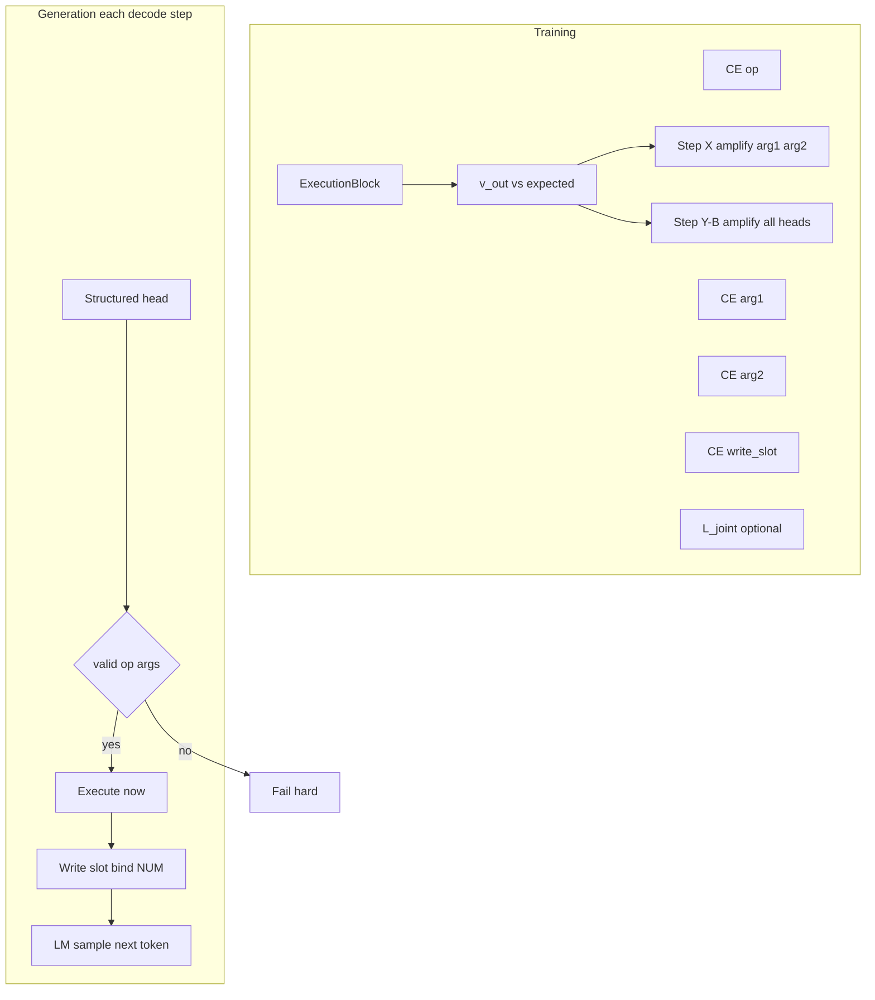

# Execution-first numeric reasoning (plan)

This plan tracks the **current** [.cursor/plans/executionblockiterations.md](.cursor/plans/executionblockiterations.md). **Hard constraint:** the model must **not** solve arithmetic via hidden-state approximation; **ExecutionBlock** is the **only** path to numeric correctness. If training destabilizes, **fix supervision—not these constraints.**

## Goal (from spec)

- Enforce: **(state, op, args) → execution → state'**
- Forbid: **hidden_state → predicted number**

**Core rule:** numeric correctness **must** come **only** from ExecutionBlock. No shortcut that produces the right scalar without the right **op + arguments + transition**.

## No backwards compatibility

- **Do not** keep NumericHead, `kernelNumericLoss`, `predictNumericValue()`, or “optional” fallbacks that reproduce old behavior.
- **Do not** feature-flag the legacy numeric path alongside the new path in the same binary for “gradual migration.” Either the build matches this spec or it is wrong.
- **Do not** load old checkpoints as-is; expect **breakage**. If a checkpoint format is kept, it is only to **error out** with a clear message, not to silently ignore missing structured-head weights.
- **Do not** preserve generation paths that fill `<NUM>` from a value head or leave `token_to_slot_map == -1` for numeric tokens.
- **Do not** downgrade hard failures to warnings in DataLoader, batch build, forward, or decode (no `cerr` + continue for violations of this spec).

If something used to work and now throws, that is **expected** until the rest of the stack is implemented.

## File intent (separation of concerns)

Each area below should stay in **one** primary place. Cross-cutting checks may **duplicate validation** at boundaries (host batch build **and** device forward) but **logic** should not sprawl without reason.

| Intent                                              | Primary files                                                                                                                                                                                                                                                                                       | Must not own                                |
| --------------------------------------------------- | --------------------------------------------------------------------------------------------------------------------------------------------------------------------------------------------------------------------------------------------------------------------------------------------------- | ------------------------------------------- |
| **Spec / rationale**                                | [.cursor/plans/executionblockiterations.md](executionblockiterations.md), this plan                                                                                                                                                                                                                 | Implementation code                         |
| **Batch shape + side-channel truth**                | `[BatchPayload.hpp](resources/models/GRIM-text/Shared/Batching/BatchPayload.hpp)`, `[BatchPayload.cu](resources/models/GRIM-text/Shared/Batching/BatchPayload.cu)`                                                                                                                                  | Execution kernels, loss formulas            |
| **Tokenization + literal → `<NUM>` + slot binding** | `[DataLoader.cu](resources/models/GRIM-text/Shared/DataLoader/DataLoader.cu)`, `[UniByte.cu](resources/models/GRIM-text/Shared/UnigramByte/UniByte.cu)`, `[AtomTable.cu](resources/models/GRIM-text/Shared/UnigramByte/AtomTable.cu)`                                                               | Autograd, ExecutionBlock internals          |
| **Public model API + config knobs**                 | `[grim_language_model_cuda.hpp](resources/models/GRIM-text/GRIM/grim_language_model_cuda.hpp)`, `[ai_config.json](ai_config.json)`                                                                                                                                                                  | CUDA kernel launches                        |
| **Training state + device caches**                  | `[TrainingState_GPU.hpp](resources/models/GRIM-text/Shared/TrainingState/TrainingState_GPU.hpp)`, `[InitTrainingState.cu](resources/models/GRIM-text/training/InitTrainingState.cu)`                                                                                                                | Business rules for “is arithmetic batch”    |
| **Autograd forward + encoder + hook order**         | `[AutogradTraining.cu](resources/models/GRIM-text/training/Autograd/AutogradTraining.cu)`                                                                                                                                                                                                           | ScratchBlock value encoding policy          |
| **Loss assembly (CE, Step X/Y, optional sequence)** | `[AutogradTraining.cu](resources/models/GRIM-text/training/Autograd/AutogradTraining.cu)` (or small dedicated `*Loss*.cu` **called from here only**)                                                                                                                                                | Generation loop                             |
| **Training entry from batch**                       | `[ComputeLossBatch.cu](resources/models/GRIM-text/Shared/Loss/ComputeLoss/ComputeLossBatch.cu)`                                                                                                                                                                                                     | Slot binding in tokenizer                   |
| **LM head (text tokens only)**                      | `[lm_head_GPU.cu](resources/models/GRIM-text/Layers/LMHead/lm_head_GPU.cu)` / [`LMHead` wiring in AutogradTraining]                                                                                                                                                                                 | Numeric answer supervision                  |
| **Structured head (op, slots)**                     | *New or consolidated module* wired like LM head; config in `[grim_language_model_cuda.hpp](resources/models/GRIM-text/GRIM/grim_language_model_cuda.hpp)`                                                                                                                                           | ScratchBlock injection                      |
| **Deterministic ops + slot memory**                 | `[execution_block_GPU.cu](resources/models/GRIM-text/Layers/ExecutionBlock/execution_block_GPU.cu)`, `[execution_block_GPU.hpp](resources/models/GRIM-text/Layers/ExecutionBlock/execution_block_GPU.hpp)`                                                                                          | CE loss (stays in autograd/loss)            |
| **Type-only vs value injection**                    | `[ScratchBlockReasoning_GPU.cu](resources/models/GRIM-text/Layers/ScratchBlock/ScratchBlockReasoning_GPU.cu)`                                                                                                                                                                                       | ExecutionBlock op selection                 |
| **Prefill + incremental decode**                    | `[Inference_GPU.cu](resources/models/GRIM-text/training/Inference_GPU.cu)`                                                                                                                                                                                                                          | Sampling policy details                     |
| **High-level generate API + Step Z loop**           | `[grim_language_model_gpu.cu](resources/models/GRIM-text/Common/grim_language_model_gpu.cu)`                                                                                                                                                                                                        | Low-level tensor alloc in InitTrainingState |
| **Logit masking for literals**                      | `[Sampling.cu](resources/models/GRIM-text/Shared/Sampling/Sampling.cu)`, `[Sampling.hpp](resources/models/GRIM-text/Shared/Sampling/Sampling.hpp)`                                                                                                                                                  | ExecutionBlock                              |
| **Checkpoint I/O**                                  | `[grim_model_serialization.cu](resources/models/GRIM-text/Common/grim_model_serialization.cu)`                                                                                                                                                                                                      | Forward math                                |
| **Remove value head**                               | Delete/strip `[numeric_head_GPU.](resources/models/GRIM-text/Layers/NumericHead/)*`, `[LanguageModel_Training.cu](resources/models/GRIM-text/training/LanguageModel_Training.cu)`, `[InitinferenceState.cu](resources/models/GRIM-text/Layers/InitInferenceState/InitinferenceState.cu)` references | Anything except teardown                    |

## Hard-fail error logic

**Default:** `throw std::runtime_error` with a **specific** message (include batch id / step index / sequence offset when available). **No** silent clamp-and-continue for spec violations. Training may use **full loss penalty** for *invalid logits* where the spec says “full penalty” **and** still **throw** if the situation indicates a **bug** (e.g. corrupted batch metadata).

| Trigger                                                                                                 | When to check                                                                                                                                                                            | Action                                                                   |
| ------------------------------------------------------------------------------------------------------- | ---------------------------------------------------------------------------------------------------------------------------------------------------------------------------------------- | ------------------------------------------------------------------------ |
| `token_numeric_values.size() != token_ids.size()` or atom mask mismatch                                 | `[BatchPayload::validate](resources/models/GRIM-text/Shared/Batching/BatchPayload.hpp)`, `[buildBatchPayload](resources/models/GRIM-text/Shared/Batching/BatchPayload.cu)`               | **Throw**                                                                |
| `<NUM>` (or atom mask) at position `t` but `token_to_slot_map[t]` invalid (`< 0` or `>= num_slots`)     | Batch build + optional forward preflight                                                                                                                                                 | **Throw**                                                                |
| Arithmetic-tagged batch (your flag) but `execution_block_enabled == false` or ExecutionBlock layer null | `[computeLossBatch](resources/models/GRIM-text/Shared/Loss/ComputeLoss/ComputeLossBatch.cu)` / `[initAutogradContext](resources/models/GRIM-text/training/Autograd/AutogradTraining.cu)` | **Throw** (no training step)                                             |
| Ordered step targets missing or length mismatch for arithmetic example                                  | Data loader or batch builder                                                                                                                                                             | **Throw**                                                                |
| Invalid `op` or slot index after argmax / before execute                                                | Training: apply **full structured penalty** and **throw** if indices could not occur with valid teacher (bug); Inference/Step Z: **Throw**                                               |                                                                          |
| Structured validation fails at decode (Step Z)                                                          | `[generateSequenceGPU](resources/models/GRIM-text/Common/grim_language_model_gpu.cu)`                                                                                                    | **Throw** (no execute, no repair)                                        |
| `<NUM>` sampled or appended without bound slot                                                          | Generation loop                                                                                                                                                                          | **Throw**                                                                |
| Dynamic slot id invented (out of fixed `[0, num_slots)`)                                                | Generation / write-back                                                                                                                                                                  | **Throw**                                                                |
| ExecutionBlock internal numeric error flag / NaN slot (existing `d_numeric_error_flag_` path)           | After `executeStep` sync                                                                                                                                                                 | **Throw** (treat as hard failure for arithmetic batches)                 |
| ScratchBlock value features enabled for arithmetic batch                                                | ScratchBlock forward entry                                                                                                                                                               | **Throw** (misconfiguration) or **assert** in debug; release = **throw** |
| Legacy `predictNumericValue` / NumericHead forward still reachable                                      | Static review + runtime assert in dev builds                                                                                                                                             | **Remove**; if called, **throw** “removed”                               |

**Not hard-fail:** `v_out != expected_value` during training → **no throw**; apply Step X / Step Y loss multipliers (that is **learning signal**, not a contract violation).

## Mapping: spec steps → engineering

| Spec   | Requirement                                                                                                                                                                                                                                                 |
| ------ | ----------------------------------------------------------------------------------------------------------------------------------------------------------------------------------------------------------------------------------------------------------- |
| **1**  | Remove **all** value-based supervision (NumericHead / `kernelNumericLoss`, regression on `numeric_values`, any predicted-vs-ground-truth value objective).                                                                                                  |
| **2**  | **Structured supervision only:** per step, targets `op_target`, `arg1_target`, `arg2_target`, `write_slot_target`; `L_total = CE(op)+CE(arg1)+CE(arg2)+CE(write_slot)`. **No numeric loss.**                                                                |
| **3**  | **Execution-grounded correctness:** after each predicted step, run `v_out = ExecutionBlock(op, args)`; if `v_out ≠ expected`, penalize routing (**Steps X–Y**)—still **not** value-prediction training.                                                     |
| **X**  | **Execution-consistency loss (required):** if `v_out ≠ expected`, **amplify** `CE(arg1)` and `CE(arg2)` so weighting **exceeds** base CE—ties numeric correctness to slot selection.                                                                        |
| **Y**  | **Joint structured loss:** auxiliary `L_joint = CE(joint(op, arg1, arg2), target_joint)` over a discretized tuple **or** **simpler:** if execution incorrect, increase loss on **all** structured heads for that step (`op`, `arg1`, `arg2`, `write_slot`). |
| **Z**  | **Generation execution loop:** each decode step—run structured head; if `(op, args)` valid, **execute immediately**, write slot, **bind** next `<NUM>` to that slot; continue LM decoding—execution **interleaved** with token generation.                  |
| **4**  | **Hard disable value leakage** on arithmetic-tagged batches: strip ScratchBlock **log-magnitude, sign, numeric-derived** embeddings; **only** type embedding (“this is a number”). Hidden state must not encode reconstructible magnitudes.                 |
| **5**  | **Execution dependency:** if the answer requires execution, the forward **must** go through ExecutionBlock; **correct value with wrong op** = **wrong**.                                                                                                    |
| **6**  | **Step-wise supervision:** each example supplies an **ordered list of steps** (e.g. `"12+7*3"` → step1 MUL slots…, step2 ADD slots…); **loss per step**—**do not** collapse to single-step supervision.                                                     |
| **7**  | **Invalid predictions:** invalid op or slot indices → **full penalty**, **no** execute fallback, **no** silent correction—**fail hard**.                                                                                                                    |
| **8**  | **No execution ⇒ no learning:** execution skipped or disabled on an arithmetic batch ⇒ **training step fails**.                                                                                                                                             |
| **9**  | **Optional:** after the full sequence, if final slot value ≠ ground truth, apply an **extra penalty** across steps (long-chain signal).                                                                                                                     |
| **10** | **Prevent token-mode collapse:** do **not** use LM head to supervise numeric outputs; mask numeric tokens except `<NUM>`; **no** path to emit raw numeric strings.                                                                                          |

## Step X — Execution-consistency loss (required)

After execution for a supervised step:

1. Compare `v_out` to `expected_value` (ground truth for that step from the teacher trace / executed reference).
2. If `**v_out ≠ expected_value`**, **amplify** the loss on:
  - `**arg1_logits`** (CE against `arg1_target`)
  - `**arg2_logits`** (CE against `arg2_target`)

**Weighting:** the amplified terms must be **strictly stronger** than the base structured CE on those heads (e.g. multiply `CE(arg1)` and `CE(arg2)` by a factor **> 1** when mismatch fires, or add an extra hinge term—choose one scheme in code, document the multiplier in config).

**Purpose:** tie **numeric correctness** (post-execution) to **slot selection quality** so wrong operands are penalized harder than a generic wrong logit without execution feedback.

**Scope:** this is **not** value regression (no MSE on `v_out`). It remains **cross-entropy on slot logits**, gated by execution outcome.

**Implementation:** hook in `[AutogradTraining.cu](resources/models/GRIM-text/training/Autograd/AutogradTraining.cu)` (or dedicated loss module) immediately after the step’s `v_out` is available; apply multiplier only on mismatch; optional: also upweight `CE(op)` if spec later requires—**Step X as written applies only to arg1 and arg2.**

## Step Y — Joint structured loss (auxiliary)

Add a **second** supervision path on top of per-head CE (spec Step 2), to couple **op + operands** in one objective.

**Option A — explicit joint head**

- Build a **joint** logit vector over the Cartesian product (or a feasible subset) of `(op, arg1, arg2)`; teacher provides `target_joint` as a single class index.
- `L_joint = CE(joint_logits, target_joint)` with weight `λ_joint` in total loss.

**Option B — simpler (no extra head)**

- If execution is **incorrect** (`v_out ≠ expected`): **increase loss on all structured components of that step**—i.e. upweight **`CE(op)`**, **`CE(arg1)`**, **`CE(arg2)`**, and **`CE(write_slot)`** together (same multiplier or per-head schedule), **stronger than** the base terms.

**Policy:** Option B **subsumes** narrow Step X if you apply a single global step multiplier; if both Step X and Step Y-B are enabled, define explicitly whether multipliers **stack** or Step Y-B **replaces** Step X to avoid double-counting.

**Purpose:** discourage factorized mistakes (right op, wrong slots) that sum to low per-head CE but wrong execution.

## Step Z — Generation execution loop (interleaved decode)

During **generation**, execution is **not** deferred to end-of-sequence. At **each** decode step:

1. **Run the structured head** on the current hidden state (same encoder output path as training).
2. If the predicted `(op, arg1, arg2)` [and `write_slot` as needed] is **valid** (in-range indices, masks satisfied):
  - **Execute immediately** via ExecutionBlock (deterministic op on slot values).
  - **Write** the result into the chosen slot; update device/host **NumericSpace** side state.
  - **Bind** the next emitted `<NUM>` (when the LM samples it) to that **slot** and refresh `numeric_values` / `token_to_slot_map` for the new position.
3. **Continue** standard token decoding (LM sample / `forwardStep`).

**Rule:** execution is **interleaved** with token generation—each step may advance both **text** and **numeric state**.

**Invalid structured prediction:** follow spec Step 7—**full penalty** in training; at inference **fail hard** or skip execute (no silent fix)—plan default **fail hard** for arithmetic decode.

**Implementation:** `[grim_language_model_gpu.cu](resources/models/GRIM-text/Common/grim_language_model_gpu.cu)` `generateSequenceGPU` / `[Inference_GPU.cu](resources/models/GRIM-text/training/Inference_GPU.cu)` `forwardStep`—refactor the current “sample one token only” loop into **structured head → conditional execute → then** LM logits / sample.

## Data and runtime prerequisites (supports spec, not numbered in source doc)

- **Input literals → slots:** parsing still binds literals to `NumericSpace` / `token_numeric_values` + `token_to_slot_map` (`[BatchPayload](resources/models/GRIM-text/Shared/Batching/BatchPayload.hpp)`, `[DataLoader.cu](resources/models/GRIM-text/Shared/DataLoader/DataLoader.cu)`).
- **Structured head:** `op_logits` `[num_ops]`, `arg1_logits`, `arg2_logits`, `write_slot_logits` each `[num_slots]`—fed by encoder state; used in training, loss, and generation (`[grim_language_model_cuda.hpp](resources/models/GRIM-text/GRIM/grim_language_model_cuda.hpp)`, `[AutogradTraining.cu](resources/models/GRIM-text/training/Autograd/AutogradTraining.cu)`, `[grim_language_model_gpu.cu](resources/models/GRIM-text/Common/grim_language_model_gpu.cu)`).
- **NumericSpace / transitions:** append a record each execution step; write-back slot scalars into side channels for ScratchBlock (type-only) and generation.
- **Generation slot policy:** no `<NUM>` without a bound slot; slots only from **input** or **execution**—no dynamic slot creation; **throw** on violation.

## Current state (ground truth in code)

- `[BatchPayload.cu](resources/models/GRIM-text/Shared/Batching/BatchPayload.cu)` → `[TrainingState_GPU.hpp](resources/models/GRIM-text/Shared/TrainingState/TrainingState_GPU.hpp)` → `[AutogradTraining.cu](resources/models/GRIM-text/training/Autograd/AutogradTraining.cu)`: side channels exist; execution hooks exist mid-encoder.
- `[execution_block_GPU.cu](resources/models/GRIM-text/Layers/ExecutionBlock/execution_block_GPU.cu)`: internal softheads over op/slots + deterministic ops; **not** yet wired to a **single** explicit structured head + **spec Step 2** loss decomposition; **no** first-class per-step teacher schedule in the batch.
- `[AutogradTraining.cu](resources/models/GRIM-text/training/Autograd/AutogradTraining.cu)`: **NumericHead** + `kernelNumericLoss` + `kNumericLossWeight`—**remove** per spec Step 1.
- `[ScratchBlockReasoning_GPU.cu](resources/models/GRIM-text/Layers/ScratchBlock/ScratchBlockReasoning_GPU.cu)`: value features **violate** spec Step 4 for arithmetic batches—must be **gated off** (type-only path).
- `[grim_language_model_gpu.cu](resources/models/GRIM-text/Common/grim_language_model_gpu.cu)`: `predictNumericValue()` / slot `-1` on generate—legacy leakage.
- `[Sampling.cu](resources/models/GRIM-text/Shared/Sampling/Sampling.cu)`: literal numeric tokens not masked per spec Step 10.

## Deliverable (from spec)

Modify:

- **Training loop** — per-step targets, mandatory ExecutionBlock on arithmetic batches, fail if execution off.
- **Loss computation** — structured CE + **Step X** (arg1/arg2 amplification on mismatch) + **Step Y** (`L_joint` and/or full-head upweight) + optional final consistency (spec 9); remove value losses.
- **ScratchBlock** — conditional: arithmetic batches = **type-only** injection (spec 4).
- **Execution integration** — no fallback execute path for invalid logits (spec 7).
- **Generation** — **Step Z** interleaved loop: structured head → execute → write/bind → continue decode (`[grim_language_model_gpu.cu](resources/models/GRIM-text/Common/grim_language_model_gpu.cu)`).

**Do not** add fallbacks. **Do not** preserve value-prediction logic.

## Suggested implementation order

1. **Remove** value supervision and NumericHead path (spec 1).
2. **Batch format** for ordered step targets + **per-step CE** (spec 2, 6).
3. **Structured head** + wire logits to loss and to ExecutionBlock inputs (spec 2, 3) + **Step X** + **Step Y** (joint or full-head mismatch policy—resolve stacking with Step X).
4. **ScratchBlock** arithmetic gating: disable value features (spec 4).
5. **Training guards:** execution mandatory, invalid = hard fail / full penalty (spec 5, 7, 8).
6. **Write-back + NumericSpace trace + generation slot policy.**
7. **Step Z** — refactor `generateSequenceGPU` / `forwardStep` for interleaved structured execute + LM decode.
8. **LM / sampling** isolation (spec 10).
9. **Optional** sequence-level consistency loss (spec 9).

## Testing and fallout

- Update tests and minimal diagnostics to use **step lists**, **no** numeric head loss, **masked** literals, and **fail** when execution disabled on arithmetic batches.
- Checkpoints and configs will break—intentional.

