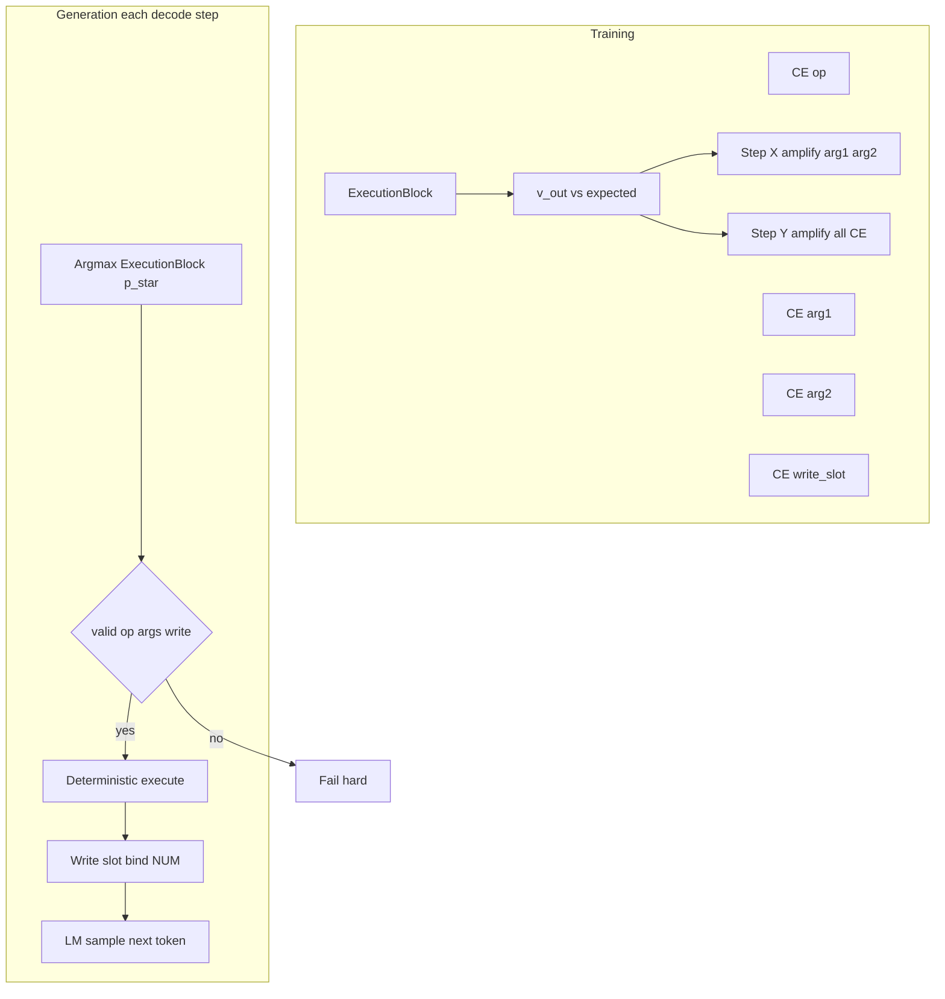

# Execution-first numeric reasoning (plan)

**This file is the single combined plan.** It merges the former [execution-first_remainder_bf7af867.plan.md](execution-first_remainder_bf7af867.plan.md) (remainder checklist) into this document; open **this** file for implementation.

This document and [.cursor/plans/executionblockiterations.md](executionblockiterations.md) are **authoritative**. Implementers must **not** reinterpret, simplify, or substitute alternative designs.

**Hard constraint:** numeric correctness must **not** come from hidden-state inference; **ExecutionBlock** is the **only** path. If training destabilizes, fix supervision—not these constraints.

## Non-negotiable invariants (remainder checklist)

- Execution-first, not prediction-first.
- `<NUM>` is a slot reference, not a value.
- NumericHead permanently removed.
- ScratchBlock is type-only (no numeric authority).
- ExecutionBlock is the only authority over numeric state.
- Reasoning narrative follows (state₀) → (state₁, how, why) — but **slot execution** is not ReasoningHead.
- Invalid slot access → hard failure.
- Missing teacher step (when supervision required) → hard failure.
- ExecutionBlock disabled on arithmetic batch → hard failure.
- No silent fallbacks; no probabilistic numeric outputs.
- **Teacher step index `k` MUST align 1:1 with ExecutionBlock step `k`.** v1: fixed step count only — `len(teacher_steps) == execution_block_num_steps` for every supervised row. No dynamic K, no partial supervision, no padding-as-skip; any mismatch → hard failure.
- `**valid_value_slots(batch_idx, k)`** — single timing everywhere: from `ExecutionMemory` **after** step `k-1` and **before** step `k` (for `k == 0`: after `bootstrapMemoryFromSlotMap`, before first `executeStep`). **Training forward, CE loss, and Step Z** must use this same snapshot. Logits for slots outside the set → **-inf** before softmax (**required**).
- **Generation:** invalid `op_id`, arg not in `valid_value_slots(batch_idx, k)`, or invalid `write_slot` (same rules) → **immediate abort** — **no** fallback LM sampling or alternate decode.
- `**batch_size == 1` is not an acceptable substitute** for correct batched execution memory.

## Baseline already in tree (do not redo)

- NumericHead / value regression removed from model init, autograd loss, serialization, and inference; [predictNumericValue()](resources/models/GRIM-text/training/Inference_GPU.cu) throws.
- ScratchBlock [execution_first_type_only](resources/models/GRIM-text/training/Autograd/AutogradTraining.cu) path when `execution_block_enabled && scratch_block_execution_first_type_only`.
- [computeLossBatch](resources/models/GRIM-text/Shared/Loss/ComputeLoss/ComputeLossBatch.cu) guards: execution on requires ExecutionBlock + ScratchBlock; `<NUM>` with `atom_mask` requires valid `token_to_slot_map`.
- Generation: digit byte tokens masked when `execution_block_enabled`; sampling `<NUM>` throws until Step Z ([grim_language_model_gpu.cu](resources/models/GRIM-text/Common/grim_language_model_gpu.cu)).
- Legacy checkpoints with NumericHead weights rejected in [Serialization_validate.cu](resources/models/GRIM-text/Layers/Serialization/Serialization_validate.cu).

## Authoritative requirements (verbatim policy)

### Hard blocker — fix first

- The system currently uses **one ExecutionMemory for the entire batch** (e.g. [executeAutogradForward](resources/models/GRIM-text/training/Autograd/AutogradTraining.cu) path) — this **violates** the spec and invalidates per-example supervision for `batch_size > 1`.
- **Required:** refactor `ExecutionMemory` to `[batch_size, num_slots, …]`.
- **Update:** `executeStep`, `bootstrapMemoryFromSlotMap`, `crossAttentionRead`, **all** kernels using slot memory.
- **Constraints:** every operation indexes `batch_idx`; **no** shared state across batch rows; any remaining shared state = **hard failure**.
- **Do not continue** with teacher CE, Step Z, or loss refactors until this is **complete**.

### Data layer — teacher steps

- **Exact struct:**

```cpp
struct TeacherStep {
    int op_id;
    int arg1_slot;
    int arg2_slot;
    int write_slot;
    float expected_value;
};
```

- **Per batch row:** `std::vector<TeacherStep> steps`.
- **Extend** [BatchPayload](resources/models/GRIM-text/Shared/Batching/BatchPayload.hpp) + builder; **populate from** [ConceptBlock::execution](DataCollection/concept_block.hpp) (and consistent slot mapping with `token_to_slot_map` / `state_0` as needed).
- **Validate:** `steps.size() == execution_block_num_steps`; slot indices in bounds; mapping consistent.
- **Failure rules — THROW (not warn):** missing steps; step count mismatch; invalid slot index; inconsistent slot mapping. **Remove** `cerr` / warning paths for these cases.

### STEP 3 — Loss (**REPLACE, not add**)

**Current (wrong):** training uses **entropy** (`computeEntropyLoss` over ExecutionBlock step distributions) and/or other **indirect** signals as the main execution supervision. That path must be **removed from the primary loss**, not supplemented.

**Required (primary execution loss):** for **each** execution step `k` (and **each** batch row once memory is batched), the execution part of the objective is:

- `CE(p_op, op_id)`
- `CE(p_arg1, arg1_slot)`
- `CE(p_arg2, arg2_slot)`
- `CE(p_write, write_slot)`

Summed over steps (and rows). Teacher targets come from `TeacherStep` / `BatchPayload`.

**Rules:**

- Use **ONLY** [ExecutionBlockStepOutput](resources/models/GRIM-text/Layers/ExecutionBlock/execution_block_GPU.hpp) tensors: `p_op`, `p_arg1`, `p_arg2`, `p_write` (same tensors that already backprop through `executeStep`).
- **Do NOT** create new heads.
- **Do NOT** reintroduce NumericHead or any value regression on scalars.
- **Mandatory masking:** for each `(batch_idx, k)`, build `valid_value_slots(batch_idx, k)` at the agreed time (post-`(k-1)` pre-`k`). For `p_arg1`, `p_arg2`, and (if same support) `p_write`, set logits for invalid slot indices to **-inf** before softmax / masked CE. **No** unmasked arg softmax in training or inference.
- Teacher `arg1_slot` / `arg2_slot` / `write_slot` MUST lie in the admissible set for that step; otherwise **throw** at batch validation (not a learnable case).

**Entropy:** **demote** to **optional auxiliary** only (e.g. tiny weighted term or off by default). It must **not** be the main gradient source for execution correctness.

**Implementation locus:** [computeAutogradLoss](resources/models/GRIM-text/training/Autograd/AutogradTraining.cu) — **replace** the block that adds `exec_entropy_loss` to `loss_value` as the primary execution signal with the structured CE sum above; keep LM/text CE unchanged except as already specified elsewhere.

### Conflicting path — ReasoningHead

ReasoningHead operates on **atoms**, not **slots**. **Required:** disable or remove ReasoningHead for execution training. **Exactly ONE** execution decision source.

### Execution consistency — Step X / Y

Use **state_after_step** from the transition contract below. Let `v_out` be the scalar in **state_after[write_slot]** after the step (same cell used for teacher `expected_value` comparison).

If `v_out != expected_value` (integer: exact; float: `|Δ| ≤ ε` if configured):

- **Step X:** multiply **CE(arg1)** and **CE(arg2)** by `step_x_multiplier`.
- **Step Y:** multiply **CE(op)**, **CE(arg1)**, **CE(arg2)**, **CE(write)** by `step_y_multiplier`.

**Config:** `step_x_multiplier`, `step_y_multiplier`, `step_y_overrides_x` (bool).

**Behavior:** if `step_y_overrides_x == true` → apply **only** Step Y (multiplier `m_y` on all four CE terms — **no** extra `m_x` on args). Else → apply **both** X and Y: Step Y does **not** replace Step X; effective scales on **value mismatch** are:

- `CE_op *= m_y`, `CE_write *= m_y`
- `CE_arg1 *= m_x * m_y`, `CE_arg2 *= m_x * m_y`

where `m_x` = `step_x_multiplier`, `m_y` = `step_y_multiplier` (each `> 1` when used).

**Value match / mismatch (gating multipliers):** Compare **only** post-execute **slot scalars** (`state_after[write_slot]` vs teacher `expected_value`), not logits. **Integer:** exact equality. **Float:** `|v_out - expected| ≤ ε` with **ε** in [LanguageModelConfig](resources/models/GRIM-text/GRIM/grim_language_model_cuda.hpp) / [ai_config.json](ai_config.json) (**default `1e-6`**). Outcome is **binary** (match → no X/Y scaling on that step for value consistency; mismatch → apply multipliers as above). **No partial credit** by distance.

**Wrong `write_slot` value is not a throw** — it drives Step X / Y multipliers only. **Unintended mutation of other slots is a throw** (see **STATE TRANSITION VALIDITY**).

**Invalid indices / execution errors:** align with [d_numeric_error_flag](resources/models/GRIM-text/Layers/ExecutionBlock/execution_block_GPU.cu) handling; arithmetic batches fail hard after sync on error flags; impossible teacher metadata fails hard at validation.

### STATE TRANSITION VALIDITY (CRITICAL)

**ExecutionBlock must expose both snapshots for every step `k` and every `batch_idx`:**

- **state_before_step:** `ExecutionMemory[batch_idx]` **immediately before** `executeStep` for step `k`.
- **state_after_step:** `ExecutionMemory[batch_idx]` **immediately after** `executeStep` for step `k`.

Implementation may be views, copies, or tensors recorded in the step API — the contract is **observable before/after** per row, not merged across the batch.

**Checks (in order):**

1. **Write-slot value vs teacher (learning signal):**
  If `state_after[write_slot]` (the executed result) **≠** teacher `expected_value` (per domain rules above) → apply **Step Y** (and Step X per stacking) as already specified. **Do not throw** for this alone.
2. **Single-slot mutation contract (hard invariant):**
  Verify that **only** `write_slot` changed in the **semantic register state** compared to `state_before_step`, **unless** the op is explicitly documented in the ExecutionBlock op table as allowing additional slot updates (multi-write ops).  
   **Default:** for every slot `s ≠ write_slot`, slot `s`’s value (and any parallel per-slot fields that define “committed numeric state,” e.g. validity / filled flags per spec) must match `state_before_step` within the same equality rules (exact int; float tolerance where applicable).  
   If **any** slot changes **outside** the allowed set for that `op_id` → **throw** (hard failure). This is a **bug or implementation violation**, not a training signal.
3. **Generation (Step Z):**
  After deterministic `executeStep`, run the **same** transition check; unintended mutation → **abort / throw** immediately (no LM fallback).

**Separation of concerns:** ExecutionBlock **materializes** `state_before_step` / `state_after_step` and should implement or host the **structural** diff (what may change per `op_id`). Loss code applies Step X/Y from the value mismatch; it does **not** soften unintended mutation into a penalty.

### Generation — Step Z

Per decode iteration (see also [executeInferenceForward](resources/models/GRIM-text/training/Inference_GPU.cu) / `forwardStep`):

1. Forward → last-position hidden state (KV path unchanged).
2. Structured decode `(op, arg1, arg2, write_slot)` from ExecutionBlock on current `M`. Compute `**valid_value_slots(batch_idx, k)`** from `M` **after** executed step `k-1`, **before** step `k` — **same timing as training**. Apply **-inf** mask on arg logits (and write if same support); use **temperature → 0 / argmax** for deterministic execute.
3. **Before** execute or LM continuation: if illegal `op_id`, or `arg1` / `arg2` ∉ `valid_value_slots(batch_idx, k)`, or `write_slot` invalid under the same rules → **THROW** and **stop generation** (no fallback token, no re-decode without execution, no repaired hypothesis).
4. Execute **deterministically** into `ExecutionMemory` for the session row; update slots/masks. Run **state_before / state_after** transition check; **throw** on unintended slot mutation.
5. When `<NUM>` is sampled: bind display via `token_to_slot_map` / numeric side channels; remove throw-on-`<NUM>` once binding is wired.
6. Continue LM sampling **only** when steps 2–4 succeed for the execution slice (no silent skip).

**Persistence:** one `ExecutionMemory` (batched shape consistent with inference session) across `forwardStep` calls; clear only in [resetKVCache](resources/models/GRIM-text/training/Inference_GPU.cu). **Still THROW:** invalid op/slot; `<NUM>` without binding when required; out-of-range access; disallowed multi-slot mutation.

### ScratchBlock

Arithmetic batches: **type-only** — no numeric magnitude encoding; no value leakage into hidden state. **If detected → THROW.**

### Execution dependency

Arithmetic batches **MUST** use ExecutionBlock. If `execution_block_enabled == false` on that path → **THROW**.

### Forbidden

Do **NOT:** reintroduce NumericHead; add regression/value prediction; allow hidden-state numeric inference; keep fallback numeric paths; share execution state across batch; allow soft execution or silent fixes.

### Success criteria

The system is correct **only if:**

- Each batch sample executes **independently**.
- Execution is learned via **structured CE** on ExecutionBlock outputs.
- Numeric correctness comes **ONLY** from execution.
- **Every step** exposes **state_before_step** and **state_after_step**; **no unintended slot mutation** beyond the op contract — violations **throw**.
- Generation binds `<NUM>` from **slot state**.
- No hidden-state shortcut exists.
- All invalid states **fail hard**.

## Goal (from spec)

- Enforce: **(state, op, args) → execution → state'**
- Forbid: **hidden_state → predicted number**

**Core rule:** numeric correctness **must** come **only** from ExecutionBlock. No shortcut that produces the right scalar without the right **op + arguments + transition**.

## No backwards compatibility

- **Do not** keep NumericHead, `kernelNumericLoss`, `predictNumericValue()`, or “optional” fallbacks that reproduce old behavior.
- **Do not** feature-flag the legacy numeric path alongside the new path in the same binary for “gradual migration.” Either the build matches this spec or it is wrong.
- **Do not** load old checkpoints as-is; expect **breakage**. If a checkpoint format is kept, it is only to **error out** with a clear message, not to silently ignore missing weights.
- **Do not** preserve generation paths that fill `<NUM>` from a value head or leave `token_to_slot_map == -1` for numeric tokens.
- **Do not** downgrade hard failures to warnings in DataLoader, batch build, forward, or decode (no `cerr` + continue for violations of this spec).

If something used to work and now throws, that is **expected** until the rest of the stack is implemented.

## File intent (separation of concerns)

Each concern has **one primary owner**. Validation may **repeat** at boundaries (e.g. host `BatchPayload::validate` **and** device preflight); **business rules** should not be duplicated in unrelated modules.

### Summary table


| Intent                                                   | Primary files                                                                                                                                                                                                                                                                                                                                                                                                                                  | Must not own                                                                              |
| -------------------------------------------------------- | ---------------------------------------------------------------------------------------------------------------------------------------------------------------------------------------------------------------------------------------------------------------------------------------------------------------------------------------------------------------------------------------------------------------------------------------------- | ----------------------------------------------------------------------------------------- |
| **Spec / rationale**                                     | [executionblockiterations.md](executionblockiterations.md), this plan                                                                                                                                                                                                                                                                                                                                                                          | Implementation code                                                                       |
| **Batch shape + side-channel truth**                     | [BatchPayload.hpp](resources/models/GRIM-text/Shared/Batching/BatchPayload.hpp), [BatchPayload.cu](resources/models/GRIM-text/Shared/Batching/BatchPayload.cu)                                                                                                                                                                                                                                                                                 | Execution kernels, CE formulas                                                            |
| **Device batch packing / copies**                        | [Batching_GPU.hpp](resources/models/GRIM-text/Shared/Batching/Batching_GPU.hpp), [Batching_GPU.cu](resources/models/GRIM-text/Shared/Batching/Batching_GPU.cu)                                                                                                                                                                                                                                                                                 | ConceptBlock semantics, loss                                                              |
| **ConceptBlock schema (curriculum truth)**               | [concept_block.hpp](DataCollection/concept_block.hpp)                                                                                                                                                                                                                                                                                                                                                                                          | GPU tensors, autograd                                                                     |
| **ConceptBlock → GRMT / `BatchPayload`**                 | [DataLoader.cu](resources/models/GRIM-text/Shared/DataLoader/DataLoader.cu), [dataset_target.cpp](DataCollection/dataset_target.cpp) where persistence applies                                                                                                                                                                                                                                                                                 | `executeStep`, `computeAutogradLoss`                                                      |
| **Tokenization + `<NUM>` + slot binding**                | [UniByte.cu](resources/models/GRIM-text/Shared/UnigramByte/UniByte.cu), [AtomTable.cu](resources/models/GRIM-text/Shared/UnigramByte/AtomTable.cu)                                                                                                                                                                                                                                                                                             | ExecutionBlock kernels                                                                    |
| **Config load / merge**                                  | [bootstrap_config.cpp](bootstrap/bootstrap_config.cpp) (and callers), [ai_config.json](ai_config.json)                                                                                                                                                                                                                                                                                                                                         | Forward math                                                                              |
| **Public model API + config struct**                     | [grim_language_model_cuda.hpp](resources/models/GRIM-text/GRIM/grim_language_model_cuda.hpp)                                                                                                                                                                                                                                                                                                                                                   | Kernel bodies                                                                             |
| **Training state + GPU buffers**                         | [TrainingState_GPU.hpp](resources/models/GRIM-text/Shared/TrainingState/TrainingState_GPU.hpp), [InitTrainingState.cu](resources/models/GRIM-text/training/InitTrainingState.cu)                                                                                                                                                                                                                                                               | “Is arithmetic batch?” policy (that stays in loss/guards)                                 |
| **Autograd forward + layer order**                       | [AutogradTraining.cu](resources/models/GRIM-text/training/Autograd/AutogradTraining.cu), [AutogradTraining.hpp](resources/models/GRIM-text/training/Autograd/AutogradTraining.hpp), [AutogradIntermediates.hpp](resources/models/GRIM-text/training/Autograd/AutogradIntermediates.hpp)                                                                                                                                                        | ScratchBlock magnitude policy                                                             |
| **Loss assembly (structured CE, Step X/Y, entropy aux)** | [AutogradTraining.cu](resources/models/GRIM-text/training/Autograd/AutogradTraining.cu) — or a small `*ExecutionLoss*.cu` **invoked only from here**                                                                                                                                                                                                                                                                                           | Generation loop                                                                           |
| **Training entry + batch guards**                        | [ComputeLossBatch.cu](resources/models/GRIM-text/Shared/Loss/ComputeLoss/ComputeLossBatch.cu)                                                                                                                                                                                                                                                                                                                                                  | Tokenizer slot binding                                                                    |
| **LM head (text only)**                                  | [lm_head_GPU.cu](resources/models/GRIM-text/Layers/LMHead/lm_head_GPU.cu) (+ wiring from autograd)                                                                                                                                                                                                                                                                                                                                             | Numeric / execution CE                                                                    |
| **Structured supervision tensors**                       | **No new head** — targets vs [ExecutionBlockStepOutput](resources/models/GRIM-text/Layers/ExecutionBlock/execution_block_GPU.hpp) `p_op`, `p_arg1`, `p_arg2`, `p_write`                                                                                                                                                                                                                                                                        | ScratchBlock numeric inject                                                               |
| **Execution memory + deterministic execute**             | [execution_block_GPU.hpp](resources/models/GRIM-text/Layers/ExecutionBlock/execution_block_GPU.hpp), [execution_block_GPU.cu](resources/models/GRIM-text/Layers/ExecutionBlock/execution_block_GPU.cu) (`state_before_step`/`state_after_step`, single-slot mutation check, `bootstrapMemoryFromSlotMap`, `executeStep`, `crossAttentionRead`, `valid_value_slots` timing, masked logits if in-block, `computeEntropyLoss` **auxiliary only**) | Teacher parsing, total loss scalar, Step X/Y scaling                                      |
| **Atom-side reasoning (conflicts with slots)**           | [reasoning_head_GPU.hpp](resources/models/GRIM-text/Layers/ReasoningHead/reasoning_head_GPU.hpp) (+ `.cu` implementation)                                                                                                                                                                                                                                                                                                                      | **Must be gated off** on execution/arithmetic training — single execution decision source |
| **ScratchBlock type vs value**                           | [ScratchBlockReasoning_GPU.cu](resources/models/GRIM-text/Layers/ScratchBlock/ScratchBlockReasoning_GPU.cu)                                                                                                                                                                                                                                                                                                                                    | Op selection / slot CE                                                                    |
| **Inference step + KV / session reset**                  | [Inference_GPU.cu](resources/models/GRIM-text/training/Inference_GPU.cu) (`forwardStep`, `resetKVCache`, `executeInferenceForward`)                                                                                                                                                                                                                                                                                                            | Step Z policy details                                                                     |
| **High-level generation + Step Z interleave**            | [grim_language_model_gpu.cu](resources/models/GRIM-text/Common/grim_language_model_gpu.cu) (`generateSequenceGPU`)                                                                                                                                                                                                                                                                                                                             | Tensor pool internals                                                                     |
| **Literal / digit masking at sample**                    | [Sampling.cu](resources/models/GRIM-text/Shared/Sampling/Sampling.cu), [Sampling.hpp](resources/models/GRIM-text/Shared/Sampling/Sampling.hpp)                                                                                                                                                                                                                                                                                                 | ExecutionBlock                                                                            |
| **Checkpoint I/O**                                       | [grim_model_serialization.cu](resources/models/GRIM-text/Common/grim_model_serialization.cu), [Serialization_*.cu](resources/models/GRIM-text/Layers/Serialization/)                                                                                                                                                                                                                                                                           | Forward math                                                                              |
| **NumericHead removal (done)**                           | Strip references in [LanguageModel_Training.cu](resources/models/GRIM-text/training/LanguageModel_Training.cu), [InitinferenceState.cu](resources/models/GRIM-text/Layers/InitInferenceState/InitinferenceState.cu), `Layers/NumericHead/`                                                                                                                                                                                                     | Reintroducing value heads                                                                 |


### Detailed boundaries (owns vs must not)

**1. ExecutionBlock (`execution_block_GPU.hpp` / `.cu`)**

- **Owns:** `ExecutionMemory` layout and allocation API; `[batch_size, num_slots, …]` indexing contract; `bootstrapMemoryFromSlotMap`, `executeStep`, `crossAttentionRead`; slot kernels; deterministic numeric ops; `d_numeric_error_flag` (or equivalent) semantics; **state_before_step / state_after_step** exposure per `(batch_idx, k)` around each `executeStep`; **single-slot (per op) mutation validation** — if any disallowed slot differs from `state_before_step` after execute → **throw**; `valid_value_slots(batch_idx, k)` definition **at the single agreed time** (after step `k-1` / after bootstrap for `k==0`, before step `k`); optional **-inf masking** of arg/write logits if implemented here; `computeEntropyLoss` **only** as optional auxiliary (not primary teaching signal).
- **Must not own:** parsing `concept_blocks.jsonl`; building `TeacherStep` vectors; summing CE into `loss_value`; applying Step X/Y multipliers (consumer: autograd loss); LM sampling; ReasoningHead.

**2. Host batch contract (`BatchPayload.hpp` / `BatchPayload.cu`)**

- **Owns:** `TeacherStep` (or row-wise container); `token_to_slot_map`, `token_numeric_values`, arithmetic / atom masks; `validate()` and `buildBatchPayload` **throw** on missing steps, `steps.size() != execution_block_num_steps`, out-of-range slots, inconsistent mapping — **no** `cerr`-only for these.
- **Must not own:** CUDA kernels; autograd graph assembly.

**3. ConceptBlock pipeline (`concept_block.hpp`, `DataLoader.cu`, optional `dataset_target.cpp`)**

- **Owns:** Canonical `ConceptBlock` / `ConceptExecutionStep`; mapping `execution[]` + `state_0` → `op_id`, slot indices aligned with the same slot order as `token_to_slot_map`, and `expected_value` per step.
- **Must not own:** device teacher tensor layout (define shape in `TrainingState_GPU`, fill in autograd/batching copy path).

**4. Device teacher mirrors (`TrainingState_GPU.hpp`, `InitTrainingState.cu`, copy sites in `AutogradTraining.cu` / `ComputeLossBatch.cu`)**

- **Owns:** Dense `[batch_size, K, …]` tensors for teacher `op_id`, slots, `expected_value` (or packed equivalent); host→device copy; **throw** if host/device metadata disagree after copy.
- **Must not own:** CE math (consumer only).

**5. Loss and training orchestration (`AutogradTraining.cu`)**

- **Owns:** `computeAutogradLoss`: **replace** primary `exec_entropy_loss` with per-step Σ `CE(p_op)+CE(p_arg1)+CE(p_arg2)+CE(p_write)`; optional small entropy weight; Step X / Y multipliers from **state_after[write_slot]** vs teacher `expected_value` (not from guessing `v_out` elsewhere); read teacher targets from device buffers.
- **Must not own:** implementing `executeStep` internals; **authoritative** unintended-mutation check (ExecutionBlock throws first); parsing JSON.

**6. Batch entry guards (`ComputeLossBatch.cu`)**

- **Owns:** “Arithmetic batch requires ExecutionBlock + ScratchBlock + valid `<NUM>` slot map” style checks; fail before expensive forward when contract is broken.
- **Must not own:** ExecutionBlock memory layout.

**7. Generation (`grim_language_model_gpu.cu` + `Inference_GPU.cu`)**

- **Owns:** Persist `ExecutionMemory` across decode steps; reset on session/`resetKVCache`; Step Z: forward → structured argmax → validate → execute → `<NUM>` bind from slot; **throw** on invalid tuple or unbound `<NUM>` when binding is required.
- **Must not own:** teacher CE; `BatchPayload` construction.

**8. ScratchBlock (`ScratchBlockReasoning_GPU.cu`)**

- **Owns:** Type-only path for arithmetic when configured; **throw** on magnitude/value feature leakage when execution-first requires it.
- **Must not own:** slot-level CE targets.

**9. ReasoningHead (`reasoning_head_GPU.hpp` / `.cu`)**

- **Owns:** Atom-pooled auxiliary (if any non-arithmetic use remains).
- **Must not run** as a parallel supervised “execution” signal on arithmetic batches — gate in autograd/init or config; **exactly one** execution decision path (ExecutionBlock).

**10. Config (`grim_language_model_cuda.hpp`, `ai_config.json`, `bootstrap_config.cpp`)**

- **Owns:** `step_x_multiplier`, `step_y_multiplier`, `step_y_overrides_x`, optional `entropy_aux_weight`, `execution_block_num_steps`, slot/op counts, ε for float compare (if placed here per remainder spec).
- **Must not own:** loss implementation details beyond reading scalars.

## Hard-fail error logic

**Default:** `throw std::runtime_error` with a **specific** message (include batch id / step index / sequence offset when available). **No** silent clamp-and-continue for spec violations. Training may use **full loss penalty** for *invalid logits* where the spec says “full penalty” **and** still **throw** if the situation indicates a **bug** (e.g. corrupted batch metadata).


| Trigger                                                                                                                    | When to check                                                                                                                                                                            | Action                                                   |
| -------------------------------------------------------------------------------------------------------------------------- | ---------------------------------------------------------------------------------------------------------------------------------------------------------------------------------------- | -------------------------------------------------------- |
| `token_numeric_values.size() != token_ids.size()` or atom mask mismatch                                                    | `[BatchPayload::validate](resources/models/GRIM-text/Shared/Batching/BatchPayload.hpp)`, `[buildBatchPayload](resources/models/GRIM-text/Shared/Batching/BatchPayload.cu)`               | **Throw**                                                |
| `<NUM>` (or atom mask) at position `t` but `token_to_slot_map[t]` invalid (`< 0` or `>= num_slots`)                        | Batch build + optional forward preflight                                                                                                                                                 | **Throw**                                                |
| Arithmetic-tagged batch but `execution_block_enabled == false` or ExecutionBlock layer null                                | `[computeLossBatch](resources/models/GRIM-text/Shared/Loss/ComputeLoss/ComputeLossBatch.cu)` / `[initAutogradContext](resources/models/GRIM-text/training/Autograd/AutogradTraining.cu)` | **Throw** (no training step)                             |
| Ordered step targets missing or length mismatch for arithmetic example                                                     | Data loader or batch builder                                                                                                                                                             | **Throw**                                                |
| Invalid `op` or slot index after argmax / before execute                                                                   | Training: full penalty where specified; Inference/Step Z: **Throw**                                                                                                                      |                                                          |
| Structured validation fails at decode (Step Z)                                                                             | `[generateSequenceGPU](resources/models/GRIM-text/Common/grim_language_model_gpu.cu)`                                                                                                    | **Throw** (no execute, no repair)                        |
| `<NUM>` without slot binding after Step Z should have bound                                                                | Generation loop                                                                                                                                                                          | **Throw**                                                |
| Once `<NUM>` is correctly bound from slot, do not throw for that token                                                     | Generation loop                                                                                                                                                                          | **Valid**                                                |
| Dynamic slot id invented (out of fixed `[0, num_slots)`)                                                                   | Generation / write-back                                                                                                                                                                  | **Throw**                                                |
| ExecutionBlock internal numeric error flag / NaN slot (`d_numeric_error_flag` path)                                        | After `executeStep` sync                                                                                                                                                                 | **Throw** (treat as hard failure for arithmetic batches) |
| **Unintended slot mutation:** after step `k`, any slot outside the op’s allowed write set differs from `state_before_step` | Immediately after `executeStep`, same check in **training** and **Step Z**                                                                                                               | **Throw** (not a CE penalty)                             |
| ScratchBlock value / magnitude leakage on arithmetic batch                                                                 | ScratchBlock forward entry                                                                                                                                                               | **Throw**                                                |
| Legacy `predictNumericValue` / NumericHead forward still reachable                                                         | Static review + runtime                                                                                                                                                                  | **Remove**; if called, **throw** “removed”               |


**Not hard-fail:** `state_after[write_slot] != teacher expected_value` during training → **no throw**; apply Step X / Step Y multipliers (learning signal, not contract violation). **This does not** excuse illegal changes to other slots — those still **throw** per row above.

## Mapping: spec steps → engineering


| Spec   | Requirement                                                                                                                                                                                                                                                                                                                                                                                |
| ------ | ------------------------------------------------------------------------------------------------------------------------------------------------------------------------------------------------------------------------------------------------------------------------------------------------------------------------------------------------------------------------------------------ |
| **1**  | Remove **all** value-based supervision (NumericHead / `kernelNumericLoss`, regression on `numeric_values`, any predicted-vs-ground-truth value objective).                                                                                                                                                                                                                                 |
| **2**  | **Structured supervision only (REPLACE primary loss):** per step, CE on `p_op`, `p_arg1`, `p_arg2`, `p_write` vs teacher. **Remove** entropy (and any indirect execution objective) as **primary** — optional auxiliary only. **No** new head. **No** numeric loss.                                                                                                                        |
| **3**  | **Execution-grounded correctness + transition validity:** per `(batch_idx, k)`, expose `state_before_step` / `state_after_step` around `executeStep`. **Value:** if `state_after[write_slot] ≠ teacher expected` → **Steps X–Y** (not throw). **Structure:** only `write_slot` (or slots explicitly allowed by `op_id`) may differ from `state_before`; any other slot change → **throw**. |
| **X**  | **Execution-consistency loss (required):** if `v_out ≠ expected`, **amplify** `CE(arg1)` and `CE(arg2)` by `step_x_multiplier`.                                                                                                                                                                                                                                                            |
| **Y**  | **Joint structured loss (required):** if execution incorrect, multiply **all** CE terms (`op`, `arg1`, `arg2`, `write`) by `step_y_multiplier`. **Stacking:** if `step_y_overrides_x` → apply **only** Y; else **stack** X and Y.                                                                                                                                                          |
| **Z**  | **Generation execution loop:** each decode step — argmax on `p_op`, `p_arg1`, `p_arg2`, `p_write`, validate, deterministic execute, bind `<NUM>` from slot; interleave with LM decode.                                                                                                                                                                                                     |
| **4**  | **Hard disable value leakage** on arithmetic-tagged batches: ScratchBlock **type-only**; throw if magnitude leaks.                                                                                                                                                                                                                                                                         |
| **5**  | **Execution dependency:** forward **must** go through ExecutionBlock for arithmetic; **correct value with wrong op** = **wrong**.                                                                                                                                                                                                                                                          |
| **6**  | **Step-wise supervision:** each example supplies **ordered** `TeacherStep` list; **loss per step**.                                                                                                                                                                                                                                                                                        |
| **7**  | **Invalid predictions:** invalid op or slot indices → **full penalty** / **throw** per context; **no** silent correction.                                                                                                                                                                                                                                                                  |
| **8**  | **No execution ⇒ no learning:** execution skipped or disabled on an arithmetic batch ⇒ **throw**.                                                                                                                                                                                                                                                                                          |
| **9**  | **Optional:** after the full sequence, if final slot value ≠ ground truth, apply an **extra penalty** across steps.                                                                                                                                                                                                                                                                        |
| **10** | **Prevent token-mode collapse:** do **not** use LM head to supervise numeric outputs; mask numeric tokens except `<NUM>`; **no** path to emit raw numeric strings.                                                                                                                                                                                                                         |


## Step X — Execution-consistency loss (required)

After execution for a supervised step (and **after** transition validity has passed — no unintended slot mutation):

1. Read `v_out` from **state_after_step[write_slot]** (same scalar compared to teacher).
2. Compare `v_out` to `expected_value` (from `TeacherStep`).
3. If `v_out ≠ expected_value`, multiply **CE(arg1)** and **CE(arg2)** by `step_x_multiplier`.

**Scope:** not value regression (no MSE on `v_out`). Cross-entropy on distributions, gated by execution outcome.

**Implementation:** [AutogradTraining.cu](resources/models/GRIM-text/training/Autograd/AutogradTraining.cu) (or dedicated loss module) after each step’s `state_after_step` is available and structural mutation check succeeded.

## Step Y — Joint structured loss (required)

When `state_after[write_slot]` (i.e. `v_out`) is a **mismatch** vs teacher `expected_value` (int exact; float `|Δ| > ε`), multiply structured CE terms per **Authoritative requirements → Execution consistency** (including **m_x × m_y** on arg CE terms when override is false).

**Stacking:** `step_y_overrides_x == true` → **only** Step Y (`m_y` on all four terms). Else **both** X and Y with effective scales `CE_op, CE_write *= m_y`; `CE_arg1, CE_arg2 *= m_x * m_y`.

**No joint head:** no Cartesian-product `L_joint`; multiplier-based only.

## Step Z — Generation execution loop (interleaved decode)

See **Authoritative requirements → Generation — Step Z** above.

**Implementation files:** `[grim_language_model_gpu.cu](resources/models/GRIM-text/Common/grim_language_model_gpu.cu)` (`generateSequenceGPU`), `[Inference_GPU.cu](resources/models/GRIM-text/training/Inference_GPU.cu)` (`forwardStep`, `resetKVCache`).

## Batched execution state (hard requirement)

**No shared ExecutionMemory across batch rows.** Layout `ExecutionMemory: [batch_size, num_slots, …]`; thread `batch_idx` through `executeStep`, `bootstrapMemoryFromSlotMap`, `crossAttentionRead`, and all slot kernels. Leftover shared state = **hard failure**.

**Per step:** record **state_before_step** and **state_after_step** per `batch_idx` for validation and for loss (write-slot readout must come from **state_after_step**).

## Data layer: ConceptBlock → `TeacherStep` → `BatchPayload`

**Canonical curriculum record:** `[GRIM::ConceptBlock](DataCollection/concept_block.hpp)` — `state_0` (`atoms`, `type`), ordered `execution` as `std::vector<ConceptExecutionStep>` (`op` string, `args` doubles, `result`), `state_1`, plus `question` / `intermediates` / `answer` / `source_sequence_id` (see `[ADDITION_SEQUENCES_AND_ARG_LEARNING.md](resources/models/GRIM-text/Layers/ExecutionBlock/ADDITION_SEQUENCES_AND_ARG_LEARNING.md)`).

**Batch contract:** `TeacherStep` struct (above); per row `vector<TeacherStep> steps`.

**ConceptBlock → teacher mapping:**

- Parse `concept_blocks.jsonl` / resolved `ConceptBlock` (today: `[DataLoader.cu](resources/models/GRIM-text/Shared/DataLoader/DataLoader.cu)` `conceptJsonToTrainingText`, `slotOrderFromConceptJson`, `assignExecSlotsFromOrder`).
- **Extend** so each row carries **structured** `steps`: map `ConceptExecutionStep.op` → `op_id` (registry vs `execution_block_num_ops`); map operands to **slot indices** consistent with `token_to_slot_map` and `execution_block_num_slots`; set `expected_value` from teacher trace.
- Replace **cerr** / partial slot assignment with **throw** on mismatch or invalid index.

**Also:** `token_numeric_values` + `token_to_slot_map` remain the substrate for ScratchBlock bootstrap and validation (`[BatchPayload](resources/models/GRIM-text/Shared/Batching/BatchPayload.hpp)`).

## Runtime prerequisites (loss / generation)

- **Structured CE (primary execution loss):** ExecutionBlock `p_op`, `p_arg1`, `p_arg2`, `p_write` only — **no** new head. **Replace** entropy-as-primary; do **not** add teacher CE while leaving entropy as co-primary.
- **ReasoningHead:** **off** execution / arithmetic training.
- **Entropy:** optional small auxiliary only (not the main execution teaching signal).
- **NumericSpace / transitions:** per-batch-row; write-back for ScratchBlock (type-only) and generation; **before/after snapshots** per step; **no silent multi-slot corruption**.
- **Generation:** deterministic execute; `<NUM>` from slot when bound; **same transition validity** as training.

## Current state (ground truth in code)

- **NumericHead / value loss:** removed from training path (`predictNumericValue` throws; no numeric regression term in combined loss).
- **ScratchBlock:** `execution_first_type_only` when execution enabled — still need **runtime throw** if value features leak on arithmetic batches.
- **Batch / guards:** `computeLossBatch` validates execution + ScratchBlock + `<NUM>` slot map when `execution_block_enabled`.
- **Generation:** digit-byte masking when execution enabled; `<NUM>` still throws until Step Z slot binding is implemented.
- **ExecutionBlock:** **single shared** `ExecutionMemory` per forward — **must** become `[batch_size, num_slots, …]`.
- **BatchPayload:** no per-row `TeacherStep` list yet; ConceptBlock → GRMT still uses text + `__SLOTS`__ + `assignExecSlotsFromOrder` with **cerr** — **must** become structured steps + **throw**.
- **Loss:** `[computeAutogradLoss](resources/models/GRIM-text/training/Autograd/AutogradTraining.cu)` still adds `exec_entropy_loss` into `loss_value` as the main execution term — **must be replaced** (not stacked as primary) by per-step CE on `p_op`, `p_arg1`, `p_arg2`, `p_write` vs `TeacherStep`; entropy only optional auxiliary.
- **[ReasoningHead](resources/models/GRIM-text/Layers/ReasoningHead/reasoning_head_GPU.hpp):** still runs on atoms — **must** gate/remove for execution training.




## Deliverable (from spec)

Modify:

- **Execution memory** — `[batch_size, num_slots, …]`; no cross-row sharing; **state_before_step** / **state_after_step** per step; **single-slot (per op) mutation** enforced — else **throw**; **valid_value_slots** masking end-to-end.
- **Data layer** — `BatchPayload` per-row `TeacherStep` from **ConceptBlock.execution** (and aligned slot map); **throw** on missing/invalid data.
- **Training loop** — mandatory ExecutionBlock for arithmetic; structured CE only.
- **Loss** — **Replace** primary execution signal with per-step CE on `p_op`, `p_arg1`, `p_arg2`, `p_write` (not add alongside dominant entropy); Steps X/Y + config knobs; entropy **optional auxiliary only**; optional spec 9.
- **ScratchBlock** — type-only + **throw** on leakage.
- **Execution** — deterministic only; no invalid-execute fallback.
- **Generation** — Step Z as above; remove `<NUM>` throw when slot-bound.

**Do not** add fallbacks. **Do not** preserve value-prediction logic.

## Suggested implementation order

1. **Batched `ExecutionMemory`** + all kernels and call sites (verify no shared row state); **expose** `state_before_step` / `state_after_step` per step; **enforce** allowed mutation set per `op_id` (**throw** on violation).
2. `**TeacherStep` in `BatchPayload`** + validation + GPU copy; **ConceptBlock** / `concept_blocks.jsonl` → `steps`; remove cerr for spec violations → **throw**.
3. **STEP 3:** **Replace** `exec_entropy_loss` (and any indirect execution primary) with structured CE on `p_op`, `p_arg1`, `p_arg2`, `p_write` per step; entropy **optional auxiliary only** — do not leave entropy as co-primary.
4. **Config:** `step_x_multiplier`, `step_y_multiplier`, `step_y_overrides_x` in `[grim_language_model_cuda.hpp](resources/models/GRIM-text/GRIM/grim_language_model_cuda.hpp)` + `[ai_config.json](ai_config.json)`.
5. **Steps X / Y** implementation in loss assembly.
6. **ReasoningHead** off arithmetic / execution path.
7. **ScratchBlock** — enforce type-only + **throw** on arithmetic if value path active.
8. **Step Z** — persistent `M`, argmax decode, deterministic execute, `<NUM>` from slot (remove throw when bound).
9. **LM / sampling** isolation (spec 10).
10. **Optional** sequence-level consistency (spec 9).

## Testing and fallout

- Tests and diagnostics: **ConceptBlock-shaped** data or minimal `TeacherStep` vectors; **batched** `ExecutionMemory`; **assert** `state_before_step` / `state_after_step` contracts and **throw** on forged multi-slot writes; **no** numeric head loss; **masked** literals; **throw** when execution disabled on arithmetic batches or teacher steps missing/invalid.
- Checkpoints and configs will break — intentional.

