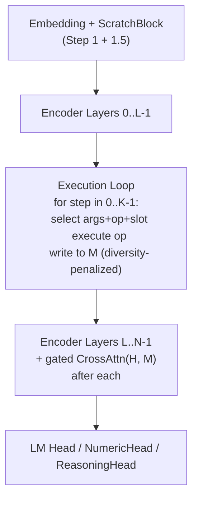
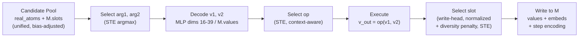
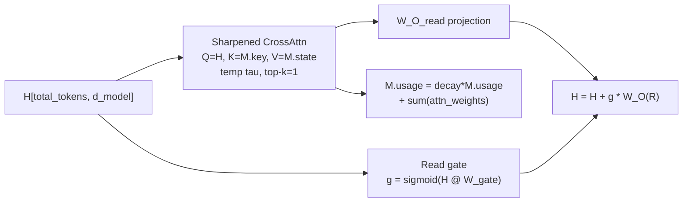

# Execution Block -- Differentiable Register Machine

## Hard Rules

- No direct writes into H from execution results
- No attention over raw slots without gating
- No slot append-only behavior
- No soft op mixtures
- No silent shape coercion, implicit broadcasting, truncation, or best-effort fallback on malformed tensors
- All results go into ExecutionMemory
- Transformer reads ExecutionMemory via gated, sharpened cross-attention ONLY
- Execution operates over unified candidate pool (real atoms + memory slots)

## Stability Rules (silent training failure prevention)

- Write-head logits are scale-normalized (cosine similarity + learned scalars)
- Usage accumulation is decayed, never unbounded
- Key embeddings are generated from result_emb directly, NOT from state_embeds
- Cross-attention read is gated: `H = H + g * W_O(R)` where `g = sigmoid(H @ W_gate)`
- Cross-attention uses top-k=1 by default (one slot read per query)
- Memory slot candidates carry a bias penalty to prevent early-training preference over real atoms
- Write-head has a diversity penalty to prevent repeated slot overwrites
- Every public entrypoint and kernel launch boundary validates ranks, extents, and compatibility; failures are hard and loud

## Validation And Failure Policy

Shape validation is mandatory. The Execution Block must never proceed on malformed tensors, partially initialized memory, or incompatible dimensions.

**Rules:**

- Validate shapes before every public `ExecutionBlockLayer` call: `executeStep`, `crossAttentionRead`, `allocate`, `clear`
- Validate shapes before every kernel launch that assumes a fixed layout
- Validate config consistency at construction time: `d_model`, `d_key`, `num_slots`, `num_exec_steps`, `atom_embedding_dim`, `cross_attn_head_dim`
- Validate runtime consistency for `num_atoms`, `atom_positions`, candidate counts, valid slot counts, and all projected tensor shapes
- Abort immediately on mismatch; do not clamp, reshape, truncate, or continue

**Failure behavior:**

- Use hard-fail checks with explicit error messages
- Error messages must include tensor name, expected shape, actual shape, and callsite/context
- Treat invalid ranks, non-positive critical dims, out-of-range indices, NaNs in selector logits, and incompatible projection dims as fatal
- No warning-only path for shape errors

**Minimum required checks:**

- `hidden_states == [total_tokens, d_model]`
- atom embedding buffer is `[num_atoms, atom_embedding_dim]`
- `M.values == [V, 1]`
- `M.atom_embeds == [V, atom_embedding_dim]`
- `M.state_embeds == [V, d_model]`
- `M.key_embeds == [V, d_key]`
- `M.valid_mask == [V]`
- `M.usage == [V]`
- `M.write_score == [V]`
- `M.recent_write_mask == [V]`
- `step_embeddings == [K, d_model]`
- `W_state == [atom_embedding_dim, d_model]`
- `W_key_base == [atom_embedding_dim, d_key]`
- `W_op_select == [3 * d_model, num_ops]`
- `W_Q_read == [d_model, d_head]`
- `W_K_read == [d_key, d_head]`
- `W_V_read == [d_model, d_head]`
- `W_O_read == [d_head, d_model]`
- `W_gate_read == [d_model, 1]`

## Architecture




**Single execution step:**




**How the transformer reads M:**




## ExecutionMemory

A structured, addressable register file with learned allocation, decayed usage tracking, and diversity-enforced writes.

```cpp
struct ExecutionMemory {
    Tensor values;            // [V, 1]           -- scalar ground truth per slot
    Tensor atom_embeds;       // [V, 64]          -- ScratchBlock-format encoding
    Tensor state_embeds;      // [V, d_model]     -- value projection for cross-attn V
    Tensor valid_mask;        // [V]              -- 1.0 if filled, 0.0 if empty
    Tensor usage;             // [V]              -- decayed cross-attn read weight
    Tensor write_score;       // [V]              -- learned overwrite preference bias
    Tensor key_embeds;        // [V, d_key]       -- addressing keys (from result_emb, NOT state_embeds)
    Tensor type_embed;        // [V, d_type]      -- type tag per slot (TYPE_NUM for now)
    Tensor recent_write_mask; // [V]              -- 1.0 if written in recent step, else 0.0
    int num_filled = 0;                           -- how many slots have been written at least once

    void clear(cudaStream_t stream);
    void allocate(int V, int atom_dim, int d_model, int d_key, int d_type, cudaStream_t s);
};
```

All `ExecutionMemory` buffers must be validated immediately after allocation and immediately before read/write use. Any missing allocation, wrong rank, or mismatched slot count is fatal.

### Write Path: Learned Slot Allocation (Normalized)

The write-head selects which slot to write to based on content similarity, usage history, and diversity. All logit components are normalized to comparable scales.

**Weights:**

```cpp
Tensor W_write_query_;   // [d_model, d_key]   -- projects execution context -> query
Tensor W_write_key_;     // [d_key, d_key]     -- transforms slot keys for matching
Tensor alpha_;           // [1] -- learned scalar for content score (init 1.0)
Tensor beta_;            // [1] -- learned scalar for usage penalty (init 1.0)
Tensor gamma_;           // [1] -- learned scalar for write score (init 1.0)
```

**Slot selection logic (normalized):**

```
// 1. Compute write query from execution context
context_summary = (h_arg1 + h_arg2) / 2
q = context_summary @ W_write_query_        // [d_key]

// 2. Score each slot (NORMALIZED -- prevents scale domination)
k_i = M.key_embeds[i] @ W_write_key_       // [d_key] per slot
content_score_i = dot(normalize(q), normalize(k_i))   // cosine similarity, bounded [-1, 1]

usage_norm = M.usage / (max(M.usage) + eps)            // normalize to [0, 1]
usage_penalty_i = -usage_norm[i]                        // bounded [-1, 0]

ws_norm = M.write_score / (norm(M.write_score) + eps)  // unit normalize
write_score_i = ws_norm[i]                              // bounded

// 3. Combine with learned scalars (each term is comparable scale)
write_logits[i] = alpha_ * content_score_i
                + beta_  * usage_penalty_i
                + gamma_ * write_score_i

// 4. Empty slot bonus (prefer filling empty slots first)
write_logits[i] += (1.0 - M.valid_mask[i]) * EMPTY_SLOT_BONUS

// 5. Diversity penalty (prevent repeated overwrites of same slot)
write_logits[i] -= kappa * M.recent_write_mask[i]

// 6. Select via STE
slot = argmax(write_logits)                 // forward: discrete
// backward: softmax(write_logits)          // STE gradient proxy
```

**Write operation:**

```
M.values[slot]       = v_out
M.atom_embeds[slot]  = encode_numeric(v_out)            // sinusoidal (same as ScratchBlock)
M.state_embeds[slot] = M.atom_embeds[slot] @ W_state    // learned projection to d_model
M.key_embeds[slot]   = M.atom_embeds[slot] @ W_key_base // KEY FROM result_emb, NOT state_embeds
M.valid_mask[slot]   = 1.0
M.usage[slot]        = 0.0                               // reset usage on fresh write
M.type_embed[slot]   = TYPE_NUM_EMBED                    // numeric type tag

// Step encoding
M.state_embeds[slot] += step_embeddings[step]
M.key_embeds[slot]   += step_embeddings[step]

// Update diversity tracking
M.recent_write_mask  = 0.0 (all slots)                  // clear previous
M.recent_write_mask[slot] = 1.0                          // mark just-written
```

### Key Embedding: Separate Address Space

Keys represent "where is this in memory space," NOT "what is the value." They are generated from the raw result embedding, not from state_embeds:

```
M.key_embeds[slot] = result_emb @ W_key_base + step_embeddings[step]
```

This prevents key-content entanglement where the write-head and read-head would compete over the same representation space. `W_key_base` is `[atom_embedding_dim, d_key]`.

### Read Path (by ExecutionBlock for chaining)

For value decode: memory slots use `M.values[slot]` directly (exact scalar).
For arg selection: memory slots use `M.state_embeds[slot]` as hidden representation.
For atom embedding: memory slots use `M.atom_embeds[slot]`.

Real atoms and memory slots are treated identically by the candidate pool.

## Execution Block -- Single Step

### Candidate Pool

Each step sees `C = num_atoms + num_valid_slots` candidates:


| Index          | Source                    | Hidden repr            | Value decode                   | Atom embed                    |
| -------------- | ------------------------- | ---------------------- | ------------------------------ | ----------------------------- |
| 0..num_atoms-1 | Real atoms                | `H[atom_positions[i]]` | MLP on `atom_embeds[i][16:39]` | `ScratchBlock.atom_embeds[i]` |
| num_atoms..C-1 | Memory slots (valid only) | `M.state_embeds[j]`    | `M.values[j]` directly         | `M.atom_embeds[j]`            |


Type embeddings are added to candidate hidden representations:

```
candidate_hidden[i] += type_embed[i]   // TYPE_NUM for all in v1
```

**Memory slot bias penalty (prevents early-training preference):**

```
// Memory slots have cleaner values (exact scalars) so the model will
// over-rely on them before learning proper atom decoding.
// Apply a small bias penalty to memory slot candidates for arg selection:
arg_scores[num_atoms..C-1] -= delta

// delta starts at ~0.5, decayed toward 0 over training steps
// (scheduled externally, passed as config parameter)
```

### Forward Pass (one step)

```
1. Build candidate pool
   candidate_hidden [C, d_model]: gather H[atom_positions] + M.state_embeds (valid)
   candidate_hidden += type_embed                         // type signal
   candidate_atom_emb [C, 64]: ScratchBlock embeds + M.atom_embeds (valid)
   validate candidate count, gathered source ranges, and all source tensor shapes

2. Decode values [C]
   real atoms: extract dims 16-39 -> MLP [24]->[16](ReLU)->[1]
   memory slots: M.values[j] directly

3. Select arg1, arg2 (STE argmax, with memory bias)
   arg1_scores = candidate_hidden @ w_arg1_select         // [C]
   arg2_scores = candidate_hidden @ w_arg2_select         // [C]
   arg1_scores[num_atoms:] -= delta                       // memory slot bias penalty
   arg2_scores[num_atoms:] -= delta
   idx1 = argmax(arg1_scores), idx2 = argmax(arg2_scores)
   v1 = decoded_values[idx1], v2 = decoded_values[idx2]

4. Context-aware op selection (STE argmax)
   context = mean(H[all_tokens])                          // global context
   pool = concat(candidate_hidden[idx1],
                 candidate_hidden[idx2],
                 context)                                  // [3 * d_model]
   op_logits = pool @ W_op_select                         // [num_ops]
   op_idx = argmax(op_logits)                             // STE

5. Execute
   Compute all 8 ops on (v1, v2) -> results[8]
   v_out = results[op_idx]                                // hard select, STE backward

6. Re-embed result
   result_emb = kernelReEmbedValue(v_out)                 // [64] sinusoidal

7. Select write slot (normalized write-head, STE argmax)
   q = f(h_arg1, h_arg2) @ W_write_query_
   write_logits = alpha*cosine_sim + beta*usage_penalty + gamma*write_score
                + empty_bonus - kappa*recent_write_mask
   slot = argmax(write_logits)
   validate write_logits == [V] and slot in [0, V)

8. Write to ExecutionMemory
   M.values[slot]           = v_out
   M.atom_embeds[slot]      = result_emb
   M.state_embeds[slot]     = result_emb @ W_state + step_embeddings[step]
   M.key_embeds[slot]       = result_emb @ W_key_base + step_embeddings[step]
   M.valid_mask[slot]       = 1.0
   M.usage[slot]            = 0.0
   M.type_embed[slot]       = TYPE_NUM_EMBED
   M.recent_write_mask      = 0.0 (all)
   M.recent_write_mask[slot]= 1.0
   re-validate slot-local outputs in checked/debug path

9. Return ExecutionBlockStepOutput with all logits for supervision
```

### All Selections Use STE

Args, ops, AND write-slot all use hard argmax forward, softmax backward:

```
// Arg selection STE
Forward:  idx = argmax(scores)
Backward: grad flows through softmax(scores)

// Op selection STE
Forward:  op_idx = argmax(op_logits)
Backward: grad flows through softmax(op_logits)

// Write slot STE
Forward:  slot = argmax(write_logits)
Backward: grad flows through softmax(write_logits)
```

No soft mixtures or weighted averages anywhere in the execution path.

### Context-Aware Op Selection

The op selector sees the full picture, not just a mean of the two args:

```
pool = concat(h_arg1, h_arg2, context)   // [3 * d_model]
op_logits = pool @ W_op_select            // [num_ops]
```

Where `context = mean(H)` provides global sequence awareness. `W_op_select` is `[3 * d_model, num_ops]`.

### Value Decode: Structured Inversion

Decode from atom embedding dims 16-39 (24 dims):

- Dims 16-31: sinusoidal features of `log2(|v| + 1)`
- Dim 32: sign
- Dims 33-39: integer bits

MLP: `[24] -> [16] (ReLU) -> [1]`. Memory slots bypass this with exact `M.values[j]`.

### Step Encoding

Learned positional signal `step_embeddings [K, d_model]` added during write:

```
M.state_embeds[slot] += step_embeddings[step]
M.key_embeds[slot]   += step_embeddings[step]
```

This tells downstream cross-attention which execution step produced a result.

### Supervision from ReasoningHead

Per step: `CE(arg1_scores, target) + CE(arg2_scores, target) + CE(op_logits, target)`

## Gated, Sharpened Cross-Attention Read Layer

The ONLY way execution results enter H. Applied after every encoder layer >= `execution_block_layer`.

**Key design decisions:**

1. Keys come from `M.key_embeds` (separate addressing space, generated from `result_emb @ W_key_base`)
2. Values come from `M.state_embeds` (content)
3. Read is gated: model must choose to read via learned sigmoid gate
4. Top-k=1 default: each query reads exactly one slot (no multi-slot blending)
5. Usage is decayed, not accumulated

```
// Projections
Q = H @ W_Q_read                    // [total_tokens, d_head]
K = M.key_embeds @ W_K_read         // [num_valid, d_head]
V = M.state_embeds @ W_V_read       // [num_valid, d_head]

// Sharpened scores
scores = (Q @ K^T) / (sqrt(d_head) * tau)    // temperature-scaled
scores = apply_valid_mask(scores, M.valid_mask)

// Top-k masking (k=1 by default -- one slot per query)
scores = top_k_mask(scores, k)               // mask non-top-k to -inf

// Attend
attn = softmax(scores)
R = attn @ V

// Gated output (model must learn to read, prevents over-reliance)
g = sigmoid(H @ W_gate_read)        // [total_tokens, 1] per-token gate
H = H + g * (R @ W_O_read)          // gated residual

// Decayed usage update (prevents unbounded growth)
M.usage = usage_decay * M.usage + sum_over_queries(attn)    // [V]
```

If any projection, score tensor, mask tensor, gate tensor, or attention output has an invalid shape, execution aborts immediately with a fatal error.

**Temperature `tau`:** Learnable scalar (initialized to 1.0). Lower = sharper reads.

**Top-k masking:** Default k=1. Each query reads from exactly one memory slot. Prevents blended reasoning states. Can be relaxed to k=2 if needed later.

**Read gate:** Per-token `sigmoid(H @ W_gate_read)` controls whether each token reads from memory at all. Without this, the model can passively read memory every layer, creating a soft shortcut. The gate forces the model to actively choose to incorporate execution results.

**Usage decay:** `M.usage = decay * M.usage + new_usage` where `decay ~= 0.9`. Prevents usage from growing without bound and eventually dominating write decisions. Recent reads matter more than old reads.

**Weights:**

- `W_Q_read` [d_model, d_head]
- `W_K_read` [d_key, d_head] -- keys from d_key space
- `W_V_read` [d_model, d_head]
- `W_O_read` [d_head, d_model]
- `W_gate_read` [d_model, 1] -- read gate projection
- `tau` [1] -- learnable temperature

Single-head is sufficient (1-4 keys).

## File Changes

## File Separation Of Concerns

The Execution Block must be implemented with strict file boundaries. Each file owns one layer of concern. Do not spread logic across unrelated files.

### Core rules

- `execution_block_GPU.hpp` declares data structures, config, public API, and validation method signatures only
- `execution_block_GPU.cu` owns execution math, CUDA kernels, checked launch wrappers, and layer method implementations
- `AutogradTraining.cu` owns encoder-loop orchestration only; it must not contain execution math or slot-allocation logic
- `grim_language_model_cuda.hpp` owns model config surface and object ownership only; it must not implement execution behavior
- `TrainingOps.cu` and `InitInferenceState.cu` own construction/wiring only; they must not contain execution logic
- `LanguageModel_Training.cu` owns parameter registration only
- `Serialization_GPU.hpp` owns serialization view structs only
- `Serialization_GPU.cu` and `grim_model_serialization.cu` own save/load translation only
- `TensorContract_GPU.hpp` owns enum/group declarations only
- `GradNormGPU.*` and `Phase2_TrainingLoop.cu` own gradient accounting only
- Validation helpers may be declared in the header, but validation implementation belongs in `execution_block_GPU.cu`

### Per-file responsibilities

`**resources/models/GRIM-text/Layers/ExecutionBlock/execution_block_GPU.hpp`**

- Define `ExecutionMemory`, `ExecutionBlockConfig`, `ExecutionBlockStepOutput`, `ExecutionBlockOutput`, and `ExecutionBlockLayer`
- Declare public methods: constructor, `executeStep`, `crossAttentionRead`, validation helpers
- Declare weight tensors and config-owned constants
- Declare no CUDA kernels here
- Contain no orchestration logic from training/inference loops
- Contain no serialization code

`**resources/models/GRIM-text/Layers/ExecutionBlock/execution_block_GPU.cu`**

- Implement all `ExecutionBlockLayer` methods
- Implement all validation helpers and hard-fail checks
- Implement all CUDA kernels and checked launch wrappers
- Own candidate construction, value decode, arg/op/slot selection, write-head logic, memory writes, and cross-attention read
- Own no model-global config definitions beyond consuming `ExecutionBlockConfig`
- Own no training-loop control flow beyond one execution step and one read pass

`**resources/models/GRIM-text/training/Autograd/AutogradIntermediates.hpp`**

- Own runtime intermediates only: `ExecutionMemory`, `ExecutionBlockOutput`
- Provide storage lifetime and clearing behavior
- Contain no execution kernels or policy logic

`**resources/models/GRIM-text/training/Autograd/AutogradTraining.hpp`**

- Extend `AutogradContext` with `ExecutionBlockLayer*`
- Declare integration surface only
- No execution math or serialization logic

`**resources/models/GRIM-text/training/Autograd/AutogradTraining.cu**`

- Decide when the Execution Block runs in the encoder loop
- Pass already-owned buffers into `executeStep` / `crossAttentionRead`
- Perform runtime sanity checks at integration boundaries (`num_atoms`, buffer presence, resolved layer index)
- Do not implement candidate scoring, slot scoring, or cross-attention equations here
- Do not duplicate validation that belongs inside the layer implementation

`**resources/models/GRIM-text/GRIM/grim_language_model_cuda.hpp**`

- Add config knobs and `ExecutionBlockLayer` ownership/accessor
- Keep this file limited to model surface area
- No kernel declarations, no training logic, no shape-check implementation

`**resources/models/GRIM-text/training/TrainingOps.cu**`

- Construct `ExecutionBlockLayer` from config
- Thread dependencies (`stream`, `cublas_handle`, dimensions)
- No execution behavior

`**resources/models/GRIM-text/Layers/InitInferenceState/InitinferenceState.cu**`

- Mirror construction for inference
- No execution behavior

`**resources/models/GRIM-text/training/LanguageModel_Training.cu**`

- Register Execution Block tensors with `ParamGroupType::EXECUTION_BLOCK`
- No execution math, no serialization, no runtime control flow

`**resources/models/GRIM-text/Shared/TensorContract/TensorContract_GPU.hpp**`

- Add enum/group definitions such as `EXECUTION_BLOCK`
- No layer behavior

`**resources/models/GRIM-text/Shared/GradNorm/GradNormGPU.hpp**` / `**.cu**`

- Add gradient metrics storage and aggregation for Execution Block parameters
- No execution behavior

`**resources/models/GRIM-text/training/Phases/Phase2_TrainingLoop.cu**`

- Consume aggregated gradient metrics for logging/clipping/reporting
- No Execution Block math or state mutation

`**resources/models/GRIM-text/Layers/Serialization/Serialization_GPU.hpp**`

- Declare read/write view structs for Execution Block tensors
- No file I/O logic
- No layer behavior

`**resources/models/GRIM-text/Layers/Serialization/Serialization_GPU.cu**`

- Translate between in-memory tensors and serialization views
- No FlatBuffer schema ownership
- No execution logic

`**resources/models/GRIM-text/Common/grim_model_serialization.cu**`

- Integrate Execution Block views into model save/load flow
- No tensor math, no runtime execution logic

`**resources/models/GRIM-text/training/schemas/grim_transformer_model_generated.h**`

- Own generated schema surface only
- Add `ExecutionBlockWeights` table and model field
- No handwritten runtime logic beyond unavoidable generated-API updates

### Anti-leakage rules

- Do not place CUDA kernel declarations in autograd or model config files
- Do not place training-loop branching inside layer serialization files
- Do not place serialization conditionals inside `execution_block_GPU.cu`
- Do not place parameter registration in construction files
- Do not place shape-validation implementation in unrelated files; keep it inside the layer implementation
- Do not duplicate slot-allocation or attention math outside `execution_block_GPU.cu`

### New files

`**resources/models/GRIM-text/Layers/ExecutionBlock/execution_block_GPU.hpp`**

```cpp
struct ExecutionMemory {
    Tensor values;            // [V, 1]
    Tensor atom_embeds;       // [V, atom_embedding_dim]
    Tensor state_embeds;      // [V, d_model]
    Tensor valid_mask;        // [V]
    Tensor usage;             // [V]
    Tensor write_score;       // [V]
    Tensor key_embeds;        // [V, d_key]
    Tensor type_embed;        // [V, d_type]
    Tensor recent_write_mask; // [V]
    int num_filled = 0;

    void clear(cudaStream_t stream);
    void allocate(int V, int atom_dim, int d_model, int d_key, int d_type, cudaStream_t s);
};

struct ExecutionBlockConfig {
    int d_model = 0;
    int atom_embedding_dim = 0;
    int num_ops = 8;
    int num_slots = 4;              // V
    int num_exec_steps = 2;         // K
    int execution_block_layer = -1; // -1 = num_layers - 2
    int value_decode_input_dim = 24;
    int value_decode_hidden_dim = 16;
    int d_key = 64;                 // key embedding dim
    int d_type = 8;                 // type embedding dim
    int cross_attn_head_dim = 64;
    int cross_attn_topk = 1;       // 1 = one slot per query (default)
    float usage_decay = 0.9f;       // decay factor for usage accumulation
    float empty_slot_bonus = 10.0f;
    float diversity_kappa = 2.0f;   // penalty for recently-written slots
    cudaStream_t stream = nullptr;
    cublasHandle_t cublas_handle = nullptr;
};

struct ExecutionBlockStepOutput {
    int selected_op;
    int selected_arg1;
    int selected_arg2;
    int selected_slot;
    float decoded_v1;
    float decoded_v2;
    float computed_result;
    Tensor op_logits;       // [1, num_ops]
    Tensor arg1_scores;     // [1, C]
    Tensor arg2_scores;     // [1, C]
    Tensor write_logits;    // [1, V]
};

struct ExecutionBlockOutput {
    std::vector<ExecutionBlockStepOutput> steps;
};

class ExecutionBlockLayer {
    // Value decode MLP
    Tensor w_decode_1_;     // [24, 16]
    Tensor b_decode_1_;     // [16]
    Tensor w_decode_2_;     // [16, 1]

    // Arg selection
    Tensor w_arg1_select_;  // [d_model, 1]
    Tensor w_arg2_select_;  // [d_model, 1]

    // Context-aware op selection
    Tensor W_op_select_;    // [3 * d_model, num_ops]

    // Memory write projection
    Tensor W_state_;        // [atom_embedding_dim, d_model]

    // Key generation (from result_emb, separate from state)
    Tensor W_key_base_;     // [atom_embedding_dim, d_key]

    // Write-head (normalized)
    Tensor W_write_query_;  // [d_model, d_key]
    Tensor W_write_key_;    // [d_key, d_key]
    Tensor alpha_;          // [1] -- learned content score scalar (init 1.0)
    Tensor beta_;           // [1] -- learned usage penalty scalar (init 1.0)
    Tensor gamma_;          // [1] -- learned write score scalar (init 1.0)

    // Step encoding
    Tensor step_embeddings_; // [K, d_model]

    // Type embedding
    Tensor type_num_embed_;  // [d_type]

    // Cross-attention read (gated + sharpened)
    Tensor W_Q_read_;       // [d_model, head_dim]
    Tensor W_K_read_;       // [d_key, head_dim]
    Tensor W_V_read_;       // [d_model, head_dim]
    Tensor W_O_read_;       // [head_dim, d_model]
    Tensor W_gate_read_;    // [d_model, 1] -- per-token read gate
    Tensor tau_;            // [1] -- learnable temperature

    ExecutionBlockStepOutput executeStep(
        const Tensor& hidden_states,
        const float* atom_embeddings,
        const int* atom_positions,
        int num_atoms,
        int total_tokens,
        ExecutionMemory& M,
        int step,
        cudaStream_t stream
    );

    void crossAttentionRead(
        Tensor& hidden_states,
        ExecutionMemory& M,              // non-const: updates M.usage (decayed)
        int total_tokens,
        cudaStream_t stream
    );

    void validateConfigOrThrow() const;
    void validateMemoryOrThrow(const ExecutionMemory& M) const;
    void validateExecuteStepInputsOrThrow(
        const Tensor& hidden_states,
        const float* atom_embeddings,
        const int* atom_positions,
        int num_atoms,
        int total_tokens,
        const ExecutionMemory& M,
        int step) const;
    void validateCrossAttentionInputsOrThrow(
        const Tensor& hidden_states,
        const ExecutionMemory& M,
        int total_tokens) const;
};
```

`**resources/models/GRIM-text/Layers/ExecutionBlock/execution_block_GPU.cu**`

CUDA kernels:

1. `**kernelGatherCandidateHidden**` -- build `[C, d_model]` from real atoms in H + valid memory state_embeds + type_embed
2. `**kernelGatherCandidateAtomEmb**` -- build `[C, 64]` from real atom embeds + valid memory atom_embeds
3. `**kernelExtractValueDims**` -- extract dims 16-39 from atom embeddings into `[C, 24]` for real atoms
4. `**kernelDecodeValues**` -- MLP for real atoms; direct copy for memory slots
5. `**kernelComputeArgScores**` -- per-candidate dot product with w_arg_select; subtract delta from memory slot indices
6. `**kernelArgmaxSTE**` -- hard argmax forward, softmax backward. Reused for arg1, arg2, op, write-slot
7. `**kernelComputeContext**` -- mean-pool H to get global context vector [d_model]
8. `**kernelComputeOpLogits**` -- concat(h_arg1, h_arg2, context) @ W_op_select -> [num_ops]
9. `**kernelExecuteAllOps**` -- compute all 8 ops from (v1, v2), output [8]
10. `**kernelReEmbedValue**` -- sinusoidal encoding of v_out into [64]
11. `**kernelComputeWriteLogits**` -- alpha*cosine_sim + beta*usage_penalty + gamma*write_score + empty_bonus - kappa*recent_write
12. `**kernelWriteMemorySlot`** -- write all fields, key from result_emb@W_key_base, step encoding, reset usage, update recent_write_mask
13. `**kernelCrossAttnQKV`** -- Q=H@W_Q, K=M.key@W_K, V=M.state@W_V
14. `**kernelCrossAttnSharpScores`** -- `(Q@K^T) / (sqrt(d) * tau)`, valid_mask, top-k=1 default, softmax
15. `**kernelCrossAttnGatedOutput`** -- `g = sigmoid(H @ W_gate)`, `R = attn @ V`, `H += g * (R @ W_O)`
16. `**kernelDecayedUsageUpdate*`* -- `M.usage = decay * M.usage + sum_queries(attn_weights)`
17. `**validation helpers / checked launch wrappers**` -- validate tensor ranks, extents, candidate counts, slot ranges, and projection compatibility before dispatch; fatal on mismatch

The 8 ops (all computed, one selected via STE):

- 0: Add `v1 + v2`
- 1: Sub `v1 - v2`
- 2: Mul `v1 * v2`
- 3: Div `v1 / (v2 + eps)`
- 4: Mod `fmod(v1, v2 + eps)`
- 5: Pow `copysign(pow(|v1|, clamp(v2, -10, 10)), v1)`
- 6: Min `fmin(v1, v2)`
- 7: Max `fmax(v1, v2)`

### Modified files

`**[grim_language_model_cuda.hpp](resources/models/GRIM-text/GRIM/grim_language_model_cuda.hpp)**` -- Add to `LanguageModelConfig`:

```cpp
bool execution_block_enabled = false;
int execution_block_layer = -1;
int execution_block_num_ops = 8;
int execution_block_num_slots = 4;
int execution_block_num_steps = 2;
int execution_block_d_key = 64;
int execution_block_d_type = 8;
int execution_block_cross_attn_head_dim = 64;
int execution_block_cross_attn_topk = 1;       // 1 = one slot per query
float execution_block_usage_decay = 0.9f;
float execution_block_diversity_kappa = 2.0f;
```

Add to `LanguageModel`:

```cpp
std::unique_ptr<ExecutionBlockLayer> execution_block_layer_;
ExecutionBlockLayer* getExecutionBlockLayer();
```

`**[AutogradTraining.hpp](resources/models/GRIM-text/training/Autograd/AutogradTraining.hpp)**` -- Add `ExecutionBlockLayer* execution_block` to `AutogradContext`.

`**[AutogradIntermediates.hpp](resources/models/GRIM-text/training/Autograd/AutogradIntermediates.hpp)**` -- Add `ExecutionMemory exec_memory` and `ExecutionBlockOutput execution_block_output`. Clear in `clear()`.

`**[AutogradTraining.cu](resources/models/GRIM-text/training/Autograd/AutogradTraining.cu)**` -- Encoder loop:

```cpp
int exec_layer = resolveExecutionBlockLayer(cfg);
int K = cfg->execution_block_num_steps;

for (int layer_idx = 0; layer_idx < num_layers; ++layer_idx) {
    Tensor layer_output = enc_layer->forward(...);

    if (layer_idx == exec_layer && ctx.execution_block && ctx.scratch_block) {
        // D2H num_atoms, clear M
        intermediates.exec_memory.clear(ctx.stream);

        for (int step = 0; step < K; ++step) {
            auto step_out = ctx.execution_block->executeStep(
                layer_output,
                ctx.scratch_block->atomEmbeddingsBuffer(),
                ctx.scratch_block->atomPositionsBuffer(),
                num_atoms, total_tokens,
                intermediates.exec_memory,
                step,
                ctx.stream);
            intermediates.execution_block_output.steps.push_back(std::move(step_out));
        }
    }

    // Gated, sharpened cross-attention read at every layer >= exec_layer
    if (layer_idx >= exec_layer && ctx.execution_block
        && intermediates.exec_memory.num_filled > 0) {
        ctx.execution_block->crossAttentionRead(
            layer_output, intermediates.exec_memory,
            total_tokens, ctx.stream);
    }

    intermediates.encoder_layer_outputs.push_back(std::move(layer_output));
}
```

No changes to `total_tokens`, `seq_len`, or self-attention masks.

`**[TrainingOps.cu](resources/models/GRIM-text/training/TrainingOps.cu)**` -- Construct `ExecutionBlockLayer`.

`**[InitInferenceState.cu](resources/models/GRIM-text/Layers/InitInferenceState/InitinferenceState.cu)**` -- Same.

`**[TensorContract_GPU.hpp](resources/models/GRIM-text/Shared/TensorContract/TensorContract_GPU.hpp)**` -- `EXECUTION_BLOCK = 9`, `COUNT = 10`.

`**[GradNormGPU.hpp](resources/models/GRIM-text/Shared/GradNorm/GradNormGPU.hpp)**` / `**[GradNormGPU.cu](resources/models/GRIM-text/Shared/GradNorm/GradNormGPU.cu)**` -- `execution_block_sum_sq` / `execution_block_count`.

`**[LanguageModel_Training.cu](resources/models/GRIM-text/training/LanguageModel_Training.cu)**` -- Register all weights.

`**[Phase2_TrainingLoop.cu](resources/models/GRIM-text/training/Phases/Phase2_TrainingLoop.cu)**` -- Gradient norms.

`**[CMakeLists.txt](resources/models/GRIM-text/training/TrainingLoop/CMakeLists.txt)**` -- Add source.

`**[Serialization_GPU.hpp](resources/models/GRIM-text/Layers/Serialization/Serialization_GPU.hpp)**` -- Views.

`**[grim_transformer_model_generated.h](resources/models/GRIM-text/training/schemas/grim_transformer_model_generated.h)**` -- FlatBuffer table.

`**[Serialization_GPU.cu](resources/models/GRIM-text/Layers/Serialization/Serialization_GPU.cu)**` / `**[grim_model_serialization.cu](resources/models/GRIM-text/Common/grim_model_serialization.cu)**` -- Save/load.

## Design Summary


| Aspect            | Previous revision                     | Current                                                          |
| ----------------- | ------------------------------------- | ---------------------------------------------------------------- |
| Write logit scale | Raw sums (scale-dominated)            | Normalized: cosine similarity + learned alpha/beta/gamma scalars |
| Usage tracking    | Unbounded accumulation (explodes)     | Decayed: `decay * old + new` (bounded)                           |
| Key generation    | From state_embeds (entangled)         | From result_emb @ W_key_base (separate address space)            |
| Cross-attn read   | Ungated `H += W_O(R)` (soft shortcut) | Gated: `H += sigmoid(H@W_gate) * W_O(R)`                         |
| Top-k masking     | Disabled by default (blurry)          | k=1 default (one slot per query, crisp reads)                    |
| Candidate bias    | None (memory slots dominate)          | Memory candidates penalized by delta (decays over training)      |
| Slot diversity    | None (single-slot oscillation)        | Diversity penalty: `-kappa * recent_write_mask`                  |
| Slot allocation   | Append-only                           | Learned write-head (content + usage + diversity)                 |
| Step identity     | step_embeddings on state + key        | Same (unchanged)                                                 |
| Op context        | concat(h_arg1, h_arg2, context)       | Same (unchanged)                                                 |
| Type system       | type_embed per slot                   | Same (unchanged)                                                 |


