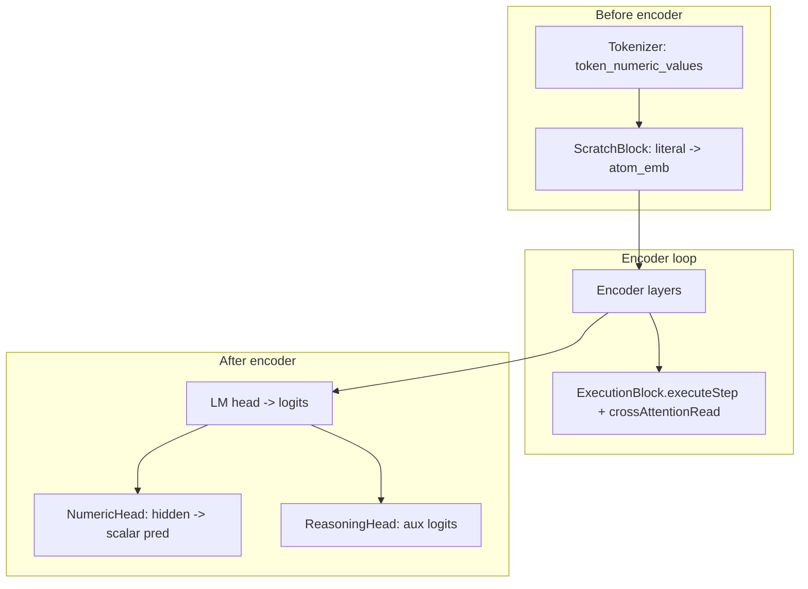

# GRIM execution pipeline refactor (numeric truth in ExecutionMemory)

## Current architecture (baseline)

Important facts from code:

- `[ScratchBlockReasoning_GPU.cu](resources/models/GRIM-text/Layers/ScratchBlock/ScratchBlockReasoning_GPU.cu)` `kernelLookupAtomEmbeddingsWithValue` uses `token_numeric_values[token_pos]` for value bands (dims 16–47). That bakes **parsed literals** into embeddings **before** any execution.
- `[execution_block_GPU.cu](resources/models/GRIM-text/Layers/ExecutionBlock/execution_block_GPU.cu)` `executeStep` builds `decoded_values` as **MLP(atom_emb slice)** for atom rows and `**M.values` + mask** for memory rows, then `kernelBlendedWriteValues` updates `M.values`. Atom rows are **not** yet tied to persistent slots.
- `[AutogradTraining.cu](resources/models/GRIM-text/training/Autograd/AutogradTraining.cu)` runs ExecutionBlock **inside** the encoder at `execution_block_layer`, then runs **NumericHead** and **ReasoningHead** **after** the LM head (lines ~926–967). **ReasoningHead does not drive `executeStep` today**—op/arg selection is entirely inside ExecutionBlock. The doc’s arrow “ReasoningHead → ExecutionBlock” is **target semantics**, not current wiring.

## Gaps vs the written spec

| Spec item                          | Gap                                                                                                                                                                                                                                                                                   |
| ---------------------------------- | ------------------------------------------------------------------------------------------------------------------------------------------------------------------------------------------------------------------------------------------------------------------------------------- |
| `<NUM>` → `M.values[slot]`         | No `token_to_slot` / device map; ScratchBlock always reads literals                                                                                                                                                                                                                   |
| NumericHead decoding-only          | Forward still runs full-sequence NumericHead; `[ComputeLossBatch.cu](resources/models/GRIM-text/Shared/Loss/ComputeLoss/ComputeLossBatch.cu)` and `[kernelNumericLoss](resources/models/GRIM-text/training/Autograd/AutogradTraining.cu)` supervise it vs `token_numeric_values[t+1]` |
| ReasoningHead → ExecutionBlock     | ReasoningHead is **downstream** of final hidden state; not connected to `executeStep`                                                                                                                                                                                                 |
| Ordering: ScratchBlock before exec | Literals are injected at embedding time; `M.values` is filled only after `exec_layer`—needs **bootstrap** and/or **post-exec refresh** design                                                                                                                                         |

## Recommended phased approach

### Phase A — Data and buffers (slot identity)

- Define per-token **slot id** side channel: `int32_t` in `[0, V)` or sentinel (e.g. `-1`) for “no slot / non-NUM”. This is the `token_to_slot_map` the doc refers to.
- **Plumb through the same path as numeric side-channel today**:
  - Host: `[UniByte.hpp` / `UniByte.cu](resources/models/GRIM-text/Shared/UnigramByte/UniByte.hpp)`, `[BatchPayload](resources/models/GRIM-text/Shared/Batching/BatchPayload.cu)`, `[TrainingState_GPU.hpp](resources/models/GRIM-text/Shared/TrainingState/TrainingState_GPU.hpp)` (`cached_token_*`), `[grim_language_model_cuda.hpp](resources/models/GRIM-text/GRIM/grim_language_model_cuda.hpp)` (`TokenBufferView`, `generateSequenceGPU` state).
  - **Slot assignment policy** (implement in tokenizer / dataset prep): e.g. monotonic assignment per `<NUM>` in sequence order modulo `V`, or deterministic mapping from AtomTable metadata—must be **stable across steps** for autoregressive inference.
- Device: allocate `cached_token_exec_slots` (or packed in existing buffer only if you can prove no collision); upload in `[ComputeLossBatch.cu](resources/models/GRIM-text/Shared/Loss/ComputeLoss/ComputeLossBatch.cu)` / `[Inference_GPU.cu](resources/models/GRIM-text/training/Inference_GPU.cu)` alongside other DMA rounds.

### Phase B — Bootstrap `M.values` (resolve chicken-and-egg)

Without an initial write, slot-bound `<NUM>` cannot read teacher literals from `M.values`. Pick one **explicit** policy (document in code comments):

1. **Teacher bootstrap (training-friendly):** After `ExecutionMemory::allocate` / `clear` in `[AutogradTraining.cu](resources/models/GRIM-text/training/Autograd/AutogradTraining.cu)` (same block as today’s exec setup), launch a small kernel: for each token with `slot == s`, set `M.values[s]` from **ground-truth** packed literal (still stored separately for supervision / display), with `valid_mask` updated. Gradients: either stop-grad bootstrap (constants) or use a differentiable `scatter`/assign if you need literals in the graph—default to **non-diff or detached** bootstrap to avoid reintroducing “predict the literal” through embeddings.
2. **Inference bootstrap:** For **prompt** literals only, same kernel from host-provided values; for **generated** `<NUM>`, values must come **only** from prior `executeStep` writes (matches “if not in `M.values`, it does not exist” for model state).

This keeps the invariant for **computed** intermediates while allowing **inputs** to exist in registers.

### Phase C — ExecutionBlock: atom rows read slot memory (core spec)

- Extend `executeStep` (and `validateExecuteStepInputsOrThrow`) to accept a **per-atom slot index** buffer: `d_atom_slot[num_atoms]` derived from `d_token_slots` + `atom_positions` (host or device gather once per forward).
- When assembling `decoded_values` for atom index `i`:
  - If `slot[i] < 0`: keep current path (**MLP on atom_emb slice**) for backward compatibility during rollout, or deprecate behind a config flag.
  - If `slot[i] >= 0`: set atom row scalar from `**M.values[slot]`** (with same finite/magnitude checks as memory rows), wired through autograd with a small **Gather/Select GradFn** (mirror patterns used for `GatherCandidateHiddenGradFn` / `DecodeAssembleGradFn` in `[execution_block_GPU.cu](resources/models/GRIM-text/Layers/ExecutionBlock/execution_block_GPU.cu)`).
- **Do not** add hard argmax or `detach` on the execution path; keep softmax + blended writes as today.

### Phase D — ScratchBlock: literals off the reasoning path

- In `[kernelLookupAtomEmbeddingsWithValue](resources/models/GRIM-text/Layers/ScratchBlock/ScratchBlockReasoning_GPU.cu)`, for tokens with **bound slot** (`slot >= 0`), **disable** value-based bands (treat like `has_value == false` for dims 16–47) so `<NUM>` does not carry a scalar through embeddings.
- Add a **small learnable signal** for slot identity (e.g. `slot_embedding_table[V, k]` added into fixed dims, or fuse into existing type embedding path) so atoms remain distinguishable without literals.
- Update `autograd::scratch_block_inject` signature and all call sites (`[AutogradTraining.cu](resources/models/GRIM-text/training/Autograd/AutogradTraining.cu)` ~373) to pass `d_token_slots`.

### Phase E — NumericHead: decode-only + criterion #5

- **Forward:** Only invoke NumericHead for positions that need **vocabulary-side numeric decoding** (e.g. last token in inference, or masked positions for `<NUM>` token prediction), not full `total_tokens` every step—controlled by `HyperParameters` / config.
- **Training loss:** Retarget or gate `[kernelNumericLoss](resources/models/GRIM-text/training/Autograd/AutogradTraining.cu)`: either remove intermediate supervision against `numeric_head_output`, or restrict to **output** `<NUM>` positions only; optionally add loss that aligns **decoded display** with teacher while **execution** loss uses `M.values` (separate objective).
- **Inference:** Replace `[predictNumericValue](resources/models/GRIM-text/Common/grim_language_model_gpu.cu)` / `[Inference_GPU.cu](resources/models/GRIM-text/training/Inference_GPU.cu)` path that reads `cached_numeric_pred` with **readout from `M.values[slot]`** after forward (requires caching final `exec_memory` or a designated result slot on inference state—today intermediates may not be exposed to `LanguageModel`; add a minimal, explicit buffer).

### Phase F — ReasoningHead vs ExecutionBlock (optional, larger)

The doc’s control-flow (“ReasoningHead logits → executeStep”) is **not** implemented. Two options:

- **F1 (lighter):** Leave ReasoningHead as auxiliary supervision only; document that ExecutionBlock’s internal heads are the compute control for now.
- **F2 (full):** Add logits fusion inside `executeStep` (e.g. add ReasoningHead op/arg logits as biases before softmax on arg1/arg2/op), which requires **moving ReasoningHead forward before `exec_layer`** or recomputing partial reasoning features mid-stack—substantial reorder and memory cost.

**Default recommendation:** ship Phases A–E first; treat F2 as a follow-up unless you explicitly want unified control.

### Phase G — Validation, tests, docs

- Extend `[ScratchBlockTest.cu](resources/models/GRIM-text/Tests/ScratchBlockTest.cu)` with slot-bound `<NUM>`: assert value bands ignore tokenizer literal.
- Add ExecutionBlock unit test: after bootstrap + one step, later read uses updated `M.values`.
- Update `[SCRATCHBLOCK_ARCHITECTURE.md](resources/models/GRIM-text/GRIM/References/SCRATCHBLOCK_ARCHITECTURE.md)` / ExecutionBlock doc to describe slot map + bootstrap (only if you already maintain those docs for this subsystem).

## Risk notes

- **Differentiability:** Atom path reading `M.values` creates cross-dependencies between steps; verify backward through K steps and `crossAttentionRead` still behaves (no buffer reuse bugs).
- **Serialization:** Slot map is runtime data; likely **no** checkpoint change unless you add learned `slot_embedding_table`.
- **Fail-hard:** Preserve existing `[kernelCheckFinite](resources/models/GRIM-text/Layers/ExecutionBlock/execution_block_GPU.cu)` / entropy-collapse checks when changing `decoded_values` assembly.

## Success criteria mapping

1. **Intermediate values in `M.values`** — Phase B+C + tests.
2. **Later steps reuse those values** — Phase C gather + Phase E inference readout.
3. **NumericHead not used for reasoning** — Phase D (no literal in emb) + Phase E (scoped forward/loss).
4. **Multi-step improvement** — training/eval outcome; out of scope for code plan beyond enabling mechanics.
5. **Removing NumericHead does not break computation** — Phase E ensures forward path and loss do not depend on NumericHead for core exec.

