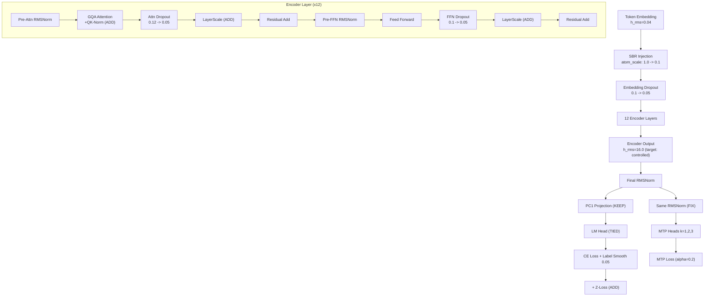

# GRIM-text Method Audit for Coherence

## Current State

After 5 epochs on an A100, the model produces incoherent output. Key diagnostic signals from the training log:

- **h_rms_growth**: 26x at start, 182x at epoch 1, **400x by epoch 5** (hidden state norm explosion)
- **Embedding gradient RMS**: 3.5e-5 at start, dropping to **1e-6 by epoch 5** (embeddings stop learning)
- **Encoder gradient RMS**: attn 4.3e-4 at start, dropping to **5.4e-5** (8x reduction)
- **Prediction collapse**: only 28-35 unique argmax tokens out of 2512, dominated by space (tok36)
- **Layer 0 ANOMALY**: consistently amplifies representation cosine similarity by +0.09 to +0.15

---

## B. REMOVE — Methods Hurting Coherence

### B1. `center_encoder_residuals` — Remove

**What it does**: Applies `center_columns` (subtract feature-wise mean) after BOTH the attention residual AND FFN residual in every encoder layer. That is **24 centering operations** across 12 layers.

**Where**: `Encoding_GPU.cu` lines 991-994 and 1047-1052

**Why remove**: Despite 24 centering passes, h_rms is STILL exploding (400x by epoch 5). Centering is failing at its intended purpose (controlling norm/collapse) while actively stripping useful directional information from the residual stream. The gradients for encoder weights (attn, ffn) have dropped 8x, indicating the centering backward pass is attenuating useful gradient signal through the 24-deep chain.

**Config change**: `center_encoder_residuals: false` in `lm_head_centering`

---

### B2. `center_hidden_states` — Remove (replace with PC1)

**What it does**: At the LM head, applies `center_columns` then `center_rows` before the output projection. This removes both the shared feature direction and shared token direction from the representation.

**Where**: `lm_head_GPU.cu` lines 199-226

**Why remove**: Column + row centering is the most aggressive option. Combined with B1 (24 encoder centerings), the model's representations are being stripped at every stage. The code already implements `project_out_pc1` as a milder alternative (mutually exclusive with `center_hidden_states`). PC1 projection removes only the single dominant direction via power iteration, preserving much more useful signal.

**Config change**: `center_hidden_states: false`, keep `project_out_pc1: true`

---

### B3. NumericHead — Remove or Fix

**What it does**: Predicts `(log_magnitude, sign)` for numeric tokens. Loss: `L_total += 0.1 * numeric_loss`.

**Where**: `numeric_head_GPU.cu`, `AutogradTraining.cu` lines 857-863

**Why remove**: Two issues:

1. **Bias gradient bug**: The bias is applied via a raw CUDA kernel (`kernelNumericHeadBias`) that bypasses autograd. Backward never computes `grad_bias`, so bias gets zero gradients.
2. **Competing objective**: Adds another loss signal (0.1 weight) that pushes encoder representations toward numeric prediction, diverting gradient budget from language modeling coherence.

---

## A. IMPROVE — Methods That Need Fixing

### A1. MTP (Multi-Token Prediction) — Fix Representation Mismatch

**Critical bug**: MTP heads consume `intermediates.encoder_output_tensor` (raw encoder output), while the main LM head consumes the centered/RMSNorm'd version. The encoder receives **conflicting gradient signals** — the LM head wants representations that work well after centering+RMSNorm, while MTP heads want representations that work well raw.

**Where**:

- MTP forward: `AutogradTraining.cu` lines 1057-1078 — uses `encoder_output_tensor` directly
- LM head forward: `lm_head_GPU.cu` lines 199-296 — applies final RMSNorm + centering

**Fix**: Apply the same final RMSNorm (`final_rms_gamma`) to MTP input. If PC1 projection is active, optionally apply it too. This aligns what both the LM head and MTP heads expect from the encoder:

```cpp
// In AutogradTraining.cu, before MTP loop (around line 1057):
Tensor mtp_input = autograd::rms_norm(intermediates.encoder_output_tensor, 
    ctx.lm_head->finalRmsGamma(), 1e-5f, ctx.stream);
// Then use mtp_input instead of encoder_output_tensor in the MTP matmuls
```

**Also**: Increase `alpha_warmup_steps` from 500 to 2000. The model needs basic next-token competence before MTP gradients should have full weight.

---

### A2. SBR (Scratch Block Reasoning) — Scale Down Injection

**What it does**: Detects numeric atoms, builds a 96-dim embedding (learned type embedding + deterministic value/sign/flag features), projects to 768-dim, and **adds** to token embeddings with `atom_scale=1.0`.

**Where**: `ScratchBlockReasoning_GPU.cu` line 183: `hidden_states[pos * d_model + d] += scale * sum`

**Issue**: The embedding h_rms is 0.04 (Xavier init with d_model=768). The atom injection at scale=1.0 can produce vectors with comparable or larger magnitude, potentially dominating the token signal at atom positions. This is especially concerning with astronomy/scientific training data that has many numeric tokens.

**Fix**: Reduce `atom_scale` from 1.0 to **0.1** to keep atom injection proportional to embedding magnitude. Alternatively, make `atom_scale` a learnable parameter (like LayerScale) so the model can modulate injection strength.

**Config change**: `scratch_block_reasoning.atom_scale: 0.1`

---

### A3. Dropout — Too High for Early Training

**Current**: `attention_dropout: 0.12`, `dropout_rate: 0.1`, `residual_dropout_rate: 0.1`

Three independent dropout stages per layer means ~30% of activations are dropped per layer, compounding across 12 layers. This prevents stable representation formation during the critical early phase when the model needs to learn basic token co-occurrence patterns.

**Fix**: Reduce all to `0.05`. This still provides regularization while allowing stable gradient flow.

---

### A4. Label Smoothing — Too High for Small Vocab

**Current**: `epsilon: 0.1` across 2512 tokens

With only 2512 tokens, label smoothing of 0.1 spreads 10% of probability mass across the entire vocabulary. This is a significant tax on sharp, confident predictions. For comparison, models with 32K+ vocabularies use 0.1 and each non-target token gets ~3e-6 mass; here each gets ~4e-5 (13x more per token).

**Fix**: Reduce to `epsilon: 0.05` or `0.03`.

---

### A5. Vocabulary Size — 2512 is a Bottleneck

**Current**: 2512 tokens total (2250 unigram pieces + 4 special + 256 bytes + 2 atom). The config targets 10,000 but the tokenizer training on the current data only produced 2250 pieces (likely due to `min_subword_freq: 3` and limited data).

**Impact**: With ~2250 subword tokens, average English text requires far more tokens per word, making sequences longer and making it harder for the model to learn long-range dependencies within the 1024-token context window. Byte fallback triggers frequently for uncommon words.

**Fix**: Regenerate the vocab with either more training data or a lower `min_subword_freq` (e.g., 1-2) to approach the 10K target. Then re-encode the `.grmt` training data.

---

## C. ADD — Methods to Enable

### C1. Weight Tying — Enable (`tie_embeddings: true`)

**Current**: Disabled. The codebase manifests (`GrimTextManifest.md`, `TRAINING_COMPILATION_MANIFEST.md`) reference `tie_embeddings: true` as the expected production state. Issue #140 removed sqrt(d_model) embedding scaling specifically because "modern LLMs with tied weights do NOT scale."

**Why critical**: Without tying, the embedding table receives ~1e-6 gradient RMS by epoch 5 — effectively frozen. The LM head's gradient (2.8e-4 RMS) never reaches the embeddings. This means the input representation of tokens diverges from the output prediction space. Weight tying is the primary mechanism by which "predicting token X" teaches the model "what token X means."

**Code**: Already fully implemented in `lm_head_GPU.cu` lines 57-94 (share_grad, from_ptr). `LanguageModel_Training.cu` lines 145-165 handles param group registration.

**Config change**: `tie_embeddings: true`

---

### C2. QK-Norm — Enable (`qk_norm.enabled: true`)

**Current**: Disabled. Already fully implemented and wired through config.

**Why**: With h_rms growing 400x across layers, attention logit magnitudes become unstable. QK-Norm (per-head RMSNorm on Q and K before dot-product) normalizes the attention input regardless of hidden state magnitude. Used in Gemma-2, Chameleon, and other modern architectures specifically to handle representation scale issues.

**Where implemented**: `Encoding_GPU.cu` (config `qk_norm_enabled`), `TrainingOps.cu` line 283, `Phase1_Startup.cu` line 960

**Config change**: `qk_norm.enabled: true`

---

### C3. LayerScale — Enable (`layer_scale.enabled: true`)

**Current**: Disabled. Already fully implemented with learned scalars per sublayer.

**Why**: The h_rms explosion (400x) is because sublayer outputs (attention, FFN) are added to the residual stream at full magnitude. LayerScale (from CaiT/DeiT-III) gates each sublayer output with a learned scalar (initialized small, e.g., 0.1-1.0), allowing the model to learn how much each layer should contribute to the residual stream.

**Where implemented**: `Encoding_GPU.cu` lines 348-363 (init), 953-957 (attention gate), 1035-1039 (FFN gate). Uses `autograd::layer_scale()` with proper backward.

**Config change**: `layer_scale.enabled: true`, `layer_scale.init_value: 0.1` (start small, let model learn to increase)

---

### C4. Z-Loss Regularization — New Implementation Needed

**What**: Regularize logit magnitudes: `L_z = (1/N) * sum(log(sum(exp(logits)))^2)`. Penalizes logits from drifting to large magnitudes.

**Why**: The logs show `logit_std` growing and `ratio(actual/expected)` consistently ~1.7-2.0x. Z-loss (used in PaLM, Gemini) would constrain this drift and keep the softmax distribution well-behaved.

**Where to add**: In `AutogradLoss.cu` after `unified_loss`, add a small z-loss term (weight ~~1e-4). This is a new kernel (~~20 lines CUDA) plus autograd wiring.

---

## Method Interaction Diagram




**Removed from the diagram**: `center_encoder_residuals` (24 centering ops), `center_hidden_states` (aggressive dual centering at LM head), NumericHead (bias gradient bug + competing objective).

---

## Priority Order

1. **C1: Enable weight tying** — fixes the dead embedding gradient problem
2. **B1+B2: Remove dual centering** — stop destroying representations; keep PC1 only
3. **A1: Fix MTP representation mismatch** — apply RMSNorm to MTP input
4. **C2: Enable QK-Norm** — stabilize attention against h_rms growth
5. **C3: Enable LayerScale** — control h_rms growth at source (init=0.1)
6. **A2: Reduce SBR atom_scale** — 1.0 to 0.1
7. **A3+A4: Reduce dropout and label smoothing**
8. **B3: Remove/fix NumericHead**
9. **C4: Add z-loss** — new code needed
10. **A5: Regenerate vocab** — requires tokenizer retraining + data re-encoding

