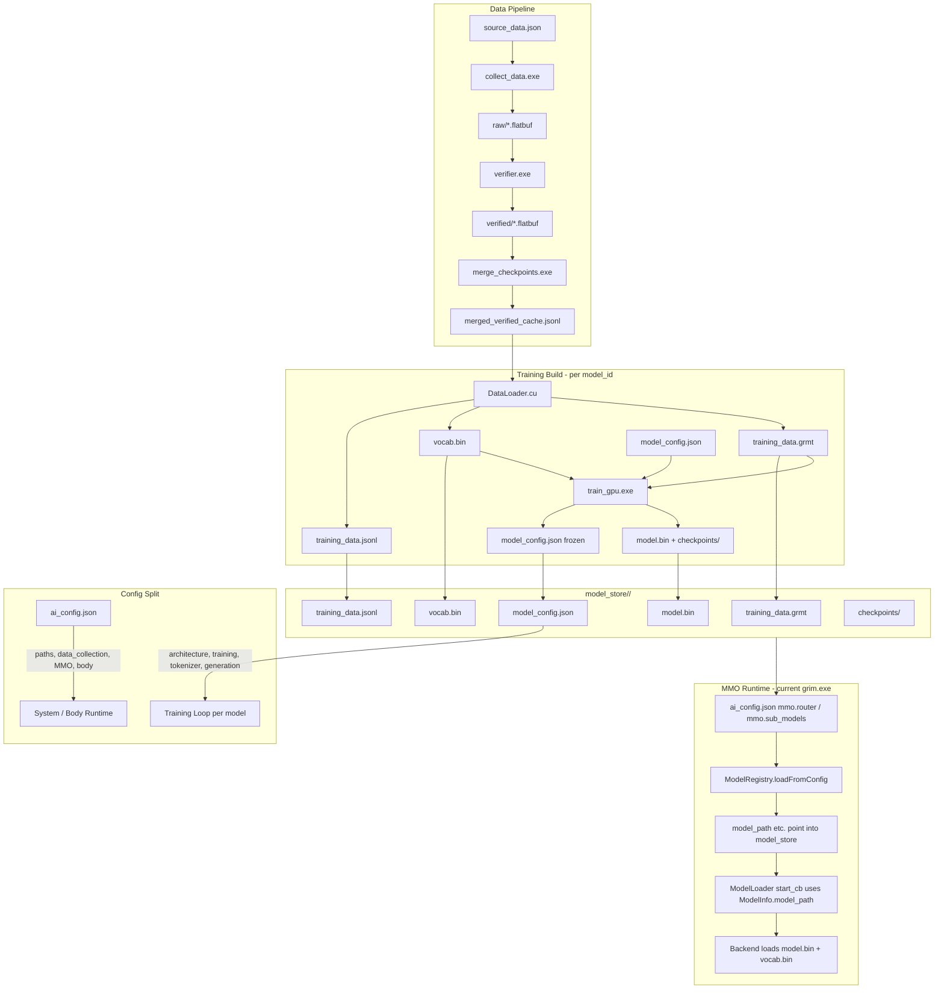

# Model Store and Training Artifact Structure

## Current State

Training artifacts are scattered across ad-hoc paths rooted under `resources/models/GRIM-text/`:

- **Training data**: `training/data/training_data.grmt` (binary, GRMT v9)
- **Vocab**: `training/data/vocab.bin` (binary KTMG format, optional `.txt` companion)
- **Checkpoints**: `checkpoints/checkpoint_final.bin` + `.mtp` sidecar
- **Source cache**: `training/data/merged_verified_cache.jsonl` (~76MB)
- **Paths governed by**: `ai_config.json` -> `paths.grim_text.`*

The GRMT format, vocab binary format, and checkpoint format are **stable and production-proven**. No changes to the file formats themselves are needed.

### ai_config.json Audit (completed)

Cross-referenced every field in `ai_config.json` against `ai_config_paths.hpp` (`TrainingHyperparameters`, `TokenizerConfig`, `GrimTextPaths`, `DataCollectionConfig`) and `HyperParameters_GPU.hpp` (`ModelArchitecture`, `loadModelArchitecture()`).

**Dead fields removed:**


| Field                              | Location          | Reason                                                                                                                     |
| ---------------------------------- | ----------------- | -------------------------------------------------------------------------------------------------------------------------- |
| `use_mixed_precision`              | `training.config` | Not in `TrainingHyperparameters`, never parsed by `applyTrainingConfigObject`. Only existed in legacy FlatBuffers schema.  |
| `guess_cache` (entire object)      | `training.config` | Never parsed by Phase1. GRIM-TS allocates cache buffers internally with hardcoded capacity. Config was documentation-only. |
| `hardcoded_hidden_states.patterns` | `training.config` | Documentation sub-object; parser only reads `enabled`, `pattern`, `log_every_n_batches`.                                   |
| `model_path`                       | top-level         | Legacy path redundant with `paths.grim_text.model`.                                                                        |


**Bug fixed:**


| Issue                                               | Fix                                                                                                                                                                    |
| --------------------------------------------------- | ---------------------------------------------------------------------------------------------------------------------------------------------------------------------- |
| `min_lr` in REQUIRED list + struct but never parsed | Removed `min_lr` from `TrainingHyperparameters` struct and REQUIRED validation list. `cosine_decay_min_lr` (from `cosine_decay.min_lr`) is the authoritative LR floor. |


**Missing field added:**


| Field             | Default | Added to                           |
| ----------------- | ------- | ---------------------------------- |
| `qk_norm.enabled` | `false` | `ai_config.json` `training.config` |


---

## Design

### Model Store Root

Introduce a single canonical directory where all trained models live:

```
resources/models/model_store/
```

The **current MMO implementation** ([MMO/Core/ModelRegistry.cpp](MMO/Core/ModelRegistry.cpp)) loads models **only from `ai_config.json`**: it expects `mmo.router` (object) and `mmo.sub_models` (array). There is no filesystem scan. Each model is a self-contained subfolder named by its `model_id`; the config entries point `model_path` and (for router) `hard_copy_path` into that folder.

### Per-Model Directory Layout

Every model trained by the training loop produces a **complete, portable bundle**:

```
resources/models/model_store/<model_id>/
  model.bin                    # Final trained checkpoint (FlatBuffer)
  model.bin.mtp                # MTP sidecar (if multi-token prediction enabled)
  vocab.bin                    # Binary vocab (KTMG format)
  vocab.txt                    # Human-readable vocab (optional, save_text_vocab)
  training_data.grmt           # Binary training data (GRMT v9)
  training_data.jsonl          # Hard copy JSONL of raw training texts
  model_config.json            # Per-model configuration (replaces training.config in ai_config.json)
  checkpoints/                 # Intermediate checkpoints from training
```

### Per-Model Config: `model_config.json`

**This is the key change.** Each model gets its own flat config JSON that replaces the `training.config` and `tokenizer` sections currently embedded in `ai_config.json`. This enables training multiple models with different architectures, hyperparameters, and tokenizer settings from a single codebase.

**What moves INTO `model_config.json`:**

- `training.config.`* → `model_config.json` (architecture, hyperparameters, generation, diagnostics)
- `tokenizer.`* → `model_config.json` `tokenizer` section

**What STAYS in `ai_config.json`:**

- `paths.`* (system-level paths including model_store root)
- `data_collection.`* (data pipeline config)
- `training.server_host` / `training.server_port` (training control server)
- `mmo.`* (MMO routing — which models to load, URLs, backends)
- Body config: `api_keys`, `backend`, `conversation_history_size`, `default_model`, `grim_text_url`, `localai_url`, `max_tokens`, `ollama_options`, `ollama_url`, `personality`, `silence_threshold`, `silence_timeout_ms`, `ui`, `vision`, `vision_model`, `voice`, `whisper`, `whisper_language`, `whisper_max_tokens`

`**model_config.json` structure:**

```json
{
    "model_id": "grim-text-base",
    "format_version": 1,
    "created_at": "2026-03-10T00:00:00Z",

    "architecture": {
        "d_model": 768,
        "num_layers": 12,
        "num_heads": 12,
        "num_kv_heads": 4,
        "d_ff": 3072,
        "max_seq_len": 1024,
        "tie_embeddings": false,
        "positional_encoding": {
            "use_learned": false,
            "use_rope": true,
            "use_alibi": true
        },
        "dropout_rate": 0.1,
        "residual_dropout_rate": 0.1,
        "attention_dropout": 0.12
    },

    "tokenizer": {
        "vocab_size": 10000,
        "max_vocab_size": 10000,
        "max_length": 2048,
        "min_subword_freq": 3,
        "prune_during_mining": false,
        "enable_parallel_subword_mining": true,
        "subword_mining_workers": 0,
        "subword_mining_max_bytes": 0,
        "model_type": "unibytes",
        "save_text_vocab": true,
        "add_bos": true,
        "add_eos": true,
        "unk_token": "<unk>",
        "pad_token": "<pad>",
        "bos_token": "<s>",
        "eos_token": "</s>",
        "enable_nfkc_normalization": true,
        "enable_lowercasing": true,
        "enable_parallel_tokenization": true,
        "parallel_threshold": 1000,
        "enable_byte_fallback": true,
        "expected_checksum": 0,
        "scratch_block_reasoning": {
            "enabled": true,
            "detect_urls": true,
            "detect_emails": true,
            "detect_paths": true,
            "detect_dates": true,
            "detect_code_literals": true
        }
    },

    "training": {
        "epochs": 5,
        "seed": 1,
        "batch_size": 8,
        "gradient_accumulation_steps": 2,
        "batch_strategy": "RANDOM",
        "learning_rate": 6e-4,
        "weight_decay": 0.01,
        "grad_clip_norm": 1.0,
        "per_token_grad_scale": true,
        "warmup_steps": 2000,
        "cosine_decay": { "enabled": true, "min_lr": 6e-5 },
        "min_seq_valid_tokens": 10,
        "log_interval": 25,
        "atom_stats_interval": 200,
        "atom_stats_max_seqs": 32,
        "validation_interval": 2000,
        "checkpoint_interval": 2000,
        "use_gpu": true,
        "use_flash_attention": true,
        "min_seq_len_for_flash": 256,
        "force_rebuild_vocab": false,

        "single_batch": { "enabled": false, "max_steps": 1000 },
        "soft_restart": { "enabled": false, "loss_increase_threshold": 3.0, "max_step_window": 50, "cooldown_steps": 200 },
        "auto_stop": { "enabled": true, "plateau_patience": 18, "plateau_min_delta": 0.004, "high_loss_threshold": 6.0, "high_loss_patience": 12 },
        "micro_validation": { "enabled": false, "interval": 500, "batch_limit": 8, "min_step": 500, "prefer_short": false },
        "guess_aux": { "enabled": false, "lambda": 0.25, "min_confidence": 0.7 },
        "shuffle": { "enabled": true, "epochs": 1 },

        "telemetry_control": {
            "enabled": false,
            "spike_thresholds": { "mild": 3.0, "moderate": 5.0, "severe": 10.0 },
            "response": { "moderate_grad_scale": 0.5, "moderate_cooldown_extension": 3 },
            "accumulation_guard": { "min_grad_for_nonzero_loss": 1e-10, "loss_threshold": 0.01, "max_consecutive_zero_grad_steps": 0 },
            "regime_change": { "seq_len_threshold": 0.3, "suppression_steps": 2 },
            "volatility_damping": { "threshold": 150.0, "max_damping": 0.9 },
            "gradient_decay": { "threshold": 0.0, "max_boost": 1.0 },
            "progress_boost": { "threshold": 100.0, "max_boost": 1.0 },
            "outlier": { "frequency_trigger": 0.95, "persistence_trigger": 0.9 },
            "drift": { "anchor_sigma_multiplier": 5.0 },
            "soft_restart": { "cooldown_steps": 100000 },
            "baseline": { "warmup_steps": 200, "stabilization_steps": 100 },
            "logging": { "verbose": false, "fail_loud_on_accumulation_bug": true },
            "plateau_noise": { "enabled": true, "patience": 30, "variance_threshold": 0.008, "noise_std": 0.1, "proportional": true, "cooldown": 10, "max_per_epoch": 3 }
        },

        "loss": {
            "label_smoothing": { "enabled": true, "epsilon": 0.1 },
            "focal": { "enabled": false, "gamma": 0.0, "alpha": 1.0 },
            "entropy_reg": { "enabled": false, "lambda": 0.0 },
            "class_balanced": { "enabled": true, "beta": 0.5 },
            "preference": { "enabled": false, "beta": 0.1 },
            "distillation": { "enabled": false, "temperature": 1.0, "lambda": 0.5 },
            "masking": { "enabled": true, "tag": "" }
        },

        "embedding_freeze": { "enabled": false, "freeze_after_step": 0 },
        "lm_head_centering": { "enabled": true, "center_hidden_states": true, "project_out_pc1": true, "pc1_power_iters": 5, "center_logits": false, "center_encoder_residuals": true },
        "layer_scale": { "enabled": false, "init_value": 1.0 },
        "qk_norm": { "enabled": false },
        "hardcoded_hidden_states": { "enabled": false, "pattern": "random_centered", "log_every_n_batches": 1 },

        "stability_overrides_enabled": false,
        "stability_overrides": { "batch_size": 8, "max_seq_len": 1024, "clip_per_token": 0.02, "lr_min": 5e-4 },
        "scratch_blocks": { "enabled": true, "max_tokens_per_block": 1024, "num_blocks": 4, "use_write_combined": true },
        "scratch_block_reasoning": { "enabled": true, "atom_embedding_dim": 96, "max_atoms": 8192, "atom_scale": 1.0 },
        "activation_quantization": { "enabled": false, "apply_to_embeddings": false, "apply_to_encoder_outputs": false, "apply_to_layer_caches": false, "apply_to_qkv_cache": false, "apply_to_logits": false, "scale": 1.0, "clip_min": -127.0, "clip_max": 127.0, "zero_point": 0, "symmetric": false },
        "cuda_execution": { "single_stream_mode": false, "disable_async_frees": false, "synchronize_after_kernels": true },
        "multi_token_prediction": { "enabled": true, "k": 3, "alpha": 0.2, "alpha_warmup_steps": 500, "log_ratio_monitor": true },
        "prediction_comparison": { "enabled": false, "interval": 100, "top_k": 5, "max_positions": 8, "log_path": "prediction_comparison.log" },
        "logit_update_trace": { "enabled": false, "interval": 50 },
        "attention_diagnostics": { "enabled": false, "layer": -1, "head": 0 },
        "log_recorder": {
            "enabled": true,
            "default_level": "Info",
            "modules": {
                "ForwardPass": "WARN", "BackwardPass": "WARN", "Optimizer": "Info", "Scheduler": "Info",
                "Activations": "WARN", "GuessCache": "Info", "Validation": "Info", "Checkpoint": "Info",
                "DataLoader": "Info", "Inference": "Info", "LogRecorder": "Info", "Training": "Info",
                "TrainingOrchestrator": "Info", "StreamController": "Info", "Custom": "Info"
            },
            "layers": { "embedding": true, "rms_norm": true, "attention": true, "feed_forward": true, "residual": true, "encoding": true, "serialization": true }
        }
    },

    "generation": {
        "strategy": "greedy",
        "max_new_tokens": 128,
        "min_new_tokens": 1,
        "temperature": 0.8,
        "top_k": 50,
        "top_p": 0.9,
        "min_p": 0.0,
        "typical_p": 1.0,
        "repetition_penalty": 1.1,
        "repetition_penalty_window": 64,
        "frequency_penalty": 0.0,
        "presence_penalty": 0.0,
        "no_repeat_ngram_size": 3,
        "do_sample": true,
        "enable_scratchblock_reasoning": true
    }
}
```

**Key properties of `model_config.json`:**

1. **Self-contained** — everything needed to reproduce the model is in one file
2. **Flat-ish** — top-level sections are `architecture`, `tokenizer`, `training`, `generation` (4 sections, not deeply nested inside system config)
3. **No paths** — paths are system-level and stay in `ai_config.json`
4. **Frozen on save** — written at end of training as the exact config that produced the checkpoint
5. **Read on load** — training loop reads this instead of `ai_config.json` `training.config`
6. `**format_version`** — allows future schema evolution

### Config Changes to `ai_config.json`

After migration, `ai_config.json` becomes the **system/body/MMO config only**:

```json
{
    "api_keys": { ... },
    "backend": "grim_native",
    "conversation_history_size": 10,
    "data_collection": {
        "clear_merged_cache_on_merge": false,
        "max_new_entries_per_run": 200,
        "max_huggingface_pdfs_per_dataset": 2000,
        "max_huggingface_pdfs_total": 10000
    },
    "default_model": "llama3.1:8b",
    "grim_text_url": "http://127.0.0.1:11435",
    "localai_url": "http://127.0.0.1:8080/v1",
    "max_tokens": 256,
    "ollama_options": { ... },
    "ollama_url": "http://127.0.0.1:11434",
    "paths": {
        "model_store": "resources/models/model_store",
        "grim_text": {
            "training_data": "resources/models/model_store/grim-text-base/training_data.grmt",
            "vocab": "resources/models/model_store/grim-text-base/vocab.bin",
            "model": "resources/models/model_store/grim-text-base/model.bin",
            "checkpoints": "resources/models/model_store/grim-text-base/checkpoints",
            "collected": "resources/models/GRIM-text/data/collected",
            "verified": "resources/models/GRIM-text/data/verified",
            "logs": "resources/models/GRIM-text/training/logs",
            "training_status": "resources/models/GRIM-text/training/training_status.fb",
            "merge_checkpoints_exe": "resources/models/GRIM-text/DataCollection/Release/merge_checkpoints.exe",
            "collector_log": "resources/models/GRIM-text/training/logs/collector.log",
            "source_config": "DataCollection/source_data.json"
        }
    },
    "personality": { ... },
    "training": {
        "server_host": "127.0.0.1",
        "server_port": 11436
    },
    "mmo": {
        "enabled": true,
        "mode": "shadow",
        "router": {
            "id": "grim-text-base",
            "name": "GRIM Text Router",
            "url": "http://127.0.0.1:11435",
            "model_path": "resources/models/model_store/grim-text-base/model.bin",
            "hard_copy_path": "resources/models/model_store/grim-text-base/training_data.jsonl",
            "backend_type": "grim_text_server"
        },
        "sub_models": []
    },
    "ui": { ... },
    "voice": { ... },
    "whisper": { ... }
}
```

**Note:** `training.config` and `tokenizer` are gone. Only `training.server_host/server_port` remain (server-level, not model-level).

---

## Code Changes

### 1. New: `loadModelConfig()` in `ai_config_paths.hpp`

Add a function that reads `model_config.json` and populates the same structs (`TrainingHyperparameters`, `TokenizerConfig`, `ModelArchitecture`):

```cpp
struct ModelConfigSnapshot {
    std::string model_id;
    int format_version = 0;
    std::string created_at;
    HyperParameters::ModelArchitecture architecture;
    TrainingHyperparameters hyperparameters;
    TokenizerConfig tokenizer_config;
    // generation config loaded separately by Phase1
};

std::optional<ModelConfigSnapshot> loadModelConfig(const std::string& model_config_path);
```

Internally, this reuses the same `applyTrainingConfigObject()`, `populateTokenizerConfigFromConfig()`, and `loadModelArchitecture()` parsing logic — the JSON keys are identical, just nested under `training` / `tokenizer` / `architecture` instead of `training.config` / `tokenizer`.

### 2. Update Phase1_Startup: Read from `model_config.json`

Phase1_Startup currently does:

1. Load `ai_config.json` via `loadAiConfigSnapshot()`
2. Parse `training.config` for hyperparameters, architecture, generation
3. Parse `tokenizer` for tokenizer config

Updated flow:

1. Load `ai_config.json` for **paths only** (`GrimTextPaths`)
2. Derive model directory from `paths.grim_text.model` parent directory
3. Read `<model_dir>/model_config.json` via `loadModelConfig()`
4. If `model_config.json` missing, **fallback** to `ai_config.json` `training.config` (migration period)

This means the training loop becomes model-directory-aware: it knows where the model lives, and reads its config from the same place.

### 3. Phase3_Cleanup: Write frozen `model_config.json`

At end of training, write `model_config.json` into the model directory as a frozen snapshot. Pulls from the already-parsed config structs. Includes `created_at` timestamp and `model_id` derived from the directory name.

### 4. DataLoader: Write JSONL hard copy alongside GRMT

In [DataLoader.cu](resources/models/GRIM-text/Shared/DataLoader/DataLoader.cu), after `save_grmt(...)` succeeds, write `training_data.jsonl` to the same directory.

### 5. `GrimTextPaths` struct update

Add `model_store` field to `ai_config_paths.hpp` `GrimTextPaths` and parse from `paths.model_store`.

---

## Data Flow Diagram




## Migration Strategy

1. **Phase A (now):** Clean `ai_config.json` (done). Create `model_store/grim-text-base/` directory. Write initial `model_config.json` by extracting current `training.config` + `tokenizer` from `ai_config.json`.
2. **Phase B:** Add `loadModelConfig()` to `ai_config_paths.hpp`. Update Phase1_Startup to try `model_config.json` first, fallback to `ai_config.json`. Both paths work during migration.
3. **Phase C:** Once confirmed stable, strip `training.config` and `tokenizer` from `ai_config.json`. All model config now lives in per-model `model_config.json`.
4. **New model training:** Copy `model_config.json` from an existing model, modify architecture/hyperparameters, point `ai_config.json` paths at the new model directory, and run training.

## MMO Integration Points (current MMO/Core)

- **ModelRegistry** ([ModelRegistry.cpp](MMO/Core/ModelRegistry.cpp)): Loads **only from `ai_config.json`** — `mmo.router` and `mmo.sub_models`. No filesystem scan. Each entry's `model_path` (and router-only `hard_copy_path`) should point at paths inside `model_store/<model_id>/` so the bundle layout is the single source of files.
- **ModelLoader** ([ModelLoader.cpp](MMO/Core/ModelLoader.cpp)): Does not load weights; it runs the state machine and calls `start_cb`/`stop_cb` with `ModelInfo`. The body's callback starts the backend process with `ModelInfo::model_path` and the corresponding vocab path. With the model store layout, vocab is always in the same directory as the checkpoint.
- **Orchestrator** ([Orchestrator.cpp](MMO/Core/Orchestrator.cpp)): Dispatches requests via `registerBackend(model_id, backend)`. Every model must have a backend registered at bootstrap.
- **Router-only fields**: `lora_path`, `hard_copy_path` — only on `mmo.router`; sub-models must not set them (validated in `ModelRegistry::validateModel`). `hard_copy_path` can point at the bundle's `training_data.jsonl` for LoRA training input.
- **model_config.json**: Read by training loop for model-specific config. The current registry does not read it; `ai_config.json` remains the single source of truth for MMO routing.

