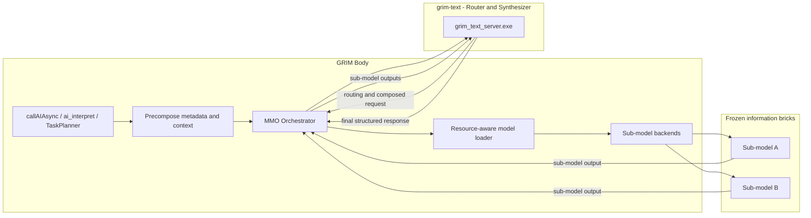
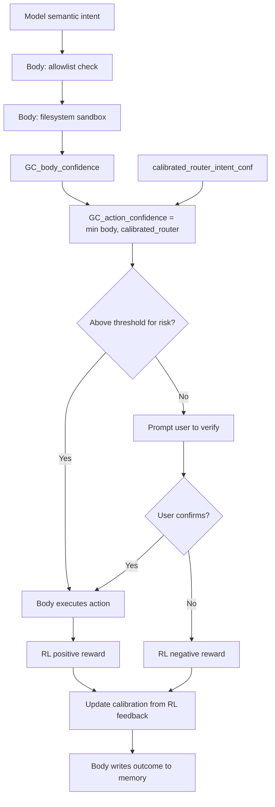

# Multi-Model Orchestration (MMO) Plan

## Invariants (non-negotiable)

- **Base model weights are never modified.** No code ever touches the model’s internal (base) weights. All user- and environment-specific adaptation is done **only** via a **LoRA file**.
- **LoRA is the personalization bridge.** The LoRA file is trained/updated using GRIM’s **memory** and **RL weighting** system. It is the single bridge of personalization between GRIM and the user. Inference always runs base model + LoRA; training/update of the LoRA happens in a separate pipeline (e.g. train_gpu or a dedicated LoRA trainer) that writes the LoRA file; the runtime only loads it.
- **Sub-models receive only the generation.** Subject-based sub-models do not receive raw user input or full context. They receive only a **structured composed_generation** prompt (strict template below). **grim-text as router** is responsible for embedding enough constraints into that prompt so sub-models cannot go off the rails (no invented assumptions, required grounding, parseable output). Without a strict contract, sub-models would invent assumptions grim-text didn’t intend, omit citations/grounding, and return output that’s hard to synthesize reliably.
- **Sub-models are frozen information bricks.** Sub-models are **not** personalized; they have no LoRA and are not updated from user interaction. grim-text **pulls from** them as fixed knowledge/skill sources. Only grim-text (router) adapts via LoRA; sub-models are read-only, subject-specific bricks.
- **Sub-model output feeds back into grim-text for the final response.** The user-facing output is **not** the raw sub-model response. The body invokes sub-model(s), then passes their output(s) **back into grim-text**. grim-text synthesizes a **structured response** (e.g. unified format, confidence, intent) from these bricks. So on the “end side”: sub-models → feedback into grim-text → grim-text produces the final structured response to the body/user.
- **The model never writes to memory.** grim-text (and sub-models) are read-only consumers of memory context. All memory writes (short-term store, long-term sync, LoRA training data) are performed by the **body** (GRIM). The model receives precomposed memory context; it does not modify, create, or delete memory entries.
- **Actions hook into commands and plugins; no action JSON.** The model **never** outputs a freeform command string or "run this". The body’s **commands and plugin system** is the hook for the model’s semantic actions: grim-text indicates semantic intent (e.g. suggested command + args); the body maps that to a **registered command or plugin**, validates (command registry / plugin allowlist, sandbox as defined by commands/plugins), applies the **Training Wheels gate**, then **invokes** via the existing system. No separate action JSON — **commands and plugins are the action interface**.

---

## Action boundary: commands and plugin system (body validates, then invokes)

The model does **not** output a raw command or a custom action JSON. The body’s **commands** and **plugin system** are the hook: semantic intent (from grim-text’s response or suggested_command) is mapped to a **registered command or plugin**; that registry is the allowlist. **No action JSON** — commands and plugins **are** the action interface.

Each command/plugin has its own signature, args, and (where applicable) sandbox/risk policy; the body enforces those before invocation.

**Body-side validation (in order)**  

1. **Command/plugin allowlist**: Intent must resolve to a **registered** command or allowed plugin. No ad-hoc verbs or shell.
2. **Sandbox and preconditions**: Whatever the command or plugin defines (e.g. filesystem sandbox, preconditions) is enforced before invocation.
3. **Training Wheels gate**: `GC_action_confidence` (see Phase 4) must meet the threshold for this command/plugin’s risk category; if not, prompt user to verify (or reject).

**Execution**  

- Only after all checks pass does the body **invoke** the command or plugin via the existing command/plugin system. The model never emits shell strings or "run this"; it only contributes semantic intent that the body turns into a command/plugin call.

---

## Sub-model contract: composed_generation and output format

Because sub-models **never see raw user input or full context**, grim-text (as router) must embed all necessary constraints into **composed_generation**. Without a **strict template**, sub-models will: invent assumptions grim-text didn’t intend, omit citations/grounding, and return output that’s hard to synthesize reliably.

**composed_generation: structured prompt template**

The router (grim-text) fills a **strict structured prompt** when it produces `composed_generation` for a sub-model. The prompt is **tagged text or JSON** with required sections so sub-models know exactly what to do and what not to do. Minimum sections (names may be configurable per sub_model type):

- **TASK** – What to do in one sentence; no ambiguity.
- **SCOPE** – Boundaries (e.g. "only existing files in /docs", "do not infer user identity").
- **ALLOWED_ASSUMPTIONS** – What the sub-model may assume (e.g. "user meant current directory"); anything else is out of scope.
- **OUTPUT_SCHEMA** – Required shape of the response (e.g. JSON with keys `answer`, `citations`, `confidence`; or tagged sections ANSWER, CITATIONS, REFUSAL).
- **REFUSE_IF** – Conditions under which the sub-model must refuse or return a structured refusal (e.g. "if target path is outside SCOPE").
- **STYLE** – Tone/length (e.g. "one paragraph", "technical").
- **MAX_LENGTH** – Hard cap (tokens or characters).

Example (tagged text):  
`TASK: Summarize the following path's contents.\nSCOPE: Path must be under C:\\Users\\...\nALLOWED_ASSUMPTIONS: Path exists.\nOUTPUT_SCHEMA: JSON { "summary": string, "citations": string[] }\nREFUSE_IF: Path outside SCOPE.\nSTYLE: One paragraph.\nMAX_LENGTH: 512\n\n---\n[router-injected context only]`

grim-text is responsible for populating these from precomposed metadata and context (it sees user input + memory); sub-models see **only** this composed prompt.

**Sub-model output: machine-parseable**

Sub-models **must** return **machine-parseable** output so grim-text can synthesize reliably. Acceptable formats:

- **JSON** conforming to the OUTPUT_SCHEMA specified in composed_generation (preferred when possible).
- **Tagged sections** (e.g. `ANSWER: ...`, `CITATIONS: ...`, `REFUSAL: ...`) when the sub-model cannot guarantee valid JSON.

The body and grim-text must be able to **parse** sub-model responses into a canonical structure (e.g. extract answer, citations, refusal reason). Freeform-only blobs that omit citations or are impossible to parse reliably are **out of scope**; sub-models that cannot comply with OUTPUT_SCHEMA/REFUSE_IF should return a structured refusal.

**Synthesis**

Grim-text receives one or more such parsed sub-model outputs and produces the **final structured response** (and optional semantic intent that the body maps to a command/plugin). Because inputs are structured, synthesis is deterministic and reliable.

---

## Context: Body vs Brain

- **GRIM (body)**: Main app — `main.cpp`, `ai/`, `control/`, `perception/`, memory, RL. Owns UI, voice, task planning, intent, **precomposed metadata and context** sent to the brain, and which sub-model to call after the router responds. Does not touch model weights; drives LoRA training via memory and RL signals.
- **grim-text (brain, router model)**: The **router model**. It receives **precomposed metadata and context** from the body and, based on that metadata, **chooses which sub-model to use** (and may output a composed generation request). It does not perform all end-user generation itself; it routes to subject-based sub-models. Stays lightweight. Base weights frozen; only LoRA is user-specific.
- **Sub-models**: Subject-based, **frozen information bricks**. They receive **only the generation** (the composed prompt/instruction); they do not adapt (no LoRA). grim-text **pulls from** them. Their output is **fed back into grim-text**; grim-text then produces the **final structured response** to the body/user. Loaded on a per-use, resource-aware basis (see Model loading).

Orchestration flow: **Body** → precomposed metadata + context → **grim-text (router)** → routing decision + composed request → **Body/MMO** invokes chosen **sub-model(s)** with that generation → sub-model(s) generate → **sub-model outputs feed back into grim-text** → **grim-text synthesizes final structured response** → body/user.

---

## Memory design

**Ownership: body writes, model reads.** The model (grim-text router and sub-models) **never writes to memory**. All memory storage, routing, indexing, decay, and sync operations are performed by the body (GRIM). The model receives a **read-only precomposed memory context** as part of its input.

**Short-term: rotating 3-buffer design**

1. **Working buffer** – The model’s current working memory (active context for the current request/session).
2. **Preprocessing buffer** – Incoming data is staged here before being merged into working memory or synced to long-term.
3. **Sync-and-clear buffer** – After preprocessing, short-term memory is synced to long-term here; then this buffer is cleared. So: preprocess → sync to long-term → clear.

Rotation: data flows working ↔ preprocessing → sync-and-clear → long-term; after sync, the cleared buffer becomes available again for the next cycle.

**Long-term: two structure points**

1. **LoRA file** – The persistent personalization adapter (trained from GRIM memory and RL weighting). This is what gets updated over time; base weights are never written.
2. **Hard copy** – The persistent store that the LoRA is trained on (the canonical data/snapshot used to adapt the LoRA to the environment and user). This is the “source of truth” for what the LoRA was trained on; LoRA training reads from here and writes only the LoRA file.

So long-term memory is: (1) the LoRA file (adaptation weights), (2) the hard copy (training data / persistent context the LoRA adapts to).

**Memory context retrieval (body to router)**

The body uses the existing 3-tiered memory system (`UnifiedMemoryStorage` in [memory/unified_memory.hpp](memory/unified_memory.hpp), `MemoryStorage` in [memory/memory_storage.hpp](memory/memory_storage.hpp), `ContextManager` in [memory/context_manager.hpp](memory/context_manager.hpp)) to **find memories relevant to the current context and user input**. This retrieval is done entirely by the body before calling the router:

1. **Query**: Body takes the user's input + current `ContextSnapshot` (recent intents, commands, mood, conversation depth from `ContextManager::getSnapshot()`) and queries memory via `UnifiedMemoryStorage::search(query)`, `getByTag(tag)`, `getByTags(tags)`, or `semanticSearch(query)` (when implemented).
2. **Filter**: Results are filtered by relevance (text match, tag match, recency, confidence score). The existing `MemoryRouter::evaluate()` priority scoring (in [memory/memory_router.hpp](memory/memory_router.hpp)) can be reused for ranking.
3. **Compose**: Found memories are serialized into a **precomposed memory context** payload (e.g. JSON with relevant memory entries, context tags, environment tags, current confidence state from `Confidence::GC` in [Reward_Learning/grim_confidence.hpp](Reward_Learning/grim_confidence.hpp)). This payload is sent to the router model alongside the user's input/metadata.
4. **Read-only contract**: The router receives this payload as context. It uses it for routing decisions and composed generation. It **never returns memory-write instructions**; the body handles all memory mutations post-response (e.g. storing the interaction, updating confidence, RL feedback via `GRIM::RL::processCommandResult` in [ai/ai_rl.hpp](ai/ai_rl.hpp)).

---

## Model loading: resource-aware state machine, use-degrading

- Models (router + sub-models) are loaded **on a per-use, resource-aware** basis. The system does not keep every model in GPU memory at once.
- **Use-degrading**: The longer a model is used (session length or cumulative use), the longer it stays in GPU memory before being eligible for eviction. So: recent or long sessions → keep in memory; idle or short one-off use → evict sooner. This can be implemented as a state machine (e.g. loaded → in_use → idle → evict_eligible) with timers or use counters that delay eviction for “hot” models.
- State machine states (conceptual): **unloaded** → **loading** → **loaded** (in GPU) → **in_use** (request in flight or recent) → **idle** (no recent use; use-degrading timer running) → **evict_eligible** → **unloading** → **unloaded**. Transitions are resource-aware (e.g. do not load if GPU memory is above threshold unless evicting another model).

---

## Current State

| Area                       | What exists                                                                                                                                                                                                                                                        |
| -------------------------- | ------------------------------------------------------------------------------------------------------------------------------------------------------------------------------------------------------------------------------------------------------------------ |
| **Body backend selection** | `[ai/ai.cpp](ai/ai.cpp)`: `resolveBackendURL()` returns one backend; `callAIAsync()` branches on it (grim_native → `g_grimBackend` HTTP to grim-text server; ollama/localai/openai → cpr).                                                                         |
| **Body → grim-text**       | `[ai/grim_backend.cpp](ai/grim_backend.cpp)`: HTTP client to `grim_text_url` (e.g. 11435). `[ai/grim_text_server_manager.cpp](ai/grim_text_server_manager.cpp)`: starts/stops single `grim_text_server.exe`.                                                       |
| **MMO stubs**              | `[MMO/Shared/MMD.hpp](MMO/Shared/MMD.hpp)`: `MMD::ModelInfo` (ID, name, Version, Subject, model_path, SubjectTags, Usage_Weight). `getSubjectTags(RawInput)` declared. `[MMO/Router/ModelRouter.hpp](MMO/Router/ModelRouter.hpp)`: empty.                          |
| **Call sites**             | `callAIAsync` used from: `[ai/ai.cpp](ai/ai.cpp)` (chat, interpret, process, warmup), `[ai/task_planner.cpp](ai/task_planner.cpp)`, `[ai/lm_intent.cpp](ai/lm_intent.cpp)`, `[voice/voice_speak.cpp](voice/voice_speak.cpp)`. All use the single resolved backend. |
| **Brain**                  | One model per server process; no in-process multi-model or routing. `[ScratchBlockPool_GPU.hpp](resources/models/GRIM-text/Shared/ScratchBlock/ScratchBlockPool_GPU.hpp)` mentions multi-model for buffer sharing but no higher-level orchestration.               |

---

## Goals for MMO

1. **grim-text as router and synthesizer** – Body sends precomposed metadata and context to grim-text; grim-text selects which subject-based sub-model(s) to use and outputs a composed generation request. Sub-model outputs **feed back into grim-text**; grim-text produces the **final structured response** (not raw sub-model output). No routing or final response that bypasses grim-text.
2. **Sub-models as frozen information bricks** – Sub-models get only the **structured composed_generation** (strict template: TASK, SCOPE, ALLOWED_ASSUMPTIONS, OUTPUT_SCHEMA, REFUSE_IF, STYLE, MAX_LENGTH); they are **frozen** (no LoRA). grim-text embeds all constraints so sub-models don’t invent assumptions or omit grounding; sub-model output must be machine-parseable (JSON or tagged sections) for reliable synthesis.
3. **Sub-models receive only the generation** – They do not see raw user input or full context; they see only the composed prompt. grim-text (router) is responsible for filling the template so that is sufficient.
4. **Frozen base weights; LoRA-only adaptation (grim-text only)** – Only grim-text is personalized via one LoRA file (trained from GRIM memory and RL weighting); sub-models are fixed. No code path writes to base model weights.
5. **Resource-aware loading with use-degrading** – Load router and sub-models on demand; keep models in GPU longer when they are used more.
6. **Single config and API** in the body: registry of router + sub-models, memory (3-buffer + LoRA/hard copy), and Training Wheels; all call sites go through the orchestrator.
7. **Extensibility** for future subject-based frozen bricks without rewriting call sites.

---

## Architecture (High Level)

- **Body** builds **precomposed metadata and context** (from memory, intent, task, user context) and sends it to **grim-text (router)**. The router runs **base + LoRA** (LoRA = personalization bridge); it **never** has its base weights written.
- **grim-text (router)** returns a **routing decision** and **composed generation request**. The body/orchestrator invokes the chosen **sub-model(s)** (frozen information bricks) with **only that generation**. Sub-models have **no LoRA**; grim-text **pulls from** them.
- **Sub-model output feeds back into grim-text.** The body passes sub-model response(s) **back to grim-text**. grim-text **synthesizes the final structured response** (unified format, confidence, intent) from these bricks. The user/body receives this **grim-text output**, not raw sub-model output.
- **ModelRegistry**: Holds `MMD::ModelInfo` for router + each sub-model; sub-models are **frozen** (no lora_path). Only the router has LoRA.
- **Resource-aware loader**: State machine with use-degrading. Orchestrator uses loader for router and sub-models.
- **Orchestrator**: Builds precomposed context → calls router → gets routing + composed request → invokes sub-model(s) with only that generation → **passes sub-model output(s) back to grim-text** → grim-text returns **final structured response** → orchestrator returns that to the body. Session/history and 3-buffer memory in body; long-term = LoRA file + hard copy.

---

## Phase 1: Body – Backend abstraction and registry

**1.1 Unified backend interface (body)**  

- Add `ai/backends/IGenerationBackend.hpp`: interface with `generate(prompt, max_tokens, options)`, `generateWithHistory(prompt, history, max_tokens)`, `isAvailable()`, `getBackendId()`. All backends are read-only from the model’s perspective (no weight writes; LoRA loading is separate).
- Implement:
  - **Router backend** (grim-text): `GrimNativeRouterBackend` – HTTP to grim_text_url; sends **precomposed metadata and context**; expects response with **routing decision** (sub-model id) and **composed generation** for that sub-model. Uses existing grim_text_server_manager. Router runs base + LoRA (LoRA path from config); server loads LoRA, never writes base weights.
  - **Sub-model backends**: e.g. grim-text sub-model server or Ollama/LocalAI. They expose `generate(composed_prompt_only, ...)` – they **receive only the generation**, not raw user context.
- LoRA path and hard-copy path in config; inference only loads LoRA; training/update of LoRA is a separate pipeline (memory + RL → trainer → writes LoRA file only).

**1.2 Model registry and config**  

- Implement `MMO/Core/ModelRegistry.hpp/.cpp`: load **router** (single) and **sub-models** (list), each with `MMD::ModelInfo` plus backend type, URL/path, **lora_path** (optional), **hard_copy_path** (optional), subject tags (for sub-models).
- Extend `ai_config.json`: `router` (model id, backend, url, lora_path, hard_copy_path), `sub_models` array (id, backend, url/path, subject_tags, optional lora_path), optional `routing` (default_sub_model). Backward compatibility: if missing, single grim-text as both router and sole “sub-model.”
- Implement `MMD::getSubjectTags` in `MMO/Shared/MMD.cpp`: keyword/tag extraction for subject-based routing.

**1.3 Router and synthesizer API (body → grim-text)**  

- **grim-text is the router and the synthesizer.** Body sends precomposed metadata + context to the router backend; grim-text returns structured response: `{ "sub_model_id": "...", "composed_generation": "..." }`. Body then invokes the selected sub-model (frozen brick, no LoRA) with **only** `composed_generation`. Body’s `ModelRouter` is thin: parse router response. (2) Body sends sub-model output(s) back to grim-text (synthesize call); grim-text produces the final structured response (e.g. response text, confidence_correctness, confidence_user_intent, intent). That synthesized response is what is returned to the user; sub-models are frozen information bricks, only grim-text adapts via LoRA.

---

## Phase 2: Body – Resource-aware loader, orchestrator, memory integration

**2.1 Resource-aware model loader (use-degrading state machine)**  

- Add `MMO/Core/ModelLoader.hpp/.cpp`: per-model state machine **unloaded → loading → loaded → in_use → idle → evict_eligible → unloading → unloaded**. Resource-aware transitions (e.g. do not load if GPU memory above threshold without evicting). **Use-degrading**: longer or more recent use keeps model in GPU longer (e.g. last-use timestamp + session-use counter; evict_eligible only after idle timeout that increases with recent use). Orchestrator requests “router” or “sub_model_id” from loader; loader returns handle and marks in_use; caller signals when done so loader can transition to idle.
- Router (grim-text) and each sub-model are tracked by the loader. Sub-models may be separate processes (e.g. grim_text_server per port) or one server with model id; “load”/“unload” means ensure this model is in GPU / eligible for eviction.

**2.2 MMO orchestrator**  

- Add `MMO/Core/Orchestrator.hpp/.cpp`: owns registry, **router backend** (grim-text), **sub-model backends** (map sub_model_id → backend; all **frozen**), and **ModelLoader**.  
- API: `generate(prompt, options)` with precomposed **metadata and context** in options. Flow: (1) Build precomposed payload from prompt + options. (2) Get router from loader; call router backend with precomposed metadata + context. (3) Parse response → sub_model_id + composed_generation. (4) Get that sub-model from loader; call sub-model backend with **only** composed_generation (frozen brick). (5) **Pass sub-model output(s) back to grim-text** (synthesize call). (6) grim-text returns **final structured response**; orchestrator returns that to the body/user. No weight writes in this path. User never sees raw sub-model output; they see grim-text’s synthesized response.
- **3-buffer memory**: Working, preprocessing, and sync-and-clear buffers live in the body (e.g. memory/ or MMO/memory). Precomposed context is built from working + preprocessing; after sync phase, short-term syncs to long-term (hard copy / LoRA training input) and sync-and-clear is cleared. Orchestrator receives “current context” from the body; it does not implement buffers. Long-term = **LoRA file** + **hard copy** (config paths); only the training pipeline writes them; orchestrator only reads.

**2.3 Lifecycle**  

- Orchestrator init in bootstrap: build registry (router + sub_models), create router backend, register sub-model backends. Start grim-text router server if config uses it. Loader starts with all models unloaded; router may be preloaded or loaded on first use.
- Shutdown: stopGRIMTextServer(); loader unloads all models; orchestrator destructor clears backends.

**2.4 Replace direct backend use with orchestrator**  

- Replace `resolveBackendURL()` + branching in `callAIAsync` with: build precomposed metadata + context (from 3-buffer / memory), then orchestrator.generate(prompt, options). Same for ai_interpret, ai_process, warmup – pass intent/role in options. Sub-models receive only composed_generation.

---

## Phase 3: Config, routing response contract, and observability

**3.1 Config schema**  

- Document in `ai_config.json` (and in docs):
  - **router**: `{ "id", "backend", "url", "lora_path", "hard_copy_path" }` – single router model (grim-text). Base weights never written; only LoRA (and hard copy for training input) are user-specific.
  - **sub_models**: array of `{ "id", "name", "backend", "url"|"path", "subject_tags" }`. Sub-models are **frozen** (no lora_path). They receive only **composed_generation** (strict template); they must return **machine-parseable** output (JSON or tagged sections per OUTPUT_SCHEMA). Their output feeds back into grim-text for synthesis.
  - **routing**: `{ "default_sub_model_id" }` – fallback if router does not specify sub_model_id. Routing **decision** is made by grim-text (router); body only parses response.
  - **memory**: optional paths for 3-buffer and long-term: working/preprocessing/sync buffer sizes or paths, **lora_path** (persistent LoRA file), **hard_copy_path** (persistent store LoRA is trained on).

**3.2 Router and synthesizer response contract**  

-  **Route call**: grim-text returns `{ "sub_model_id": "<id>", "composed_generation": "<structured_prompt>" }`. **composed_generation** must follow the **strict template** (TASK, SCOPE, ALLOWED_ASSUMPTIONS, OUTPUT_SCHEMA, REFUSE_IF, STYLE, MAX_LENGTH) so sub-models receive enough constraints and do not see raw user input. Body invokes the selected sub-model with only this composed prompt. **Synthesize call**: Body sends **parsed** sub-model output(s) (machine-parseable: JSON or tagged sections per OUTPUT_SCHEMA) back to grim-text; grim-text returns the **final structured response**. When the response involves an **action**, the body maps it to a **registered command or plugin** (commands/plugin system); body validates (allowlist, sandbox, Training Wheels) then invokes. No action JSON — commands and plugins are the hook. Response may include weak confidence signals for calibration; action gating is body-primary.

**3.3 Logging and debugging**  

- Log per request: router used, sub_model_id and backend selected, and that sub-model received only composed_generation. Expose in command/settings: current router, last sub-model, loader state (loaded/idle/evict_eligible) per model.

---

## Phase 4: Training Wheels Protocol (action guard)

The Training Wheels Protocol is the **guard between manual actions and autonomous ones**. Action gating is based **primarily on body-side signals**; router confidence is a **weak signal with capped influence**. Without calibrating router confidence using RL feedback history, Training Wheels will either **block forever** or **let dumb actions through**.

**4.1 Action confidence: body-primary, router weak and calibrated**

Before the body invokes any **command or plugin** (after resolving intent to a registered command/plugin and validating allowlist/sandbox), the system computes **GC_action_confidence** and compares it to the threshold for that action’s **risk** category.

- **Primary inputs (body-side)**  
  - **Command parser certainty** – How confident the body is that the user input was parsed correctly (e.g. intent + slot extraction).  
  - **Memory match quality** – Relevance/strength of retrieved memories for this context (e.g. from `UnifiedMemoryStorage` search / semantic match).  
  - **Tool preconditions satisfied** – Whether the chosen action’s preconditions (e.g. file exists, app installed) are met.  
  - **Historical success rate** for this action + context similarity – From RL/feedback history: success rate for the same or similar (action, context) buckets.  
  - **User friction cost** – Estimated cost of asking the user to confirm (e.g. high for frequent low-risk actions).
  These are combined into **GC_body_confidence** (e.g. weighted combination or minimum of critical factors). Body owns this; it is the **primary** gate.
- **Router confidence as weak, capped signal**  
  - The router’s self-reported intent/confidence (e.g. `confidence_user_intent`) is **not** the main gate. It is **temperature-scaled** and **bucket-calibrated** using **RL feedback history**: map raw router score to a calibrated value so that over time, "0.7 from the router" reflects actual success rate in that bucket. Without this calibration, router scores are poorly calibrated and Training Wheels either block too often or allow bad actions.  
  - **Calibrated_router_intent_conf** = bucket-calibrated (and optionally temperature-scaled) router intent confidence, using RL feedback history per (action_bucket, context_similarity) or similar.
- **Single rule**  
  - **GC_action_confidence = min(GC_body_confidence, calibrated_router_intent_conf)**  
  - So: body confidence is the ceiling; router confidence (after calibration) can only lower the bar. Router has **capped influence** and is treated as one weak signal among many.

**4.2 User verification flow**

When **GC_action_confidence** is below the threshold for the action’s **risk** category:

1. Body presents the **proposed command/plugin** (or a user-friendly summary) to the user: e.g. "I want to run [command] with [args]. Is this what you want?" (via existing voice/UI channels). No freeform "run this" is ever shown or executed.
2. **User confirms (yes)**: Body executes the action (allowlist + sandbox already validated). RL receives a **positive reward** via `GRIM::RL::processCommandResult()` and `GRIM::RewardLearning::sendCommandFeedback()`. Outcome is used to update **calibrated_router_intent_conf** (bucket calibration) and LoRA training data.
3. **User rejects (no / not what I wanted)**: Action is **cancelled**. RL receives a **negative reward (punishment)**. Calibration and LoRA pipeline incorporate this so similar proposals are gated more strictly in the future.
4. Post-feedback, the body writes the outcome to memory (working buffer → hard copy). The model never writes to memory.

**4.3 Progressive autonomy (intent alignment over time)**

- As calibration and LoRA adapt from reward/punishment, **calibrated_router_intent_conf** and body-side success rates improve. The system passes the gate more often for well-aligned (action, context) buckets and stays strict where feedback was negative — "training wheels come off" only where warranted.
- Thresholds are **per-risk category** (e.g. `destructive` higher than `search`). Optionally user-adjustable. Confidence history is logged for observability.

**4.4 Integration points**

- **Commands/plugins only**: Model semantic actions hook into the **commands and plugin system**. Body resolves intent to a **registered command or plugin**, validates (allowlist, sandbox as defined by command/plugin), then applies **Training Wheels gate** (GC_action_confidence vs threshold). No freeform shell or "run this"; no action JSON.
- **GC_action_confidence = min(GC_body_confidence, calibrated_router_intent_conf)**. Body computes GC_body_confidence from command parser certainty, memory match quality, tool preconditions, historical success rate for (action, context), user friction cost. Router intent confidence is **temperature-scaled and bucket-calibrated** using RL feedback history; without calibration, Training Wheels block forever or let dumb actions through.
- **Router response**: Router may still emit a weak confidence signal (e.g. `confidence_user_intent`) for calibration input; it does **not** drive the gate by itself.
- **Config**: `ai_config.json` → `training_wheels`: `action_threshold`, `per_category_thresholds` by `risk` (e.g. destructive, system, search), `enabled`, and calibration/bucket config for router intent.
- **RL feedback**: `GRIM::RL::processCommandResult()` and reward learning feed **calibration** (so calibrated_router_intent_conf improves) and LoRA training. User confirm = positive; reject = negative.

---

## Phase 5: Brain-side options (optional / later)

**5.1 Router and synthesizer (grim-text)**: LoRA-only, no weight writes  

- grim_text_server loads **base model (read-only) + LoRA file**. All personalization is in the LoRA; base weights are never written. LoRA file path from config; updates to LoRA come from a **separate training pipeline** (GRIM memory + RL weighting → trainer → writes LoRA file only). Optionally server reads **hard copy** for context; hard copy is written by the body/training pipeline, not by inference.
- **Route endpoint**: Accepts precomposed metadata + context (including found memories); returns `{ "sub_model_id", "composed_generation", "confidence_correctness", "confidence_user_intent" }`. Routing logic lives inside grim-text.
- **Synthesize endpoint**: Accepts **parsed sub-model output(s)** (JSON or tagged sections per composed_generation’s OUTPUT_SCHEMA). Grim-text produces the **final structured response**. When the response includes an action, the body maps it to a **registered command or plugin** (commands/plugin system). Optional weak confidence fields feed body-side calibration; body owns the action gate. No action JSON. Sub-models never return freeform-only blobs; output must be parseable for reliable synthesis.

**5.2 Sub-model servers (frozen information bricks, body-managed, resource-aware)**  

- Sub-models can be multiple grim-text or Ollama/LocalAI instances. They are **frozen** (no LoRA, no adaptation). Body starts sub-model servers via extended server manager; **ModelLoader** controls load/unload (use-degrading). Each sub-model: base only, **no weight writes**. Output is returned to the body, which passes it back to grim-text for synthesis.
- Config: per sub_model id, port/url; no lora_path. Router selects sub_model_id; body invokes that sub-model with only composed_generation; body then sends sub-model output to grim-text synthesize endpoint.

**5.3 Long-term memory and LoRA training**  

- **LoRA file** and **hard copy** are the two long-term structure points. Hard copy is the persistent store the LoRA is trained on (environment + user adaptation). A separate pipeline (not in the inference path) runs training: reads from memory + RL signals (including Training Wheels reward/punishment signals) and hard copy, **writes only the LoRA file**. Inference path only **loads** LoRA and optionally reads hard copy for context; it never writes base or LoRA weights.

---

## File and dependency summary

| Component          | New/Modified files                                                                                                                                                                                                                                                                                                                       |
| ------------------ | ---------------------------------------------------------------------------------------------------------------------------------------------------------------------------------------------------------------------------------------------------------------------------------------------------------------------------------------- |
| Backend interface  | `ai/backends/IGenerationBackend.hpp`, router backend (precomposed in → route response; synthesize(sub_model_outputs) → final structured response), sub-model backends (frozen bricks, composed_generation in only)                                                                                                                       |
| MMD                | `MMO/Shared/MMD.hpp` (existing), `MMO/Shared/MMD.cpp` (`getSubjectTags`)                                                                                                                                                                                                                                                                 |
| Registry           | `MMO/Core/ModelRegistry.hpp`, `MMO/Core/ModelRegistry.cpp` (router + sub_models, lora_path, hard_copy_path)                                                                                                                                                                                                                              |
| Router (thin)      | `MMO/Router/ModelRouter.hpp`, `MMO/Router/ModelRouter.cpp` (parse grim-text router response)                                                                                                                                                                                                                                             |
| ModelLoader        | `MMO/Core/ModelLoader.hpp`, `MMO/Core/ModelLoader.cpp` (use-degrading state machine, resource-aware load/unload)                                                                                                                                                                                                                         |
| Orchestrator       | `MMO/Core/Orchestrator.hpp`, `MMO/Core/Orchestrator.cpp` (memory retrieval + precompose → router → Training Wheels check → sub-model with only composed_generation)                                                                                                                                                                      |
| Memory retrieval   | Body-side: uses existing `UnifiedMemoryStorage::search/getByTag/getByTags/semanticSearch`, `ContextManager::getSnapshot()`, `MemoryRouter::evaluate()` for relevance. Composes found memories into precomposed payload. Model never writes.                                                                                              |
| Training Wheels    | `MMO/Core/TrainingWheels.hpp`, `MMO/Core/TrainingWheels.cpp`: GC_action_confidence = min(GC_body_confidence, calibrated_router_intent_conf); body-side signals (parser certainty, memory match, preconditions, historical success, friction); router confidence bucket-calibrated from RL; user verification flow; RL reward/punishment. |
| Action boundary    | **Commands and plugin system** are the hook for model semantic actions. Body resolves intent to registered command/plugin (allowlist), validates sandbox/preconditions, Training Wheels gate, then invokes. No action JSON; no freeform shell or "run this".                                                                             |
| Sub-model contract | **composed_generation**: strict template (TASK, SCOPE, ALLOWED_ASSUMPTIONS, OUTPUT_SCHEMA, REFUSE_IF, STYLE, MAX_LENGTH); grim-text fills it. Sub-model output: machine-parseable (JSON or tagged sections). Parser/schema in router-synthesizer path.                                                                                   |
| 3-buffer memory    | Body memory module (working, preprocessing, sync-and-clear); long-term = LoRA file + hard copy; orchestrator receives context, does not implement buffers                                                                                                                                                                                |
| RL integration     | `Reward_Learning/grim_rl.hpp/.cpp` (existing), `ai/ai_rl.hpp` (existing) -- extended to accept Training Wheels confirmation/rejection signals                                                                                                                                                                                            |
| Confidence         | `Reward_Learning/grim_confidence.hpp/.cpp` (existing) -- router confidence scores integrated into `GC` for threshold checks                                                                                                                                                                                                              |
| Integration        | `ai/ai.cpp` (orchestrator.generate with precomposed context + memory), `bootstrap/bootstrap.cpp` (init orchestrator + loader + Training Wheels), `main.cpp` (shutdown)                                                                                                                                                                   |
| Config             | `ai_config.json`: `router`, `sub_models`, `routing`, `memory` (lora_path, hard_copy_path, buffer config), `training_wheels` (action_threshold, per_category_thresholds by risk, enabled, calibration), action_allowlist, sandbox (paths)                                                                                                 |

---

## Implementation order (suggested)

1. **Phase 1.1** – Backend interface: router backend (precomposed in → route response with **structured composed_generation** per template; synthesize(parsed sub-model outputs) → final response) and sub-model backend (receives only composed_generation; returns machine-parseable output). No weight writes.
2. **Phase 1.2** – ModelRegistry + config: `router`, `sub_models`, `lora_path`, `hard_copy_path`; backward compatible single-model mode.
3. **Phase 1.3** – Thin ModelRouter: parse router response → sub_model_id + composed_generation + confidence scores.
4. **Phase 2.1** – ModelLoader: use-degrading state machine, resource-aware load/unload for router and sub-models.
5. **Phase 2.2–2.4** – Orchestrator with memory retrieval, then: router → frozen sub-model with composed_generation → sub-model output back to grim-text → grim-text final structured response; 3-buffer memory integration, bootstrap init, replace callAIAsync/call sites.
6. **Phase 3** – Config schema docs, router response contract (including confidence fields), logging.
7. **Phase 4** – **Action boundary**: Commands and plugin system only; body resolves intent to command/plugin, allowlist, sandbox (per command/plugin), Training Wheels gate, then invokes; no action JSON, no freeform commands. **Training Wheels**: GC_action_confidence = min(GC_body_confidence, calibrated_router_intent_conf); body-primary signals (parser certainty, memory match, preconditions, historical success, friction); router confidence weak, temperature-scaled and bucket-calibrated from RL feedback (required or gate blocks forever or lets dumb actions through); user verification flow; RL feedback for calibration and LoRA.
8. **Phase 5** – grim-text router + synthesizer: LoRA-only loading; route endpoint (metadata+context+memories → routing + **composed_generation** using strict template TASK/SCOPE/ALLOWED_ASSUMPTIONS/OUTPUT_SCHEMA/REFUSE_IF/STYLE/MAX_LENGTH + confidence); **synthesize endpoint** (parsed sub-model outputs, machine-parseable → final structured response); sub-model servers as **frozen** bricks with parseable output; LoRA training pipeline (memory + RL + Training Wheels → trainer → LoRA file + hard copy only).

Invariants throughout: base model weights never written; model never writes to memory; personalization only via LoRA (grim-text only); sub-models are frozen bricks; **composed_generation** is a strict structured prompt (TASK, SCOPE, ALLOWED_ASSUMPTIONS, OUTPUT_SCHEMA, REFUSE_IF, STYLE, MAX_LENGTH), grim-text fills it so sub-models don’t see raw input; sub-model output is **machine-parseable** (JSON or tagged sections) for reliable synthesis; **actions hook into commands and plugins** (body resolves intent to command/plugin, validates then invokes; no action JSON); action gating body-primary with calibrated router confidence; router confidence calibrated from RL or gate is broken.