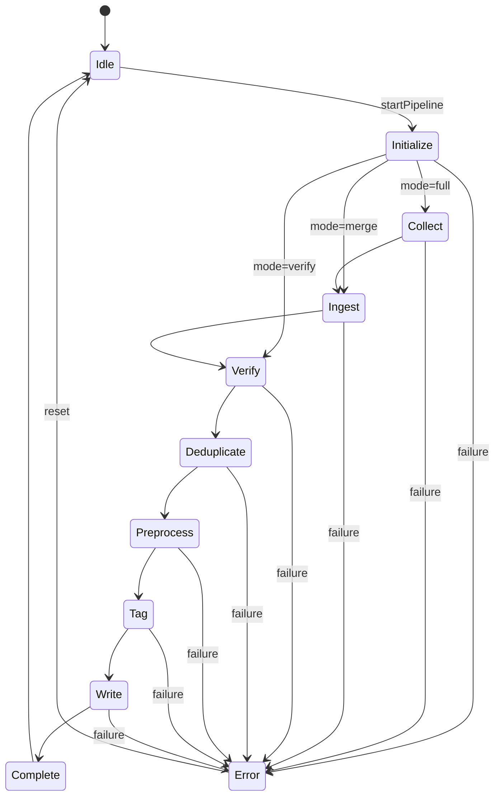
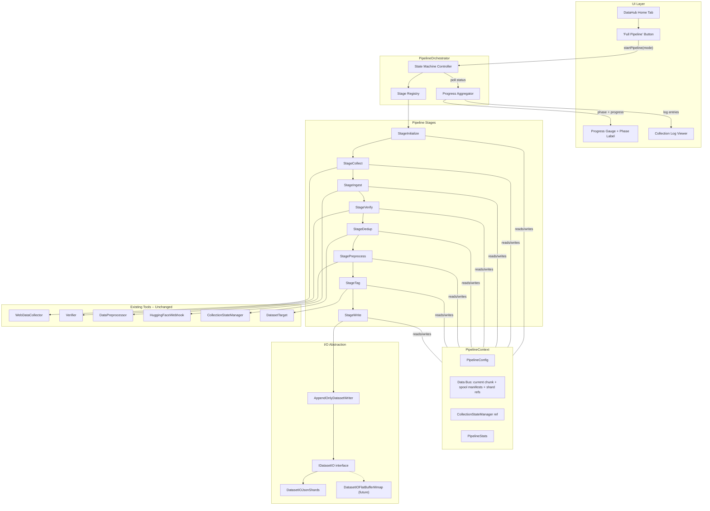
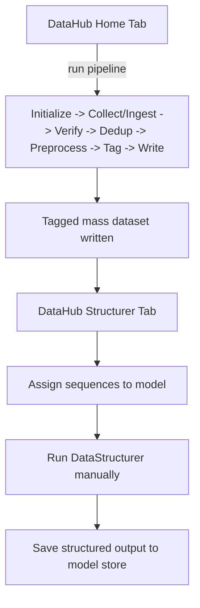

# Data Pipeline State Machine Refactor

## Problem Statement

The current data pipeline is a 1807-line monolith (`[grim_data_pipeline.cpp](DataCollection/grim_data_pipeline.cpp)`) with:

- **Global state** (`g_checkpoint_dir`, `g_verified_dir`, `g_force_rebuild`, `g_stateManager`, etc.)
- `**runMerge()` is 700 lines** performing 6 distinct operations (load, dedup, verify, preprocess, Q/A ingest, write) in a single function
- `**DataCollectionManager`** is a hollow pass-through that fakes `argc/argv` and calls `StartDataCollection()`
- **No state machine** -- purely procedural with hardcoded ordering
- **No I/O abstraction** -- JSON parsing/writing scattered across functions
- **Whole-corpus materialization** -- the current flow loads and duplicates large in-memory vectors between phases, which becomes the first scaling ceiling
- **Metadata tagging** from `[DATA_HUB_IMPLEMENTATION_PLAN.md](docs/DATA_HUB_IMPLEMENTATION_PLAN.md)` not yet bridged

## Architecture: Stage-Based State Machine

### State Machine




### Pipeline Modes (stage subsets)

- **full**: Initialize -> Collect -> Ingest -> Verify -> Dedup -> Preprocess -> Tag -> Write -> Complete
- **collect**: Initialize -> Collect -> Complete
- **verify**: Initialize -> Verify -> Complete
- **merge**: Initialize -> Ingest -> Verify -> Dedup -> Preprocess -> Tag -> Write -> Complete
- **merge-rebuild**: Same as merge with `forceRebuild = true` in context

Pipeline-side structuring is intentionally removed. Structuring only happens from the `Structurer` tab in `ui/ui_data_hub.cpp`.

### Full Flow from DataHub Home Tab




The `Structurer` tab remains a separate manual workflow after pipeline completion:




---

## File Structure

### Directory Layout

```text
DataCollection/
  pipeline/
    pipeline_types.hpp
    pipeline_context.hpp
    chunk_spool.hpp/.cpp
    pipeline_stage.hpp
    pipeline_orchestrator.hpp/.cpp
    stages/
      stage_initialize.hpp/.cpp
      stage_collect.hpp/.cpp
      stage_ingest.hpp/.cpp
      stage_verify.hpp/.cpp
      stage_dedup.hpp/.cpp
      stage_preprocess.hpp/.cpp
      stage_tag.hpp/.cpp
      stage_write.hpp/.cpp
  io/
    dataset_io.hpp
    append_only_dataset_writer.hpp/.cpp
    dataset_io_json.hpp/.cpp
  dataset_target.hpp
  web_collector.hpp
  verifier.hpp/.cpp
  data_preprocessor.hpp
  huggingface_webhook.hpp/.cpp
  collection_state.hpp
  training_paths.hpp

ui/
  ui_data_hub.hpp/.cpp
```

### Responsibility Boundaries

#### Orchestration Layer


| File                                                | Responsibility                                                                                                                                                                | Must Not Own                                                       |
| --------------------------------------------------- | ----------------------------------------------------------------------------------------------------------------------------------------------------------------------------- | ------------------------------------------------------------------ |
| `DataCollection/pipeline/pipeline_types.hpp`        | Shared enums and result/value types used across the pipeline. Defines state IDs, mode IDs, and basic stage result contracts.                                                  | Runtime logic, file I/O, stage behavior                            |
| `DataCollection/pipeline/pipeline_context.hpp`      | Run-scoped execution context: config, stats, chunk cursors, spool locations, writer handles, stop/progress hooks. This is the only shared state object passed stage-to-stage. | Whole-corpus entry ownership, business logic, parsing, UI concerns |
| `DataCollection/pipeline/pipeline_stage.hpp`        | Base contract for all stages. Defines the execution interface and stage identity contract.                                                                                    | Concrete stage logic, storage implementation                       |
| `DataCollection/pipeline/pipeline_orchestrator.hpp` | Public pipeline controller API used by CLI and UI. Owns run lifecycle, state machine status, stage registry, worker thread, stop/poll hooks.                                  | Stage internals, dataset parsing, tagging rules                    |
| `DataCollection/pipeline/pipeline_orchestrator.cpp` | Execution loop, stage ordering, mode-to-stage mapping, error transitions, aggregate progress reporting.                                                                       | Per-stage transforms, direct JSON/manifest logic                   |


#### Chunk Transport Layer


| File                                      | Responsibility                                                                                                                    | Must Not Own                               |
| ----------------------------------------- | --------------------------------------------------------------------------------------------------------------------------------- | ------------------------------------------ |
| `DataCollection/pipeline/chunk_spool.hpp` | Types and helpers for chunk manifests, chunk file naming, and stage handoff cursors. Defines how chunks are staged between steps. | Verification, preprocessing, tagging logic |
| `DataCollection/pipeline/chunk_spool.cpp` | Chunk file creation, chunk enumeration, cursor advancement, spool cleanup for aborted runs, temporary run storage mechanics.      | Final dataset publication, UI reads        |


#### Stage Layer

Each stage owns one transformation only. A stage may read one upstream cursor and publish one downstream cursor. A stage must not reach sideways into another stage’s domain.


| File                                                       | Responsibility                                                                                                                                                 | Must Not Own                                                       |
| ---------------------------------------------------------- | -------------------------------------------------------------------------------------------------------------------------------------------------------------- | ------------------------------------------------------------------ |
| `DataCollection/pipeline/stages/stage_initialize.hpp/.cpp` | Resolve paths, load config, create run ID, create spool directories, initialize `CollectionStateManager`, construct storage providers, seed execution context. | Collection, verification, tagging, final writes                    |
| `DataCollection/pipeline/stages/stage_collect.hpp/.cpp`    | Wrap `WebDataCollector` and convert collection output into ingest spool chunks. Owns only the collect phase.                                                   | Dedup, verify, preprocess, tag, manifest commit                    |
| `DataCollection/pipeline/stages/stage_ingest.hpp/.cpp`     | Stream HuggingFace downloads, checkpoints, verified cache/shards, PDFs, and Q/A JSONL into normalized ingest chunks. This is the “gather all inputs” stage.    | Quality scoring, dedup state mutation beyond basic source tracking |
| `DataCollection/pipeline/stages/stage_verify.hpp/.cpp`     | Run `Verifier` over ingest chunks and publish only accepted verified chunks. Owns quality gate behavior.                                                       | Dedup persistence, text cleanup, metadata tagging                  |
| `DataCollection/pipeline/stages/stage_dedup.hpp/.cpp`      | Use `CollectionStateManager` plus in-run hashing to remove already-merged and duplicate content from verified chunks.                                          | Verification thresholds, preprocessing rules, writes               |
| `DataCollection/pipeline/stages/stage_preprocess.hpp/.cpp` | Run `DataPreprocessor` over deduplicated chunks: cleanup, chunk splitting, filter/prune, normalize text samples for downstream storage.                        | Source metadata decisions, ID assignment, shard commit             |
| `DataCollection/pipeline/stages/stage_tag.hpp/.cpp`        | Assign persistent IDs, quality tiers, subject classification, and tag sets. Converts cleaned text chunks into `TaggedEntry` chunks.                            | Storage implementation, manifest mutation, UI assignment state     |
| `DataCollection/pipeline/stages/stage_write.hpp/.cpp`      | Append tagged chunks into immutable shard files through the append-only writer and atomically commit manifest updates for the run.                             | Parsing upstream raw data, dedup, verification, preprocessing      |


#### Storage Layer


| File                                               | Responsibility                                                                                                                                 | Must Not Own                                   |
| -------------------------------------------------- | ---------------------------------------------------------------------------------------------------------------------------------------------- | ---------------------------------------------- |
| `DataCollection/io/dataset_io.hpp`                 | Abstract read contract for shard-backed dataset access plus assignment persistence. Defines the seam for JSON today and mmap/flatbuffer later. | Concrete serialization format logic            |
| `DataCollection/io/append_only_dataset_writer.hpp` | Abstract append-only publication contract for a run: begin, append chunk, commit manifest, abort run.                                          | Read/query behavior, UI logic                  |
| `DataCollection/io/append_only_dataset_writer.cpp` | Shared append-only run commit workflow if a concrete base implementation is needed; otherwise keep implementation-specific mechanics here.     | Tagging, verification, search behavior         |
| `DataCollection/io/dataset_io_json.hpp/.cpp`       | Concrete JSON shard reader/writer and manifest persistence implementation. This is the only JSON-specific storage file.                        | Pipeline orchestration, UI policy, stage logic |


#### Existing Backend Files Kept In Place

These remain specialized engines and are wrapped by stages rather than absorbed into the orchestrator.


| File                                          | Responsibility                                                          | Used By                                           |
| --------------------------------------------- | ----------------------------------------------------------------------- | ------------------------------------------------- |
| `DataCollection/web_collector.hpp`            | External collection engine and source crawling/fetching.                | `stage_collect`                                   |
| `DataCollection/verifier.hpp/.cpp`            | Content quality and semantic verification engine.                       | `stage_verify`                                    |
| `DataCollection/data_preprocessor.hpp`        | Text cleanup, chunking, duplicate suppression at preprocessing level.   | `stage_preprocess`                                |
| `DataCollection/huggingface_webhook.hpp/.cpp` | HF browsing/download integration and dataset fetch flow.                | `stage_ingest`                                    |
| `DataCollection/collection_state.hpp`         | Persistent source/content state, dedup memory, run resumption metadata. | `stage_initialize`, `stage_dedup`, `stage_ingest` |
| `DataCollection/training_paths.hpp`           | Root/path resolution helpers.                                           | `stage_initialize`                                |


#### Files Outside The Pipeline But Coupled To Its Output


| File                                 | Responsibility                                                                                                 | Relationship To New Pipeline                                                                                               |
| ------------------------------------ | -------------------------------------------------------------------------------------------------------------- | -------------------------------------------------------------------------------------------------------------------------- |
| `DataCollection/dataset_target.hpp`  | DataHub-side access to the tagged mass dataset plus model assignment references and structured output storage. | Must read shard/manifest-backed tagged dataset instead of assuming one flat monolithic file                                |
| `ui/ui_data_hub.hpp/.cpp`            | UI controller for Home, Sources, HF, and Structurer tabs.                                                      | Home tab talks to `PipelineOrchestrator`; Structurer tab reads tagged dataset and remains separate from pipeline execution |
| `DataCollection/data_structurer.hpp` | Manual structuring engine used only from the Structurer tab.                                                   | Consumes tagged dataset after pipeline completion; never called by pipeline stages                                         |


### Deleted / Replaced Files


| File                                              | Change                                                           |
| ------------------------------------------------- | ---------------------------------------------------------------- |
| `DataCollection/grim_data_pipeline.cpp`           | Replaced by the orchestrator + stages + storage layers           |
| `DataCollection/data_collection_manager.hpp/.cpp` | Replaced by `pipeline_orchestrator.hpp/.cpp`                     |
| `DataCollection/main_data_collection.cpp`         | Refactored to construct `PipelineOrchestrator` and invoke a mode |
| `DataCollection/merge_checkpoints.cpp`            | Logic absorbed into `stage_ingest`                               |


---

## Key Interfaces

### `pipeline_types.hpp` -- Enums and result types

```cpp
namespace GRIM::Pipeline {

enum class PipelineState : uint8_t {
    Idle, Initialize, Collect, Ingest, Verify,
    Deduplicate, Preprocess, Tag, Write,
    Complete, Error
};

enum class PipelineMode : uint8_t {
    Full, CollectOnly, VerifyOnly, MergeOnly, MergeRebuild
};

struct StageResult {
    bool success = true;
    std::string errorMessage;
    float durationSeconds = 0.0f;
};

} // namespace
```

### `pipeline_context.hpp` -- Streaming data bus between stages

Everything that was global state in `grim_data_pipeline.cpp` becomes fields here. No globals. The context is constructed once by the orchestrator and passed by reference to each stage.

Crucially, the context no longer owns the entire corpus in memory. It only owns:

- run-level configuration and stats
- the current working chunk buffer
- spool/manifest references for upstream and downstream stage outputs
- append-writer handles for final dataset publication

```cpp
namespace GRIM::Pipeline {

struct PipelineConfig {
    PipelineMode mode = PipelineMode::Full;
    std::string sourceConfigPath;
    std::string checkpointDir;
    std::string rawDir;
    std::string verifiedDir;
    std::string outputDir;
    bool forceRebuild = false;
    int vocabSize = 50000;
    std::vector<std::string> qaJsonlPaths;
};

struct PipelineStats {
    size_t entriesCollected = 0;
    size_t entriesIngested = 0;
    size_t entriesVerified = 0;
    size_t duplicatesRemoved = 0;
    size_t entriesCleaned = 0;
    size_t entriesTagged = 0;
    size_t entriesWritten = 0;
    size_t chunksCreated = 0;
    size_t prunedCount = 0;
    size_t chunksProcessed = 0;
    size_t shardsWritten = 0;
};

template <typename T>
struct EntryChunk {
    std::vector<T> items;
    size_t chunkIndex = 0;
    bool isLastChunk = false;

    void clear() {
        items.clear();
        isLastChunk = false;
    }
};

struct ChunkCursor {
    std::string stageName;
    std::vector<fs::path> chunkFiles;
    size_t nextChunk = 0;
};

struct PipelineRunLayout {
    std::string runId;
    fs::path runRoot;
    fs::path spoolRoot;
    fs::path outputRoot;
    fs::path manifestPath;
};

struct PipelineContext {
    PipelineConfig config;
    PipelineStats stats;

    // State manager (initialized by StageInitialize)
    std::unique_ptr<CollectionStateManager> stateManager;

    // Run layout and stage handoff
    PipelineRunLayout run;
    ChunkCursor ingestCursor;
    ChunkCursor verifyCursor;
    ChunkCursor dedupCursor;
    ChunkCursor preprocessCursor;
    ChunkCursor tagCursor;

    // Reused working buffers; never hold the entire dataset
    EntryChunk<VerifiedEntry> verifiedChunk;
    EntryChunk<std::string> cleanedChunk;
    EntryChunk<TaggedEntry> taggedChunk;

    // Execution tuning
    size_t chunkSize = 5000;

    // Progress
    std::function<void(PipelineState, float, const std::string&)> onProgress;
    std::atomic<bool> stopRequested{false};

    // Storage providers (set during initialization)
    std::shared_ptr<IDatasetIO> datasetIO;
    std::shared_ptr<AppendOnlyDatasetWriter> datasetWriter;
};

} // namespace
```

### `pipeline_stage.hpp` -- Stage interface

```cpp
namespace GRIM::Pipeline {

class IPipelineStage {
public:
    virtual ~IPipelineStage() = default;
    virtual PipelineState stageId() const = 0;
    virtual const char* stageName() const = 0;
    virtual float progressWeight() const = 0;

    // Each stage is responsible for streaming through its input cursor,
    // processing one chunk at a time, and publishing chunk outputs for
    // the next stage. Stages must never accumulate the full corpus.
    virtual StageResult execute(PipelineContext& ctx) = 0;
};

} // namespace
```

### `pipeline_orchestrator.hpp` -- State machine + execution

Replaces `DataCollectionManager`. The orchestrator:

1. Owns the stage registry (ordered list of `IPipelineStage`)
2. Determines which stages to run based on `PipelineMode`
3. Executes stages sequentially, passing `PipelineContext` to each
4. Reports aggregate progress to UI via callback
5. Handles stop requests between stages
6. Captures errors and transitions to Error state

```cpp
namespace GRIM::Pipeline {

class PipelineOrchestrator {
public:
    PipelineOrchestrator();

    void startPipeline(PipelineMode mode);
    void stopPipeline();
    PipelineState currentState() const;
    float overallProgress() const;

    struct Status {
        PipelineState state;
        float progress;        // 0-100
        std::string phase;
        std::string message;
        PipelineStats stats;
        int64_t elapsedSeconds;
        bool isRunning;
    };
    Status getStatus() const;

    using ProgressCallback = std::function<void(float, const std::string&)>;
    void setProgressCallback(ProgressCallback cb);

private:
    void executionThread();
    std::vector<PipelineState> stagesForMode(PipelineMode mode) const;

    std::unordered_map<PipelineState, std::unique_ptr<IPipelineStage>> stages_;
    PipelineContext context_;
    std::atomic<PipelineState> currentState_{PipelineState::Idle};
    std::unique_ptr<std::thread> thread_;
    mutable std::mutex mutex_;
};

} // namespace
```

### `io/dataset_io.hpp` + append-only writer -- Storage abstraction

```cpp
namespace GRIM::Pipeline {

struct TaggedEntry {
    std::string id;               // unique persistent ID (UUID or hash-based)
    std::string content;
    std::string sourceUrl;
    std::string sourceType;       // "web", "huggingface", "manual", etc.
    std::string qualityTier;      // "high", "medium", "low"
    std::string subject;          // "physics", "code", "general", etc.
    std::vector<std::string> tags;
    float reliabilityScore = 0.0f;
    int64_t timestamp = 0;
};

class IDatasetIO {
public:
    virtual ~IDatasetIO() = default;

    // Read path for DataHub / DatasetTarget / training consumers
    virtual bool iterateShard(const fs::path& shardPath,
                              std::function<bool(const TaggedEntry&)> visitor) = 0;
    virtual size_t countEntries(const fs::path& manifestPath) = 0;
    virtual bool loadAssignments(const fs::path& path, std::vector<std::string>& ids) = 0;
    virtual bool saveAssignments(const fs::path& path, const std::vector<std::string>& ids) = 0;
};

class AppendOnlyDatasetWriter {
public:
    virtual ~AppendOnlyDatasetWriter() = default;

    virtual bool beginRun(const PipelineRunLayout& run) = 0;
    virtual bool appendTaggedChunk(const EntryChunk<TaggedEntry>& chunk,
                                   fs::path& writtenShardPath) = 0;
    virtual bool commitRunManifest(const PipelineRunLayout& run,
                                   const std::vector<fs::path>& newShards) = 0;
    virtual bool abortRun(const PipelineRunLayout& run) = 0;
};

} // namespace
```

`DatasetIOJson` implements this using shard files plus a manifest, not a single rewriteable JSONL. Future `DatasetIOFlatBuffer` will use mmap + flatbuffer shards behind the same read/write seams.

### Append-only mass dataset layout

Instead of one rewritten `merged_verified_cache.jsonl`, the plan now uses:

```text
resources/models/GRIM-text/data/
  manifest.json
  shards/
    2026-03-20_runA_000001.jsonl
    2026-03-20_runA_000002.jsonl
    2026-03-21_runB_000001.jsonl
```

- Each pipeline run appends one or more new shard files
- `manifest.json` is the authoritative ordered list of shards plus counts and schema version
- Existing shards are immutable after commit
- Failed runs can be aborted by deleting only their uncommitted shard set
- DataHub and `DatasetTarget` read through the manifest, not by scanning a monolithic file

---

## Stage Breakdown

### StageInitialize

**Extracts from**: `StartDataCollection()` lines 1605-1766 (arg parsing, config loading, path resolution)

- Loads `ai_config.json` for paths, chunk sizing, and Q/A paths
- Creates a unique `runId` and run spool directory
- Resolves all directories (raw, verified, checkpoint, output) using `training_paths.hpp`
- Initializes `CollectionStateManager`
- Creates `IDatasetIO`, `AppendOnlyDatasetWriter`, and `ChunkSpool` instances (JSON shard-backed for now)
- Populates `PipelineConfig` -- no globals

### StageCollect

**Extracts from**: `runCollect()` lines 700-771

- Constructs `WebDataCollector`, loads config, calls `collectData()`
- Saves raw JSONL + checkpoint
- Writes collected results into ingest spool chunks instead of a long-lived in-memory vector

### StageIngest

**Extracts from**: `runMerge()` lines 996-1163 (loading verified, HF, checkpoints, previously merged)

- Also absorbs: `ingestHuggingFaceDownloads()` (lines 378-630), `ingestQaJsonlFiles()` (lines 151-240), `loadJsonlFile()`, `loadPdfFile()`, `loadTextFile()`, `extractZipArchive()`
- Streams all sources into spool chunk files: verified JSONL, HF downloads, checkpoint files, Q/A JSONL, previously merged shards

### StageVerify

**Extracts from**: `runMerge()` lines 1237-1287 and `runVerify()` lines 773-870

- Constructs `Verifier`, runs `verify_entries()` on `ctx.rawEntries`
- Reads ingest chunks, verifies chunk-by-chunk, and publishes verified chunks to the next cursor

### StageDedup

**Extracts from**: `runMerge()` lines 1170-1216

- Uses `CollectionStateManager::hasMergedContent()` + in-batch hash set
- Reads verified chunks, deduplicates chunk-by-chunk, and publishes deduplicated chunks to the next cursor

### StagePreprocess

**Extracts from**: `runMerge()` lines 1289-1411

- Constructs `DataPreprocessor` with config from `ai_config.json`
- Chunks, cleans, filters, deduplicates
- Re-injects previously merged entries
- Reads deduplicated chunks, preprocesses chunk-by-chunk, and publishes cleaned chunks to the next cursor

### StageTag (NEW)

**Bridges with**: `DatasetTarget::SequenceHandle` and metadata tagging from `[DATA_HUB_IMPLEMENTATION_PLAN.md](docs/DATA_HUB_IMPLEMENTATION_PLAN.md)`

- Assigns unique IDs to each entry (UUID-based, deterministic from content hash for idempotency)
- Auto-tags `sourceType` (already available from collection metadata)
- Auto-tags `qualityTier` based on verification reliability scores
- Heuristic `subject` classification (keyword-based initially, LLM-powered later)
- Reads cleaned chunks and converts them into `TaggedEntry` chunks with full metadata
- Produces the raw tagged dataset that the `Structurer` tab later reads from and works against
- Publishes tagged chunks to the write cursor

### StageWrite

**Extracts from**: `runMerge()` lines 1551-1589, but changes output semantics completely

- Opens an append-only run with `AppendOnlyDatasetWriter::beginRun()`
- Appends tagged chunks into immutable shard files
- Atomically updates `manifest.json` on successful run completion
- Never rewrites the full historical corpus
- Saves state manager
- Reports final stats

---

## UI Integration

The UI changes are minimal -- replace `DataCollectionManager` with `PipelineOrchestrator`:

In `[ui/ui_data_hub.hpp](ui/ui_data_hub.hpp)`, change:

```cpp
// Before:
std::unique_ptr<GRIM::DataCollection::DataCollectionManager> collectionManager_;

// After:
std::unique_ptr<GRIM::Pipeline::PipelineOrchestrator> pipelineOrchestrator_;
```

The `Status` struct from `PipelineOrchestrator::getStatus()` maps directly to the existing Home tab HUD fields (phase, progress, stats, elapsed time). The `startCollection(mode)` call becomes `pipelineOrchestrator_->startPipeline(mode)`.

The `Structurer` tab is explicitly not part of the orchestration path. It remains a separate UI-driven workflow that reads the tagged mass dataset, assigns entries to model datasets, runs `DataStructurer`, and writes structured outputs per model.

Because the mass dataset is now shard + manifest backed, the `Structurer` tab and `DatasetTarget` should resolve entries through manifest iteration or indexed lookup rather than assuming a single contiguous JSONL file.

---

## JSON to mmap Flatbuffer Migration Path

The storage seam is now shard-oriented. Today:

- `DatasetIOJson` reads JSONL shards through `manifest.json`
- `AppendOnlyDatasetWriter` writes immutable JSONL shards and commits them into the manifest
- `TaggedEntry` carries the full metadata record used by the UI and training pipeline

When ready for mmap flatbuffer:

1. Define a shard `.fbs` schema matching `TaggedEntry`
2. Implement `DatasetIOFlatBuffer` using mmap for shard reads
3. Implement a flatbuffer-backed `AppendOnlyDatasetWriter`
4. Swap both in `StageInitialize`
5. Zero changes to stage orchestration, chunk flow, or UI control flow

---

## CMake Changes

- Remove `grim_data_pipeline.cpp` from compile targets
- Remove `data_collection_manager.cpp` from compile targets
- Add all `pipeline/*.cpp` and `pipeline/stages/*.cpp` and `io/*.cpp`
- Add `merge_checkpoints.cpp` removal (absorbed into `stage_ingest`)

