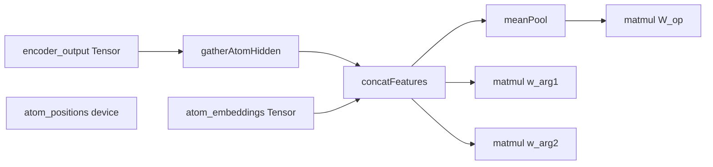

# ReasoningHeadLayer (parallel to NumericHead)

## Context from the repo

- **Numeric head pattern**: `[NumericHeadLayer::forward](resources/models/GRIM-text/Layers/NumericHead/numeric_head_GPU.cu)` uses `autograd::matmul(..., transpose_b=true)` so `output = encoder @ W^T` with `W` stored as `[out_dim, d_model]`, then a small bias kernel. `executeAutogradForward` already sets `autograd::set_autograd_cublas_handle(ctx.cublas_handle)` and runs the numeric head right after the LM head (`[AutogradTraining.cu` ~856–863](resources/models/GRIM-text/training/Autograd/AutogradTraining.cu)).
- **ScratchBlock**: during `scratch_block_inject`, atom positions/count/embeddings are produced **before** the encoder. Indices refer to token positions, so `encoder_output[pos]` is the correct gather. `numAtomsBuffer()` is a device pointer. `d_atom_embeddings_` remains a raw `float`* work buffer; it is **not** the canonical autograd owner.
- **Intermediates home**: extend `[AutogradIntermediates](resources/models/GRIM-text/training/Autograd/AutogradIntermediates.hpp)` (and `clear()`) with `ReasoningHeadOutput reasoning_output` and `Tensor scratch_atom_embeddings`. `AutogradIntermediates` is the **single canonical owner** of the per-forward atom-embedding tensor for the whole forward→backward cycle.
- **Build**: register a new `.cu` next to numeric head in `[TrainingLoop/CMakeLists.txt](resources/models/GRIM-text/training/TrainingLoop/CMakeLists.txt)`.

## Reading `num_atoms` correctly (device-side count)

`numAtomsBuffer()` points to **device** memory. The host must not use an uninitialized value, a stale stack variable, or `max_atoms` when the real count is smaller.

**Correct pattern** (host `num_atoms` before any host-sized allocation or launch that depends on the true count):

```cpp
int num_atoms = 0;
cudaMemcpyAsync(
    &num_atoms,
    scratch_block->numAtomsBuffer(),
    sizeof(int),
    cudaMemcpyDeviceToHost,
    stream);
cudaStreamSynchronize(stream);
```

**Why this matters**

- Wrong `num_atoms` → wrong `cudaMalloc` / `Tensor::zeros` sizes → **OOB reads/writes** or **silent wrong results**.
- Mean-pool denominator must be the **actual** atom count, not `max_atoms`.
- ReasoningHead arg logits length must match **real** `num_atoms`.

**Note**: `cudaStreamSynchronize(stream)` ensures the host can read `num_atoms` before enqueuing dependent work. If you batch multiple async copies on one stream, a single sync after the copy (before use) is sufficient; do not read `num_atoms` until the copy has completed.

## Corrections to the kernel launch sketch

1. **Thread limits**: `blockDim.x = d_model` or `d_model + atom_dim` **fails** if that dimension exceeds **1024** (typical `d_model` 768 is OK today; `d_model + atom_embedding_dim` e.g. 832 is OK). For robustness, use **strided loops** per row (e.g. block 256–512, `for (j = threadIdx.x; j < dim; j += blockDim.x)`) so larger configs do not break.
2. **Arg logit shapes**: `Z @ w^T` with `Z` `[num_atoms, d_total]` and `w` `[1, d_total]` yields `**[num_atoms, 1]`** in this codebase’s row-major `matmul` convention. That is **layout-equivalent** to `[1, num_atoms]` (same contiguous `num_atoms` floats). Set `Tensor.shape` to `TensorShape::make_BSM(1, num_atoms)` on the result for API consistency with your spec.
3. `**num_atoms == 0`**: define behavior explicitly (recommended: emit **zeros** `op_logits`, **empty or zero-shaped** arg logits, or skip head and leave tensors default-null — pick one and validate loss callers).

## Hard-fail validation and shape checks

The new path should follow the same **fail loud / validate early** conventions already used across the repo. Do not allow silent fallthrough, implicit reshapes, or best-effort recovery.

**Required validations**

1. **Forward entry (`ReasoningHeadLayer::forward`)**
  - Throw if `stream == nullptr`.
  - Throw if `config_.cublas_handle == nullptr`.
  - Throw if `encoder_output.data == nullptr`.
  - Throw if `atom_embeddings.data == nullptr` when `num_atoms > 0`.
  - Throw if `atom_positions == nullptr` when `num_atoms > 0`.
  - Throw if `num_atoms < 0`.
  - Throw if `total_tokens <= 0`.
2. **Shape validation**
  - `encoder_output.shape` must be 2D and exactly `[total_tokens, d_model]`.
  - `atom_embeddings.shape` must be 2D and exactly `[num_atoms, atom_embedding_dim]`.
  - `W_op.shape` must be `[num_ops, d_total]`.
  - `w_arg1.shape` and `w_arg2.shape` must each be `[1, d_total]`.
  - Any output tensor returned from matmul must have the expected number of elements before its final shape is assigned.
3. **Position validation**
  - In forward gather and backward scatter kernels, treat `pos_i < 0 || pos_i >= total_tokens` as invalid.
  - Prefer a fail-loud path: detect invalid positions and raise a host-visible error after kernel launch rather than clamping or skipping silently.
4. **Autograd wiring validation**
  - If `encoder_output.requires_grad`, verify `encoder_output.grad_fn` or grad ownership is set consistently before attaching `ReasoningHeadGradFn`.
  - If `atom_embeddings.requires_grad`, verify its grad target / `grad_fn` is valid before concat backward relies on it.
  - Throw if `scratch_atom_embeddings` is missing from `AutogradIntermediates` when reasoning head is enabled and `num_atoms > 0`.
5. **Context / pipeline validation**
  - In `executeAutogradForward`, throw if reasoning head is enabled but `ctx.reasoning_head == nullptr`.
  - Throw if ScratchBlock is required for reasoning head but `ctx.scratch_block == nullptr` or disabled.
  - Throw if `num_atoms > 0` but ScratchBlock buffers are null.

**Validation style**

- Match the rest of the codebase: explicit `throw std::runtime_error(...)` with concrete dimension values and the caller name.
- Validate on the host **before** kernel launch wherever possible.
- After custom CUDA kernels, check launch status and surface a hard failure if the kernel failed.
- Do not silently reinterpret malformed shapes as equivalent layouts.

## Atom embeddings as a `Tensor` (ScratchBlock + autograd)

**Goal**: stop treating post-projection atom activations as an opaque `float*` for any consumer that needs gradients.

**Direction**

1. After ScratchBlock forward has filled `d_atom_embeddings_` for the current batch, `**executeAutogradForward`** creates `training_state->autograd_intermediates.scratch_atom_embeddings` immediately after the D2H `num_atoms` copy and before ReasoningHead runs.
2. Create that tensor as a **copy-first tensor**, not a view: allocate `Tensor::empty(make_BSM(num_atoms, atom_embedding_dim), ...)` and copy exactly `num_atoms * atom_embedding_dim` floats from `scratch_block->atomEmbeddingsBuffer()` on `ctx.stream`.
3. **Do not use a subrange view in v1.** This plan explicitly chooses copy-over-view to avoid lifetime, aliasing, and grad-ownership bugs in TensorContract.
4. Wire `grad_fn` on `scratch_atom_embeddings` so it aligns with `ScratchBlockGradFn` and existing backward into `atom_projection_` / `atom_type_embeddings_`.
5. `ReasoningHead::forward` should take `Tensor& atom_embeddings` from `AutogradIntermediates`, not raw `float*` and not a second tensor owned by ScratchBlock, so concat backward writes into one canonical grad target.

This removes the prior ownership ambiguity and the broken-view risk. Slower is acceptable for v1; correctness wins.

## Implementation layout

### 1) ScratchBlock raw buffers; `AutogradIntermediates` canonical tensor

- Keep ScratchBlock's current raw device buffers (`d_atom_embeddings_`, `d_atom_positions_`, `d_num_atoms_`) as kernel-facing state.
- In `[AutogradTraining.cu](resources/models/GRIM-text/training/Autograd/AutogradTraining.cu)`, after ScratchBlock has run and after `num_atoms` is copied to host, create `intermediates.scratch_atom_embeddings = Tensor::empty(make_BSM(num_atoms, atom_embedding_dim), ...)` and copy from `scratch_block->atomEmbeddingsBuffer()` into it.
- This copied tensor is the **only** autograd-visible atom-embedding tensor. ScratchBlock does **not** also pretend to own a second canonical `Tensor`.
- **Do not** change NumericHead or LMHead.

### 2) New ReasoningHead layer files

- Add `[resources/models/GRIM-text/Layers/ReasoningHead/reasoning_head_GPU.hpp](resources/models/GRIM-text/Layers/ReasoningHead/reasoning_head_GPU.hpp)` and `.cu`.
- `**ReasoningHeadConfig`**: `d_model`, `atom_embedding_dim` (from `[LanguageModelConfig::scratch_block_atom_embedding_dim](resources/models/GRIM-text/GRIM/grim_language_model_cuda.hpp)`), `num_ops`, `cublas_handle`, optional `cudaStream_t` default.
- **Parameters** (Xavier init mirroring numeric head): `W_op` `[num_ops, d_total]`, `b_op` optional `[num_ops]`; `w_arg1`, `w_arg2` each `[1, d_total]` (or `[d_total]` stored as BSM `(1, d_total)`).
- `**ReasoningHeadOutput forward(...)`**: `Tensor& encoder_output`, `Tensor& atom_embeddings`, `int* atom_positions`, `int num_atoms` (host, from D2H copy above), `int total_tokens`, `cudaStream_t stream`. Validate `atom_embeddings.shape` matches `[num_atoms, atom_embedding_dim]` and `atom_positions` length / device buffer consistency.

### 3) Forward execution (kernels + matmul)

Inside `forward` when `ctx.is_training` matches how you set `requires_grad` on weights:

1. Allocate workspace: `H_atoms` `[num_atoms, d_model]`, `Z` `[num_atoms, d_total]`, `z_pool` `[1, d_total]` (or `[d_total]` as BSM `(1, d_total)`).
2. **gatherAtomHidden**: scatter one row per `blockIdx.x` with strided `j` loop (see correction above).
3. **concatFeatures**: same strided pattern over `d_total`.
4. **meanPool**: one thread per output dim with a **serial sum over atoms** is OK while `d_total <= ~1024`; if `d_total` grows, switch to parallel reduction or cub.
5. **op_logits**: `autograd::matmul(z_pool_2d, W_op, stream, …, transpose_b=true)` → `[1, num_ops]`; add `b_op` with a small bias kernel (pattern from numeric head).
6. **arg{1,2}_logits**: two matmuls `Z` `[num_atoms, d_total]` × `w` `[1, d_total]^T` → reshape/`make_BSM(1, num_atoms)`.

Call `autograd::set_autograd_cublas_handle` from the layer **or** rely on `executeAutogradForward` (already sets it before LM head) — same pattern as numeric head is fine.

### 4) Full autograd

Implement a **single `ReasoningHeadGradFn`** (similar ownership style to `[ScratchBlockGradFn](resources/models/GRIM-text/Layers/ScratchBlock/ScratchBlockReasoning_GPU.hpp)`) that:

- Saves: `atom_positions`, `num_atoms`, `d_model`, `atom_dim`, `d_total`, forward buffers, `encoder_output.grad_fn`, and `**atom_embeddings.grad_fn**` (or the tensor’s grad linkage for concat’s second input).
- **Backward math**:
  - Through matmuls: reuse / mirror existing `MatmulGradFn` behavior (or compose `GradFn`s; fused node preferred for memory).
  - **Mean pool**: `dZ[i,j] += d_z_pool[j] / num_atoms`.
  - **Concat**: split `dZ` into `dH_atoms` and `d_atom_emb`; route `**d_atom_emb`** into the atom embedding `**Tensor`** gradient path (accumulate into `.grad` / child `GradFn` per TensorContract rules).
  - **Gather**: **atomicAdd** (or serialized if no duplicate positions) into encoder grad rows `positions[i]`.

With atom embeddings as a `**Tensor`**, the concat branch no longer needs a one-off ScratchBlock accumulation API: reasoning backward joins the same graph ScratchBlock already participates in.

**Concrete `ReasoningHeadGradFn` responsibilities**

1. **Own what backward needs**:
  - Device copy of `atom_positions` sized to `num_atoms`.
  - Shape metadata for `encoder_output`, `atom_embeddings`, `H_atoms`, `Z`, and pooled vector.
  - Owned grad buffers for `encoder_output` and `atom_embeddings` if those tensors require grad and do not already own safe buffers.
  - References to upstream `grad_fn`s so `apply()` can continue the chain into encoder and ScratchBlock.
2. **Attach at the right boundary**:
  - The easiest boundary is the **post-kernel / pre-linear** reasoning input assembly. Let `ReasoningHeadGradFn` own gather + concat + pool backward, while the three linear projections use existing `autograd::matmul` grad machinery.
  - Alternative if simpler in code: make `ReasoningHeadGradFn` the top-level grad node for the whole head and internally invoke the saved matmul grad paths. Either is acceptable; prefer the version with fewer extra persistent tensors.
3. **Apply order**:
  - Consume `grad_op_logits`, `grad_arg1_logits`, `grad_arg2_logits`.
  - Accumulate their contributions into `grad_z_pool` and `grad_Z`.
  - Backprop mean-pool into `grad_Z`.
  - Split `grad_Z` into `grad_H_atoms` and `grad_atom_embeddings`.
  - Scatter `grad_H_atoms` into `encoder_output.grad` using `atom_positions`.
  - Accumulate `grad_atom_embeddings` into the atom embedding tensor grad, then call its saved `grad_fn`.
4. **Lifecycle**:
  - Store the forward-owned tensors or raw buffers in `AutogradIntermediates` so nothing is freed before backward.
  - Follow the same “Issue #48 / stable data, not temporary Tensor*” rule used throughout the current autograd system.

**Critical gradient scatter requirement**

- `ReasoningHeadGradFn` backward must scatter `grad_H_atoms[i, j]` back into `encoder_output.grad[pos[i], j]` with `**atomicAdd`**, not plain assignment and not non-atomic accumulation.
- This is required even if duplicate positions are "unlikely": any repeated `atom_positions[i]` or any future change in atom extraction can otherwise cause **silent gradient corruption**.
- Exact indexing rule:
  - source index: `grad_H_atoms[i * d_model + j]`
  - destination index: `encoder_grad[pos_i * d_model + j]`
  - where `pos_i = atom_positions[i]`
- Bounds validation in backward must fail loud if `pos_i < 0 || pos_i >= total_tokens`.
- Kernel shape should use a strided loop over `j` (same reason as forward), while `i` indexes atoms.
- Add a dedicated scatter kernel, e.g. `scatterAtomHiddenGrad`, instead of open-coding this in multiple places.
- Recommended v1 sanity test:
  - construct a tiny case with repeated `atom_positions` values
  - run backward once
  - verify the encoder gradient row equals the **sum** of all contributing `grad_H_atoms` rows
  - compare against a CPU reference for indexing correctness

### 5) Pipeline wiring

- `[LanguageModel](resources/models/GRIM-text/GRIM/grim_language_model_cuda.hpp)`: `std::unique_ptr<ReasoningHeadLayer>`, getters, config flags (e.g. `reasoning_head_enabled`, `reasoning_num_ops = 8`).
- `[TrainingOps.cu](resources/models/GRIM-text/training/TrainingOps.cu)` / `[InitinferenceState.cu](resources/models/GRIM-text/Layers/InitInferenceState/InitinferenceState.cu)`: construct layer when enabled (mirror numeric head).
- `[AutogradTraining.hpp](resources/models/GRIM-text/training/Autograd/AutogradTraining.hpp)` `.cu`: extend `initAutogradContext` with `ReasoningHeadLayer`* (optional nullptr); in `executeAutogradForward`, after numeric head block:
  - **D2H `num_atoms`** as in the section above (same `ctx.stream`).
  - If enabled and `ctx.scratch_block && scratch_block->isEnabled()` and `num_atoms > 0`, obtain `**Tensor& atom_emb**` from ScratchBlock (or from `AutogradIntermediates` if scratch stores it there for Rule 20 single-owner), then `reasoning_head->forward(encoder_output_tensor, atom_emb, positions, num_atoms, total_tokens, stream)` and move result into `intermediates.reasoning_output`.
- **Inference**: if you need host-visible logits, mirror `[Inference_GPU.cu](resources/models/GRIM-text/training/Inference_GPU.cu)` numeric caching with small device→host copies after forward (optional).

**Full wiring checklist**

1. **Layer ownership + config**
  - Add `ReasoningHeadLayer* getReasoningHeadLayer()` to `LanguageModel`.
  - Add config fields for enable flag and `num_ops`.
  - Instantiate the layer in both training and inference init paths with the same stream / cuBLAS conventions as NumericHead.
2. **AutogradContext plumbing**
  - Add `ReasoningHeadLayer* reasoning_head = nullptr;` to `[AutogradTraining.hpp](resources/models/GRIM-text/training/Autograd/AutogradTraining.hpp)`.
  - Extend both `initAutogradContext(...)` overloads and all callsites (`computeLossBatch`, inference forward, full training step) to pass the pointer through.
3. **AutogradIntermediates**
  - Add `ReasoningHeadOutput reasoning_output;`.
  - Add `Tensor scratch_atom_embeddings;`.
  - Clear both in `clear()`.
4. `**executeAutogradForward`**
  - After the ScratchBlock and encoder path, but alongside NumericHead, read `num_atoms` from device.
  - Short-circuit cleanly when `num_atoms <= 0`.
  - Create `intermediates.scratch_atom_embeddings` as the canonical copy-first tensor for this pass.
  - Call `ctx.reasoning_head->forward(...)` with `encoder_output_tensor`, `intermediates.scratch_atom_embeddings`, positions buffer, `num_atoms`, `total_tokens`, and `ctx.stream`.
  - Store returned `op_logits`, `arg1_logits`, `arg2_logits` into `intermediates.reasoning_output`.
5. **Backward / loss integration**
  - Compute three CE-style losses from `intermediates.reasoning_output`: `loss_op`, `loss_arg1`, `loss_arg2`.
  - **Masking rules for v1**:
    - If `num_atoms == 0`: skip the sample entirely for reasoning loss.
    - If `num_atoms == 1`: allow `loss_op`, skip `loss_arg2`, and only compute `loss_arg1` if the label is valid for a single-atom relation.
    - If `num_atoms >= 2`: compute all enabled terms normally.
  - **Argument semantics for v1**: treat arguments as **ordered**. `arg1` and `arg2` are distinct targets; no symmetric or set-invariant loss yet.
  - **Invalid op/arg combinations for v1**: mask them in the label/data path before CE. Do not leave impossible combinations as active targets.
  - Sum the enabled reasoning terms into `intermediates.loss_tensor` so `loss.backward()` reaches `ReasoningHeadGradFn`.
6. **Inference path**
  - Decide whether to cache reasoning outputs in `TrainingState` like numeric predictions.
  - At minimum, ensure inference forward does not leak reasoning intermediates and that `autograd_intermediates.clear()` releases any reasoning tensors / grad_fns after inference.
7. **Serialization / checkpoint**
  - Extend optional load/save alongside NumericHead so resumed runs preserve `W_op`, `b_op`, `w_arg1`, and `w_arg2`.

### 6) Checkpointing (optional but recommended)

Mirror `[Serialization_GPU](resources/models/GRIM-text/Layers/Serialization/Serialization_GPU.cu)` numeric-head optional blocks so training restarts do not re-randomize `W_op` / `w_arg`*.

### 7) Sanity check “80 < 100”

That behavior is **training-data / opcode mapping**, not this plumbing: once logits exist, you’ll cross-entropy `op_logits` against the `LESS_THAN` class id and `arg*_logits` against atom indices for the tokens representing `80` and `100`. The plan only ensures **shapes** and **differentiable paths** (per autograd choice above).




