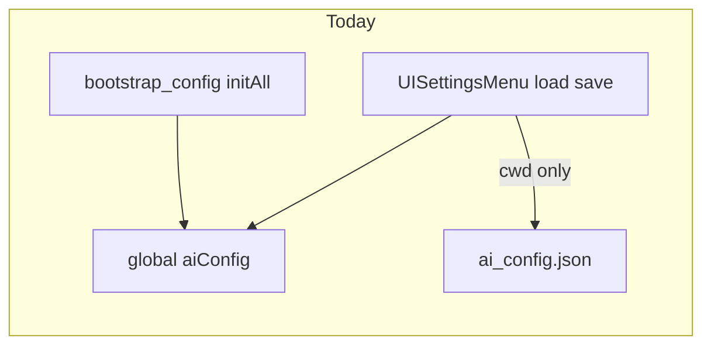
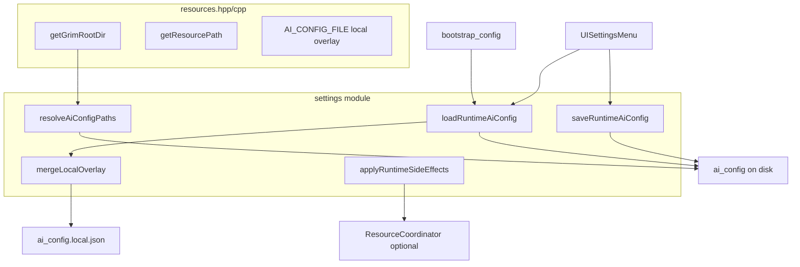

# Settings / `ai_config` refactor plan (GRIM.exe, resources layer)

## What “resources system” means here

For **GRIM.exe**, the resources system is `[resources.cpp](resources.cpp)` and `[resources.hpp](resources.hpp)`, not `control/ai_config_paths.hpp` (training / GRIM-text tooling) and not a substitute for MMO orchestration.

Relevant pieces to build on:

| API / symbol                                                                | Role                                                                                                                                                          |
| --------------------------------------------------------------------------- | ------------------------------------------------------------------------------------------------------------------------------------------------------------- |
| `[getGrimRootDir()](resources.cpp)`                                         | Locates repo root (marker dirs `control/` + `resources/`, with exe/cwd walk and optional `GRIM_ROOT_DIR`). **Canonical anchor for `ai_config.json` on disk.** |
| `[getResourcePath()](resources.cpp)`                                        | `GRIM_ROOT/resources` (with fallbacks). Use for fonts, voice assets, `loadTextResource`, etc.                                                                 |
| `[AI_CONFIG_FILE](resources.hpp)` / `[AI_CONFIG_LOCAL_FILE](resources.hpp)` | Basenames for main config and gitignored overlay.                                                                                                             |
| `[loadTextResource](resources.cpp)`                                         | Pattern for “read file under resource root.”                                                                                                                  |
| `[listFiles](resources.hpp)`                                                | Directory listing helper where appropriate.                                                                                                                   |
| `[getSafeResourcePath](resources.hpp)`                                      | Resolve targets relative to GRIM root or search tree when you add path helpers.                                                                               |
| Global `[aiConfig](resources.cpp)`                                          | Runtime JSON; single in-memory source after load/merge.                                                                                                       |

**Explicit non-goal for this refactor:** Do not include `[control/ai_config_paths.hpp](control/ai_config_paths.hpp)` or `GRIM::Config::loadAiConfigSnapshot` in the GRIM.exe settings or bootstrap ai_config path. That file is for typed training/config pipelines, not the main app’s settings UI.

**Clarification:** `[GRIM::MMO::ResourceCoordinator](MMO/Core/ResourceCoordinator.hpp)` is **runtime resource admission** (GPU/RAM, model load, etc.). It complements but does not replace `[resources.cpp](resources.cpp)`. Settings should use **resources.hpp** for paths and files; use **ResourceCoordinator** only when applying changes that need orchestration (optional phase below).

## Current state (why it is messy)

- `[ui/ui_settings_menu.cpp](ui/ui_settings_menu.cpp)` opens `"ai_config.json"` from **CWD only**, keeps a separate `config` / `pendingConfig`, and can diverge from `[bootstrap/bootstrap_config.cpp](bootstrap/bootstrap_config.cpp)` (which uses `[AI_CONFIG_FILE](resources.hpp)` relative to its own CWD and merges `[AI_CONFIG_LOCAL_FILE](resources.hpp)`).
- If the file is missing, the UI builds a **small default object**; saving could **overwrite** a full repo config (data loss).
- **Hardcoded** `D:/G.R.I.M/resources/voices/embeddings` ignores `[getGrimRootDir()](resources.cpp)` / `[getResourcePath()](resources.cpp)`.
- **Apply logic** (speaker, vision, font, blur) is embedded in `applyChanges()` in the UI file.

## Target architecture

## 1. Canonical runtime config API (modular load/save)

Implement in `**settings/**` (or add minimal path helpers next to resources if you prefer a single place), using **only** standard library + `nlohmann::json` + `[resources.hpp](resources.hpp)`:

| Responsibility    | Notes                                                                                                                                                                                                                                                                                                                                                             |
| ----------------- | ----------------------------------------------------------------------------------------------------------------------------------------------------------------------------------------------------------------------------------------------------------------------------------------------------------------------------------------------------------------- |
| **Resolve paths** | e.g. primary `std::filesystem::path(getGrimRootDir()) / AI_CONFIG_FILE`; if missing, optional fallback `current_path() / AI_CONFIG_FILE` to match legacy launches from build dirs. Same idea for `AI_CONFIG_LOCAL_FILE` next to the resolved main file or next to GRIM root—pick one rule and document it in code comments. **Do not** use `ai_config_paths.hpp`. |
| **Load document** | Read JSON from resolved main path; merge local overlay (same semantics as today’s bootstrap shallow merge for nested objects). If file missing, use shared defaults **without** clobbering an existing file’s unknown keys on later save.                                                                                                                         |
| **Local overlay** | Extract merge loop from `[bootstrap_config::initAll](bootstrap/bootstrap_config.cpp)` into `mergeLocalOverlay(base, localPath)`; call from bootstrap and settings.                                                                                                                                                                                                |
| **Save**          | Write **main** `ai_config.json` only to the resolved path (typical expectation: **never** write secrets into the committed file—local overlay stays in `ai_config.local.json`). If the UI edits keys that live only in local overlay, define policy (e.g. strip those keys from main doc on save or write local file—product decision).                           |
| **Sync global**   | After load/save, update global `[aiConfig](resources.cpp)` so the rest of the app matches.                                                                                                                                                                                                                                                                        |

**Important:** UI edits = **deep-merge** `pendingConfig` into the last loaded full document so keys not exposed in the UI (e.g. training blocks in the same file) are preserved.

**Optional:** If you want one public entry point on the resources side, add something like `std::filesystem::path resolveAiConfigFilePath()` in `[resources.cpp](resources.cpp)` / `[resources.hpp](resources.hpp)` that only uses `getGrimRootDir()` + `AI_CONFIG_FILE` (+ fallbacks). Keeps settings module thin and centralizes “where is ai_config” for GRIM.exe.

## 2. New folder module (not under `ui/`)

- `[settings/](settings/)` — e.g. `runtime_ai_config.hpp/.cpp` (load/save/merge/sync), optionally `settings_apply.hpp/.cpp`.
- **CMake:** `file(GLOB settings_SOURCES "settings/*.cpp")` in `[cmake/Sources.cmake](cmake/Sources.cmake)`.

`**bootstrap_config::initAll`:** Delegate `ai_config` load/merge/save-once behavior to the new module so bootstrap and UI share one implementation.

## 3. Move apply logic out of the UI

- `**settings_apply`:** Speaker, vision, font, blur updates—moved out of `[applyChanges](ui/ui_settings_menu.cpp)`. UI calls one function; pass font path map or a small callback if needed to avoid cycles.

## 4. Use resources discovery (fix manual paths)

- Speaker embeddings: under `[getGrimRootDir()](resources.cpp)` or `[getResourcePath()](resources.cpp)` + `voices/embeddings` (match your repo layout).
- Fonts: already use resource/grim root in the same file—keep consistent.
- Any “list files under GRIM” should use `[getResourcePath](resources.cpp)`, `[listFiles](resources.hpp)`, or `[getSafeResourcePath](resources.hpp)` as appropriate—not hardcoded drive letters.

## 5. ResourceCoordinator (optional, separate from resources.cpp)

For backend/model changes that touch GPU/RAM, optionally submit `[ResourceClaim](MMO/Core/ResourceCoordinator.hpp)` and handle `[ResourceDecision](MMO/Core/ResourceCoordinator.hpp)`. This is **orchestration**, not file loading.

## 6. Testing checklist

- Run from repo root and from a build subdirectory; same resolved `ai_config` path as bootstrap.
- `ai_config.local.json` merge behavior unchanged; saving main file does not accidentally delete overlay-only secrets from disk (per your save policy).
- One UI field change does not strip unrelated JSON keys.
- Voice embedding list works without `D:/...`.

## Implementation order

1. Path resolution + load/save/merge module (resources-aligned only); wire **bootstrap** and **UI**.
2. Thin UI: full-document load, deep-merge pending, remove hardcoded paths.
3. Extract `settings_apply`.
4. Optional: ResourceCoordinator for hot paths.

Docs: optionally add a short note to `[docs/CONFIG_SYSTEM.md](docs/CONFIG_SYSTEM.md)` distinguishing **GRIM.exe runtime** (resources + settings module) from **training** (`ai_config_paths.hpp`)—only if you want that file updated.