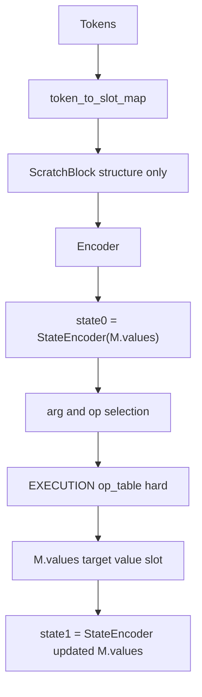

# Slot-referential execution (aligned with [executionblockiterations.md](.cursor/plans/executionblockiterations.md))

This plan is the **data + substrate + ScratchBlock + readout** track of the **unified execution system**. It must stay consistent with the **ExecutionBlock rewrite** ([execblock_scratch_slots_a5d2646d.plan.md](execblock_scratch_slots_a5d2646d.plan.md)) — same invariants, same hard boundary, **no parallel numeric paths**.

## Unified objective

```text
tokens → slot references → ExecutionMemory.values
→ execution → updated values → derived state
```

**Final invariant:** ONE numeric truth (`M.values`), ONE mutator (`ExecutionBlock`), ONE reference system (`token_to_slot_map`), **ZERO** hidden-state numeric reasoning for execution.

## Hard invariants (fail if violated)

1. `**ExecutionMemory.values` is the ONLY numeric truth** for execution and multi-step reasoning.
2. `**<NUM>` tokens MUST resolve through `token_to_slot_map`** (valid `slot_id`; never “floating” literals in the execution path).
3. **Execution MUST read/write ONLY through slots** (value slots for writes per ExecutionBlock spec `[S..V-1]`).
4. **ScratchBlock MUST NOT inject numeric values** into embeddings as reasoning truth when slot-bound (`has_value` false for value bands; use `slot_embedding`).
5. **State MUST be derived from memory** — `StateEncoder(M.values, …)` only; **never** stored independently (no state write heads, no scratch-as-state-register).
6. **NO hidden → numeric decoding for execution** (no MLP / `token_numeric_values` inside `executeStep` for operand scalars).
7. **NO fallback paths** — invalid slot, missing map for `<NUM>`, write to scratch, or hidden decode → **hard error**, not warn-and-continue.

**Engineering stance:** If a code path cannot comply → **delete it**, do not adapt or shim. Do **not** preserve legacy literal + slot mixed behavior.

## PHASE 1 — `token_to_slot_map` (mandatory)

Per-token `int32`:

```text
token_index → slot_id
```

Rules:

- `**<NUM>**` (state-bearing) → **valid `slot_id`** in `[0, V-1]` per policy (typically value-slot subrange `[S..V-1]`).
- Non-state tokens → `**slot_id = -1**`.
- Mapping **stable** across forward and autoregressive steps.

**Thread through:** `BatchPayload`, `TrainingState`, `InferenceState`, `TokenBufferView`, dataset/GRMT if needed, DMA in `ComputeLossBatch.cu` / `Inference_GPU.cu` — same plumbing depth as `token_numeric_values` today.

**Touchpoint reference:** [grim_language_model_cuda.hpp](resources/models/GRIM-text/GRIM/grim_language_model_cuda.hpp), [BatchPayload](resources/models/GRIM-text/Shared/Batching/), [InitTrainingState.cu](resources/models/GRIM-text/training/InitTrainingState.cu), [InitinferenceState.cu](resources/models/GRIM-text/Layers/InitInferenceState/InitinferenceState.cu).

**Baseline:** There is still **no** `token_exec_slots` in-tree; grep before implementing.

## PHASE 2 — Bootstrap memory (remove literal dependence for reasoning)

After `ExecutionMemory` init / clear:

```text
for each token:
  if slot_id >= 0:
    M.values[slot_id] = literal_value
```

Constraints:

- **Training:** bootstrap **detached** (no gradient through copy).
- **Inference:** **prompt** literals only; generated numeric content must come from **execution writes**, not tokenizer literals into truth.

## PHASE 3 — ExecutionBlock core (with slot map)

### REMOVE (hard delete)

- Hidden → numeric decode for execution; `**token_numeric_values` in execution**; MLP fallback for `<NUM>` in the execution operand path.
- Scratch-based **state** reads for control.
- **Dual write paths**; writes to scratch for numeric results.

### ADD — slot-based resolution + deterministic ops

**Argument resolution** (spec):

```text
slot_i = token_to_slot_map[arg1_token]
slot_j = token_to_slot_map[arg2_token]
v_i = M.values[slot_i]
v_j = M.values[slot_j]
```

Invalid slot / out of bounds → **THROW**.

**Operation:**

```text
v_out = op_table[op_id](v_i, v_j)
```

- **Not differentiable** through the table application.
- **No** hidden states in this path.

**Write (single path):**

```text
target_slot ∈ value slots [S .. V-1]
M.values[target_slot] = v_out
```

Scratch slots **never** receive numeric execution writes.

Implementation detail lives in [execution_block_GPU.cu](resources/models/GRIM-text/Layers/ExecutionBlock/execution_block_GPU.cu) — see [execblock_scratch_slots_a5d2646d.plan.md](execblock_scratch_slots_a5d2646d.plan.md) for `StateEncoder`, operand gather, and autograd boundary.

## PHASE 4 — State system

### REMOVE

- State stored in scratch; **state write heads**; **state logits**.

### ADD

```text
state0 = StateEncoder(M.values, M.valid_mask)
```

(minimum: mean over valid value slots; preferred: attention over slots) → `[1, d_model]`.

After execution:

```text
state1 = StateEncoder(M.values_updated)
```

**Always derived — never written** to `M` as “state storage.”

## PHASE 5 — ScratchBlock (strict role)

Modify [ScratchBlockReasoning_GPU.cu](resources/models/GRIM-text/Layers/ScratchBlock/ScratchBlockReasoning_GPU.cu) — [kernelLookupAtomEmbeddingsWithValue](resources/models/GRIM-text/Layers/ScratchBlock/ScratchBlockReasoning_GPU.cu):

When `slot_id >= 0`:

```text
has_value = false   // for literal value bands (dims 16–47)
```

**Remove** literal numeric injection into those bands for slot-bound tokens.

**Add** `slot_embedding[slot_id]` (learned table or projection) so positions stay distinguishable **without** carrying numeric truth in ScratchBlock.

Thread `d_token_slots` through `scratch_block_inject` / [AutogradTraining.cu](resources/models/GRIM-text/training/Autograd/AutogradTraining.cu) and ScratchBlock launch signatures.

## PHASE 6 — ExecutionBlock gather

Candidate construction:

```text
candidates = atoms + value_slots_only
```

**Exclude:** scratch slots; state embeddings as arg carriers for numeric truth.

Arg heads **only** over `C_args = num_atoms + (V - S)`.

## PHASE 7 — NumericHead (readout only)

- **Only** for decoding output tokens / optional supervision at readout sites.
- **Remove** any role in **intermediate** execution or reasoning truth.

**Inference:**

```text
final_value = M.values[result_slot]
```

**Not** NumericHead output as the authority for multi-step numeric state.

Touchpoints: [numeric_head_GPU.cu](resources/models/GRIM-text/Layers/NumericHead/numeric_head_GPU.cu), [AutogradTraining.cu](resources/models/GRIM-text/training/Autograd/AutogradTraining.cu), [Inference_GPU.cu](resources/models/GRIM-text/training/Inference_GPU.cu), [grim_language_model_gpu.cu](resources/models/GRIM-text/Common/grim_language_model_gpu.cu).

## PHASE 8 — Autograd boundary

Execution is a **hard boundary**:

```text
NO gradients through:
  op_table application
  M.values writes (discrete update)
```

Gradients **through** (where differentiable): arg selection, op selection, **StateEncoder** weights, encoder hidden states feeding heads, **before** the hard dispatch.

Document straight-through / surrogate for training stability if used ([execblock_scratch_slots plan](execblock_scratch_slots_a5d2646d.plan.md)).

## PHASE 9 — Validation (fail hard)

Runtime checks (errors only):

- `<NUM>` without valid slot → **FAIL**
- Slot out of bounds → **FAIL**
- Execution using hidden decode / `token_numeric_values` → **FAIL**
- Write to scratch slot for numeric result → **FAIL**
- Multiple truth write paths → **FAIL**

## Final pipeline (expected)




## Current baseline (still accurate)

ScratchBlock today uses `token_numeric_values` + `atom_mask` for `has_value` ([ScratchBlockReasoning_GPU.cu](resources/models/GRIM-text/Layers/ScratchBlock/ScratchBlockReasoning_GPU.cu) ~105–108). `token_to_slot_map` is **not** yet in the tree. ExecutionBlock `executeStep` still uses MLP decode + soft op mix + full-`V` blended writes — all **scheduled for removal** per phases above.

## ReasoningHead (optional note)

**Default:** keep as **auxiliary** supervision only; document that **ExecutionBlock** owns step control after refactor. **Do not** reintroduce a second numeric truth path via ReasoningHead outputs into `M.values` without an explicit spec change.

## Success criteria (from unified spec)

- Exact arithmetic via `op_table` (no learned approximation in the execution path).
- Consistent state across steps via `**M.values`** only.
- Multi-step execution without duplicate or conflicting truth writes.
- Never rely on hidden states for numeric truth.
- Extensible to future atom types (`<OBJ>`, `<TOOL>`, …) via **slot map + typed policies**, not literal bands.

## Related plans

- [execblock_scratch_slots_a5d2646d.plan.md](execblock_scratch_slots_a5d2646d.plan.md) — ExecutionBlock file: `StateEncoder`, operand gather, `op_table`, value-only write, grad boundary.
- [serialization_layer_refactor_716227cb.plan.md](serialization_layer_refactor_716227cb.plan.md) / model store plans — if new tensors (`slot_embedding`, reshaped op weights) need schema updates.

## Risk notes

- **Dataset / GRMT:** May need to persist `token_exec_slots` per token if not purely derivable at runtime.
- **Checkpoints:** New weights (slot embeddings, StateEncoder, resized op head) → serialization changes; **breaking** acceptable per unified spec.
- **Regression:** K-step training backward after hard boundary — test explicitly (Phase 9).

