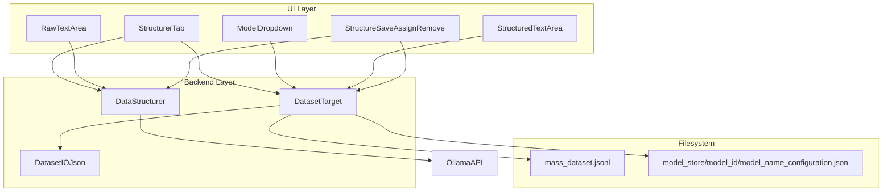

# Structurer Tab Backend Wiring Plan

## Architecture




The key rule is:

- `mass_dataset.jsonl` is the single source of truth for sequence content and sequence metadata.
- The Structurer tab updates that file by entry `id`.
- Each model directory gets one temporary config file named `<model_name>_configuration.json`.
- That config file stores assigned sequence IDs and model-specific config state for now.
- No model directory stores copied raw corpus text.

---

## File Responsibilities


| File                                                                                         | Responsibility                                                                                                                                                                                                       |
| -------------------------------------------------------------------------------------------- | -------------------------------------------------------------------------------------------------------------------------------------------------------------------------------------------------------------------- |
| [DataCollection/pipeline/pipeline_context.hpp](DataCollection/pipeline/pipeline_context.hpp) | Extend `TaggedEntry` with structuring metadata so the pipeline and structurer share one entry schema.                                                                                                                |
| [DataCollection/io/dataset_io_json.cpp](DataCollection/io/dataset_io_json.cpp)               | Extend JSON parse/serialize to round-trip structuring fields in `mass_dataset.jsonl`.                                                                                                                                |
| [DataCollection/dataset_target.hpp](DataCollection/dataset_target.hpp)                       | Keep public API declaration for dataset browsing, assignment, and persistence against the mass dataset and per-model configuration file.                                                                             |
| [DataCollection/dataset_target.cpp](DataCollection/dataset_target.cpp)                       | **NEW**. Implement all `DatasetTarget` behavior: load mass dataset, search, assign/remove, upsert structured output by `id`, append new structured entries, and save `<model_name>_configuration.json`. No UI logic. |
| [DataCollection/data_structurer.hpp](DataCollection/data_structurer.hpp)                     | Existing structuring engine. No persistence. Only transforms text into structured output.                                                                                                                            |
| [ui/ui_data_hub.hpp](ui/ui_data_hub.hpp)                                                     | Add backend member ownership: `DatasetTarget`, `DataStructurer`, state for active results and current sequence.                                                                                                      |
| [ui/ui_data_hub.cpp](ui/ui_data_hub.cpp)                                                     | Wire the Structurer tab callbacks to the backend. UI remains responsible only for layout, selection, and user interaction.                                                                                           |
| [control/ai_config_paths.hpp](control/ai_config_paths.hpp)                                   | Add `model_store` path support so Structurer can resolve per-model configuration files consistently.                                                                                                                 |
| [cmake/Sources.cmake](cmake/Sources.cmake)                                                   | Include `DataCollection/dataset_target.cpp` in the build.                                                                                                                                                            |


---

## 1. Unify the Entry Schema

Before wiring the Structurer tab, the shared sequence schema must carry structuring state.

### Update `TaggedEntry`

In [DataCollection/pipeline/pipeline_context.hpp](DataCollection/pipeline/pipeline_context.hpp), extend `TaggedEntry` with:

- `bool structured = false;`
- `std::string structuredOutput;`

This makes structuring state first-class metadata, just like:

- `id`
- `verified`
- `sourceType`
- `qualityTier`
- `subject`
- `tags`

### Update JSON I/O

In [DataCollection/io/dataset_io_json.cpp](DataCollection/io/dataset_io_json.cpp), update:

- `parseTaggedEntry(...)`
- `taggedEntryToJson(...)`

to round-trip:

- `structured`
- `structured_output`

Resulting JSONL shape per entry:

```json
{
  "id": "...",
  "content": "...",
  "source_url": "...",
  "source_type": "...",
  "quality_tier": "...",
  "subject": "...",
  "tags": ["..."],
  "reliability_score": 0.8,
  "timestamp": 0,
  "verified": true,
  "structured": true,
  "structured_output": "Q: ...\n\nA: ..."
}
```

---

## 2. Implement `dataset_target.cpp`

### Intent

`DatasetTarget` becomes the non-UI adapter between:

- the structurer UI
- the mass dataset
- the per-model config file

It must not create sidecar structured files. All content persistence goes through `mass_dataset.jsonl`. Per-model membership and config persistence goes through `<model_name>_configuration.json`.

### Path resolution

- `model_store_root`:
  - preferred: `paths.model_store` from [control/ai_config_paths.hpp](control/ai_config_paths.hpp)
  - fallback: `resources/models/model_store`
- `mass_dataset_path`:
  - preferred: parent directory of `paths.grim_text.training_data` + `mass_dataset.jsonl`
  - fallback: `resources/models/GRIM-text/training/data/mass_dataset.jsonl`

### Config file contract

For now, each model directory gets a config file named:

- `model_store/<model_id>/<model_name>_configuration.json`

Minimum shape:

```json
{
  "model_id": "science-brick",
  "assigned_sequence_ids": [
    "7d9c2fa2ef64345cbcaf7fa8c24ce570",
    "dad37bb6f6f55ffacb1f309d09d8d9ee"
  ],
  "hyperparameters": {},
  "mmo": {}
}
```

Rules:

- `assigned_sequence_ids` is the only field required for this task.
- IDs are always stored as sequence IDs, never as dataset indices.
- Existing config fields like `hyperparameters` or `mmo` must be preserved when saving.
- This file is temporary scaffolding until the final MMO configuration path is proven.

### Core methods


| Method                                             | Behavior                                                                                                                                                                                         |
| -------------------------------------------------- | ------------------------------------------------------------------------------------------------------------------------------------------------------------------------------------------------ |
| `loadMassDataset()`                                | Create `DatasetIOJson` and delegate to `loadMassDataset(io)`.                                                                                                                                    |
| `loadMassDataset(io)`                              | Load all entries from `mass_dataset.jsonl`, map `TaggedEntry` to `SequenceHandle`, including `structuredOutput` into `SequenceHandle.structured`.                                                |
| `massDatasetSize()`                                | Return cached `sequences_.size()`.                                                                                                                                                               |
| `getSequence(index)`                               | Return cached sequence from the loaded dataset.                                                                                                                                                  |
| `searchSequences(...)`                             | Case-insensitive substring search on `content`, with optional metadata filters.                                                                                                                  |
| `assignSequenceToModel(size_t seq_index)`          | Resolve the entry `id`, add it to the assigned ID set, then save `<model_name>_configuration.json`.                                                                                              |
| `assignSequenceToModel(const std::string& seq_id)` | Add the ID directly, then save `<model_name>_configuration.json`.                                                                                                                                |
| `removeSequenceFromModel(index)`                   | Remove the current entry `id` from the assigned ID set, then save `<model_name>_configuration.json`.                                                                                             |
| `loadAssignments()`                                | Load `model_store/<model_id>/<model_name>_configuration.json`, read `assigned_sequence_ids`, and resolve them against the current mass dataset by `id`.                                          |
| `saveAssignments()`                                | Save `assigned_sequence_ids` into `<model_name>_configuration.json` while preserving any existing config fields already present in that file.                                                    |
| `writeStructuredOutput(index, structured)`         | Update matching entry by `id` inside `mass_dataset.jsonl`, set `structured=true`, set `structured_output`, full-file rewrite through `saveAllEntries()`, then refresh in-memory cache.           |
| `readStructuredOutput(index)`                      | Return `sequences_[index].structured` from the in-memory mass dataset.                                                                                                                           |
| `appendStructuredEntry(...)`                       | New helper: create a brand-new `TaggedEntry` from Structurer-originated content, assign a new `id`, set `structured=true`, write `structured_output`, append or rewrite file, then reload cache. |


### Persistence rules

For an existing dataset sequence:

1. Locate by `id`
2. Update:
  - `structured = true`
  - `structured_output = <editor text>`
3. Save full `mass_dataset.jsonl`

For a new sequence created from the Structurer tab:

1. Create new `TaggedEntry`
2. Assign new `id`
3. Fill metadata:
  - `content`
  - `structured = true`
  - `structured_output`
  - `verified` according to chosen policy
  - `sourceType` / `sourceUrl` / `qualityTier` / `subject` / `tags`
4. Append or rewrite `mass_dataset.jsonl`

For per-model membership/config:

1. Do not copy raw text into the model directory
2. Save only assigned sequence IDs plus config state into `<model_name>_configuration.json`
3. Preserve any model hyperparameter or MMO settings already stored in that file

### Important constraint

Do not write:

- `structured/<index>.txt`
- `structured/<format>/structured_data.jsonl`

Those would split ownership across files and conflict with the single-file metadata model plus the temporary config-file contract.

---

## 3. Wire the Structurer Tab

### Backend ownership in `ui_data_hub.hpp`

Add:

- `std::unique_ptr<DatasetTarget> datasetTarget_;`
- `std::unique_ptr<GRIM::DataCollection::DataStructurer> structurer_;`
- cached search results / active sequence state as needed

### Construction in `ui_data_hub.cpp`

In the constructor:

1. Resolve `modelStoreRoot`
2. Resolve `massDatasetPath`
3. Construct `datasetTarget`_
4. Build `DataStructuringConfig`
5. Construct `structurer`_

### Model dropdown behavior

Populate from [MMO/Core/ModelRegistry.hpp](MMO/Core/ModelRegistry.hpp):

- use `ModelRegistry::instance().getAllModels()`
- dropdown entries are model ids or names

On model selection:

1. `datasetTarget_->setActiveModel(modelId)`
2. `datasetTarget_->loadAssignments()`
3. refresh:
  - `assignedSequences`_
  - current sequence preview

### Tab refresh behavior

When Structurer opens or refreshes:

1. `datasetTarget_->loadMassDataset()`
2. set:
  - `totalSequences`_
  - `assignedSequences`_
  - `structuredCount`_ = count of entries with `structured=true`

### Navigation behavior

For current sequence:

1. `seq = datasetTarget_->getSequence(currentSequenceIndex_)`
2. `rawTextArea`_ shows `seq.content`
3. `structuredTextArea`_ shows `seq.structured`

### Search behavior

Search uses `DatasetTarget::searchSequences(...)` and populates `searchPreviewScrollBox`_.

Clicking a result:

1. selects the matching sequence index
2. loads raw and structured text areas

### Structure button

1. read raw text from `rawTextArea`_
2. call `structurer_->structureEntry(...)`
3. join results into one editable string
4. write into `structuredTextArea`_

No persistence yet at this step.

### Save button

If editing an existing sequence:

1. `datasetTarget_->writeStructuredOutput(currentSequenceIndex_, structuredTextArea_->getText())`
2. update local counters
3. reload current sequence from cache

If saving a new sequence not tied to the current dataset entry:

1. call `appendStructuredEntry(...)`
2. optionally assign it immediately to the active model
3. reload dataset and selection

### Structure All button

1. gather target sequence indices
2. run `structureBatch(...)`
3. for each successful result:
  - call `writeStructuredOutput(...)`
4. update:
  - `structuredCount_`
  - `failedCount_`

### Assign / Remove buttons

Assignments stay only in `<model_name>_configuration.json`.

They do not modify sequence content. They only control model membership.

---

## 4. Config and Build Changes

### `ai_config_paths.hpp`

Add support for:

- `paths.model_store`

This keeps per-model configuration storage path resolution explicit and centralized.

### `Sources.cmake`

Add:

- `DataCollection/dataset_target.cpp`

to the build source list.

---

## 5. Data Flow Summary


| User Action                    | Backend Call                                     | File Touched                                            |
| ------------------------------ | ------------------------------------------------ | ------------------------------------------------------- |
| Open Structurer tab            | `loadMassDataset()`, `loadAssignments()`         | `mass_dataset.jsonl`, `<model_name>_configuration.json` |
| Search                         | `searchSequences()`                              | none                                                    |
| Prev / Next                    | `getSequence()`                                  | none                                                    |
| Structure                      | `structureEntry()`                               | none                                                    |
| Save existing structured entry | `writeStructuredOutput()`                        | `mass_dataset.jsonl`                                    |
| Save new structured entry      | `appendStructuredEntry()`                        | `mass_dataset.jsonl`                                    |
| Assign                         | `assignSequenceToModel()`, `saveAssignments()`   | `<model_name>_configuration.json`                       |
| Remove                         | `removeSequenceFromModel()`, `saveAssignments()` | `<model_name>_configuration.json`                       |


---

## 6. Separation of Intent

- UI code in [ui/ui_data_hub.cpp](ui/ui_data_hub.cpp):
  - layout
  - event handling
  - showing current sequence
  - invoking backend methods
- Structuring logic in [DataCollection/data_structurer.hpp](DataCollection/data_structurer.hpp):
  - talk to Ollama
  - convert raw text into structured text
  - no file ownership
- Dataset ownership in [DataCollection/dataset_target.cpp](DataCollection/dataset_target.cpp):
  - mass dataset loading
  - mass dataset rewriting
  - per-model configuration persistence
  - sequence lookup and search
- JSON persistence in [DataCollection/io/dataset_io_json.cpp](DataCollection/io/dataset_io_json.cpp):
  - parse / serialize the canonical entry schema

This keeps one clear owner per concern and avoids mixing UI, structuring, and persistence.

---

## 7. Out of Scope

- Model creation UX in the Model Panel
- HF cleanup behavior beyond existing hooks
- advanced search ranking
- final MMO-owned hyperparameter editing workflow
- final long-term model config schema once this temporary `<model_name>_configuration.json` path is proven

Those can follow once the Structurer tab is fully functional against the mass dataset.