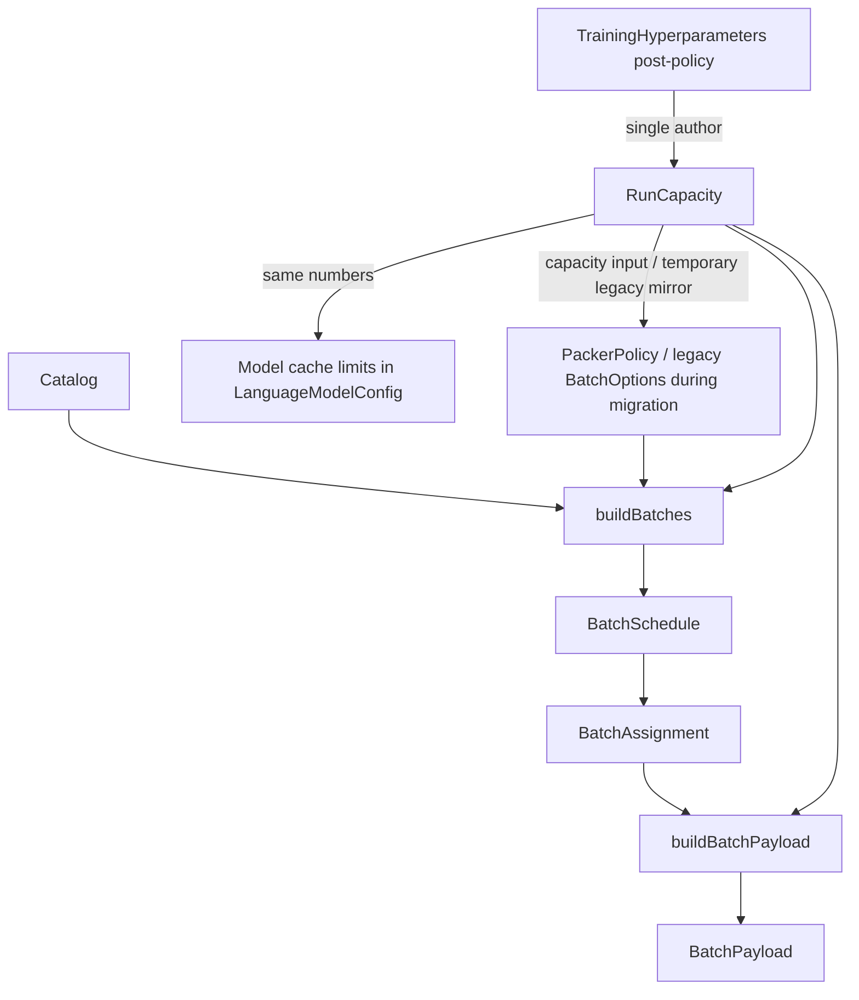

---
name: Linear startup and config stem
overview: **The batching/payload layer already owns schedule and per-batch facts**—policy/capacity inputs feed `buildBatches` → `BatchSchedule` / `BatchAssignment` → `buildBatchPayload` → `BatchPayload`, plus `Catalog` / sequence views at the corpus end and epoch scheduling in `EpochBatching`. The startup order should be **Logging → Memory snapshot → Hyperparameter constants → Hyperparameter groupings/stem → Data info → Payload builder/scheduler setup → Final validation**. Phase 1 derives **`RunCapacity` once after post-policy HP** as the single author of capacity (batch rows, seq cap, token-rectangle product); `RunCapacity` applies matching mirrors to `LanguageModelConfig`, and legacy `BatchOptions` capacity fields may be filled from it only during migration. **Explicit follow-on: slim `BatchOptions`** so it no longer carries duplicate limits—**only packer policy** (at minimum **strategy** and **batch ordering**; other fields TBD). **Budget / cache contract violations must fail loud.** Intentional tradeoff: monolithic `StartupConfig` / HP until slim views.
todos:
  - id: phase1-linear-startup-doc
    content: "Document linear startup + ownership: `CapacityStem` derives `RunCapacity` once after post-policy HP; model cache fields receive mirrors from it; legacy `BatchOptions` capacity fields may be filled only during migration; batching types remain the schedule/batch/payload story—no second parallel struct for the same fields."
    status: pending
  - id: phase1-hp-stem-to-batching-types
    content: "Phase 1: the `CapacityStemReady` subsystem call derives `RunCapacity` from post-policy `StartupConfig`; the `ModelAllocated` subsystem applies those integers to `LanguageModelConfig` cache fields. `executePhase1` must not contain either derivation or mirror-application logic."
    status: pending
  - id: priority-context-carries-options
    content: "Store frozen `RunCapacity` (and policy-only `PackerPolicy` once available) on `TrainingContext` so Phase2 val, `buildEpochBatches`, and `buildPayloadFromAssignment` do not re-derive `batch_size × max_seq_len` from scattered sources."
    status: pending
  - id: phase2-payload-align
    content: "`buildPayloadFromAssignment` and cache-fit args to `buildBatchPayload` use the stem (context-held options or derived from it)—align with `BatchAssignment` / `BatchPayload` as the per-batch source of truth for geometry"
    status: pending
  - id: phase3-gpu-init-align
    content: "`InitTrainingState` / `TrainingOps` match the same capacity numbers already applied to the model config from the stem (no third independent min/max story)"
    status: pending
  - id: later-slim-views
    content: "Optional: narrow pass-by-const / views over `StartupConfig` once the pipeline is stable"
    status: pending
  - id: fail-loud-budget-contract
    content: "Per-layer audit (see plan §Failure semantics, detailed): stem product overflow; InitTrainingState `min`/`max`; scheduler `overflow` vs throw; `UINT32_MAX` saturations; `buildBatchPayload` throw path as template; any catch-and-continue on budget/capacity. Document decisions for unavoidable overflow batches (keep vs make fatal)."
    status: pending
  - id: slim-batch-options
    content: "Refactor legacy `BatchOptions` out of [`Batching_GPU.hpp`](resources/models/GRIM-text/Shared/Batching/Batching_GPU.hpp): **drop** `max_tokens_per_batch` and `max_batch_size`; introduce [`Shared/Batching/PackerPolicy.hpp`](resources/models/GRIM-text/Shared/Batching/PackerPolicy.hpp) for packer policy only—at minimum `PackingStrategy` and `BatchOrdering`; relocate/delete bucket/similarity/curriculum/RNG if they belong in HP or `EpochBatching` only."
    status: pending
  - id: startup-order-contract
    content: "Adopt and document the exact 12-callsite initialization order: `LoggingReady`, `MemorySnapshotReady`, `HyperparametersReady`, `CapacityStemReady`, `DataInfoReady`, `ModelAllocated`, `ResumeStateReady`, `TelemetryReady`, `SchedulerPreflightReady`, `EpochPlanReady`, `StartupValidated`, `Phase2HandoffReady`. Each callsite only invokes its subsystem; all logic lives behind the subsystem boundary."
    status: pending
  - id: startup-event-taxonomy
    content: "Define startup as a linear event/artifact pipeline (`LoggingReady`, `MemorySnapshotReady`, `HyperparametersReady`, `CapacityStemReady`, `DataInfoReady`, `ModelAllocated`, `ResumeStateReady`, `TelemetryReady`, `SchedulerPreflightReady`, `EpochPlanReady`, `StartupValidated`, `Phase2HandoffReady`). Events are one-way handoffs; `Phase2HandoffReady` is the prepared-input boundary equivalent to starting an epoch, and only Phase2 epoch/batch loops are loops."
    status: pending
  - id: model-allocation-gate
    content: "Add an explicit Model config assembly + GPU allocation gate after data info: apply the HP capacity stem to `LanguageModelConfig`, allocate `TrainingState`, and validate allocated cache limits match the stem before optimizer/telemetry."
    status: pending
  - id: resume-state-gate
    content: "Add an explicit checkpoint/optimizer resume gate: restore model/optimizer state from the exact loaded checkpoint sidecar, then emit a `ResumeStateReady` artifact containing optimizer step/global step/best val/epochs completed."
    status: pending
  - id: telemetry-control-gate
    content: "Add telemetry/control gate after model allocation and resume: telemetry uses the HP capacity stem or model fields filled from it; it must not re-derive token budget."
    status: pending
  - id: epoch-plan-finalization
    content: "Add epoch plan finalization gate before entering the epoch loop: build scheduler preflight, derive `estimated_total_steps`, `warmup_steps`, and `lr_schedule`, then validate LR schedule exists before any train step."
    status: pending
  - id: startup-final-validator
    content: "Add a final cross-stage validator file/stage that compares logging, memory snapshot, HP constants/stem, data info, model allocation, resume state, telemetry, scheduler/payload preflight, and epoch plan. It writes no config; it only passes or throws, then emits the direct Phase1-to-Phase2 handoff inputs."
    status: pending
  - id: logic-groupings-contract
    content: "Define strict logic-only grouping structs/views: `MemorySnapshot`, existing post-policy HP (`StartupConfig` / `TrainingHyperparameters` / `DerivedScheduleInfo` from `HyperParameters_GPU.hpp`), `RunCapacity`, `DataLoadInputs`, `DataInfo`, `ModelAssemblyInputs`, `PackerPolicy`, `SchedulerInputs`, `PayloadBuildInputs`, `EpochPlanInputs`, `TelemetryInitInputs`, `ResumeState`, `StartupValidationInputs`, and `Phase2HandoffInputs`. Each grouping is narrow and read-only; hyperparameters are not a new Startup file."
    status: pending
  - id: concrete-grouping-definitions
    content: "Add concrete field-level definitions and ownership for each grouping: owner file, build function, exact fields, consumers, and placement in the event chain. These are planning definitions, not implementation yet."
    status: pending
  - id: startup-file-structure-policy
    content: "Use the authoritative grouped file tree under `training/Phases/Startup/`: `Capacity/`, `Data/`, `Model/`, `Resume/`, `Telemetry/`, `Scheduling/`, `Epoch/`, `Validation/`. Do **not** add `Startup/Hyperparameters/`; HP already exists in `Shared/HyperParameters/HyperParameters_GPU.hpp`. `EpochPlan.hpp` belongs under `Startup/Epoch/`, not `Startup/Scheduling/`. No flat `Startup/*.hpp` dumping ground for new grouping artifacts."
    status: pending
  - id: hyperparameter-feature-groupings
    content: "Add `resources/models/GRIM-text/Shared/HyperParameters/HyperparameterGroupings.hpp`: feature-structured read-only views over existing `TrainingHyperparameters` / `StartupConfig` / `DerivedScheduleInfo` (optimizer, LR, capacity inputs, data loading, model features, loss, telemetry, scheduling). This lives beside `HyperParameters_GPU.hpp`, not under `Startup/`."
    status: pending
  - id: existing-elements-inventory
    content: "Maintain an explicit inventory of existing structs/files that must be reused, not recreated: HP roots, startup context structs, batching/payload structs, epoch batching helpers, telemetry/config dump/checkpoint helpers, and startup utility files."
    status: pending
  - id: chronological-implementation-phases
    content: "Execute the refactor as chronological implementation phases with explicit ownership boundaries, handoffs, gates, and completion criteria: baseline audit, HP feature views/capacity stem, Phase1 model/context wiring, data/model allocation artifacts, Phase2 scheduler/payload alignment, fail-loud audit, slim `BatchOptions` to `PackerPolicy`, epoch/resume/telemetry/final validation gates, and cleanup."
    status: pending
isProject: false
---

# Linear startup: HP stem into existing schedule / batch / payload types

## Correction (what was wrong in earlier drafts)

Earlier drafts implied a **new** abstract "config grouping" or "geometry" struct as the hero object. **That misses what you already have:** the **payload and batching stack** is already the right place for schedule, batch, epoch, and per-batch (sequence) information—captured in concrete types, not a parallel duplicate layer.

- **Corpus / sequence:** [`DynaSeq::Catalog`](resources/models/GRIM-text/Shared/Batching/Batching_GPU.hpp) + `TrainingSequence` views in [`training_data_loader`](resources/models/GRIM-text/training/training_data_loader.hpp).
- **Epoch:** [`buildEpochBatches`](resources/models/GRIM-text/Shared/Batching/EpochBatching.cu) (per-epoch `PackerPolicy` / legacy `BatchOptions` during migration + `RunCapacity` + `buildBatches`).
- **Batch (scheduler output):** [`BatchSchedule`](resources/models/GRIM-text/Shared/Batching/Batching_GPU.hpp) = `vector<`[`BatchAssignment`](resources/models/GRIM-text/Shared/Batching/Batching_GPU.hpp)`>`; each assignment carries `seq_ids`, per-batch `max_seq_len`, `total_tokens`, padding stats, overflow, etc.
- **Scheduler input:** `RunCapacity` for capacity plus `PackerPolicy` for strategy/order/tunables. Legacy [`BatchOptions`](resources/models/GRIM-text/Shared/Batching/Batching_GPU.hpp) may carry capacity mirrors only during migration.
- **Per-batch payload:** [`buildBatchPayload`](resources/models/GRIM-text/Shared/Batching/BatchPayload.hpp) → [`BatchPayload`](resources/models/GRIM-text/Shared/Batching/BatchPayload.hpp) (full geometry, padding, valid_tokens, device upload sizes, `fits_in_cache`, etc.).

**This** is what "it should be": **branch constants from hyperparameters into these structures and their call chain**, not invent a second set of "grouping" types that re-express the same thing.

## Canonical ownership summary

This is the short version of the desired ownership model. If any later section appears to conflict with this, this section wins:

| Artifact | Ownership rule |
|----------|----------------|
| `StartupConfig` / `TrainingHyperparameters` | Existing HP root. Loaded, validated, and policy-applied by the existing HyperParameters layer. |
| `HyperparameterGroupings.hpp` | Read-only feature views over **post-policy** HP. Not stored as runtime truth and not a new config root. |
| `RunCapacity` | Sole capacity owner: batch rows, sequence cap, checked token rectangle, overflow policy. |
| `LanguageModelConfig` | Receives capacity mirrors from `RunCapacity` during model assembly. It does not author capacity. |
| `BatchOptions` / `PackerPolicy` | Packer behavior only. No batch size. No token budget. Long-term home is `Shared/Batching/PackerPolicy.hpp`. |
| `BatchAssignment` | Actual scheduled batch facts: selected `seq_ids`, observed per-batch sequence length, token/padding stats. |
| `BatchPayload` | Actual materialized tensor/payload geometry and masks for one batch. |
| `TrainingContext` | Artifact registry. Stores `RunCapacity`, `DataInfo`, `ResumeState`, `PackerPolicy`, `EpochPlan`, model/optimizer/telemetry handles, etc.; does not invent new runtime truth. |

## Existing elements inventory: reuse, do not recreate

This refactor must start by reusing the types and helpers that already exist. Adding a new grouping is only allowed when there is no existing artifact with that responsibility. If a new type overlaps one of these, the plan should be revised before implementation.

### Hyperparameters / configuration roots

| Existing element | File | Reuse as | Do not recreate as |
|------------------|------|----------|--------------------|
| `GRIM::HyperParameters::StartupConfig` | [`Shared/HyperParameters/HyperParameters_GPU.hpp`](resources/models/GRIM-text/Shared/HyperParameters/HyperParameters_GPU.hpp) | Existing startup config root: paths, HP, tokenizer config, generation config, resolved `max_seq_len`, sliding-window stride, CLI flags. | `Startup/Hyperparameters/EffectiveHyperparameters.hpp`, new startup config root, duplicate path/config bundle. |
| `GRIM::Config::TrainingHyperparameters` | [`Shared/HyperParameters/HyperParameters_GPU.hpp`](resources/models/GRIM-text/Shared/HyperParameters/HyperParameters_GPU.hpp) | Existing post-policy HP field source. Feature views in `HyperparameterGroupings.hpp` should read from this. | New runtime HP struct, new JSON mirror, new scheduler config root. |
| `GRIM::HyperParameters::LanguageModelConfig` | [`Shared/HyperParameters/HyperParameters_GPU.hpp`](resources/models/GRIM-text/Shared/HyperParameters/HyperParameters_GPU.hpp) | Model architecture/config target. It receives capacity mirrors from `RunCapacity` during model assembly. | Separate “model config grouping” that redefines architecture fields. |
| `GRIM::HyperParameters::DerivedScheduleInfo` | [`Shared/HyperParameters/HyperParameters_GPU.hpp`](resources/models/GRIM-text/Shared/HyperParameters/HyperParameters_GPU.hpp) | Existing schedule-independent derived HP output from `computeDerivedSchedule`. | New duplicate “derived training constants” struct. |
| `PathConfig` alias | [`training/Phases/Phase1_Startup.hpp`](resources/models/GRIM-text/training/Phases/Phase1_Startup.hpp) alias to HP path config | Existing path bundle. | New local path struct in startup stages. |
| `loadStartupConfig` + HP validate/derive/apply trio | [`Shared/HyperParameters/HyperParameters_GPU.hpp`](resources/models/GRIM-text/Shared/HyperParameters/HyperParameters_GPU.hpp) | Only JSON/CLI/override interpretation path. | New config parser or second policy application function. |

### Startup context / registry

| Existing element | File | Reuse as | Do not recreate as |
|------------------|------|----------|--------------------|
| `TrainingContext` | [`training/Phases/Phase1_Startup.hpp`](resources/models/GRIM-text/training/Phases/Phase1_Startup.hpp) | Artifact registry passed from Phase1 to Phase2. Add new artifact fields here when they are long-lived. | Another global “startup context” / “run context” object. |
| `SequenceData` | [`training/Phases/Phase1_Startup.hpp`](resources/models/GRIM-text/training/Phases/Phase1_Startup.hpp) | Existing owner of train/val sequences, views, catalogs, and vocab size. `DataInfo` should reference/summarize this, not replace storage. | New data store for train/val sequences or catalogs. |
| `LoggingContext` | [`training/Phases/Phase1_Startup.hpp`](resources/models/GRIM-text/training/Phases/Phase1_Startup.hpp) | Existing logging/status/tape sink bundle. | New logger bundle unless logging is deliberately extracted later. |
| `TelemetryContext` | [`training/Phases/Phase1_Startup.hpp`](resources/models/GRIM-text/training/Phases/Phase1_Startup.hpp) | Existing telemetry lattice/control/CSV state. | New telemetry state wrapper. `TelemetryInitInputs` should be input-only. |
| `OptimizerContext` | [`training/Phases/Phase1_Startup.hpp`](resources/models/GRIM-text/training/Phases/Phase1_Startup.hpp) | Existing optimizer + LR/soft restart/current micro-step state. | New optimizer runtime state struct. |
| `RNGContext` | [`training/Phases/Startup/Rng.*`](resources/models/GRIM-text/training/Phases/Startup/Rng.hpp) and [`Phase1_Startup.hpp`](resources/models/GRIM-text/training/Phases/Phase1_Startup.hpp) | Existing hierarchical seed/init RNG artifact. | New ad-hoc seed bundle in model/data/epoch code. |

### Batching / payload primitives

| Existing element | File | Reuse as | Do not recreate as |
|------------------|------|----------|--------------------|
| `GRIM::DynaSeq::Catalog` | Included via [`Shared/Batching/Batching_GPU.hpp`](resources/models/GRIM-text/Shared/Batching/Batching_GPU.hpp) | Existing catalog input to scheduler. | New sequence index/catalog type for scheduling. |
| `BatchAssignment` | [`Shared/Batching/Batching_GPU.hpp`](resources/models/GRIM-text/Shared/Batching/Batching_GPU.hpp) | Actual scheduled batch facts: seq ids, per-batch max/min length, token/padding stats. | New “scheduled batch info” struct. |
| `BatchSchedule` | [`Shared/Batching/Batching_GPU.hpp`](resources/models/GRIM-text/Shared/Batching/Batching_GPU.hpp) | Existing schedule output and aggregate stats. | New epoch schedule summary struct unless it only wraps existing schedule as part of `SchedulerPreflightState`. |
| `BatchOptions` | [`Shared/Batching/Batching_GPU.hpp`](resources/models/GRIM-text/Shared/Batching/Batching_GPU.hpp) | Legacy scheduler input during migration only. Capacity fields must be filled from stem until removed. | Long-term capacity owner. |
| `buildBatches` | [`Shared/Batching/Batching_GPU.cu`](resources/models/GRIM-text/Shared/Batching/Batching_GPU.cu) | Existing scheduler implementation. | New batch scheduler implementation for the same job. |
| `EpochBatching` / `buildEpochBatches` | [`Shared/Batching/EpochBatching.hpp`](resources/models/GRIM-text/Shared/Batching/EpochBatching.hpp), [`EpochBatching.cu`](resources/models/GRIM-text/Shared/Batching/EpochBatching.cu) | Existing per-epoch schedule builder and batching log function. | New per-epoch schedule builder in Phase2. |
| `BatchPayload` | [`Shared/Batching/BatchPayload.hpp`](resources/models/GRIM-text/Shared/Batching/BatchPayload.hpp) | Existing materialized per-batch tensor geometry, masks, valid token counts, payload metadata. | New payload/geometry struct. |
| `buildBatchPayload` | [`Shared/Batching/BatchPayload.cu`](resources/models/GRIM-text/Shared/Batching/BatchPayload.cu) | Existing assignment-to-payload materialization + cache-fit validation path. | New per-batch materializer. |

### Startup utility modules already extracted

| Existing element | File | Reuse as | Do not recreate as |
|------------------|------|----------|--------------------|
| `SlidingWindow` helpers | [`training/Phases/Startup/SlidingWindow.hpp`](resources/models/GRIM-text/training/Phases/Startup/SlidingWindow.hpp) / `.cu` | Existing sliding-window policy/data prep helper. | New stride/window logic in data info or payload code. |
| `Logging` helpers | [`training/Phases/Startup/Logging.hpp`](resources/models/GRIM-text/training/Phases/Startup/Logging.hpp) / `.cu` | Existing logging bootstrap and batch-tape setup (`initializeLogging`, `setupBatchLogTape`). | New logging bootstrap path or parallel “logging handles” owner. |
| `Rng` helpers | [`training/Phases/Startup/Rng.hpp`](resources/models/GRIM-text/training/Phases/Startup/Rng.hpp) / `.cu` | Existing RNG initialization and hierarchical seeding. | New seed derivation scattered in model/scheduler. |
| `ClassBalancedWeights` | [`training/Phases/Startup/ClassBalancedWeights.hpp`](resources/models/GRIM-text/training/Phases/Startup/ClassBalancedWeights.hpp) / `.cu` | Existing optional class-balanced loss weight computation/upload. | New class-balance logic in Phase1 body or loss setup. |
| `InitFacts` | [`training/Phases/Startup/InitFacts.hpp`](resources/models/GRIM-text/training/Phases/Startup/InitFacts.hpp) / `.cu` | Existing init structural-invariant verification + telemetry/CSV emission. | New tie-embedding verification block. |
| `ConfigDump` | [`training/Phases/ConfigDump.hpp`](resources/models/GRIM-text/training/Phases/ConfigDump.hpp) / `.cu` | Existing hyperparameter/data stats dump. | New local echo blocks for the same HP/data facts. |
| `OptimizerCheckpoint` helpers | [`training/OptimizerCheckpoint.hpp`](resources/models/GRIM-text/training/OptimizerCheckpoint.hpp) / `.cu` | Existing optimizer sidecar path/load/save functions. | New sidecar path derivation or independent checkpoint scan. |

### Shared telemetry / control elements

| Existing element | File | Reuse as | Do not recreate as |
|------------------|------|----------|--------------------|
| `TelemetryLattice`, `LatticeConfig`, `TelemetryCsvLogger` | [`Shared/Telemetry`](resources/models/GRIM-text/Shared/Telemetry/) | Existing telemetry lattice and CSV export. | New telemetry CSV/lattice wrapper for startup facts. |
| `TelemetryControlConfig` / `TelemetryControl` | [`Shared/Telemetry`](resources/models/GRIM-text/Shared/Telemetry/) | Existing telemetry control config/runtime. | New control-config grouping that re-derives token budget. |
| `makeLatticeConfigFromHyperparameters` | [`Shared/Telemetry/TelemetryLatticeConfig_FromHyperParams.hpp`](resources/models/GRIM-text/Shared/Telemetry/TelemetryLatticeConfig_FromHyperParams.hpp) | Existing HP-to-lattice config builder. | New lattice config mapping in startup telemetry gate. |
| `makeControlConfigFromHyperparameters` | [`Shared/Telemetry/TelemetryControlConfig_FromHyperParams.hpp`](resources/models/GRIM-text/Shared/Telemetry/TelemetryControlConfig_FromHyperParams.hpp) | Existing HP + capacity inputs to telemetry control config builder. Pass `RunCapacity` values into this; do not recompute there. | New telemetry budget derivation. |
| `MetricStream::INIT_*` | [`Shared/Telemetry/TelemetryLattice_GPU.hpp`](resources/models/GRIM-text/Shared/Telemetry/TelemetryLattice_GPU.hpp) | Existing init-facts telemetry stream slots. | New ad-hoc init metric channels. |

### Reuse rule for implementation

Before adding a new type or file, answer:

1. Does one of the elements above already own this data?
2. Is the new type a **narrow input view** over existing data, or a second source of truth?
3. Can it be a function parameter group instead of a stored runtime artifact?
4. Does it introduce a new derivation of `batch_size`, `max_seq_len`, token product, schedule length, LR/warmup, or resume step?

If the answer to 2 is “second source of truth” or the answer to 4 is “yes,” do not add it. Wire the existing owner instead.

## Chronological implementation phases

These are delivery phases, not runtime phases. Each phase should leave the codebase coherent enough to build and review. Do not start a later phase by adding compatibility shims around an incomplete earlier phase; finish the gate or split the earlier phase smaller.

Each phase below maps ownership explicitly. `Owns` names the artifact or invariant the phase is allowed to author. `Consumes` names prior artifacts it may read. `May change` names the existing surfaces it may adapt to wire that ownership through. `Must not own / recreate` is the hard boundary that prevents duplicate sources of truth.

### Training endpoint and handoff boundary

This design exists to prepare the inputs Phase2 training needs. It ends at the **Phase1 startup boundary**, immediately before Phase2 begins training-loop ownership. The final runtime artifact is a validated `TrainingContext` plus a narrow `Phase2HandoffInputs` view that names the exact inputs Phase2 receives.

Phase1 may prepare the facts Phase2 needs before the first loop iteration: capacity, data info, model allocation state, model/optimizer handles, resume state, telemetry state, scheduler preflight, packer policy, epoch plan, and the starting epoch/global-step position. Phase1 must not execute a training batch.

The handoff point is:

```text
StartupValidated -> Phase2HandoffReady -> executePhase2(phase2_handoff_inputs)
```

Treat `Phase2HandoffReady` as the equivalent of **standing at the start of an epoch**: Phase2 has everything needed to choose/build that epoch's schedule, materialize the first batch payload, run forward/backward, step the optimizer, validate, and checkpoint. Startup can dry-run or preflight scheduling only to prove the handoff is coherent; real epoch scheduling, batch iteration, payload materialization, training, validation, and training checkpoint writes belong to Phase2.

### Strict Phase1 orchestration contract

[`training/Phases/Phase1_Startup.cu`](resources/models/GRIM-text/training/Phases/Phase1_Startup.cu) is the **event orchestrator only**. Its `executePhase1` body must collapse to exactly these twelve ordered subsystem callsites:

1. `LoggingReady`
2. `MemorySnapshotReady`
3. `HyperparametersReady`
4. `CapacityStemReady`
5. `DataInfoReady`
6. `ModelAllocated`
7. `ResumeStateReady`
8. `TelemetryReady`
9. `SchedulerPreflightReady`
10. `EpochPlanReady`
11. `StartupValidated`
12. `Phase2HandoffReady`

Each callsite may assign the returned artifact into `TrainingContext` / `Phase2HandoffInputs`, but it must not contain local derivation blocks, field-by-field mapping, scheduler construction, LR config mapping, telemetry setup, validation comparisons, or data/model/control policy logic. Those details belong inside the owning subsystem file for the event (`Startup/Capacity/`, `Startup/Data/`, `Startup/Model/`, `Startup/Resume/`, `Startup/Telemetry/`, `Startup/Scheduling/`, `Startup/Epoch/`, `Startup/Validation/`, or the existing `Shared/HyperParameters/` / batching owner).

Hard review rule: if `executePhase1` needs braces for anything other than function scope, the phase is not done. Banners, directory creation, status writes, error detail, scheduler dry-runs, LR setup, telemetry construction, and final comparisons all belong behind one of the twelve subsystem callsites. Do not satisfy this plan by moving a large block from Phase2 or `train_gpu.cu` into Phase1; satisfy it by giving the block an owner subsystem and leaving Phase1 with the named event callsite.

### Phase 0: Baseline audit and guardrails

**Goal:** make the current duplication and reuse boundaries explicit before moving code.

**Primary work:**

- Confirm all current `batch_size × max_seq_len`, `max_tokens_per_batch`, `max_cached_*`, scheduler-capacity, and payload cache-fit derivations.
- Mark every silent capacity clamp / saturation / overflow continuation site found in `Phase1_Startup.cu`, `Phase2_TrainingLoop.cu`, `InitTrainingState.cu`, `TrainingOps.cu`, `Batching_GPU.cu`, and `BatchPayload.cu`.
- Confirm existing reusable owners from the inventory above before adding any new file.

**Ownership boundaries:**

- **Owns:** the audit map only: capacity derivation sites, silent clamp/saturation sites, and existing-owner reuse decisions.
- **Consumes:** the current code in Phase1 startup, Phase2 training, init/training ops, batching, epoch batching, payload, HP, telemetry, and checkpoint helpers.
- **May change:** no production code by default; only characterization notes or plan notes if the audit needs a durable record.
- **Must not own / recreate:** no new runtime artifact, config grouping, scheduler wrapper, payload wrapper, context object, or helper type may be introduced in this phase.
- **Handoff:** a classified list of derivations and clamp/saturation sites that later phases either move to their owner or deliberately preserve as domain math.

**Completion criteria:**

- Every known capacity derivation has an intended future owner: `RunCapacity`, model mirror, scheduler input, payload input, or validation-only.
- Every known silent clamp/saturation site is classified as either legitimate domain math or a fail-loud bug to remove.
- No implementation artifact has been added that overlaps `StartupConfig`, `TrainingHyperparameters`, `BatchPayload`, `BatchSchedule`, `SequenceData`, `LoggingContext`, `TelemetryContext`, or `OptimizerContext`.

### Phase 1: HP feature views and capacity stem

**Goal:** create the first real single-source bridge from post-policy hyperparameters to capacity facts, without yet forcing every consumer to migrate.

**Primary work:**

- Add `Shared/HyperParameters/HyperparameterGroupings.hpp` as read-only feature views over existing post-policy HP artifacts.
- Add `training/Phases/Startup/Capacity/RunCapacity.hpp` and `training/Phases/Startup/Capacity/CapacityStem.hpp`.
- Derive capacity once from post-policy `StartupConfig` / `TrainingHyperparameters`: effective batch rows, resolved sequence cap, checked token-rectangle product, and overflow policy.
- Use checked 64-bit multiplication before narrowing any token product.

**Ownership boundaries:**

- **Owns:** `HyperparameterGroupings.hpp` as read-only post-policy HP views; `RunCapacity` as the only author of batch rows, sequence cap, checked token rectangle, and capacity overflow policy; `CapacityStem` as the one build/validation point for that artifact.
- **Consumes:** existing `StartupConfig`, `TrainingHyperparameters`, `DerivedScheduleInfo`, and policy-applied HP state from `HyperParameters_GPU.hpp`.
- **May change:** Phase1 startup orchestration only to call the new stem after HP validation/derived schedule/policy application; headers only to expose the artifact needed by later phases.
- **Must not own / recreate:** no `Startup/Hyperparameters/*` tree, no replacement `StartupConfig`, no duplicate model config, no scheduler or payload facts, no data facts, no telemetry budget derivation.
- **Handoff:** a frozen `RunCapacity` artifact available for model assembly, scheduler inputs, payload cache-fit checks, telemetry control, and final validation.

**Completion criteria:**

- There is exactly one capacity derivation function/site after HP validation, derived schedule computation, and policy application.
- The derived capacity artifact names both factors and the checked product.
- Overflow or zero/invalid capacity throws with batch rows, sequence cap, product, and bound in the message.
- No scheduler, payload, telemetry, or model code is allowed to recompute capacity inside this phase except as temporary assertions against the new stem.
- Existing HP structs remain the source of truth; no `Startup/Hyperparameters/*` files are created.

### Phase 2: Wire capacity into Phase1 model assembly and `TrainingContext`

**Goal:** make Phase1 startup store and apply the capacity stem before model allocation.

**Primary work:**

- Add the capacity artifact to `TrainingContext`.
- Apply `RunCapacity` to `LanguageModelConfig` before constructing/allocating the model.
- Remove local capacity/product derivation from `initializeModel`.
- During migration only, fill legacy `BatchOptions.max_batch_size` and `BatchOptions.max_tokens_per_batch` from the stem if a call path still requires them.

**Ownership boundaries:**

- **Owns:** Phase1 application of `RunCapacity` into `LanguageModelConfig` mirrors and `TrainingContext` storage; this phase wires the artifact, it does not derive it.
- **Consumes:** `RunCapacity`, existing model HP/config fields, and existing `TrainingContext`.
- **May change:** `Phase1_Startup.hpp` / `.cu` for context fields, model assembly order, and call-site wiring; `HyperParameters_GPU.hpp` only for a narrow helper that belongs with existing model config types.
- **Must not own / recreate:** no new model-config root, no second capacity product, no independent `initializeModel` geometry, no scheduler policy changes beyond temporary legacy mirror assignment.
- **Handoff:** `TrainingContext` carries the capacity artifact and model config mirrors agree with it before allocation.

**Completion criteria:**

- `TrainingContext` carries the capacity artifact for Phase2 and validation consumers.
- `LanguageModelConfig.max_cached_batch`, `max_cached_seq_len`, and retained `max_tokens_per_batch` are assigned from the same `RunCapacity` values.
- `initializeModel` no longer authors `max_tokens_per_batch` from local math.
- Any legacy `BatchOptions` capacity fields are written only from the stem and are treated as mirrors, not owners.
- Startup logs/config dumps can report the same capacity numbers without re-deriving them.

### Phase 3: Data and model allocation artifacts

**Goal:** separate loaded data facts and allocation facts from capacity ownership.

**Primary work:**

- Add `DataLoadInputs` and `DataInfo` under `training/Phases/Startup/Data/`.
- Add `ModelAssemblyInputs` and `ModelAllocationState` under `training/Phases/Startup/Model/`.
- Make `DataInfo` summarize existing `SequenceData` and catalog facts without replacing the underlying storage.
- Validate post-allocation model/cache facts against `RunCapacity`.

**Ownership boundaries:**

- **Owns:** `DataLoadInputs` as a narrow input view for data loading; `DataInfo` as a summary/reference artifact for loaded data facts; `ModelAssemblyInputs` as the model-init input view; `ModelAllocationState` as post-allocation cache/model validation.
- **Consumes:** `RunCapacity`, HP feature views, existing `SequenceData`, existing data loader/catalog outputs, and existing model config/allocation helpers.
- **May change:** Phase1 startup orchestration and context storage to pass the new input/summary artifacts through the data and model gates.
- **Must not own / recreate:** `DataInfo` must not replace `SequenceData`, train/val sequence storage, catalogs, or views; `ModelAssemblyInputs` must not own scheduler policy, epoch state, payload arrays, or capacity derivation.
- **Handoff:** actual data facts and allocated model/cache facts are available as artifacts that can be validated against `RunCapacity`.

**Completion criteria:**

- Data loading consumers receive data-path/tokenizer/window inputs through `DataLoadInputs` or existing owned config, not the full config by convenience.
- `DataInfo` reports actual vocab, split counts, catalog/view facts, and observed sequence limits while leaving `SequenceData` as the storage owner.
- Model assembly consumes `RunCapacity` + `DataInfo` + HP views; it does not inspect scheduler policy.
- `ModelAllocationState` validates exact agreement between allocated cache facts and `RunCapacity`; no `min(max_seq_len, max_cached_seq_len)` style masking remains in startup allocation checks.

### Phase 4: Phase2 scheduler and payload alignment

**Goal:** make the Phase2 entry path consume prepared startup inputs instead of re-deriving training geometry.

**Primary work:**

- Update Phase2 validation, epoch batching calls, and payload helper paths to read `RunCapacity` and related prepared inputs from `Phase2HandoffInputs` / `TrainingContext` at the Phase1 handoff.
- Introduce `EpochSchedulerInputs` / `SchedulerInputs` and `PayloadBuildInputs` where they reduce full-context passing.
- Keep using `BatchSchedule`, `BatchAssignment`, `buildEpochBatches`, `buildBatches`, `buildBatchPayload`, and `BatchPayload` as the existing scheduler/payload primitives.

**Ownership boundaries:**

- **Owns:** the Phase2 consumption contract for `Phase2HandoffInputs`: Phase2 receives prepared startup inputs directly instead of reconstructing capacity, epoch position, or schedule constants at entry.
- **Consumes:** `RunCapacity`, existing `SequenceData` / catalog views, existing `BatchOptions` during migration, `BatchSchedule`, `BatchAssignment`, `buildEpochBatches`, `buildBatches`, `buildBatchPayload`, and `BatchPayload`.
- **May change:** Phase2 call sites, `EpochBatching` signatures, batching signatures, and payload helper signatures only to accept explicit capacity/policy/input artifacts.
- **Must not own / recreate:** no new scheduler implementation, no new per-batch assignment type, no replacement `BatchPayload`, no Phase2-local capacity product, no validation-only capacity source that can diverge from training.
- **Handoff:** Phase2 entry can consume startup-prepared inputs directly, as if starting an epoch, while existing batching/payload primitives remain the owners of schedule facts and materialized tensor geometry once the training loop starts.

**Completion criteria:**

- Phase2 contains no independent `hp.batch_size * max_seq_len` or equivalent capacity product except assertions comparing to `RunCapacity`.
- `buildEpochBatches` receives capacity from `RunCapacity` or a strict capacity input derived from it.
- `buildBatchPayload` cache-fit arguments come from `RunCapacity` / model mirrors filled by it, not local recomputation.
- `BatchAssignment` remains the per-batch schedule fact owner and `BatchPayload` remains the materialized tensor/mask owner.
- Validation and training use the same handoff capacity source unless a deliberate, named validation capacity artifact exists.

### Phase 5: Fail-loud capacity contract cleanup

**Goal:** remove the defensive behavior that silently keeps going after capacity/budget contradictions.

**Primary work:**

- Replace hidden clamps, saturations, and overflow-as-normal scheduling with explicit contract checks.
- Preserve real domain `min`/`max` operations inside scheduling statistics or length grouping.
- Ensure capacity exceptions include the bound, actual values, and batch/sequence context where available.

**Ownership boundaries:**

- **Owns:** the fail-loud capacity contract: overflow, cache-fit, product narrowing, and capacity mismatch behavior must throw or be explicitly classified as legitimate domain math.
- **Consumes:** the Phase 0 clamp/saturation audit and the now-wired `RunCapacity` / model mirror / scheduler / payload facts.
- **May change:** init/training ops, scheduler, payload, and Phase2 validation checks where they currently hide capacity contradictions.
- **Must not own / recreate:** no new capacity artifact, no new scheduler output, no broad replacement of domain `min`/`max` grouping logic, and no catch-and-continue wrapper around budget/cache exceptions.
- **Handoff:** all capacity contradictions have a single failure posture, and remaining clamp/min/max sites are documented as domain behavior rather than defensive masking.

**Completion criteria:**

- Capacity product overflow fails before narrowing.
- Scheduler overflow behavior is explicitly decided: either invalid data fails during batch build/data prep, or overflow batches are documented as diagnostics and blocked before training if they exceed cache.
- No `UINT32_MAX` saturation hides a real product size used for bounds.
- No catch-and-continue path swallows capacity/cache-fit exceptions.
- Existing `BatchPayload` fail-loud behavior remains the model for new checks.

### Phase 6: Slim `BatchOptions` into shared `PackerPolicy`

**Goal:** remove capacity ownership from scheduler policy.

**Primary work:**

- Add `Shared/Batching/PackerPolicy.hpp`.
- Move or retain only true packer behavior: `PackingStrategy`, `BatchOrdering`, and explicitly reviewed packer tunables.
- Remove `max_tokens_per_batch` and `max_batch_size` from `BatchOptions`, or replace `BatchOptions` entirely with `PackerPolicy` plus explicit capacity input.
- Relocate `bucket_step`, `similarity_threshold`, `prefer_short_first`, `curriculum_progress`, `interleave_overflow`, and `rng_seed` to their correct owners or keep only the fields proven to be packer policy.

**Ownership boundaries:**

- **Owns:** `PackerPolicy` as the policy-only batching input: packing strategy, ordering, and only reviewed packer tunables.
- **Consumes:** `RunCapacity` as a separate capacity input, plus existing scheduler call sites that still construct legacy `BatchOptions`.
- **May change:** `BatchOptions`, batching/epoch batching signatures, and Phase1/Phase2 call sites to split policy from capacity.
- **Must not own / recreate:** no batch rows, token budget, model config, data storage, epoch plan, or capacity fallback inside `PackerPolicy` / `BatchOptions`; RNG/curriculum fields must either have a named owner or be removed.
- **Handoff:** scheduler policy can be passed independently from capacity, and `BatchOptions` is gone or reduced to policy-only behavior.

**Completion criteria:**

- No scheduler policy type contains batch rows or token budget.
- Capacity is passed beside packer policy from `RunCapacity` or a narrow capacity input.
- RNG and curriculum state have one owner: HP/epoch plan/epoch batching, not an option default plus another derivation.
- All call sites compile without filling legacy capacity fields.
- The plan’s long-term ownership rule is true in code: `BatchOptions` is gone or is policy-only.

### Phase 7: Resume, telemetry, scheduler preflight, and epoch plan gates

**Goal:** finish the event-based startup chain around the already-wired core capacity/data/model path.

**Primary work:**

- Add `ResumeState` under `training/Phases/Startup/Resume/` and make checkpoint/optimizer resume emit one coherent artifact.
- Add `TelemetryInitInputs` under `training/Phases/Startup/Telemetry/` only if it avoids passing the whole context; reuse existing telemetry builders.
- Add `SchedulerPreflightState` under `training/Phases/Startup/Scheduling/`.
- Add `EpochPlan` under `training/Phases/Startup/Epoch/`.

**Ownership boundaries:**

- **Owns:** `ResumeState` as loaded-checkpoint metadata; `TelemetryInitInputs` as a narrow telemetry initialization input view; `SchedulerPreflightState` as a wrapper around preflight schedule results; `EpochPlan` as the owner of estimated steps, warmup, LR schedule, accumulation counts, and per-epoch seed rule.
- **Consumes:** existing optimizer checkpoint helpers, existing telemetry builders, `RunCapacity`, `DataInfo`, `PackerPolicy`, `ResumeState`, and existing scheduler primitives.
- **May change:** checkpoint helper call sites, telemetry init call sites, Phase1 orchestration, and preflight/epoch-plan wiring.
- **Must not own / recreate:** no independent checkpoint scan or sidecar path rule, no new telemetry runtime wrapper, no telemetry capacity math, no scheduler replacement, no epoch plan capacity ownership.
- **Handoff:** resume, telemetry, scheduler preflight, and epoch planning are linear artifacts in `TrainingContext`, each reading earlier artifacts without mutating or re-deriving them; they are assembled into the prepared inputs Phase2 needs to start an epoch, and no epoch loop or real batch execution has started.

**Completion criteria:**

- Resume state is derived from the exact loaded checkpoint and matching optimizer sidecar path; no independent checkpoint rescan is introduced.
- Telemetry control receives reference tokens and sequence length from `RunCapacity` or model mirrors already filled from it.
- Scheduler preflight can build or dry-run the schedule from `DataInfo`, `RunCapacity`, and `PackerPolicy` before epoch planning depends on batch counts, but ownership of per-epoch schedule execution remains in Phase2.
- `EpochPlan` owns estimated steps, warmup, LR schedule, accumulation step counts, and per-epoch seed rule.
- LR schedule existence is validated before the first training step.

### Phase 8: Final startup validator and orchestration cleanup

**Goal:** make Phase1 a linear event orchestrator with a single final coherence gate and direct prepared-input handoff to Phase2.

**Primary work:**

- Add `StartupValidationInputs` and `StartupValidation` under `training/Phases/Startup/Validation/`.
- Wire the final validator immediately before returning `Phase2HandoffInputs` / `TrainingContext` to Phase2.
- Thin `Phase1_Startup.cu` so `executePhase1` is exactly the twelve event callsites from **Strict Phase1 orchestration contract** and owns no domain logic.
- Remove migration-only mirrors and comments that are no longer needed.

**Ownership boundaries:**

- **Owns:** `StartupValidationInputs` as const references to completed startup artifacts; `StartupValidation` as the final read-only coherence gate; `Phase2HandoffInputs` as the narrow prepared-input view over `TrainingContext`; `Phase2HandoffReady` as the boundary event; the exact twelve-callsite Phase1 orchestration order.
- **Consumes:** logging/memory, post-policy HP, `RunCapacity`, `DataInfo`, model allocation state, resume state, telemetry state, scheduler preflight, epoch plan, and existing context handles.
- **May change:** Phase1 orchestration and prior stage outputs only to expose const validation inputs and remove migration-only wiring.
- **Must not own / recreate:** validator writes no config, allocates no GPU memory, mutates no artifact, derives no new capacity/schedule/telemetry/resume facts, creates no flat startup dumping-ground files, and does not hide the handoff behind an unstructured full-context dependency.
- **Handoff:** startup returns only after a linear read-only validation pass proves artifact agreement across all prior owners, then hands explicit prepared inputs to Phase2.

**Completion criteria:**

- The runtime startup order is visibly linear and exact: `LoggingReady`, `MemorySnapshotReady`, `HyperparametersReady`, `CapacityStemReady`, `DataInfoReady`, `ModelAllocated`, `ResumeStateReady`, `TelemetryReady`, `SchedulerPreflightReady`, `EpochPlanReady`, `StartupValidated`, `Phase2HandoffReady`.
- The final validator writes no configuration and allocates nothing.
- Final validation compares HP/capacity/model allocation/scheduler/payload/telemetry/resume/epoch plan facts and throws on disagreement.
- `Phase2HandoffInputs` clearly names the inputs Phase2 needs to behave like it is starting an epoch: context refs/handles, `RunCapacity`, `DataInfo` / sequence views, `PackerPolicy`, `EpochPlan`, resume/global-step position, telemetry/control state, and scheduler preflight facts.
- No forward pass, backward pass, optimizer step, validation epoch, training checkpoint write, or real per-batch payload execution occurs before the Phase2 handoff.
- `executePhase1` contains no local derivation blocks, no field-by-field config mapping, no scheduler construction, no LR config mapping, no telemetry setup logic, and no validation comparison logic; it only invokes the twelve subsystems and stores their artifacts.
- Every new startup file lives under the approved domain folder; no new flat `training/Phases/Startup/*.hpp` grouping files are added.

### Phase 9: Removal and regression sweep

**Goal:** delete transitional duplication and prove no second source of truth survived.

**Primary work:**

- Remove any temporary compatibility fields, wrappers, or assertions that were only needed during migration.
- Re-run the duplicate-derivation audit from Phase 0.
- Update comments and config dump wording so they describe the final ownership model.

**Ownership boundaries:**

- **Owns:** removal of migration scaffolding and the final duplicate-derivation regression sweep.
- **Consumes:** every ownership decision and handoff produced by phases 1-8.
- **May change:** only transitional mirrors, compatibility wrappers, obsolete assertions, and comments/config-dump wording that still describes the old ownership model.
- **Must not own / recreate:** no new artifacts, no new compatibility layer, no new fallback capacity source, and no “temporary” duplicate retained because a later phase might need it.
- **Handoff:** the codebase reflects the final ownership model: one capacity owner, policy-only packer input, existing scheduler/payload owners, and validation-only comparisons.

**Completion criteria:**

- Searching for capacity derivations finds one owner and intentional comparisons only.
- Searching for `max_tokens_per_batch` and `max_cached_*` shows mirror assignment/validation, not independent derivation.
- Searching for `BatchOptions` shows either no type or a policy-only type with no capacity fields.
- No new file recreates an existing inventory element.
- The code builds, and any available startup/scheduler/payload tests or characterization runs pass.

### Phase dependency map


**Ordering rule:** Phase 6 can start earlier only after Phase 4 proves every scheduler/payload caller can receive capacity outside `BatchOptions`. Phase 7 can start in parallel with Phase 6 only if telemetry and epoch planning already consume `RunCapacity` rather than legacy `BatchOptions`.



## What Phase 1 actually builds

**Not** a new mega-struct for "grouping" for its own sake. **Yes:**

1. **After** `validate` → `computeDerivedSchedule` → `applyTrainingHyperparameterPolicy`, treat the `CapacityStemReady` subsystem as the **only author** of:
   - the **capacity artifact** (`RunCapacity`: effective batch rows, sequence cap, checked token product, overflow policy), with legacy `BatchOptions.max_batch_size` / `max_tokens_per_batch` filled from it only while old call sites still exist, and
   - the **mirror** on `LanguageModelConfig` (`max_cached_batch`, `max_cached_seq_len`, `max_tokens_per_batch`) so GPU allocation and `buildBatchPayload` cache-fit use **aligned** numbers.

2. **Persist** the training **capacity/stem** (and, temporarily during migration, legacy `BatchOptions` capacity mirrors if needed) on [`TrainingContext`](resources/models/GRIM-text/training/Phases/Phase1_Startup.hpp) so Phase2 validation, epoch batching, and payload helpers **read** the stem instead of recomputing `ctx.config.hyperparameters.batch_size * model_cfg.max_seq_len` at each callsite.

3. **Remove** ad-hoc locals in `initializeModel` that re-derive the same product—the stem runs **before** model config assembly, and `ModelAllocated` receives it as an input. Do not put the derivation or mirror mapping in `executePhase1`.

4. **Follow-on:** see **§Refactor `BatchOptions`**—first PR may only **fill** legacy `max_*` on `BatchOptions` from the stem; **deleting** those fields from the struct is the explicit next refactor (`slim-batch-options`).

## Logic-only groupings to pass between stages

The goal is **not** “make one more config object.” The goal is to stop passing giant structs to functions that only need five fields, while also preventing each function from re-deriving those five fields differently.

These groupings are **logic-only artifacts**:

- passed by `const&` or returned by value as immutable stage outputs
- narrow enough that the receiving function cannot reach unrelated config
- never perform IO by themselves
- never own GPU memory, model objects, token buffers, or log files
- never mutate previous-stage artifacts
- may temporarily copy legacy fields into old structs during migration, but the grouping remains the named source for that logic

### Grouping rule

If a function needs:

- **capacity math**, pass `RunCapacity`
- **packing behavior**, pass `PackerPolicy`
- **loaded data facts**, pass `DataInfo`
- **payload construction constants**, pass `PayloadBuildInputs`
- **model construction constants**, pass `ModelAssemblyInputs`
- **telemetry constants**, pass `TelemetryInitInputs`
- **Phase2 startup handoff**, pass `Phase2HandoffInputs`

Do **not** pass `StartupConfig`, `TrainingHyperparameters`, `LanguageModelConfig`, or all of `TrainingContext` merely because it is convenient. The orchestration layer may own the big context; logic functions should receive narrow groupings.

### Proposed strict groupings

| Grouping | Produced by event | Passed to | Contains | Must not contain / do |
|----------|-------------------|-----------|----------|------------------------|
| `LoggingHandles` | `LoggingReady` | stages that emit logs/status | logger reference, session id, status writer, log dir, structured artifact naming helpers | Hyperparameters, model, data, CUDA state |
| `MemorySnapshot` | `MemorySnapshotReady` | capacity validation, final validation, config dump | device id/name, compute capability, total/free memory at startup, CUDA runtime facts | Batch size decisions, silent caps, mutation of HP |
| Existing post-policy HP artifacts (`StartupConfig`, `TrainingHyperparameters`, `DerivedScheduleInfo`) | `HyperparametersReady` | capacity stem, model assembly, optimizer/telemetry/epoch planning | existing values from [`HyperParameters_GPU.hpp`](resources/models/GRIM-text/Shared/HyperParameters/HyperParameters_GPU.hpp) after validation/policy | New `Startup/Hyperparameters/*` files; data facts, model allocation results, payload facts |
| `RunCapacity` / `BatchCapacity` | `CapacityStemReady` | model assembly, `InitTrainingState`, scheduler, payload builder, telemetry control, final validation | effective batch rows, resolved sequence cap, checked padded-token-slot product if retained, overflow policy | Strategy/order/RNG/curriculum; it is capacity only |
| `DataLoadInputs` | `HyperparametersReady` + paths | tokenizer/data loader stage | vocab path, GRMT/data path, tokenizer config, sliding-window/load constraints, min valid token requirement | Batch scheduling policy, model cache fields, telemetry |
| `DataInfo` | `DataInfoReady` | scheduler preflight, model assembly if vocab needed, final validation | actual vocab size, train/val sequence counts, catalogs, views refs or IDs, max observed seq len, length percentiles, GRMT/header facts | Capacity decisions, model cache mutation, batch packing policy |
| `ModelAssemblyInputs` | `CapacityStemReady` + `DataInfoReady` + RNG | model init / allocation | architecture slice, actual vocab size, vocab path, capacity mirrors to apply, init seed, checkpoint paths | Scheduler policy, epoch schedule, payload vectors |
| `ResumeInputs` | `ModelAllocated` | resume stage | loaded checkpoint path, checkpoint dir, model/optimizer refs as needed, sidecar path derivation rule | Independent checkpoint rescans, data/scheduler facts |
| `ResumeState` | `ResumeStateReady` | telemetry, epoch plan, final validation | fresh/resumed flag, checkpoint path, sidecar path, optimizer step, global step, best val, epochs completed, micro-step | Model weights or optimizer tensors themselves |
| `TelemetryInitInputs` | `TelemetryReady` inputs | telemetry lattice/control init | telemetry HP constants, run capacity or model mirror, stream/controller refs, memory snapshot if logged, resume state if reconstructing counters | New capacity math, data scanning, scheduler policy |
| `PackerPolicy` | `SchedulerPreflightReady` inputs | `buildBatches` / `buildEpochBatches` | `PackingStrategy`, `BatchOrdering`, and only explicitly retained packer tunables (`bucket_step`, `similarity_threshold`, maybe overflow ordering) | `max_tokens_per_batch`, `max_batch_size`, model config, HP monolith |
| `EpochSchedulerInputs` / `SchedulerInputs` | per epoch / preflight | `buildEpochBatches`, scheduler preflight | catalog ref, `RunCapacity`, `PackerPolicy`, epoch index, global step, deterministic data seed | Payload arrays, model tensors, optimizer internals |
| `PayloadBuildInputs` | scheduler preflight / Phase2 payload helper | `buildBatchPayload` wrapper | assignment, views ref, actual vocab size, token layout, `RunCapacity`, execution block constants, `mtp_k` | Whole `TrainingContext`, whole model config, scheduler strategy |
| `EpochPlanInputs` | `SchedulerPreflightReady` + resume + HP | epoch plan finalization | total batches, epochs, grad accumulation, warmup fraction, LR constants, resume optimizer step | Model allocation, payload vectors, data loader paths |
| `EpochPlan` | `EpochPlanReady` | Phase2 epoch loop | estimated total optimizer steps, steps per epoch, warmup steps, LR schedule, per-epoch seed rule | Capacity ownership, scheduler policy mutation |
| `StartupValidationInputs` | `StartupValidated` | final validator only | const refs to all ready artifacts | Writes no config; allocates nothing |
| `Phase2HandoffInputs` | `Phase2HandoffReady` | Phase2 entry / epoch-start equivalent | validated context refs/handles, `RunCapacity`, `DataInfo` / sequence views, `PackerPolicy`, `EpochPlan`, resume/global-step position, telemetry/control state, scheduler preflight facts | New runtime truth, training loop execution, payload materialization, optimizer stepping, checkpoint writes |

### What should be stored on `TrainingContext`

`TrainingContext` can remain the orchestrator-owned bundle, but its role should be **artifact registry**, not a bag of mutable knobs. Good candidates to store:

- `LoggingHandles` / existing `LoggingContext`
- `MemorySnapshot`
- existing `StartupConfig` / `TrainingHyperparameters` plus a clear post-policy marker (no new `Startup/Hyperparameters` file)
- `RunCapacity`
- `DataInfo` / existing `SequenceData`
- model pointer and optimizer context
- `ResumeState`
- telemetry context
- `PackerPolicy`
- `EpochPlan`

`Phase2HandoffInputs` should be a return/view over these stored artifacts, not another long-lived context that copies them.

Bad candidates:

- a long-lived `BatchOptions` containing capacity fields
- duplicated `batch_size`, `max_seq_len`, or token product fields outside `RunCapacity`
- helper-only structs that should be stack-local in one stage

### Function signature direction

The long-term signatures should move in this direction:

```cpp
LanguageModelConfig assembleModelConfig(
    const StartupConfig& startup,
    const GRIM::HyperParameters::DerivedScheduleInfo& derived,
    const RunCapacity& capacity,
    const DataInfo& data,
    uint64_t init_seed);

BatchSchedule buildEpochBatches(
    const Catalog& catalog,
    const RunCapacity& capacity,
    const PackerPolicy& policy,
    const EpochSchedulerInputs& epoch);

BatchPayload buildPayload(
    const PayloadBuildInputs& inputs);

EpochPlan buildEpochPlan(
    const EpochPlanInputs& inputs);

void validateStartup(
    const StartupValidationInputs& inputs);

Phase2HandoffInputs makePhase2Handoff(
    const TrainingContext& context);

void executePhase2(
    const Phase2HandoffInputs& handoff);
```

These names are illustrative. The important rule is that logic functions receive **the artifact they need**, not `TrainingContext` because it happens to have everything.

## Concrete grouping definitions (field-level planning)

This section pins down what each grouping is **made of**, where it should live, and where it sits in the chain. Names can change in implementation, but responsibilities should not.

### 1) `LoggingHandles`

**Owner file:** existing [`Phase1_Startup.hpp`](resources/models/GRIM-text/training/Phases/Phase1_Startup.hpp) / logging setup, or a future `training/Phases/Startup/LoggingHandles.hpp` if separated.

**Producer:** logging initialization stage (`LoggingReady`).

**Suggested fields:**

```cpp
struct LoggingHandles {
    TrainingLogger* logger = nullptr;                 // non-owning
    TrainingStatusWriter* status_writer = nullptr;    // non-owning
    std::string session_id;
    std::string log_dir;
    std::string training_log_path;
    std::string telemetry_csv_path;
    std::string init_facts_csv_path;
};
```

**Consumers:** all startup stages that log; `TelemetryReady`; `StartupValidation`.

**Rule:** does not contain config, model, data, CUDA, or derived training values.

### 2) `MemorySnapshot`

**Owner file:** `training/Phases/Startup/Capacity/MemorySnapshot.hpp` only if extracted; otherwise fold the memory fact input into `CapacityStem`.

**Producer:** `captureMemorySnapshot(const LoggingHandles&)`.

**Suggested fields:**

```cpp
struct MemorySnapshot {
    int cuda_device = 0;
    std::string device_name;
    int compute_major = 0;
    int compute_minor = 0;
    size_t gpu_free_bytes = 0;
    size_t gpu_total_bytes = 0;
    size_t host_page_size = 0;      // optional, if useful
    bool cuda_context_created = false;
};
```

**Consumers:** `CapacityStem` validation, `TelemetryInitInputs`, `StartupValidation`, config/memory dump.

**Rule:** memory snapshot is evidence. It never chooses a smaller batch or sequence cap.

### 3) Existing post-policy hyperparameters (no new Startup file)

**Owner file:** existing [`Shared/HyperParameters/HyperParameters_GPU.hpp`](resources/models/GRIM-text/Shared/HyperParameters/HyperParameters_GPU.hpp). Add feature-structured views in [`Shared/HyperParameters/HyperparameterGroupings.hpp`](resources/models/GRIM-text/Shared/HyperParameters/HyperparameterGroupings.hpp). Do **not** add `training/Phases/Startup/Hyperparameters/EffectiveHyperparameters.hpp`.

**Producer:** `loadStartupConfig` + `validateTrainingHyperparameters` + `computeDerivedSchedule` + `applyTrainingHyperparameterPolicy`.

**Shape:** use the existing artifacts already produced by the HP layer:

- `StartupConfig`
- `GRIM::Config::TrainingHyperparameters`
- `GRIM::HyperParameters::DerivedScheduleInfo`
- `TokenizerConfig`
- `GenerationConfig`
- architecture slice via `TrainingHyperparameters::architecture`

If a function needs fewer fields, pass the concrete narrow downstream grouping (`RunCapacity`, `ModelAssemblyInputs`, etc.) instead of inventing a new HP wrapper.

Fields most commonly read from existing HP artifacts:

- `epochs`
- `seed`
- `batch_size`
- `gradient_accumulation_steps`
- `learning_rate`
- cosine/warmup constants
- `architecture.max_seq_len`
- architecture slice needed for model assembly
- tokenizer config pointer/ref

**Consumers:** `RunCapacity`, `ModelAssemblyInputs`, `PackerPolicy`, `EpochPlanInputs`, optimizer init, telemetry init.

**Rule:** downstream code must only read these after the existing validate/derive/apply trio has run. If that needs an explicit marker, add it to `StartupConfig` / Phase1 orchestration, not a new `Startup/Hyperparameters` type.

### `Shared/HyperParameters/HyperparameterGroupings.hpp`

This new file belongs **inside the existing HyperParameters folder**, beside `HyperParameters_GPU.hpp`. Its job is to provide **feature-structured read-only groupings** over the existing HP artifacts, not to parse JSON, mutate policy, or become a new config root.

**Owner file:** `resources/models/GRIM-text/Shared/HyperParameters/HyperparameterGroupings.hpp`

**Inputs:** existing post-policy artifacts:

- `StartupConfig`
- `GRIM::Config::TrainingHyperparameters`
- `GRIM::HyperParameters::DerivedScheduleInfo`
- nested `LanguageModelConfig` / architecture fields already carried by `TrainingHyperparameters::architecture`

**Pattern:** small structs that either copy primitive fields or hold const refs/pointers. For Phase1, prefer **copying tiny primitive groupings** where it prevents accidental reads from unrelated fields. Avoid copying huge model configs unless the grouping is explicitly a model assembly input.

**Must not do:**

- load JSON
- apply stability overrides
- call `validateTrainingHyperparameters`
- call `applyTrainingHyperparameterPolicy`
- inspect data/corpus
- allocate model or GPU memory
- build batches or payloads

It is a **classification/view layer** after HP policy has completed.

#### Proposed feature groupings

| Grouping | Fields / source | Intended consumers |
|----------|-----------------|--------------------|
| `CoreRunHP` | `epochs`, `seed`, `current_model_training`, `current_curriculum`, `single_batch_overfit_enabled`, `single_batch_overfit_max_steps` | run orchestration, epoch planning, logging/config dump |
| `SequenceHP` | resolved `max_seq_len`, `min_seq_valid_tokens`, `sliding_window_stride`, tokenizer BOS/EOS flags if useful | data loading, `DataLoadInputs`, capacity derivation |
| `CapacityHP` | effective `batch_size`, `gradient_accumulation_steps`, resolved `max_seq_len` | `RunCapacity`, `EpochPlanInputs` |
| `OptimizerHP` | `optimizer_kind`, betas, epsilon, `weight_decay`, `grad_clip_norm`, `per_token_grad_scale`, `gradient_accumulation_steps` | optimizer init, train step |
| `LearningRateHP` | `learning_rate`, `warmup_fraction`, cosine flags/min LR/restarts | `EpochPlan`, LR schedule construction |
| `SchedulerPolicyHP` | `batch_strategy` if retained, curriculum identity, shuffle settings, `seed` | `PackerPolicy`, `EpochSchedulerInputs` |
| `LossHP` | label smoothing, focal/preference/distillation/masking/entropy/class-balanced knobs | loss setup, class-balanced weights, train step |
| `TelemetryHP` | telemetry control and lattice fields only | telemetry lattice/control setup |
| `ModelFeatureHP` | architecture slice/features: ScratchBlock, ExecutionBlock, MTP, LM-head centering, hardcoded diagnostics, LayerScale/QK-norm/etc. | `ModelAssemblyInputs`, model init |
| `CheckpointHP` | checkpoint/save intervals if represented in HP or Startup paths | checkpoint phase / resume validation |
| `LoggingHP` | tape/log recorder/log interval/atom stats settings | logging setup, diagnostics |

#### Example shape (planning only)

```cpp
namespace GRIM::HyperParameters {

struct CapacityHP {
    int batch_size = 0;
    int gradient_accumulation_steps = 1;
    int max_seq_len = 0;
};

struct LearningRateHP {
    float learning_rate = 0.0f;
    float warmup_fraction = 0.0f;
    bool cosine_decay_enabled = false;
    bool cosine_warm_restarts = false;
    float cosine_decay_min_lr = 0.0f;
};

struct OptimizerHP {
    std::string optimizer_kind;
    float beta1 = 0.0f;
    float beta2 = 0.0f;
    float epsilon = 0.0f;
    float weight_decay = 0.0f;
    float grad_clip_norm = 0.0f;
    bool per_token_grad_scale = false;
};

CapacityHP capacityHP(const StartupConfig& startup);
LearningRateHP learningRateHP(const StartupConfig& startup,
                              const DerivedScheduleInfo& derived);
OptimizerHP optimizerHP(const StartupConfig& startup);

} // namespace GRIM::HyperParameters
```

**Rule:** the helpers above are **pure grouping accessors**. They read already-final HP values and return small feature groupings. If any helper starts deriving new behavior, mutating fields, or calling data/model code, it belongs somewhere else.

### 4) `RunCapacity` / `BatchCapacity`

**Owner file:** `training/Phases/Startup/Capacity/RunCapacity.hpp` and `training/Phases/Startup/Capacity/CapacityStem.hpp`.

**Producer:** `deriveRunCapacity(const StartupConfig&, const GRIM::HyperParameters::DerivedScheduleInfo&, const MemorySnapshot&)`.

**Suggested fields:**

```cpp
enum class OverflowPolicy {
    FailOnAnySequenceOverCap,
    DiagnosticsOnlyAllowOverflowAssignment  // only if deliberately retained
};

struct RunCapacity {
    int batch_rows = 0;                 // effective post-policy batch_size
    uint32_t seq_len_cap = 0;           // resolved max_seq_len
    uint64_t padded_token_slots = 0;    // checked batch_rows * seq_len_cap
    int model_max_cached_batch = 0;     // mirror target for LanguageModelConfig
    int model_max_cached_seq_len = 0;   // mirror target for LanguageModelConfig
    int model_max_tokens_per_batch = 0; // only if legacy/model field retained
    OverflowPolicy overflow_policy = OverflowPolicy::FailOnAnySequenceOverCap;
};
```

**Consumers:** model assembly, GPU allocation check, scheduler, payload builder, telemetry control, final validation.

**Rule:** this is the only author of capacity. It must use checked 64-bit multiply before narrowing to legacy `int` / `uint32_t`. It must not contain `PackingStrategy`, `BatchOrdering`, RNG, or curriculum.

### 5) `DataLoadInputs`

**Owner file:** `training/Phases/Startup/Data/DataLoadInputs.hpp`.

**Producer:** `makeDataLoadInputs(const StartupConfig&, const LoggingHandles&)`.

**Suggested fields:**

```cpp
struct DataLoadInputs {
    std::string vocab_path;
    std::string grmt_path;
    int max_seq_len = 0;
    int min_seq_valid_tokens = 0;
    int sliding_window_stride = 0;
    bool tokenizer_add_bos = false;
    bool tokenizer_add_eos = false;
};
```

**Consumers:** tokenizer init and data loader.

**Rule:** this is loader input only. It does not carry scheduler policy or model cache output.

### 6) `DataInfo`

**Owner file:** `training/Phases/Startup/Data/DataInfo.hpp`.

**Producer:** `collectDataInfo(const SequenceData&, const GRIM::Tokenizer::UniByte&, const DataLoadInputs&)`.

**Suggested fields:**

```cpp
struct DataInfo {
    uint32_t actual_vocab_size = 0;
    size_t train_sequence_count = 0;
    size_t val_sequence_count = 0;
    uint32_t max_observed_seq_len = 0;
    uint32_t p50_seq_len = 0;
    uint32_t p90_seq_len = 0;
    uint32_t p99_seq_len = 0;
    std::string data_path;
    std::string vocab_path;

    // Non-owning references or IDs are acceptable if lifetime is TrainingContext-owned.
    const GRIM::DynaSeq::Catalog* train_catalog = nullptr;
    const GRIM::DynaSeq::Catalog* val_catalog = nullptr;
};
```

**Consumers:** model assembly (vocab size), scheduler preflight, final validation, config dump.

**Rule:** data info reports corpus facts. It must throw if facts violate the declared capacity/data contract; it must not silently adjust capacity.

### 7) `ModelAssemblyInputs`

**Owner file:** `training/Phases/Startup/Model/ModelAssemblyInputs.hpp`.

**Producer:** `makeModelAssemblyInputs(const StartupConfig&, const RunCapacity&, const DataInfo&, uint64_t init_seed)`.

**Suggested fields:**

```cpp
struct ModelAssemblyInputs {
    GRIM::HyperParameters::LanguageModelConfig architecture; // copy to mutate/apply mirrors
    uint32_t vocab_size = 0;
    std::string vocab_path;
    uint64_t init_seed = 0;
    RunCapacity capacity;
    std::string checkpoint_dir;
    bool save_test_mode = false;
};
```

**Consumers:** model construction / initialization.

**Rule:** this is the only place that should apply `RunCapacity` onto `LanguageModelConfig`. `initializeModel` should not re-derive cache fields from `StartupConfig`.

### 8) `ModelAllocationState`

**Owner file:** `training/Phases/Startup/Model/ModelAllocationState.hpp`.

**Producer:** after model initialization and `TrainingState` allocation.

**Suggested fields:**

```cpp
struct ModelAllocationState {
    const GRIM::LanguageModel* model = nullptr; // non-owning
    int config_max_cached_batch = 0;
    int config_max_cached_seq_len = 0;
    int config_max_tokens_per_batch = 0;
    int state_max_cached_batch = 0;
    int state_max_cached_seq_len = 0;
    size_t state_max_cached_tokens = 0;
    size_t state_max_logit_tokens = 0;
};
```

**Consumers:** final validation, telemetry init if needed.

**Rule:** validation-only snapshot. It does not own or mutate model memory.

### 9) `ResumeInputs` and `ResumeState`

**Owner file:** `training/Phases/Startup/Resume/ResumeState.hpp`.

**Producer:** after model allocation and optimizer init.

**Suggested fields:**

```cpp
struct ResumeInputs {
    std::string loaded_checkpoint_path;
    std::string checkpoint_dir;
};

struct ResumeState {
    bool resumed = false;
    std::string loaded_checkpoint_path;
    std::string optimizer_sidecar_path;
    uint64_t optimizer_step = 0;
    int global_step = 0;
    float best_val_loss = std::numeric_limits<float>::infinity();
    int epochs_completed = 0;
    int micro_step = 0;
};
```

**Consumers:** telemetry reconstruction, epoch plan, final validation.

**Rule:** sidecar path derives from exact loaded checkpoint path. No independent scan.

### 10) `TelemetryInitInputs`

**Owner file:** existing telemetry startup site or `training/Phases/Startup/Telemetry/TelemetryInitInputs.hpp` if extracted.

**Producer:** before telemetry lattice/control initialization.

**Suggested fields:**

```cpp
struct TelemetryInitInputs {
    const GRIM::Config::TrainingHyperparameters* hp = nullptr;
    const RunCapacity* capacity = nullptr;
    const MemorySnapshot* memory = nullptr;
    const ResumeState* resume = nullptr;
    cudaStream_t primary_stream = nullptr;
    std::string telemetry_csv_path;
};
```

**Consumers:** telemetry lattice creation, telemetry CSV logger, telemetry control config.

**Rule:** telemetry consumes capacity and memory facts; it does not compute capacity.

### 11) `PackerPolicy`

**Owner file:** [`Shared/Batching/PackerPolicy.hpp`](resources/models/GRIM-text/Shared/Batching/PackerPolicy.hpp); during migration legacy `BatchOptions` may be shimmed or converted into this policy.

**Producer:** scheduler setup from effective HP and epoch/curriculum rules.

**Suggested fields:**

```cpp
struct PackerPolicy {
    GRIM::Batching::PackingStrategy strategy = GRIM::Batching::PackingStrategy::GREEDY;
    GRIM::Batching::BatchOrdering ordering = GRIM::Batching::BatchOrdering::RANDOM;
    uint32_t bucket_step = 0;              // keep only if deliberately configurable
    float similarity_threshold = 0.0f;     // keep only if strategy needs it
    bool interleave_overflow = false;      // remove if overflow becomes fatal
};
```

**Consumers:** `buildBatches` / `buildEpochBatches`.

**Rule:** no capacity. No batch size. No token budget. No model config.

### 12) `EpochSchedulerInputs`

**Owner file:** `Shared/Batching/EpochBatching.hpp` (API type) or `training/Phases/Startup/Scheduling/SchedulerPreflightState.hpp` if training-only.

**Producer:** scheduler preflight and per-epoch loop setup.

**Suggested fields:**

```cpp
struct EpochSchedulerInputs {
    const GRIM::DynaSeq::Catalog* catalog = nullptr;
    const RunCapacity* capacity = nullptr;
    const PackerPolicy* policy = nullptr;
    int epoch_index = 0;
    int global_step = 0;
    uint64_t data_seed = 0;
};
```

**Consumers:** `buildEpochBatches`.

**Rule:** scheduler inputs point to catalog/capacity/policy; they do not carry payload vectors or model tensors.

### 13) `PayloadBuildInputs`

**Owner file:** `Shared/Batching/BatchPayload.hpp` can own the final public builder shape once decoupled from training context; a training-side wrapper can live in `training/Phases/Startup/Scheduling/SchedulerPreflightState.hpp` or Phase2 while migrating.

**Producer:** scheduler preflight / Phase2 payload helper.

**Suggested fields:**

```cpp
struct PayloadBuildInputs {
    const GRIM::Batching::BatchAssignment* assignment = nullptr;
    const std::vector<TrainingSequence*>* views = nullptr;
    uint32_t actual_vocab_size = 0;
    const GRIM::Tokenizer::TokenLayout* token_layout = nullptr;
    const RunCapacity* capacity = nullptr;
    int execution_num_slots = 0;
    int execution_num_ops = 0;
    int execution_num_steps = 0;
    int mtp_k = 0;
};
```

**Consumers:** `buildBatchPayload` wrapper.

**Rule:** this is the payload boundary. It may contain execution constants needed to materialize payload metadata, but not whole model config or whole `TrainingContext`.

### 14) `SchedulerPreflightState`

**Owner file:** `training/Phases/Startup/Scheduling/SchedulerPreflightState.hpp`.

**Producer:** before final startup validation.

**Suggested fields:**

```cpp
struct SchedulerPreflightState {
    int total_train_batches = 0;
    bool sample_payload_built = false;
    int sample_payload_batch_size = 0;
    int sample_payload_max_seq_len = 0;
    int sample_payload_total_tokens = 0;
};
```

**Consumers:** epoch plan, final validation.

**Rule:** preflight may build one schedule/sample payload to validate the path. It must not become the training loop.

### 15) `EpochPlanInputs` and `EpochPlan`

**Owner file:** `training/Phases/Startup/Epoch/EpochPlan.hpp`.

**Producer:** after scheduler preflight and resume state.

**Suggested fields:**

```cpp
struct EpochPlanInputs {
    int epochs = 0;
    int total_batches = 0;
    int gradient_accumulation_steps = 1;
    float warmup_fraction = 0.0f;
    float base_lr = 0.0f;
    float cosine_decay_min_lr = 0.0f;
    bool cosine_decay_enabled = false;
    bool cosine_warm_restarts = false;
    uint64_t seed = 0;
    uint64_t resumed_optimizer_step = 0;
};

struct EpochPlan {
    int estimated_total_optimizer_steps = 0;
    int steps_per_epoch = 0;
    int warmup_steps = 0;
    GRIM::LR::LRSchedule lr_schedule;
    uint64_t data_seed_base = 0;
};
```

**Consumers:** Phase2 epoch loop, validation, telemetry reconstruction.

**Rule:** this stage derives schedule-dependent training runtime values. It does not rebuild schedule in a hidden loop.

### 16) `StartupValidationInputs`

**Owner file:** `training/Phases/Startup/Validation/StartupValidationInputs.hpp` and `training/Phases/Startup/Validation/StartupValidation.hpp`.

**Producer:** assembled by Phase1 orchestration immediately before returning `TrainingContext`.

**Suggested fields:**

```cpp
struct StartupValidationInputs {
    const LoggingHandles* logging = nullptr;
    const MemorySnapshot* memory = nullptr;
    const StartupConfig* startup = nullptr;  // existing post-policy HP artifact
    const GRIM::HyperParameters::DerivedScheduleInfo* derived = nullptr;
    const RunCapacity* capacity = nullptr;
    const DataInfo* data = nullptr;
    const ModelAllocationState* model_allocation = nullptr;
    const ResumeState* resume = nullptr;
    const TelemetryInitInputs* telemetry = nullptr;
    const SchedulerPreflightState* scheduler = nullptr;
    const EpochPlan* epoch_plan = nullptr;
};
```

**Consumers:** `validateStartup`.

**Rule:** this grouping exists only at the final validation boundary. It writes no config, performs no allocation, and throws on mismatch.

### 17) `Phase2HandoffInputs`

**Owner file:** `training/Phases/Startup/Validation/Phase2HandoffInputs.hpp` or alongside `StartupValidationInputs.hpp` if kept header-only.

**Producer:** assembled by Phase1 orchestration only after `validateStartup` passes.

**Suggested fields:**

```cpp
struct Phase2HandoffInputs {
    TrainingContext& context;                           // existing artifact registry, non-owning
    const RunCapacity& capacity;
    const DataInfo& data;
    const PackerPolicy& packer_policy;
    const SchedulerPreflightState& scheduler_preflight;
    const EpochPlan& epoch_plan;
    const ResumeState& resume;
    TelemetryContext& telemetry;                        // existing runtime context, non-owning
    OptimizerContext& optimizer;                        // existing runtime context, non-owning
    uint32_t starting_epoch = 0;
    uint64_t starting_global_step = 0;
};
```

**Consumers:** Phase2 entry and the first epoch-start path.

**Rule:** this is the prepared-input handoff, not a new runtime context. Required fields should be references so bad handoffs fail at construction instead of becoming runtime null checks. Use pointers only for genuinely optional fields. It should make Phase2 feel like it is standing at the start of an epoch: all inputs are named, validated, and ready; Phase2 still owns epoch scheduling execution, payload materialization, training, validation, and checkpoint writes.

## Concrete chain order with grouping handoffs

| Order | Event | Build function (planned) | Output grouping | Owner file |
|-------|-------|--------------------------|-----------------|------------|
| 1 | `LoggingReady` | existing logging setup / `buildLoggingHandles` | `LoggingHandles` | `Phase1_Startup` or `Startup/LoggingHandles` |
| 2 | `MemorySnapshotReady` | `captureMemorySnapshot(logging)` | memory fact input | existing Phase1 or future `Startup/Capacity/MemorySnapshot.hpp` only if extracted |
| 3 | `HyperparametersReady` | `loadStartupConfig` + validate/derive/apply trio | existing `StartupConfig` / `TrainingHyperparameters` / `DerivedScheduleInfo` | `Shared/HyperParameters/HyperParameters_GPU.hpp` + Phase1 wrapper |
| 4 | `CapacityStemReady` | `deriveRunCapacity(effective_hp, memory)` | `RunCapacity` | `Startup/Capacity/RunCapacity.hpp` + `Startup/Capacity/CapacityStem.hpp` |
| 5 | `DataLoadInputsReady` | `makeDataLoadInputs(effective_hp)` | `DataLoadInputs` | `Startup/Data/DataLoadInputs.hpp` |
| 6 | `DataInfoReady` | tokenizer/data load + `collectDataInfo` | `DataInfo` | `Startup/Data/DataInfo.hpp` |
| 7 | `ModelAssemblyReady` | `makeModelAssemblyInputs(hp, capacity, data, seed)` | `ModelAssemblyInputs` | `Startup/Model/ModelAssemblyInputs.hpp` |
| 8 | `ModelAllocated` | `initializeModel` + `validateModelAllocation` | `ModelAllocationState` | `Startup/Model/ModelAllocationState.hpp` |
| 9 | `ResumeStateReady` | `restoreResumeState(resume_inputs)` | `ResumeState` | `Startup/Resume/ResumeState.hpp` |
| 10 | `TelemetryReady` | `makeTelemetryInitInputs` + telemetry init | telemetry context + inputs | `Startup/Telemetry/TelemetryInitInputs.hpp` |
| 11 | `PackerPolicyReady` | `derivePackerPolicy(hp, epoch/preflight policy)` | `PackerPolicy` | `Shared/Batching/PackerPolicy.hpp` |
| 12 | `SchedulerPreflightReady` | `buildSchedulerPreflight(scheduler_inputs)` | `SchedulerPreflightState` | `Startup/Scheduling/SchedulerPreflightState.hpp` |
| 13 | `EpochPlanReady` | `buildEpochPlan(epoch_plan_inputs)` | `EpochPlan` | `Startup/Epoch/EpochPlan.hpp` |
| 14 | `StartupValidated` | `validateStartup(validation_inputs)` | pass/fail only | `Startup/Validation/StartupValidationInputs.hpp` + `Startup/Validation/StartupValidation.hpp` |
| 15 | `Phase2HandoffReady` | `makePhase2Handoff(ctx)` | `Phase2HandoffInputs` | `Startup/Validation/Phase2HandoffInputs.hpp` or colocated with validation |
| 16 | `EpochLoop` | `executePhase2(handoff)` / `runEpoch(...)` | runtime results | `Phase2_TrainingLoop` |

**Important:** only order 16 is a runtime loop. Orders 1-15 are event handoffs. Order 15 is intentionally the same posture as starting an epoch: Phase2 receives clear inputs and then owns the loop. If any earlier stage needs to repeat, that is a smell unless the repetition is an explicit validation/preflight pass with no mutation.

## File ownership (revised)

| Layer | Role |
|-------|------|
| [`Batching_GPU.hpp`](resources/models/GRIM-text/Shared/Batching/Batching_GPU.hpp) | **Defines** `BatchOptions`, `BatchSchedule`, `BatchAssignment`—the **shapes** of schedule/batch/epoch inputs and outputs. |
| **Startup (Phase1)** | Derives `RunCapacity` once after post-policy HP. `RunCapacity` applies mirrors to `LanguageModelConfig`. Legacy `BatchOptions` capacity fields may be filled from `RunCapacity` only during migration. `BatchOptions` is never a capacity owner. |
| [`EpochBatching.cu`](resources/models/GRIM-text/Shared/Batching/EpochBatching.cu) / [`buildBatches`](resources/models/GRIM-text/Shared/Batching/Batching_GPU.cu) | **Consumes** catalog + `RunCapacity` + `PackerPolicy` (or legacy policy-only `BatchOptions` during migration). It must not silently re-encode the capacity product. |
| [`BatchPayload.cu`](resources/models/GRIM-text/Shared/Batching/BatchPayload.cu) | **Consumes** `BatchAssignment` + cache ceilings—per-batch **instance** truth. |
| **Model / `InitTrainingState`** | GPU buffers sized from `LanguageModelConfig` fields **set only from the stem**—not a third independent derivation. |

## Target file taxonomy and responsibility boundaries

The refactor should add files only when they create a **stable ownership boundary**. Avoid “misc startup helpers.” Each file should have one noun and one reason to exist.

### Authoritative new-file layout

New startup grouping artifacts should live under **domain directories**, not directly under `training/Phases/Startup/`. This is the policy:

```text
training/Phases/Startup/
    Capacity/
        RunCapacity.hpp
        CapacityStem.hpp

    Data/
        DataLoadInputs.hpp
        DataInfo.hpp

    Model/
        ModelAssemblyInputs.hpp
        ModelAllocationState.hpp

    Resume/
        ResumeState.hpp

    Telemetry/
        TelemetryInitInputs.hpp

    Scheduling/
        SchedulerPreflightState.hpp

    Epoch/
        EpochPlan.hpp

    Validation/
        StartupValidationInputs.hpp
        StartupValidation.hpp
        Phase2HandoffInputs.hpp
```

**Policy rules:**

- Do **not** add new flat files like `training/Phases/Startup/CapacityStem.hpp` or `training/Phases/Startup/DataInfo.hpp`. Use the domain folder.
- Headers in these folders should define the **artifact type** and, only when the implementation is small and pure, the builder declaration. Heavy implementation can live in the corresponding `.cu` in the same folder.
- Each folder owns one domain:
  - `Capacity/` = capacity math and capacity stem only.
  - `Data/` = data loader inputs and loaded-data facts only.
  - `Model/` = model assembly inputs and allocation facts only.
  - `Resume/` = checkpoint/optimizer resume facts only.
  - `Telemetry/` = telemetry initialization inputs only.
  - `Scheduling/` = scheduler preflight only.
  - `Epoch/` = epoch plan only (estimated steps, warmup, LR schedule, accumulation-derived counters).
  - `Validation/` = cross-stage validation inputs, validator, and the final Phase2 handoff input view only.
- Packer policy is **not** a startup-phase artifact. It belongs with the batching scheduler in [`Shared/Batching/PackerPolicy.hpp`](resources/models/GRIM-text/Shared/Batching/PackerPolicy.hpp), next to `Batching_GPU.hpp`, `EpochBatching`, and `BatchPayload`.
- Existing files like `ClassBalancedWeights.*`, `InitFacts.*`, `Rng.*`, and `SlidingWindow.*` can remain where they are until separately reorganized. This policy applies to the new startup grouping/event artifacts.
- Hyperparameters are **not** a new `Startup/` domain. They already exist in [`Shared/HyperParameters/HyperParameters_GPU.hpp`](resources/models/GRIM-text/Shared/HyperParameters/HyperParameters_GPU.hpp), which remains the source of `StartupConfig`, `TrainingHyperparameters`, `LanguageModelConfig`, validation, derivation, and policy.
- Logging stays in the existing logging context for now. If logging artifacts are split later, add a `Logging/` directory deliberately; do not slip it in as an unnamed helper.
- Memory snapshot is a stage in the event order. Under this file policy it should either be folded into `Capacity/CapacityStem.hpp` as an input fact or added later as `Capacity/MemorySnapshot.hpp` only if it becomes a reusable artifact. Do not create a top-level flat memory snapshot header.

### Existing files that should keep ownership

| File | Keep / clarify ownership |
|------|--------------------------|
| [`Shared/HyperParameters/HyperParameters_GPU.hpp`](resources/models/GRIM-text/Shared/HyperParameters/HyperParameters_GPU.hpp) | Owns HP structs, HP validation, HP policy, schedule-independent HP derivations. It should not build payloads or inspect loaded data. |
| [`Shared/HyperParameters/HyperparameterGroupings.hpp`](resources/models/GRIM-text/Shared/HyperParameters/HyperparameterGroupings.hpp) | Owns feature-structured HP read-only groupings over post-policy HP artifacts. It should not validate, mutate, load JSON, inspect data, or allocate model resources. |
| [`Shared/Batching/Batching_GPU.hpp`](resources/models/GRIM-text/Shared/Batching/Batching_GPU.hpp) | Owns batch scheduler types: `BatchSchedule`, `BatchAssignment`, and legacy `BatchOptions` until slimmed. It should not own memory capacity. |
| [`Shared/Batching/PackerPolicy.hpp`](resources/models/GRIM-text/Shared/Batching/PackerPolicy.hpp) | Owns the long-term slim packer policy (`PackingStrategy`, `BatchOrdering`, retained packer tunables). It lives with batching, not startup, because it is scheduler behavior, not a startup event artifact. |
| [`Shared/Batching/Batching_GPU.cu`](resources/models/GRIM-text/Shared/Batching/Batching_GPU.cu) | Owns `buildBatches` packing algorithms. It consumes capacity + policy; it does not derive capacity from HP. |
| [`Shared/Batching/EpochBatching.*`](resources/models/GRIM-text/Shared/Batching/EpochBatching.hpp) | Owns per-epoch scheduler policy and schedule construction from catalog + policy + capacity. It may derive epoch RNG/curriculum from explicit inputs. |
| [`Shared/Batching/BatchPayload.*`](resources/models/GRIM-text/Shared/Batching/BatchPayload.hpp) | Owns `BatchAssignment` → concrete `BatchPayload` materialization and cache-fit validation. It does not choose batch membership or mutate capacity. |
| [`training/Phases/Phase1_Startup.*`](resources/models/GRIM-text/training/Phases/Phase1_Startup.hpp) | Orchestrates event order and stores the resulting artifacts on `TrainingContext`. It should become thinner as stage files take ownership. |
| [`training/Phases/Phase2_TrainingLoop.cu`](resources/models/GRIM-text/training/Phases/Phase2_TrainingLoop.cu) | Owns explicit runtime loops: epoch loop, batch loop, optimizer cadence. It should consume already-validated startup artifacts. |

### Proposed new files under the policy

| Proposed file | Responsibility boundary | Must not do |
|---------------|--------------------------|-------------|
| `training/Phases/Startup/Capacity/RunCapacity.hpp` | Defines capacity artifact fields: effective rows, seq cap, checked padded slot product, model cache mirrors, overflow policy. | Must not contain strategy/order/RNG/curriculum. |
| `training/Phases/Startup/Capacity/CapacityStem.hpp` | Declares/builds `CapacityStemReady` from existing post-policy HP artifacts (and memory snapshot if used). | Must not inspect corpus data, build batches, or allocate model tensors. |
| `training/Phases/Startup/Data/DataLoadInputs.hpp` | Defines the narrow data-loader input artifact from paths/tokenizer/max-seq/min-valid-token facts. | Must not contain scheduler policy or model cache outputs. |
| `training/Phases/Startup/Data/DataInfo.hpp` | Defines/builds loaded corpus facts: vocab size, split counts, catalogs/views refs, observed sequence stats, GRMT/header facts. | Must not mutate capacity, scheduler policy, or model config. |
| `training/Phases/Startup/Model/ModelAssemblyInputs.hpp` | Defines inputs used to assemble `LanguageModelConfig` from HP + capacity + data + seed. | Must not contain scheduler policy, epoch plan, or payload vectors. |
| `training/Phases/Startup/Model/ModelAllocationState.hpp` | Defines allocation snapshot/validation facts after model + `TrainingState` allocation. | Must not “fix” mismatches with `min`/`max`; validator throws with actual vs expected. |
| `training/Phases/Startup/Resume/ResumeState.hpp` | Defines checkpoint/optimizer resume inputs and output facts: exact checkpoint, sidecar, optimizer/global step, best val, epochs completed. | Must not independently rescan checkpoints after model load. |
| `training/Phases/Startup/Telemetry/TelemetryInitInputs.hpp` | Defines telemetry init input artifact from HP, capacity/model mirror, memory facts, resume state, stream, CSV path. | Must not compute capacity or scan data. |
| `resources/models/GRIM-text/Shared/Batching/PackerPolicy.hpp` | Defines long-term slim packer policy (`PackingStrategy`, `BatchOrdering`, retained packer tunables). | Must not contain `max_tokens_per_batch` or `max_batch_size`; must not depend on `TrainingContext` or startup phase headers. |
| `training/Phases/Startup/Scheduling/SchedulerPreflightState.hpp` | Defines preflight schedule/sample-payload facts used before epoch plan/final validation. | Must not become the epoch loop. |
| `training/Phases/Startup/Epoch/EpochPlan.hpp` | Defines epoch plan inputs/output: estimated steps, warmup, LR schedule, seed rule, accumulation-derived counters. | Must not reload data or rebuild model. |
| `training/Phases/Startup/Validation/StartupValidationInputs.hpp` | Defines final validator input bundle of const refs to ready artifacts. | Must not write config or allocate. |
| `training/Phases/Startup/Validation/StartupValidation.hpp` | Declares/implements final cross-stage validation. Reads artifacts and throws on incoherence. | Must not perform setup side effects. |
| `training/Phases/Startup/Validation/Phase2HandoffInputs.hpp` | Defines the explicit prepared-input view Phase2 receives at entry, equivalent to standing at the start of an epoch. | Must not copy runtime truth, execute the loop, materialize payloads, step optimizer, or write checkpoints. |

**Taxonomy rule:** if a proposed file needs both **capacity authoring** and **payload materialization**, it is too broad. Split it. If a file owns both **policy** and **runtime loop**, it is too broad unless the loop is the explicit epoch/batch loop.

## Best initialization order (event/artifact contract)

Startup should be a **linear event/artifact pipeline**. Each stage receives immutable artifacts from earlier stages, writes exactly one owned artifact (or a small group of same-owner artifacts), and emits a named “ready” event. It should not loop, rescan, or revise earlier stages. The only explicit loops should be:

- epoch loop
- batch loop inside an epoch
- micro-batch / gradient accumulation loop if it is explicit in the training step

Everything before the epoch loop should be a directed acyclic flow:

1. **LoggingReady**
2. **MemorySnapshotReady**
3. **HyperparametersReady**
4. **CapacityStemReady**
5. **DataInfoReady**
6. **ModelAllocated**
7. **ResumeStateReady**
8. **TelemetryReady**
9. **SchedulerPreflightReady**
10. **EpochPlanReady**
11. **StartupValidated**
12. **Phase2HandoffReady**
13. Enter explicit **EpochLoop**


### 1) `LoggingReady`

**Writes:** logger, session id, log/status paths, tape/module logging sinks.

**Reads:** CLI/config path only as needed to resolve where logs go. It must not depend on model, data, memory, or payload state.

**Why first:** every later stage can fail. If logging is not established first, failures in config, CUDA/memory probing, data loading, or payload construction become partially observable or duplicated across `std::cout` / module logging.

**Boundary:** logging owns human-readable and structured startup reporting. Other stages may emit through it; they do not create parallel log files unless that file is their explicit artifact (e.g. `init_facts_<session>.csv`).

### 2) `MemorySnapshotReady`

**Writes:** a read-only startup memory/capability snapshot: CUDA device id/name, total/free memory, architecture, selected stream/device capability facts, and any hard device constraints needed for allocation validation.

**Reads:** logging only.

**Why before HP groupings:** capacity-sensitive validation should know hardware facts before deciding whether the requested run can be honored. This does **not** mean shrinking the run to fit memory. It means collect facts early so later validation can say “requested shape cannot fit” with evidence.

**Boundary:** memory snapshot never mutates `batch_size`, `max_seq_len`, scheduler caps, or model cache fields. It is evidence, not policy.

### 3) `HyperparametersReady`

**Writes:** loaded + validated base hyperparameters: `StartupConfig`, `TrainingHyperparameters`, tokenizer config, generation config, architecture slice, derived schedule primitives from the existing trio:

- `validateTrainingHyperparameters`
- `computeDerivedSchedule`
- `applyTrainingHyperparameterPolicy`

**Reads:** logging, CLI/config path, memory snapshot only if validation needs a capability fact. It should not read data or payload state.

**Why before groupings:** this is the only stage that interprets JSON / CLI / stability overrides. After this, downstream code should not rediscover “effective batch size” or “effective max sequence length” by reading multiple unrelated sources.

**Boundary:** this stage owns **constants**. It does not build batches, allocate model caches, or inspect corpus statistics beyond what configuration loading already requires.

### 4) `CapacityStemReady`

**Writes:** the post-policy **capacity + scheduler stem**. This is not a new competing batching structure; it is the single source for capacity integers that will be copied into legacy mirrors during migration and passed to scheduler/payload code long-term.

The artifact should contain, at minimum:

- effective training batch rows
- resolved max sequence length
- checked token-rectangle product if still needed as an API convenience
- model cache limits to apply to `LanguageModelConfig`
- scheduler capacity to pass alongside the slim packer policy
- explicit overflow/fail policy for sequences beyond the cap

**Reads:** `HyperparametersReady` and optionally `MemorySnapshotReady` for validation only.

**Why before data/payload/model allocation:** this stage defines the declared run contract. Data loading, model cache allocation, and payload construction must be measured against it. This is where `initializeModel`’s uncontrolled local derives (`actual_batch_size`, `seq_cap`, `token_budget`) should disappear.

**Boundary:** capacity stem is the **single author** of capacity. It may populate legacy mirrors temporarily (`LanguageModelConfig.max_cached_*`, old `BatchOptions.max_*`) during migration, but those mirrors are copies, not alternate roots.

### 5) `DataInfoReady`

**Writes:** tokenizer and loaded corpus metadata:

- actual vocab size
- train/val sequence counts
- catalog sizes
- max observed sequence length
- min/max/percentile sequence lengths
- GRMT/header facts needed for validation
- train/val split metadata

**Reads:** logging, `HyperparametersReady`, `CapacityStemReady`, tokenizer/path config.

**Why after groupings:** data info should be checked against the declared run contract, not participate in inventing it. If the corpus contains a sequence longer than resolved `max_seq_len` or beyond allocated cache shape, that is a data/config mismatch and must fail (or be rejected during data prep), not create a hidden overflow lane.

**Boundary:** data info is descriptive + validating. It should not adjust batch limits, model cache limits, or scheduler limits.

### 6) `ModelAllocated`

**Writes:** constructed model and allocated `TrainingState` GPU buffers.

**Reads:** `HyperparametersReady`, `CapacityStemReady`, `DataInfoReady`, RNG seed/init artifact, logging.

**Why after data info:** model config needs the actual vocab size and capacity stem before allocation. The allocation should be the first hard proof that model-side memory/caches match the declared stem.

**Must validate immediately:**

- `LanguageModelConfig.max_cached_batch` equals capacity stem batch rows
- `LanguageModelConfig.max_cached_seq_len` equals capacity stem sequence cap
- `LanguageModelConfig.max_tokens_per_batch` equals checked capacity product if retained
- `TrainingState.max_cached_batch`, `max_cached_seq_len`, and cache tensors match model config / stem
- no `min(max_seq_len, max_cached_seq_len)` style silent clamp is masking mismatch

**Boundary:** model allocation consumes stem and data facts. It does not re-author capacity.

### 7) `ResumeStateReady`

**Writes:** checkpoint/resume metadata: loaded checkpoint path, optimizer sidecar path, optimizer step, global step, best validation loss, epochs completed, micro-step, and “fresh vs resumed” status.

**Reads:** `ModelAllocated`, logging, checkpoint paths.

**Why before telemetry and epoch planning:** resume state changes real training counters and optimizer step. LR schedule and telemetry reconstruction must know whether this is a fresh run or a resumed run.

**Boundary:** checkpoint discovery for weights must remain paired to optimizer sidecar by exact loaded `.bin` path. No independent rescans. Failed optimizer sidecar load may fall back to fresh optimizer only if explicitly logged as resume failure; it must not pretend resume succeeded.

### 8) `TelemetryReady`

**Writes:** telemetry lattice, telemetry CSV logger, telemetry control config, and any init-facts telemetry / CSV artifacts.

**Reads:** `LoggingReady`, `CapacityStemReady`, `ModelAllocated`, `ResumeStateReady`, memory snapshot, hyperparameters.

**Why after model allocation and resume:** telemetry control needs real model/cache capacity and may need resumed optimizer step / displacement reconstruction. It should not use its own token budget derivation.

**Boundary:** telemetry observes and controls from declared artifacts. It does not mutate capacity or model config.

### 9) `SchedulerPreflightReady`

**Writes:** scheduler/payload preflight artifact:

- slim packer policy (`PackingStrategy`, `BatchOrdering`, retained true packer tunables)
- capacity argument from `CapacityStemReady`
- dry-run batch-count/cache-fit facts over the train catalog, without storing a schedule as runtime authority
- optional shape/cache-fit preflight using payload code paths, without entering real batch iteration or treating the sample as a training payload

**Reads:** `DataInfoReady`, `CapacityStemReady`, `ModelAllocated`, logging.

**Why before epoch planning:** epoch planning needs `total_batches`; scheduler preflight proves the scheduler can build a coherent schedule from the actual catalog and capacity before LR/warmup depend on its batch count.

**Boundary:** scheduler consumes capacity. It does not own `max_tokens_per_batch` or `max_batch_size` long-term. `BatchOptions` should be slim packer policy; capacity is passed beside it.

### 10) `EpochPlanReady`

**Writes:** epoch-level derived runtime plan:

- total batches / steps per epoch from scheduler preflight facts, not a stored startup-owned `BatchSchedule`
- `estimated_total_steps`
- `warmup_steps`
- deterministic `lr_schedule`
- per-epoch RNG seed rule (`hp.seed + epoch` or explicit equivalent)
- accumulation-derived optimizer step counts

**Reads:** `SchedulerPreflightReady`, `HyperparametersReady`, `ResumeStateReady`.

**Why this is separate:** today LR/warmup cannot be finalized from HP alone because `total_batches` comes from the scheduler. This is the bridge from startup facts into epoch runtime.

**Boundary:** this stage may derive schedule-dependent training counters. It does not rebuild model, reload data, or alter HP capacity.

### 11) `StartupValidated`

**Writes:** no new configuration. It writes pass/fail plus structured validation output.

**Reads everything:** logging, memory snapshot, HP constants, capacity stem, data info, model allocation, resume state, telemetry, scheduler preflight, epoch plan.

**What it compares:**

- logging/session artifacts exist and paths are resolved
- memory snapshot exists and requested allocation contract is plausible
- HP constants passed validation and policy
- capacity stem matches model config mirrors exactly
- data info fits declared sequence/vocab constraints
- scheduler capacity matches model cache capacity
- any retained legacy `BatchOptions.max_*` fields (during migration) equal the stem exactly
- `BatchPayload` fail-loud behavior is wired: over-cache batches throw, not overflow-and-continue
- resume state and LR schedule are coherent (`lr_schedule` exists before first train step; resumed optimizer step is in range)
- telemetry/control config reads the same capacity stem or model mirrors filled from it

**Why last:** only final validation can see whether the assembled system is coherent. Earlier stages validate local facts; this stage validates **cross-stage agreement**.

### 12) `Phase2HandoffReady`

**Writes:** a narrow `Phase2HandoffInputs` view over the validated startup artifacts.

**Reads:** `StartupValidated`, `TrainingContext`, `RunCapacity`, `DataInfo`, `PackerPolicy`, scheduler preflight, `EpochPlan`, `ResumeState`, telemetry/control state, model and optimizer handles.

**Why this exists:** the goal of Phase1 startup is to prepare Phase2's training inputs. This event makes the handoff explicit instead of asking Phase2 to infer what it needs from a large mutable context.

**Boundary:** this is equivalent to standing at the start of an epoch. It does not build the epoch's runtime schedule, materialize real batch payloads, run validation, step the optimizer, or write training checkpoints. It names the inputs Phase2 will use to do those things.

### 13) Explicit runtime loops only

After `Phase2HandoffReady`, control enters explicit loops:

- **Epoch loop:** owns per-epoch schedule rebuild if curriculum/shuffle policy requires it.
- **Batch loop:** owns `BatchAssignment` → `BatchPayload` → train step.
- **Micro/accumulation loop:** if present, owns optimizer-step cadence and grad accumulation counters.

Everything else above should be event/artifact handoff, not hidden loops or repeated scanning.

## Top priority (restated)

**Branching constants from hyperparameters into the batching path and through to `buildBatchPayload`**, with **`BatchPayload` and friends as the structure that already holds schedule/batch/sequence-level facts** at the right layer—not a new parallel "grouping" DTO.

## Refactor `BatchOptions`: replace with `Shared/Batching/PackerPolicy.hpp` for policy

**Problem:** [`BatchOptions`](resources/models/GRIM-text/Shared/Batching/Batching_GPU.hpp) (lines 80–100) currently mixes (a) **run capacity**—`max_tokens_per_batch`, `max_batch_size`—with (b) **packer / epoch policy**—strategy, bucket, similarity, curriculum, ordering, overflow interleaving, RNG. Items under (a) are **fully determined** by post-policy `TrainingHyperparameters` + resolved `max_seq_len` (and must match `LanguageModelConfig` cache + GPU allocation). Duplicating them on `BatchOptions` is what creates drift and “second caps.”

**Explicit target (phased):**

1. **Remove from `BatchOptions` (must not remain as independent fields long-term):**
   - `max_tokens_per_batch`
   - `max_batch_size`  
   **Replace with:** those values **only** on the **HP stem** (and mirrored to `LanguageModelConfig` + `TrainingContext`), and `buildBatches` receives them as **separate parameters** and/or a tiny **`TrainingRunCapacity` / `BatchCapacity`** view that **only** holds the stem-derived ints—not a second copy in `BatchOptions`. Signature change is an implementation detail; the plan requirement is: **one struct for limits, not `BatchOptions` + HP both owning max batch.**

2. **Move packer behavior to [`Shared/Batching/PackerPolicy.hpp`](resources/models/GRIM-text/Shared/Batching/PackerPolicy.hpp):** at minimum, **packer behavior** the user already called out:
   - **`PackingStrategy`** (GREEDY vs alternatives—Issue #90 forced GREEDY in [`EpochBatching.cu`](resources/models/GRIM-text/Shared/Batching/EpochBatching.cu) is a *policy decision*, not a capacity knob).
   - **`BatchOrdering`** (and likely **`interleave_overflow`** if it stays meaningful after overflow policy is decided in §Failure semantics).  
   These are **not** derivable from `batch_size` alone; they are **how** the scheduler walks the catalog.

3. **Fields to relocate or own explicitly (not duplicate Informally):**  
   - `bucket_step`, `similarity_threshold` — true **packer tunables**; either stay on the slim policy struct *or* move to `TrainingHyperparameters` / JSON with **one** read site (avoid hardcoding in `EpochBatching` and also on `BatchOptions` defaults).  
   - `prefer_short_first`, `curriculum_progress` — **epoch/curriculum state**, not really “builder options” for every `buildBatches` call; natural home is the **epoch batching** layer (or HP if global).  
   - `rng_seed` — should be **derivable** from `hp.seed` + epoch (and any per-run salt), not a third RNG source of truth.

4. **Order of work:**  
   - **First:** one stem for capacity + wire **current** `buildBatches` / Phase2 to read limits from that stem (can still *temporarily* fill the old `BatchOptions` fields from the stem for a thin PR).  
   - **Then:** delete the redundant fields from `BatchOptions` and change `buildBatches(Catalog, …)` to take **capacity** from the stem struct and **policy** from `Shared/Batching/PackerPolicy.hpp`.  
   This matches todo **`slim-batch-options`**.

**Summary sentence:** `BatchOptions` as currently written **should not exist in that shape**; the **long-term** type is [`Shared/Batching/PackerPolicy.hpp`](resources/models/GRIM-text/Shared/Batching/PackerPolicy.hpp) (**`PackingStrategy`** and **`BatchOrdering`** at minimum) plus **explicit** relocation of capacity to the HP stem. Everything else is either HP, epoch code, or a single line of derived capacity.

## Out of scope for first implementation pass

- **`BatchPayload` replacement** (unchanged; still in use).
- **`Shared/Batching/PackerPolicy.hpp` may land in a second PR** after the stem is wired; first pass may still *populate* legacy `BatchOptions` fields from the stem to avoid a flag-day. See §Refactor `BatchOptions` and todo `slim-batch-options`.
- Deleting `max_cached_*` from `LanguageModelConfig` (follow-on after stem + slim policy).

## Failure semantics: contracts, not silent “worst case” (detailed)

**Principle (Rule 20):** If the run cannot be executed **without** violating a **stated** bound (token budget, GPU cache rectangle, integer range), the process **must** fail with a **diagnosable** error. No silent clamp, no second-guessing, no continuing training with a “recovered” shape that the user did not configure.

**What is *not* being asked for here:** throw on every sub-max batch (variable-length batches naturally use *less* than the cap—that is normal). The failure target is **contradictory or impossible** states: e.g. a batch or sequence that **requires** more slots than the **allocated** caches or **declared** `BatchOptions` allow.

### 1) Write down the invariants (after the HP stem)

After a single author sets capacity from `batch_size` and `max_seq_len` (post-policy), these should be **intentional equalities**, not three independent knobs:

- **`LanguageModelConfig.max_cached_batch`** == effective training `batch_size` (unless you document a *deliberate* lower cache row count—rare; if so, *document* and still fail if a batch needs more rows).
- **`LanguageModelConfig.max_cached_seq_len`** == training `max_seq_len` (or a **strictly documented** sub-cap; same rule: fail if a batch’s padded width exceeds it).
- **`LanguageModelConfig.max_tokens_per_batch`** == the **product** used for worst-case **rectangle** allocation (with **checked** multiply—see below).
- **`BatchOptions.max_batch_size` / `max_tokens_per_batch`** must be **the same run contract** as above for training (or explicitly **named** if validation uses a different cap—no accidental second formula in Phase2).

**If two of these differ without a one-line, reviewed reason in code comments,** that is a bug vector, not something to `min`/`max` away.

### 2) Stem derivation: fail before silent overflow

- When computing `max_tokens_per_batch` = f(`batch_size`, `max_seq_len`), use **64-bit** arithmetic for the product, then **check** it fits the type (`uint32_t` / `int` as appropriate). If it **overflows** or **exceeds** a hard platform limit, **throw** (e.g. `std::overflow_error` or `std::runtime_error` with both factors and the product bound). **Do not** wrap, saturate to `UINT32_MAX`, or “best effort” continue.

### 3) Per-layer audit (concrete)

| Area | What to look for | Desired outcome |
|------|------------------|-----------------|
| [`InitTrainingState.cu`](resources/models/GRIM-text/training/InitTrainingState.cu) (~247–252) | `min(max_seq_len, max_cached_seq_len)` and similar | If stem guarantees equality, **remove** the `min` as *defense*. If a sequence could *legally* be longer than cache in broken configs, **fail** at catalog/load time or when building the batch—not silent clamp of cache math. |
| [`Phase2_TrainingLoop.cu`](resources/models/GRIM-text/training/Phases/Phase2_TrainingLoop.cu) | Val token budget recomputed from `hp.batch_size * model_cfg.max_seq_len` | Must match stem; if mismatch would occur, that’s a **config bug**—**throw** in debug or fail first batch, not silent alignment. |
| [`Batching_GPU.cu`](resources/models/GRIM-text/Shared/Batching/Batching_GPU.cu) | `seq_len > token_budget` → pushes an **`overflow` `BatchAssignment`** and **continues** (lines ~219–230) | This is the opposite of “fail”: **unbounded** sequences are **admitted** as special single-seq batches. **Decide product policy:** (a) **Data contract:** no sequence in the catalog may exceed `max_seq_len` / packer budget—**violation = throw** at batch build or at data prep; (b) if overflow batches must remain, **log + hard stop in payload** when that batch cannot sit in cache, *or* document that overflow batches are only for diagnostics and are **disallowed** in production. Do not **silently** treat `overflow` as a normal training step without review. |
| [`Batching_GPU.cu`](resources/models/GRIM-text/Shared/Batching/Batching_GPU.cu) | `total_tokens` saturates to `UINT32_MAX` when product exceeds 32 bits (~281–283) | Saturation **hides** true size. Prefer **caught overflow** (fail) or `uint64_t` end-to-end for **bounds checks**, then narrow only when proven safe. |
| [`buildBatchPayload`](resources/models/GRIM-text/Shared/Batching/BatchPayload.cu) (~239–257) | `fits_in_cache` false → `throw` with `BATCH_SIZE` / `SEQ_LEN` | **Good template:** keep this pattern—**fail the step** with **named limit vs actual**. `BatchPayload::validate` also checks `!fits_in_cache`—same contract. |
| Any `catch` around batch build / forward | Swallowing exceptions and continuing the epoch | **Remove** for capacity/budget errors; rethrow or **abort** the run with a clear message. Catching for **logging** then continue is what “silent worst case” means here. |

### 4) “Defensive” `min` / `max` (what to delete vs keep)

- **Delete** when the only purpose is: “`max_seq_len` and `max_cached_seq_len` *might* disagree because two different code paths set them.” The fix is **one stem**, not `min(…)`.
- **Keep** when the expression is a **real domain rule** (e.g. statistical `min`/`max` *inside* the packer for length similarity, or per-batch `max` of sequence lengths in a batch)—that is **not** the same as hiding a **config** mismatch.

### 5) What a failing message must include (minimum)

- **Which bound** (e.g. `max_cached_seq_len`, `max_tokens_per_batch`, `max_batch_size`).
- **Observed** values (batch size, per-batch `max_seq_len`, optional sequence id or batch index if cheap).
- **No generic “FATAL: error”** without numbers.

### 6) Relation to `valid_tokens` / masks

- **Valid / masked token counts** control **loss normalization**, not **whether** a padded slot exists in the tensor. So “we mask padding” does **not** remove the need to **fail** if the **grid** would exceed allocation. Do not conflate the two in error handling.

**Todo:** see `fail-loud-budget-contract` in frontmatter (updated to point at this section).

## Residual symptoms (unchanged)

Duplicate `batch × max_seq` in [`Phase1_Startup.cu`](resources/models/GRIM-text/training/Phases/Phase1_Startup.cu), [`Phase2_TrainingLoop.cu`](resources/models/GRIM-text/training/Phases/Phase2_TrainingLoop.cu), [`InitTrainingState.cu`](resources/models/GRIM-text/training/InitTrainingState.cu), [`EpochBatching.cu`](resources/models/GRIM-text/Shared/Batching/EpochBatching.cu) — fix is **one HP-authored stem** into **model limit fields** and, until §Refactor `BatchOptions` ships, into **`BatchOptions` capacity fields filled only from the stem**; then **remove** those fields from `BatchOptions` so the batching type stops pretending to be a second config root.

## CMake

Unchanged: phase 1 can stay mostly header + Phase1/Phase2 edits; no new compilation unit required unless a dedicated `.cu` is preferred for the stem helper.

## Planning only

This file is planning; implementation is separate.