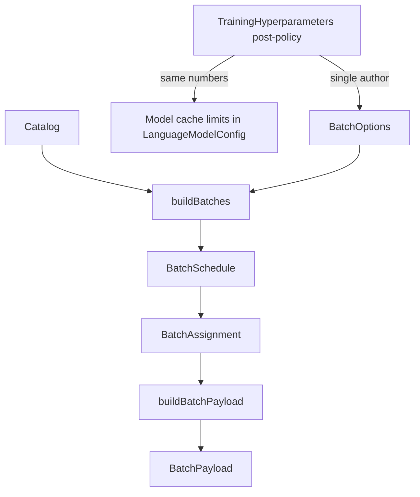

# Linear Startup Capacity Stem

## Verdict On The Current Plan

The current plan has the correct architectural instinct, but it drifted into too many named artifacts and optional files too early. The essential correction is simpler:

- **Post-policy hyperparameters author one capacity artifact: `RunCapacity`.**
- **Batching/payload types remain the runtime truth.** Do not invent a second “geometry” system.
- **`BatchOptions` capacity fields are legacy mirrors during migration only.**
- **Memory and data may validate, but must not silently rewrite capacity.**
- **Phase2, model config, TrainingState, scheduler, and payload builder must all read the same capacity values from `RunCapacity` or mirrors written once from it.**

The revised plan below keeps first-pass implementation small and makes later cleanup explicit.

## Corrected Ownership Model

### Single Authority

`RunCapacity` is the only owner of training capacity after hyperparameter policy has run.

Capacity means:

- effective batch rows
- resolved sequence length cap
- checked padded-token-slot product: `batch_rows * seq_len_cap`
- `LanguageModelConfig.max_cached_batch` mirror value
- `LanguageModelConfig.max_cached_seq_len` mirror value
- `LanguageModelConfig.max_tokens_per_batch` mirror value, if that field is retained
- temporary legacy `BatchOptions.max_batch_size` mirror value
- temporary legacy `BatchOptions.max_tokens_per_batch` mirror value
- overflow policy

### Runtime Truth Stays In Batching/Payload

Existing batching types keep their current conceptual ownership:

- `BatchSchedule` owns the epoch’s scheduled batch list.
- `BatchAssignment` owns per-scheduled-batch membership and scheduler-observed stats.
- `BatchPayload` owns one materialized batch’s actual geometry, padded arrays, masks, valid-token counts, and cache-fit result.

`RunCapacity` is not runtime geometry. It is the run-level bound those runtime artifacts must satisfy.

### Mirrors Are Not Owners

These may temporarily exist but are not authority:

- `LanguageModelConfig.max_cached_batch`
- `LanguageModelConfig.max_cached_seq_len`
- `LanguageModelConfig.max_tokens_per_batch`
- `BatchOptions.max_batch_size`
- `BatchOptions.max_tokens_per_batch`

They must be written exactly once from `RunCapacity` in startup. After `RunCapacity` exists, no code may recompute these values directly from `TrainingHyperparameters`, `StartupConfig`, `LanguageModelConfig`, or local `batch_size * max_seq_len`.

## Cleaned Naming

Use these terms consistently:

- **`RunCapacity`**: artifact name and source of truth.
- **capacity stem**: prose only, meaning “the `RunCapacity` derivation point.”
- **`PackerPolicy`**: long-term scheduler policy type for strategy/order/tunables.
- **Do not use “geometry” as a new owner term.** `BatchAssignment` and `BatchPayload` already own runtime geometry.
- **Avoid `BatchCapacity` unless it becomes a shared-library alias/view of `RunCapacity` for batching code.** If introduced, it must be a read-only view derived from `RunCapacity`, not another owner.

## First-Pass Scope

The first pass should be small enough to land safely.

### 1. Add `RunCapacity`

Create a narrow artifact, likely under `training/Phases/Startup/CapacityStem.{hpp,cu}` or similar.

Suggested fields:

```cpp
enum class OverflowPolicy {
    FailOnAnySequenceOverCap,
};

struct RunCapacity {
    int batch_rows = 0;
    uint32_t seq_len_cap = 0;
    uint64_t padded_token_slots = 0;

    int model_max_cached_batch = 0;
    int model_max_cached_seq_len = 0;
    int model_max_tokens_per_batch = 0;

    uint32_t legacy_batch_options_max_batch_size = 0;
    uint32_t legacy_batch_options_max_tokens_per_batch = 0;

    OverflowPolicy overflow_policy = OverflowPolicy::FailOnAnySequenceOverCap;
};
```

Derive it from post-policy hyperparameters only:

- effective `batch_size`
- resolved `max_seq_len`

Memory snapshot may be passed to validation later, but it must not choose or shrink the values.

### 2. Apply `RunCapacity` To Model Config

During model config assembly, copy `RunCapacity` mirrors into `LanguageModelConfig`.

Remove the uncontrolled block in `initializeModel` that locally declares or derives:

- `actual_batch_size`
- `seq_cap`
- `token_budget`
- `model_config.max_cached_batch`
- `model_config.max_cached_seq_len`
- `model_config.max_tokens_per_batch`

After this change, `initializeModel` may receive already-assembled model config or receive `RunCapacity`, but it must not re-author capacity.

### 3. Temporarily Apply `RunCapacity` To Legacy `BatchOptions`

For the first pass only, it is acceptable to populate legacy fields:

- `BatchOptions.max_batch_size`
- `BatchOptions.max_tokens_per_batch`

But only from `RunCapacity`.

Required migration comments:

- these are legacy mirrors
- not authority
- written once from `RunCapacity`
- slated for removal in the slim `BatchOptions` follow-up

### 4. Route Phase2 And Payload Through `RunCapacity`

Phase2 must stop recomputing capacity from:

- `hp.batch_size`
- `model_cfg.max_seq_len`
- `model_cfg.max_cached_*`
- local `batch_size * max_seq_len`

Instead:

- scheduler capacity comes from `RunCapacity`
- cache-fit args to `buildBatchPayload` come from `RunCapacity`
- validation schedule token budget comes from `RunCapacity`
- any temporary `BatchOptions.max_*` values are asserted equal to `RunCapacity`

### 5. Add Fail-Loud Validation

Add checks where the values cross boundaries:

- `RunCapacity` derivation
- model config mirror application
- `TrainingState` allocation
- Phase2 scheduling
- payload construction

Details are in **Required Fail-Loud Checks** below.

## Later-Pass Scope

These should not block first pass unless trivial.

### Slim `BatchOptions` Into `PackerPolicy`

Long-term, `BatchOptions` should not contain capacity. It should either be renamed or reduced to policy:

- `PackingStrategy`
- `BatchOrdering`
- retained true packer tunables, if intentionally kept:
  - `bucket_step`
  - `similarity_threshold`
  - maybe overflow ordering if overflow remains meaningful

Remove from `BatchOptions`:

- `max_batch_size`
- `max_tokens_per_batch`

Capacity should be passed to `buildBatches` beside policy, e.g. as `const RunCapacity&` or a read-only shared `BatchCapacity` view derived from it.

### Optional Startup Event Files

Only split files when they create a real boundary. Candidate later files:

- `MemorySnapshot.{hpp,cu}`
- `DataInfo.{hpp,cu}`
- `ModelAllocationCheck.{hpp,cu}`
- `ResumeState.{hpp,cu}`
- `TelemetryInitInputs.hpp`
- `SchedulerPreflight.{hpp,cu}`
- `EpochPlan.{hpp,cu}`
- `StartupValidation.{hpp,cu}`

Do not create all of these in the first pass unless needed. The first pass needs `RunCapacity` and validation more than it needs a large file taxonomy.

### Remove Model Config Capacity Mirrors

After Phase2, payload, scheduler, and allocation all consume `RunCapacity`, consider deleting or reducing:

- `LanguageModelConfig.max_cached_batch`
- `LanguageModelConfig.max_cached_seq_len`
- `LanguageModelConfig.max_tokens_per_batch`

That is a later, more invasive pass.

## Clean Startup Order

### First-Pass Required Order

1. **Logging ready**
2. **Load and policy-apply hyperparameters**
3. **Derive `RunCapacity`**
4. **Load tokenizer/data and collect minimal data facts**
5. **Assemble model config from HP + `RunCapacity` + data vocab**
6. **Initialize model / allocate `TrainingState`**
7. **Validate model + allocation mirrors against `RunCapacity`**
8. **Initialize optimizer / resume sidecar**
9. **Initialize telemetry/control from model or `RunCapacity`, without re-deriving budget**
10. **Build scheduler/payload preflight using `RunCapacity`**
11. **Finalize epoch plan / LR schedule if a schedule is needed**
12. **Final startup validation**
13. **Enter epoch loop**

### Later Cleanup Event Order

If file/event cleanup is done later, use:

`LoggingReady → MemorySnapshotReady → HyperparametersReady → RunCapacityReady → DataInfoReady → ModelAllocated → ResumeStateReady → TelemetryReady → SchedulerPreflightReady → EpochPlanReady → StartupValidated → EpochLoop`

The event model is helpful, but first pass should not require every event to become a new file.

## Required Invariants

After `RunCapacity` exists:

- `RunCapacity.batch_rows > 0`
- `RunCapacity.seq_len_cap > 0`
- `RunCapacity.padded_token_slots == batch_rows * seq_len_cap`, computed with checked 64-bit arithmetic
- if retained, `RunCapacity.model_max_cached_batch == RunCapacity.batch_rows`
- if retained, `RunCapacity.model_max_cached_seq_len == RunCapacity.seq_len_cap`
- if retained, `RunCapacity.model_max_tokens_per_batch == RunCapacity.padded_token_slots` after checked narrowing
- if retained during migration, `BatchOptions.max_batch_size == RunCapacity.batch_rows`
- if retained during migration, `BatchOptions.max_tokens_per_batch == RunCapacity.padded_token_slots` after checked narrowing
- `TrainingState.max_cached_batch == RunCapacity.batch_rows`
- `TrainingState.max_cached_seq_len == RunCapacity.seq_len_cap`
- `TrainingState.max_cached_tokens == RunCapacity.padded_token_slots`
- `buildBatchPayload` cache-fit limits are derived from `RunCapacity`, not from local recomputation
- every `BatchAssignment` must fit `RunCapacity` before materialization

If any invariant fails, throw. Do not clamp, min/max, or continue.

## Required Fail-Loud Checks

Every failure message should include:

- which bound failed
- expected/stem value
- observed value
- batch index or sequence id when available
- file/stage context when possible

Required checks:

### `RunCapacity` Derivation

Fail on:

- `batch_rows <= 0`
- `seq_len_cap == 0`
- `batch_rows * seq_len_cap` overflow in 64-bit arithmetic
- product cannot narrow safely to legacy `int` / `uint32_t` fields

### Model Config Mirror Application

Fail if after mirror application:

- `model_config.max_cached_batch != RunCapacity.batch_rows`
- `model_config.max_cached_seq_len != RunCapacity.seq_len_cap`
- retained `model_config.max_tokens_per_batch` differs from checked product

### TrainingState Allocation

Fail if after allocation:

- allocated cached batch differs from `RunCapacity.batch_rows`
- allocated cached seq length differs from `RunCapacity.seq_len_cap`
- allocated token cache differs from `RunCapacity.padded_token_slots`
- logits/target buffers use a smaller silent cap not explicitly documented

### Scheduler / `BatchAssignment`

Fail if scheduler admits:

- `assignment.seq_ids.size() > RunCapacity.batch_rows`
- `assignment.max_seq_len > RunCapacity.seq_len_cap`
- `assignment.total_tokens > RunCapacity.padded_token_slots`
- an `overflow` assignment in production mode

The current `overflow` special batch behavior must be treated as a migration target: either delete it or gate it behind a diagnostics-only mode that cannot silently train.

### `BatchPayload`

Keep and strengthen the existing cache-fit throw. Fail if:

- `payload.batch_size > RunCapacity.batch_rows`
- `payload.max_seq_len > RunCapacity.seq_len_cap`
- `payload.total_tokens > RunCapacity.padded_token_slots`
- `payload.fits_in_cache == false`

### Saturation / Narrowing

Fail on any `UINT32_MAX` saturation that hides the true token count. Prefer `uint64_t` for internal products and only narrow after proof.

### Catch-And-Continue

Capacity and budget failures must not be swallowed. A catch may add context, then rethrow or abort startup/training. It must not continue the epoch.

## Corrected `BatchOptions` Migration Story

Current `BatchOptions` capacity fields are migration-only:

- `max_batch_size`
- `max_tokens_per_batch`

Rules during migration:

- written once from `RunCapacity`
- never written from HP directly
- never recomputed in Phase2
- never treated as authority
- validated equal to `RunCapacity` before scheduler use

Follow-up slim refactor:

- remove capacity fields from `BatchOptions`
- rename or reinterpret remaining type as `PackerPolicy`
- pass capacity beside policy into `buildBatches`

Long-term split:

- `RunCapacity`: capacity bounds
- `PackerPolicy`: strategy/order/tunables
- `BatchSchedule` / `BatchAssignment`: scheduler output
- `BatchPayload`: materialized per-batch runtime truth

## Sections To Delete, Merge, Or Rewrite From The Previous Plan

Delete or heavily compress:

- long lists of every possible grouping struct for first pass
- broad event taxonomy that implies every stage must become a file immediately
- repeated “geometry” framing
- any language implying memory snapshot derives or chooses capacity
- any language implying data info participates in capacity derivation

Keep but rewrite:

- file ownership taxonomy: keep as later-pass cleanup, not first-pass requirement
- startup event order: keep as conceptual order, not mandatory file split
- `BatchOptions` refactor: keep, but make clear it is follow-up after first-pass `RunCapacity`
- fail-loud section: keep concrete checks, tied to `RunCapacity`

## Implementation-Ready First-Pass Summary

The implementation should start by adding `RunCapacity`, writing it once after hyperparameter policy, copying it into legacy mirrors, and forcing Phase2/payload/allocation to consume it. Then add fail-loud validation around every boundary where the values cross into model config, TrainingState, scheduler, or payload.

Do not start by creating every proposed event file. Do not start by deleting all `BatchOptions` capacity fields. Do not start by redesigning `BatchPayload`.

First make capacity single-authored. Then slim the policy types.
---
name: Linear startup and config stem
overview: **The batching/payload layer already owns this information**—`BatchOptions` → `buildBatches` → `BatchSchedule` / `BatchAssignment` → `buildBatchPayload` → `BatchPayload`, plus `Catalog` / sequence views at the corpus end and epoch scheduling in `EpochBatching`. The startup order should be **Logging → Memory snapshot → Hyperparameter constants → Hyperparameter groupings/stem → Data info → Payload builder/scheduler setup → Final validation**. Phase 1 is **hyperparameter initialization (post-policy) as the single author of capacity** (batch rows, seq cap, token-rectangle product) and matching model cache limits; **explicit follow-on: slim `BatchOptions`** so it no longer carries duplicate limits—**only packer policy** (at minimum **strategy** and **batch ordering**; other fields TBD). **Budget / cache contract violations must fail loud.** Intentional tradeoff: monolithic `StartupConfig` / HP until slim views.
todos:
  - id: phase1-linear-startup-doc
    content: "Document linear startup + ownership: HP post-policy **authors** `BatchOptions` (and model `max_cached_*` / `max_tokens_per_batch` in lockstep); batching types **are** the schedule/batch/payload story—no second parallel struct for the same fields"
    status: pending
  - id: phase1-hp-stem-to-batching-types
    content: "Phase 1: one function (or one site in `executePhase1`) that, from `StartupConfig` after `applyTrainingHyperparameterPolicy`, fills `BatchOptions` (at least `max_batch_size`, `max_tokens_per_batch` from the agreed capacity product) and applies the same integers to `LanguageModelConfig` cache fields—remove duplicate locals in `initializeModel`"
    status: pending
  - id: priority-context-carries-options
    content: "Store the frozen training `BatchOptions` (or equivalent) on `TrainingContext` so Phase2 val, `buildEpochBatches`, and `buildPayloadFromAssignment` do not re-derive `batch_size × max_seq_len` from scattered sources"
    status: pending
  - id: phase2-payload-align
    content: "`buildPayloadFromAssignment` and cache-fit args to `buildBatchPayload` use the stem (context-held options or derived from it)—align with `BatchAssignment` / `BatchPayload` as the per-batch source of truth for geometry"
    status: pending
  - id: phase3-gpu-init-align
    content: "`InitTrainingState` / `TrainingOps` match the same capacity numbers already applied to the model config from the stem (no third independent min/max story)"
    status: pending
  - id: later-slim-views
    content: "Optional: narrow pass-by-const / views over `StartupConfig` once the pipeline is stable"
    status: pending
  - id: fail-loud-budget-contract
    content: "Per-layer audit (see plan §Failure semantics, detailed): stem product overflow; InitTrainingState `min`/`max`; scheduler `overflow` vs throw; `UINT32_MAX` saturations; `buildBatchPayload` throw path as template; any catch-and-continue on budget/capacity. Document decisions for unavoidable overflow batches (keep vs make fatal)."
    status: pending
  - id: slim-batch-options
    content: "Refactor `BatchOptions` in [`Batching_GPU.hpp`](resources/models/GRIM-text/Shared/Batching/Batching_GPU.hpp): **drop** `max_tokens_per_batch` and `max_batch_size` from the struct (capacity comes from HP stem + passed alongside `buildBatches` / context). **Long-term struct** should hold **packer policy only**—at minimum `PackingStrategy` and `BatchOrdering`; see plan §Refactor `BatchOptions`. Relocate or delete bucket/similarity/curriculum/RNG if they belong in HP or `EpochBatching` only."
    status: pending
  - id: startup-order-contract
    content: "Adopt and document the initialization order: **Logging → Memory snapshot/capability → Hyperparameter constants → HP groupings/stem → Data info → Payload builder/scheduler → Final validation**. Each stage may only read previous stages and write its owned artifact."
    status: pending
  - id: startup-event-taxonomy
    content: "Define startup as a linear event/artifact pipeline (`LoggingReady`, `MemorySnapshotReady`, `HyperparametersReady`, `CapacityStemReady`, `DataInfoReady`, `ModelAllocated`, `ResumeStateReady`, `TelemetryReady`, `SchedulerPreflightReady`, `EpochPlanReady`, `StartupValidated`). Events are one-way handoffs; only epoch/batch loops are loops."
    status: pending
  - id: model-allocation-gate
    content: "Add an explicit Model config assembly + GPU allocation gate after data info: apply the HP capacity stem to `LanguageModelConfig`, allocate `TrainingState`, and validate allocated cache limits match the stem before optimizer/telemetry."
    status: pending
  - id: resume-state-gate
    content: "Add an explicit checkpoint/optimizer resume gate: restore model/optimizer state from the exact loaded checkpoint sidecar, then emit a `ResumeStateReady` artifact containing optimizer step/global step/best val/epochs completed."
    status: pending
  - id: telemetry-control-gate
    content: "Add telemetry/control gate after model allocation and resume: telemetry uses the HP capacity stem or model fields filled from it; it must not re-derive token budget."
    status: pending
  - id: epoch-plan-finalization
    content: "Add epoch plan finalization gate before entering the epoch loop: build initial schedule/preflight, derive `estimated_total_steps`, `warmup_steps`, and `lr_schedule`, then validate LR schedule exists before any train step."
    status: pending
  - id: startup-final-validator
    content: "Add a final cross-stage validator file/stage that compares logging, memory snapshot, HP constants/stem, data info, model allocation, resume state, telemetry, scheduler/payload preflight, and epoch plan. It writes no config; it only passes or throws."
    status: pending
  - id: logic-groupings-contract
    content: "Define the strict logic-only grouping structs/views: `MemorySnapshot`, `EffectiveHyperparameters`, `RunCapacity`, `DataLoadInputs`, `DataInfo`, `ModelAssemblyInputs`, `PackerPolicy`, `SchedulerInputs`, `PayloadBuildInputs`, `EpochPlanInputs`, `TelemetryInitInputs`, `ResumeState`, and `StartupValidationInputs`. Each grouping is a narrow read-only input/output artifact, not a second owner of config."
    status: pending
  - id: concrete-grouping-definitions
    content: "Add concrete field-level definitions and ownership for each grouping: owner file, build function, exact fields, consumers, and placement in the event chain. These are planning definitions, not implementation yet."
    status: pending
isProject: false
---

# Linear startup: HP stem into existing schedule / batch / payload types

## Correction (what was wrong in earlier drafts)

Earlier drafts implied a **new** abstract "config grouping" or "geometry" struct as the hero object. **That misses what you already have:** the **payload and batching stack** is already the right place for schedule, batch, epoch, and per-batch (sequence) information—captured in concrete types, not a parallel duplicate layer.

- **Corpus / sequence:** [`DynaSeq::Catalog`](resources/models/GRIM-text/Shared/Batching/Batching_GPU.hpp) + `TrainingSequence` views in [`training_data_loader`](resources/models/GRIM-text/training/training_data_loader.hpp).
- **Epoch:** [`buildEpochBatches`](resources/models/GRIM-text/Shared/Batching/EpochBatching.cu) (per-epoch `BatchOptions` + `buildBatches`).
- **Batch (scheduler output):** [`BatchSchedule`](resources/models/GRIM-text/Shared/Batching/Batching_GPU.hpp) = `vector<`[`BatchAssignment`](resources/models/GRIM-text/Shared/Batching/Batching_GPU.hpp)`>`; each assignment carries `seq_ids`, per-batch `max_seq_len`, `total_tokens`, padding stats, overflow, etc.
- **Scheduler input:** [`BatchOptions`](resources/models/GRIM-text/Shared/Batching/Batching_GPU.hpp) — `max_tokens_per_batch`, `max_batch_size`, strategy, bucket, RNG, ordering (core **limits** that must come from the HP stem).
- **Per-batch payload:** [`buildBatchPayload`](resources/models/GRIM-text/Shared/Batching/BatchPayload.hpp) → [`BatchPayload`](resources/models/GRIM-text/Shared/Batching/BatchPayload.hpp) (full geometry, padding, valid_tokens, device upload sizes, `fits_in_cache`, etc.).

**This** is what "it should be": **branch constants from hyperparameters into these structures and their call chain**, not invent a second set of "grouping" types that re-express the same thing.



## What Phase 1 actually builds

**Not** a new mega-struct for "grouping" for its own sake. **Yes:**

1. **After** `validate` → `computeDerivedSchedule` → `applyTrainingHyperparameterPolicy`, treat **one site** (module or `executePhase1` block) as the **only author** of:
   - the **capacity / scheduling inputs** that belong in `BatchOptions` (at minimum `max_batch_size` and `max_tokens_per_batch` = agreed product of effective `batch_size` and training `max_seq_len`, with any overflow check centralized there), and
   - the **mirror** on `LanguageModelConfig` (`max_cached_batch`, `max_cached_seq_len`, `max_tokens_per_batch`) so GPU allocation and `buildBatchPayload` cache-fit use **aligned** numbers.

2. **Persist** the training **capacity/stem** (and, temporarily during migration, legacy `BatchOptions` capacity mirrors if needed) on [`TrainingContext`](resources/models/GRIM-text/training/Phases/Phase1_Startup.hpp) so Phase2 validation, epoch batching, and payload helpers **read** the stem instead of recomputing `ctx.config.hyperparameters.batch_size * model_cfg.max_seq_len` at each callsite.

3. **Remove** ad-hoc locals in `initializeModel` that re-derive the same product—the stem runs **before** or feeds **into** model config assembly, not in the middle of `initializeModel` with new names.

4. **Follow-on:** see **§Refactor `BatchOptions`**—first PR may only **fill** legacy `max_*` on `BatchOptions` from the stem; **deleting** those fields from the struct is the explicit next refactor (`slim-batch-options`).

## Logic-only groupings to pass between stages

The goal is **not** “make one more config object.” The goal is to stop passing giant structs to functions that only need five fields, while also preventing each function from re-deriving those five fields differently.

These groupings are **logic-only artifacts**:

- passed by `const&` or returned by value as immutable stage outputs
- narrow enough that the receiving function cannot reach unrelated config
- never perform IO by themselves
- never own GPU memory, model objects, token buffers, or log files
- never mutate previous-stage artifacts
- may temporarily copy legacy fields into old structs during migration, but the grouping remains the named source for that logic

### Grouping rule

If a function needs:

- **capacity math**, pass `RunCapacity`
- **packing behavior**, pass `PackerPolicy`
- **loaded data facts**, pass `DataInfo`
- **payload construction constants**, pass `PayloadBuildInputs`
- **model construction constants**, pass `ModelAssemblyInputs`
- **telemetry constants**, pass `TelemetryInitInputs`

Do **not** pass `StartupConfig`, `TrainingHyperparameters`, `LanguageModelConfig`, or all of `TrainingContext` merely because it is convenient. The orchestration layer may own the big context; logic functions should receive narrow groupings.

### Proposed strict groupings

| Grouping | Produced by event | Passed to | Contains | Must not contain / do |
|----------|-------------------|-----------|----------|------------------------|
| `LoggingHandles` | `LoggingReady` | stages that emit logs/status | logger reference, session id, status writer, log dir, structured artifact naming helpers | Hyperparameters, model, data, CUDA state |
| `MemorySnapshot` | `MemorySnapshotReady` | capacity validation, final validation, config dump | device id/name, compute capability, total/free memory at startup, CUDA runtime facts | Batch size decisions, silent caps, mutation of HP |
| `EffectiveHyperparameters` | `HyperparametersReady` | capacity stem, model assembly, optimizer/telemetry/epoch planning | post-policy `TrainingHyperparameters` values or const refs, derived schedule info, tokenizer config, generation config | Data facts, model allocation results, payload facts |
| `RunCapacity` / `BatchCapacity` | `CapacityStemReady` | model assembly, `InitTrainingState`, scheduler, payload builder, telemetry control, final validation | effective batch rows, resolved sequence cap, checked padded-token-slot product if retained, overflow policy | Strategy/order/RNG/curriculum; it is capacity only |
| `DataLoadInputs` | `HyperparametersReady` + paths | tokenizer/data loader stage | vocab path, GRMT/data path, tokenizer config, sliding-window/load constraints, min valid token requirement | Batch scheduling policy, model cache fields, telemetry |
| `DataInfo` | `DataInfoReady` | scheduler preflight, model assembly if vocab needed, final validation | actual vocab size, train/val sequence counts, catalogs, views refs or IDs, max observed seq len, length percentiles, GRMT/header facts | Capacity decisions, model cache mutation, batch packing policy |
| `ModelAssemblyInputs` | `CapacityStemReady` + `DataInfoReady` + RNG | model init / allocation | architecture slice, actual vocab size, vocab path, capacity mirrors to apply, init seed, checkpoint paths | Scheduler policy, epoch schedule, payload vectors |
| `ResumeInputs` | `ModelAllocated` | resume stage | loaded checkpoint path, checkpoint dir, model/optimizer refs as needed, sidecar path derivation rule | Independent checkpoint rescans, data/scheduler facts |
| `ResumeState` | `ResumeStateReady` | telemetry, epoch plan, final validation | fresh/resumed flag, checkpoint path, sidecar path, optimizer step, global step, best val, epochs completed, micro-step | Model weights or optimizer tensors themselves |
| `TelemetryInitInputs` | `TelemetryReady` inputs | telemetry lattice/control init | telemetry HP constants, run capacity or model mirror, stream/controller refs, memory snapshot if logged, resume state if reconstructing counters | New capacity math, data scanning, scheduler policy |
| `PackerPolicy` | `SchedulerPreflightReady` inputs | `buildBatches` / `buildEpochBatches` | `PackingStrategy`, `BatchOrdering`, and only explicitly retained packer tunables (`bucket_step`, `similarity_threshold`, maybe overflow ordering) | `max_tokens_per_batch`, `max_batch_size`, model config, HP monolith |
| `EpochSchedulerInputs` / `SchedulerInputs` | per epoch / preflight | `buildEpochBatches`, scheduler preflight | catalog ref, `RunCapacity`, `PackerPolicy`, epoch index, global step, deterministic data seed | Payload arrays, model tensors, optimizer internals |
| `PayloadBuildInputs` | scheduler preflight / Phase2 payload helper | `buildBatchPayload` wrapper | assignment, views ref, actual vocab size, token layout, `RunCapacity`, execution block constants, `mtp_k` | Whole `TrainingContext`, whole model config, scheduler strategy |
| `EpochPlanInputs` | `SchedulerPreflightReady` + resume + HP | epoch plan finalization | total batches, epochs, grad accumulation, warmup fraction, LR constants, resume optimizer step | Model allocation, payload vectors, data loader paths |
| `EpochPlan` | `EpochPlanReady` | Phase2 epoch loop | estimated total optimizer steps, steps per epoch, warmup steps, LR schedule, per-epoch seed rule | Capacity ownership, scheduler policy mutation |
| `StartupValidationInputs` | `StartupValidated` | final validator only | const refs to all ready artifacts | Writes no config; allocates nothing |

### What should be stored on `TrainingContext`

`TrainingContext` can remain the orchestrator-owned bundle, but its role should be **artifact registry**, not a bag of mutable knobs. Good candidates to store:

- `LoggingHandles` / existing `LoggingContext`
- `MemorySnapshot`
- `EffectiveHyperparameters` or the existing `StartupConfig` plus a clear post-policy marker
- `RunCapacity`
- `DataInfo` / existing `SequenceData`
- model pointer and optimizer context
- `ResumeState`
- telemetry context
- `PackerPolicy`
- `EpochPlan`

Bad candidates:

- a long-lived `BatchOptions` containing capacity fields
- duplicated `batch_size`, `max_seq_len`, or token product fields outside `RunCapacity`
- helper-only structs that should be stack-local in one stage

### Function signature direction

The long-term signatures should move in this direction:

```cpp
LanguageModelConfig assembleModelConfig(
    const EffectiveHyperparameters& hp,
    const RunCapacity& capacity,
    const DataInfo& data,
    uint64_t init_seed);

BatchSchedule buildEpochBatches(
    const Catalog& catalog,
    const RunCapacity& capacity,
    const PackerPolicy& policy,
    const EpochSchedulerInputs& epoch);

BatchPayload buildPayload(
    const PayloadBuildInputs& inputs);

EpochPlan buildEpochPlan(
    const EpochPlanInputs& inputs);

void validateStartup(
    const StartupValidationInputs& inputs);
```

These names are illustrative. The important rule is that logic functions receive **the artifact they need**, not `TrainingContext` because it happens to have everything.

## Concrete grouping definitions (field-level planning)

This section pins down what each grouping is **made of**, where it should live, and where it sits in the chain. Names can change in implementation, but responsibilities should not.

### 1) `LoggingHandles`

**Owner file:** existing [`Phase1_Startup.hpp`](resources/models/GRIM-text/training/Phases/Phase1_Startup.hpp) / logging setup, or a future `training/Phases/Startup/LoggingHandles.hpp` if separated.

**Producer:** logging initialization stage (`LoggingReady`).

**Suggested fields:**

```cpp
struct LoggingHandles {
    TrainingLogger* logger = nullptr;                 // non-owning
    TrainingStatusWriter* status_writer = nullptr;    // non-owning
    std::string session_id;
    std::string log_dir;
    std::string training_log_path;
    std::string telemetry_csv_path;
    std::string init_facts_csv_path;
};
```

**Consumers:** all startup stages that log; `TelemetryReady`; `StartupValidation`.

**Rule:** does not contain config, model, data, CUDA, or derived training values.

### 2) `MemorySnapshot`

**Owner file:** new `training/Phases/Startup/MemorySnapshot.{hpp,cu}`.

**Producer:** `captureMemorySnapshot(const LoggingHandles&)`.

**Suggested fields:**

```cpp
struct MemorySnapshot {
    int cuda_device = 0;
    std::string device_name;
    int compute_major = 0;
    int compute_minor = 0;
    size_t gpu_free_bytes = 0;
    size_t gpu_total_bytes = 0;
    size_t host_page_size = 0;      // optional, if useful
    bool cuda_context_created = false;
};
```

**Consumers:** `CapacityStem` validation, `TelemetryInitInputs`, `StartupValidation`, config/memory dump.

**Rule:** memory snapshot is evidence. It never chooses a smaller batch or sequence cap.

### 3) `EffectiveHyperparameters`

**Owner file:** existing [`Shared/HyperParameters/HyperParameters_GPU.hpp`](resources/models/GRIM-text/Shared/HyperParameters/HyperParameters_GPU.hpp) remains the HP root; optionally add `training/Phases/Startup/EffectiveHyperparameters.hpp` only if a view type is useful.

**Producer:** `loadStartupConfig` + `validateTrainingHyperparameters` + `computeDerivedSchedule` + `applyTrainingHyperparameterPolicy`.

**Suggested shape:** prefer a const-view wrapper rather than copying the giant struct:

```cpp
struct EffectiveHyperparameters {
    const StartupConfig* startup = nullptr;  // post-policy only
    const GRIM::Config::TrainingHyperparameters* hp = nullptr;
    const GRIM::HyperParameters::DerivedScheduleInfo* derived = nullptr;
    bool policy_applied = false;
};
```

If copied fields are preferred later, the first copy set should be small:

- `epochs`
- `seed`
- `batch_size`
- `gradient_accumulation_steps`
- `learning_rate`
- cosine/warmup constants
- `architecture.max_seq_len`
- architecture slice needed for model assembly
- tokenizer config pointer/ref

**Consumers:** `RunCapacity`, `ModelAssemblyInputs`, `PackerPolicy`, `EpochPlanInputs`, optimizer init, telemetry init.

**Rule:** downstream code must require `policy_applied=true`; otherwise fail. This prevents using pre-policy `batch_size` accidentally.

### 4) `RunCapacity` / `BatchCapacity`

**Owner file:** new `training/Phases/Startup/CapacityStem.{hpp,cu}`. Optional shared read-only view type may later move to `Shared/Batching/BatchCapacity.hpp` if `buildBatches` needs it without depending on training phase headers.

**Producer:** `deriveRunCapacity(const EffectiveHyperparameters&, const MemorySnapshot&)`.

**Suggested fields:**

```cpp
enum class OverflowPolicy {
    FailOnAnySequenceOverCap,
    DiagnosticsOnlyAllowOverflowAssignment  // only if deliberately retained
};

struct RunCapacity {
    int batch_rows = 0;                 // effective post-policy batch_size
    uint32_t seq_len_cap = 0;           // resolved max_seq_len
    uint64_t padded_token_slots = 0;    // checked batch_rows * seq_len_cap
    int model_max_cached_batch = 0;     // mirror target for LanguageModelConfig
    int model_max_cached_seq_len = 0;   // mirror target for LanguageModelConfig
    int model_max_tokens_per_batch = 0; // only if legacy/model field retained
    OverflowPolicy overflow_policy = OverflowPolicy::FailOnAnySequenceOverCap;
};
```

**Consumers:** model assembly, GPU allocation check, scheduler, payload builder, telemetry control, final validation.

**Rule:** this is the only author of capacity. It must use checked 64-bit multiply before narrowing to legacy `int` / `uint32_t`. It must not contain `PackingStrategy`, `BatchOrdering`, RNG, or curriculum.

### 5) `DataLoadInputs`

**Owner file:** new `training/Phases/Startup/DataInfo.{hpp,cu}` or existing data-loading startup module if extracted later.

**Producer:** `makeDataLoadInputs(const EffectiveHyperparameters&, const LoggingHandles&)`.

**Suggested fields:**

```cpp
struct DataLoadInputs {
    std::string vocab_path;
    std::string grmt_path;
    int max_seq_len = 0;
    int min_seq_valid_tokens = 0;
    int sliding_window_stride = 0;
    bool tokenizer_add_bos = false;
    bool tokenizer_add_eos = false;
};
```

**Consumers:** tokenizer init and data loader.

**Rule:** this is loader input only. It does not carry scheduler policy or model cache output.

### 6) `DataInfo`

**Owner file:** `training/Phases/Startup/DataInfo.{hpp,cu}`.

**Producer:** `collectDataInfo(const SequenceData&, const GRIM::Tokenizer::UniByte&, const DataLoadInputs&)`.

**Suggested fields:**

```cpp
struct DataInfo {
    uint32_t actual_vocab_size = 0;
    size_t train_sequence_count = 0;
    size_t val_sequence_count = 0;
    uint32_t max_observed_seq_len = 0;
    uint32_t p50_seq_len = 0;
    uint32_t p90_seq_len = 0;
    uint32_t p99_seq_len = 0;
    std::string data_path;
    std::string vocab_path;

    // Non-owning references or IDs are acceptable if lifetime is TrainingContext-owned.
    const GRIM::DynaSeq::Catalog* train_catalog = nullptr;
    const GRIM::DynaSeq::Catalog* val_catalog = nullptr;
};
```

**Consumers:** model assembly (vocab size), scheduler preflight, final validation, config dump.

**Rule:** data info reports corpus facts. It must throw if facts violate the declared capacity/data contract; it must not silently adjust capacity.

### 7) `ModelAssemblyInputs`

**Owner file:** `training/Phases/Startup/ModelAssembly.{hpp,cu}` if extracted, otherwise `Phase1_Startup.cu` temporarily.

**Producer:** `makeModelAssemblyInputs(const EffectiveHyperparameters&, const RunCapacity&, const DataInfo&, uint64_t init_seed)`.

**Suggested fields:**

```cpp
struct ModelAssemblyInputs {
    GRIM::HyperParameters::LanguageModelConfig architecture; // copy to mutate/apply mirrors
    uint32_t vocab_size = 0;
    std::string vocab_path;
    uint64_t init_seed = 0;
    RunCapacity capacity;
    std::string checkpoint_dir;
    bool save_test_mode = false;
};
```

**Consumers:** model construction / initialization.

**Rule:** this is the only place that should apply `RunCapacity` onto `LanguageModelConfig`. `initializeModel` should not re-derive cache fields from `StartupConfig`.

### 8) `ModelAllocationState`

**Owner file:** `training/Phases/Startup/ModelAllocationCheck.{hpp,cu}`.

**Producer:** after model initialization and `TrainingState` allocation.

**Suggested fields:**

```cpp
struct ModelAllocationState {
    const GRIM::LanguageModel* model = nullptr; // non-owning
    int config_max_cached_batch = 0;
    int config_max_cached_seq_len = 0;
    int config_max_tokens_per_batch = 0;
    int state_max_cached_batch = 0;
    int state_max_cached_seq_len = 0;
    size_t state_max_cached_tokens = 0;
    size_t state_max_logit_tokens = 0;
};
```

**Consumers:** final validation, telemetry init if needed.

**Rule:** validation-only snapshot. It does not own or mutate model memory.

### 9) `ResumeInputs` and `ResumeState`

**Owner file:** `training/Phases/Startup/ResumeState.{hpp,cu}`.

**Producer:** after model allocation and optimizer init.

**Suggested fields:**

```cpp
struct ResumeInputs {
    std::string loaded_checkpoint_path;
    std::string checkpoint_dir;
};

struct ResumeState {
    bool resumed = false;
    std::string loaded_checkpoint_path;
    std::string optimizer_sidecar_path;
    uint64_t optimizer_step = 0;
    int global_step = 0;
    float best_val_loss = std::numeric_limits<float>::infinity();
    int epochs_completed = 0;
    int micro_step = 0;
};
```

**Consumers:** telemetry reconstruction, epoch plan, final validation.

**Rule:** sidecar path derives from exact loaded checkpoint path. No independent scan.

### 10) `TelemetryInitInputs`

**Owner file:** existing telemetry startup site or new `training/Phases/Startup/TelemetryInitInputs.hpp` if useful.

**Producer:** before telemetry lattice/control initialization.

**Suggested fields:**

```cpp
struct TelemetryInitInputs {
    const GRIM::Config::TrainingHyperparameters* hp = nullptr;
    const RunCapacity* capacity = nullptr;
    const MemorySnapshot* memory = nullptr;
    const ResumeState* resume = nullptr;
    cudaStream_t primary_stream = nullptr;
    std::string telemetry_csv_path;
};
```

**Consumers:** telemetry lattice creation, telemetry CSV logger, telemetry control config.

**Rule:** telemetry consumes capacity and memory facts; it does not compute capacity.

### 11) `PackerPolicy`

**Owner file:** future `Shared/Batching/PackerPolicy.hpp`; during migration this may be a slimmed `BatchOptions`.

**Producer:** scheduler setup from effective HP and epoch/curriculum rules.

**Suggested fields:**

```cpp
struct PackerPolicy {
    GRIM::Batching::PackingStrategy strategy = GRIM::Batching::PackingStrategy::GREEDY;
    GRIM::Batching::BatchOrdering ordering = GRIM::Batching::BatchOrdering::RANDOM;
    uint32_t bucket_step = 0;              // keep only if deliberately configurable
    float similarity_threshold = 0.0f;     // keep only if strategy needs it
    bool interleave_overflow = false;      // remove if overflow becomes fatal
};
```

**Consumers:** `buildBatches` / `buildEpochBatches`.

**Rule:** no capacity. No batch size. No token budget. No model config.

### 12) `EpochSchedulerInputs`

**Owner file:** `Shared/Batching/EpochBatching.hpp` (API type) or `training/Phases/Startup/SchedulerPreflight.hpp` if training-only.

**Producer:** scheduler preflight and per-epoch loop setup.

**Suggested fields:**

```cpp
struct EpochSchedulerInputs {
    const GRIM::DynaSeq::Catalog* catalog = nullptr;
    const RunCapacity* capacity = nullptr;
    const PackerPolicy* policy = nullptr;
    int epoch_index = 0;
    int global_step = 0;
    uint64_t data_seed = 0;
};
```

**Consumers:** `buildEpochBatches`.

**Rule:** scheduler inputs point to catalog/capacity/policy; they do not carry payload vectors or model tensors.

### 13) `PayloadBuildInputs`

**Owner file:** `Shared/Batching/BatchPayload.hpp` can own the final public builder shape once decoupled from training context; a training-side wrapper can live in `training/Phases/Startup/SchedulerPreflight.{hpp,cu}` or Phase2 while migrating.

**Producer:** scheduler preflight / Phase2 payload helper.

**Suggested fields:**

```cpp
struct PayloadBuildInputs {
    const GRIM::Batching::BatchAssignment* assignment = nullptr;
    const std::vector<TrainingSequence*>* views = nullptr;
    uint32_t actual_vocab_size = 0;
    const GRIM::Tokenizer::TokenLayout* token_layout = nullptr;
    const RunCapacity* capacity = nullptr;
    int execution_num_slots = 0;
    int execution_num_ops = 0;
    int execution_num_steps = 0;
    int mtp_k = 0;
};
```

**Consumers:** `buildBatchPayload` wrapper.

**Rule:** this is the payload boundary. It may contain execution constants needed to materialize payload metadata, but not whole model config or whole `TrainingContext`.

### 14) `SchedulerPreflightState`

**Owner file:** `training/Phases/Startup/SchedulerPreflight.{hpp,cu}`.

**Producer:** before final startup validation.

**Suggested fields:**

```cpp
struct SchedulerPreflightState {
    GRIM::Batching::BatchSchedule initial_train_schedule;
    int total_train_batches = 0;
    bool sample_payload_built = false;
    int sample_payload_batch_size = 0;
    int sample_payload_max_seq_len = 0;
    int sample_payload_total_tokens = 0;
};
```

**Consumers:** epoch plan, final validation.

**Rule:** preflight may build one schedule/sample payload to validate the path. It must not become the training loop.

### 15) `EpochPlanInputs` and `EpochPlan`

**Owner file:** `training/Phases/Startup/EpochPlan.{hpp,cu}`.

**Producer:** after scheduler preflight and resume state.

**Suggested fields:**

```cpp
struct EpochPlanInputs {
    int epochs = 0;
    int total_batches = 0;
    int gradient_accumulation_steps = 1;
    float warmup_fraction = 0.0f;
    float base_lr = 0.0f;
    float cosine_decay_min_lr = 0.0f;
    bool cosine_decay_enabled = false;
    bool cosine_warm_restarts = false;
    uint64_t seed = 0;
    uint64_t resumed_optimizer_step = 0;
};

struct EpochPlan {
    int estimated_total_optimizer_steps = 0;
    int steps_per_epoch = 0;
    int warmup_steps = 0;
    GRIM::LR::LRSchedule lr_schedule;
    uint64_t data_seed_base = 0;
};
```

**Consumers:** Phase2 epoch loop, validation, telemetry reconstruction.

**Rule:** this stage derives schedule-dependent training runtime values. It does not rebuild schedule in a hidden loop.

### 16) `StartupValidationInputs`

**Owner file:** `training/Phases/Startup/StartupValidation.{hpp,cu}`.

**Producer:** assembled by Phase1 orchestration immediately before returning `TrainingContext`.

**Suggested fields:**

```cpp
struct StartupValidationInputs {
    const LoggingHandles* logging = nullptr;
    const MemorySnapshot* memory = nullptr;
    const EffectiveHyperparameters* hp = nullptr;
    const RunCapacity* capacity = nullptr;
    const DataInfo* data = nullptr;
    const ModelAllocationState* model_allocation = nullptr;
    const ResumeState* resume = nullptr;
    const TelemetryInitInputs* telemetry = nullptr;
    const SchedulerPreflightState* scheduler = nullptr;
    const EpochPlan* epoch_plan = nullptr;
};
```

**Consumers:** `validateStartup`.

**Rule:** this grouping exists only at the final validation boundary. It writes no config, performs no allocation, and throws on mismatch.

## Concrete chain order with grouping handoffs

| Order | Event | Build function (planned) | Output grouping | Owner file |
|-------|-------|--------------------------|-----------------|------------|
| 1 | `LoggingReady` | existing logging setup / `buildLoggingHandles` | `LoggingHandles` | `Phase1_Startup` or `Startup/LoggingHandles` |
| 2 | `MemorySnapshotReady` | `captureMemorySnapshot(logging)` | `MemorySnapshot` | `Startup/MemorySnapshot` |
| 3 | `HyperparametersReady` | `loadStartupConfig` + validate/derive/apply trio | `EffectiveHyperparameters` | `HyperParameters_GPU.hpp` + Phase1 wrapper |
| 4 | `CapacityStemReady` | `deriveRunCapacity(effective_hp, memory)` | `RunCapacity` | `Startup/CapacityStem` |
| 5 | `DataLoadInputsReady` | `makeDataLoadInputs(effective_hp)` | `DataLoadInputs` | `Startup/DataInfo` |
| 6 | `DataInfoReady` | tokenizer/data load + `collectDataInfo` | `DataInfo` | `Startup/DataInfo` |
| 7 | `ModelAssemblyReady` | `makeModelAssemblyInputs(hp, capacity, data, seed)` | `ModelAssemblyInputs` | `Startup/ModelAssembly` |
| 8 | `ModelAllocated` | `initializeModel` + `validateModelAllocation` | `ModelAllocationState` | `Startup/ModelAllocationCheck` |
| 9 | `ResumeStateReady` | `restoreResumeState(resume_inputs)` | `ResumeState` | `Startup/ResumeState` |
| 10 | `TelemetryReady` | `makeTelemetryInitInputs` + telemetry init | telemetry context + inputs | telemetry startup / `Startup/TelemetryInitInputs` |
| 11 | `PackerPolicyReady` | `derivePackerPolicy(hp, epoch/preflight policy)` | `PackerPolicy` | `Shared/Batching/PackerPolicy` or `Startup/SchedulerPreflight` |
| 12 | `SchedulerPreflightReady` | `buildSchedulerPreflight(scheduler_inputs)` | `SchedulerPreflightState` | `Startup/SchedulerPreflight` |
| 13 | `EpochPlanReady` | `buildEpochPlan(epoch_plan_inputs)` | `EpochPlan` | `Startup/EpochPlan` |
| 14 | `StartupValidated` | `validateStartup(validation_inputs)` | pass/fail only | `Startup/StartupValidation` |
| 15 | `EpochLoop` | `runEpoch(ctx, state, epoch)` | runtime results | `Phase2_TrainingLoop` |

**Important:** only order 15 is a runtime loop. Orders 1-14 are event handoffs. If any of those stages needs to repeat, that is a smell unless the repetition is an explicit validation/preflight pass with no mutation.

## File ownership (revised)

| Layer | Role |
|-------|------|
| [`Batching_GPU.hpp`](resources/models/GRIM-text/Shared/Batching/Batching_GPU.hpp) | **Defines** `BatchOptions`, `BatchSchedule`, `BatchAssignment`—the **shapes** of schedule/batch/epoch inputs and outputs. |
| **Startup (Phase1)** | **Fills** `BatchOptions` from HP + `StartupConfig` once; applies matching limits to `LanguageModelConfig` before/while building the model. **Single author** of those integers. |
| [`EpochBatching.cu`](resources/models/GRIM-text/Shared/Batching/EpochBatching.cu) / [`buildBatches`](resources/models/GRIM-text/Shared/Batching/Batching_GPU.cu) | **Consumes** `BatchOptions` + `Catalog`—no silent re-encode of the capacity product except where epoch-specific policy intentionally adjusts (e.g. curriculum) and that should be explicit. |
| [`BatchPayload.cu`](resources/models/GRIM-text/Shared/Batching/BatchPayload.cu) | **Consumes** `BatchAssignment` + cache ceilings—per-batch **instance** truth. |
| **Model / `InitTrainingState`** | GPU buffers sized from `LanguageModelConfig` fields **set only from the stem**—not a third independent derivation. |

## Target file taxonomy and responsibility boundaries

The refactor should add files only when they create a **stable ownership boundary**. Avoid “misc startup helpers.” Each file should have one noun and one reason to exist.

### Existing files that should keep ownership

| File | Keep / clarify ownership |
|------|--------------------------|
| [`Shared/HyperParameters/HyperParameters_GPU.hpp`](resources/models/GRIM-text/Shared/HyperParameters/HyperParameters_GPU.hpp) | Owns HP structs, HP validation, HP policy, schedule-independent HP derivations. It should not build payloads or inspect loaded data. |
| [`Shared/Batching/Batching_GPU.hpp`](resources/models/GRIM-text/Shared/Batching/Batching_GPU.hpp) | Owns batch scheduler types: `BatchSchedule`, `BatchAssignment`, and eventually slim `BatchOptions`/`PackerPolicy`. It should not own memory capacity. |
| [`Shared/Batching/Batching_GPU.cu`](resources/models/GRIM-text/Shared/Batching/Batching_GPU.cu) | Owns `buildBatches` packing algorithms. It consumes capacity + policy; it does not derive capacity from HP. |
| [`Shared/Batching/EpochBatching.*`](resources/models/GRIM-text/Shared/Batching/EpochBatching.hpp) | Owns per-epoch scheduler policy and schedule construction from catalog + policy + capacity. It may derive epoch RNG/curriculum from explicit inputs. |
| [`Shared/Batching/BatchPayload.*`](resources/models/GRIM-text/Shared/Batching/BatchPayload.hpp) | Owns `BatchAssignment` → concrete `BatchPayload` materialization and cache-fit validation. It does not choose batch membership or mutate capacity. |
| [`training/Phases/Phase1_Startup.*`](resources/models/GRIM-text/training/Phases/Phase1_Startup.hpp) | Orchestrates event order and stores the resulting artifacts on `TrainingContext`. It should become thinner as stage files take ownership. |
| [`training/Phases/Phase2_TrainingLoop.cu`](resources/models/GRIM-text/training/Phases/Phase2_TrainingLoop.cu) | Owns explicit runtime loops: epoch loop, batch loop, optimizer cadence. It should consume already-validated startup artifacts. |

### Proposed new files (only if needed)

| Proposed file | Responsibility boundary | Must not do |
|---------------|--------------------------|-------------|
| `training/Phases/Startup/MemorySnapshot.{hpp,cu}` | Capture `MemorySnapshotReady`: CUDA/device/memory facts for diagnostics and later validation. | Must not change HP, batch size, sequence length, or allocation policy. |
| `training/Phases/Startup/CapacityStem.{hpp,cu}` | Build `CapacityStemReady` from post-policy HP constants: effective batch rows, seq cap, checked token rectangle, model cache mirrors, scheduler capacity. | Must not inspect corpus data, build batches, or allocate model tensors. |
| `training/Phases/Startup/DataInfo.{hpp,cu}` | Build `DataInfoReady`: vocab/corpus/catalog stats, max observed sequence length, split counts, GRMT/header facts. | Must not mutate capacity, scheduler policy, or model config. |
| `training/Phases/Startup/ModelAllocationCheck.{hpp,cu}` | Validate `ModelAllocated` against `CapacityStemReady` and `DataInfoReady` immediately after model init / `TrainingState` allocation. | Must not “fix” mismatches with `min`/`max`; throw with actual vs expected. |
| `training/Phases/Startup/ResumeState.{hpp,cu}` | Normalize checkpoint/optimizer resume facts into a `ResumeStateReady` artifact: exact checkpoint path, sidecar path, optimizer/global step, best val, epochs completed. | Must not independently rescan checkpoints after model load; exact loaded `.bin` owns sidecar matching. |
| `training/Phases/Startup/SchedulerPreflight.{hpp,cu}` | Build `SchedulerPreflightReady`: slim packer policy + capacity + dry-run/first schedule + optional sample payload validation. | Must not become the epoch loop; it is preflight only. |
| `training/Phases/Startup/EpochPlan.{hpp,cu}` | Build `EpochPlanReady`: estimated steps, warmup steps, LR schedule, accumulation-derived counters from scheduler stats. | Must not reload data or rebuild model. |
| `training/Phases/Startup/StartupValidation.{hpp,cu}` | Final cross-stage validator. Reads all artifacts and throws on incoherence. | Must write no config and perform no allocation. |
| `Shared/Batching/PackerPolicy.hpp` | Long-term slim replacement or alias for `BatchOptions`: `PackingStrategy`, `BatchOrdering`, and any explicitly retained packer tunables. | Must not contain `max_tokens_per_batch` or `max_batch_size`. |
| `Shared/Batching/BatchCapacity.hpp` | Optional tiny view passed beside packer policy into `buildBatches`: HP-stem-derived capacity only. | Must not contain strategy/order/RNG/curriculum. |

**Taxonomy rule:** if a proposed file needs both **capacity authoring** and **payload materialization**, it is too broad. Split it. If a file owns both **policy** and **runtime loop**, it is too broad unless the loop is the explicit epoch/batch loop.

## Best initialization order (event/artifact contract)

Startup should be a **linear event/artifact pipeline**. Each stage receives immutable artifacts from earlier stages, writes exactly one owned artifact (or a small group of same-owner artifacts), and emits a named “ready” event. It should not loop, rescan, or revise earlier stages. The only explicit loops should be:

- epoch loop
- batch loop inside an epoch
- micro-batch / gradient accumulation loop if it is explicit in the training step

Everything before the epoch loop should be a directed acyclic flow:

1. **LoggingReady**
2. **MemorySnapshotReady**
3. **HyperparametersReady**
4. **CapacityStemReady**
5. **DataInfoReady**
6. **ModelAllocated**
7. **ResumeStateReady**
8. **TelemetryReady**
9. **SchedulerPreflightReady**
10. **EpochPlanReady**
11. **StartupValidated**
12. Enter explicit **EpochLoop**


### 1) `LoggingReady`

**Writes:** logger, session id, log/status paths, tape/module logging sinks.

**Reads:** CLI/config path only as needed to resolve where logs go. It must not depend on model, data, memory, or payload state.

**Why first:** every later stage can fail. If logging is not established first, failures in config, CUDA/memory probing, data loading, or payload construction become partially observable or duplicated across `std::cout` / module logging.

**Boundary:** logging owns human-readable and structured startup reporting. Other stages may emit through it; they do not create parallel log files unless that file is their explicit artifact (e.g. `init_facts_<session>.csv`).

### 2) `MemorySnapshotReady`

**Writes:** a read-only startup memory/capability snapshot: CUDA device id/name, total/free memory, architecture, selected stream/device capability facts, and any hard device constraints needed for allocation validation.

**Reads:** logging only.

**Why before HP groupings:** capacity-sensitive validation should know hardware facts before deciding whether the requested run can be honored. This does **not** mean shrinking the run to fit memory. It means collect facts early so later validation can say “requested shape cannot fit” with evidence.

**Boundary:** memory snapshot never mutates `batch_size`, `max_seq_len`, scheduler caps, or model cache fields. It is evidence, not policy.

### 3) `HyperparametersReady`

**Writes:** loaded + validated base hyperparameters: `StartupConfig`, `TrainingHyperparameters`, tokenizer config, generation config, architecture slice, derived schedule primitives from the existing trio:

- `validateTrainingHyperparameters`
- `computeDerivedSchedule`
- `applyTrainingHyperparameterPolicy`

**Reads:** logging, CLI/config path, memory snapshot only if validation needs a capability fact. It should not read data or payload state.

**Why before groupings:** this is the only stage that interprets JSON / CLI / stability overrides. After this, downstream code should not rediscover “effective batch size” or “effective max sequence length” by reading multiple unrelated sources.

**Boundary:** this stage owns **constants**. It does not build batches, allocate model caches, or inspect corpus statistics beyond what configuration loading already requires.

### 4) `CapacityStemReady`

**Writes:** the post-policy **capacity + scheduler stem**. This is not a new competing batching structure; it is the single source for capacity integers that will be copied into legacy mirrors during migration and passed to scheduler/payload code long-term.

The artifact should contain, at minimum:

- effective training batch rows
- resolved max sequence length
- checked token-rectangle product if still needed as an API convenience
- model cache limits to apply to `LanguageModelConfig`
- scheduler capacity to pass alongside the slim packer policy
- explicit overflow/fail policy for sequences beyond the cap

**Reads:** `HyperparametersReady` and optionally `MemorySnapshotReady` for validation only.

**Why before data/payload/model allocation:** this stage defines the declared run contract. Data loading, model cache allocation, and payload construction must be measured against it. This is where `initializeModel`’s uncontrolled local derives (`actual_batch_size`, `seq_cap`, `token_budget`) should disappear.

**Boundary:** capacity stem is the **single author** of capacity. It may populate legacy mirrors temporarily (`LanguageModelConfig.max_cached_*`, old `BatchOptions.max_*`) during migration, but those mirrors are copies, not alternate roots.

### 5) `DataInfoReady`

**Writes:** tokenizer and loaded corpus metadata:

- actual vocab size
- train/val sequence counts
- catalog sizes
- max observed sequence length
- min/max/percentile sequence lengths
- GRMT/header facts needed for validation
- train/val split metadata

**Reads:** logging, `HyperparametersReady`, `CapacityStemReady`, tokenizer/path config.

**Why after groupings:** data info should be checked against the declared run contract, not participate in inventing it. If the corpus contains a sequence longer than resolved `max_seq_len` or beyond allocated cache shape, that is a data/config mismatch and must fail (or be rejected during data prep), not create a hidden overflow lane.

**Boundary:** data info is descriptive + validating. It should not adjust batch limits, model cache limits, or scheduler limits.

### 6) `ModelAllocated`

**Writes:** constructed model and allocated `TrainingState` GPU buffers.

**Reads:** `HyperparametersReady`, `CapacityStemReady`, `DataInfoReady`, RNG seed/init artifact, logging.

**Why after data info:** model config needs the actual vocab size and capacity stem before allocation. The allocation should be the first hard proof that model-side memory/caches match the declared stem.

**Must validate immediately:**

- `LanguageModelConfig.max_cached_batch` equals capacity stem batch rows
- `LanguageModelConfig.max_cached_seq_len` equals capacity stem sequence cap
- `LanguageModelConfig.max_tokens_per_batch` equals checked capacity product if retained
- `TrainingState.max_cached_batch`, `max_cached_seq_len`, and cache tensors match model config / stem
- no `min(max_seq_len, max_cached_seq_len)` style silent clamp is masking mismatch

**Boundary:** model allocation consumes stem and data facts. It does not re-author capacity.

### 7) `ResumeStateReady`

**Writes:** checkpoint/resume metadata: loaded checkpoint path, optimizer sidecar path, optimizer step, global step, best validation loss, epochs completed, micro-step, and “fresh vs resumed” status.

**Reads:** `ModelAllocated`, logging, checkpoint paths.

**Why before telemetry and epoch planning:** resume state changes real training counters and optimizer step. LR schedule and telemetry reconstruction must know whether this is a fresh run or a resumed run.

**Boundary:** checkpoint discovery for weights must remain paired to optimizer sidecar by exact loaded `.bin` path. No independent rescans. Failed optimizer sidecar load may fall back to fresh optimizer only if explicitly logged as resume failure; it must not pretend resume succeeded.

### 8) `TelemetryReady`

**Writes:** telemetry lattice, telemetry CSV logger, telemetry control config, and any init-facts telemetry / CSV artifacts.

**Reads:** `LoggingReady`, `CapacityStemReady`, `ModelAllocated`, `ResumeStateReady`, memory snapshot, hyperparameters.

**Why after model allocation and resume:** telemetry control needs real model/cache capacity and may need resumed optimizer step / displacement reconstruction. It should not use its own token budget derivation.

**Boundary:** telemetry observes and controls from declared artifacts. It does not mutate capacity or model config.

### 9) `SchedulerPreflightReady`

**Writes:** scheduler/payload preflight artifact:

- slim packer policy (`PackingStrategy`, `BatchOrdering`, retained true packer tunables)
- capacity argument from `CapacityStemReady`
- a first schedule or dry-run schedule over the train catalog
- optional first/sample `BatchPayload` build to verify cache-fit failure mode and upload geometry

**Reads:** `DataInfoReady`, `CapacityStemReady`, `ModelAllocated`, logging.

**Why before epoch planning:** epoch planning needs `total_batches`; scheduler preflight proves the scheduler can build a coherent schedule from the actual catalog and capacity before LR/warmup depend on its batch count.

**Boundary:** scheduler consumes capacity. It does not own `max_tokens_per_batch` or `max_batch_size` long-term. `BatchOptions` should be slim packer policy; capacity is passed beside it.

### 10) `EpochPlanReady`

**Writes:** epoch-level derived runtime plan:

- initial `BatchSchedule` (or enough schedule stats to derive total batches)
- `estimated_total_steps`
- `warmup_steps`
- deterministic `lr_schedule`
- per-epoch RNG seed rule (`hp.seed + epoch` or explicit equivalent)
- accumulation-derived optimizer step counts

**Reads:** `SchedulerPreflightReady`, `HyperparametersReady`, `ResumeStateReady`.

**Why this is separate:** today LR/warmup cannot be finalized from HP alone because `total_batches` comes from the scheduler. This is the bridge from startup facts into epoch runtime.

**Boundary:** this stage may derive schedule-dependent training counters. It does not rebuild model, reload data, or alter HP capacity.

### 11) `StartupValidated`

**Writes:** no new configuration. It writes pass/fail plus structured validation output.

**Reads everything:** logging, memory snapshot, HP constants, capacity stem, data info, model allocation, resume state, telemetry, scheduler preflight, epoch plan.

**What it compares:**

- logging/session artifacts exist and paths are resolved
- memory snapshot exists and requested allocation contract is plausible
- HP constants passed validation and policy
- capacity stem matches model config mirrors exactly
- data info fits declared sequence/vocab constraints
- scheduler capacity matches model cache capacity
- any retained legacy `BatchOptions.max_*` fields (during migration) equal the stem exactly
- `BatchPayload` fail-loud behavior is wired: over-cache batches throw, not overflow-and-continue
- resume state and LR schedule are coherent (`lr_schedule` exists before first train step; resumed optimizer step is in range)
- telemetry/control config reads the same capacity stem or model mirrors filled from it

**Why last:** only final validation can see whether the assembled system is coherent. Earlier stages validate local facts; this stage validates **cross-stage agreement**.

### 12) Explicit runtime loops only

After `StartupValidated`, control enters explicit loops:

- **Epoch loop:** owns per-epoch schedule rebuild if curriculum/shuffle policy requires it.
- **Batch loop:** owns `BatchAssignment` → `BatchPayload` → train step.
- **Micro/accumulation loop:** if present, owns optimizer-step cadence and grad accumulation counters.

Everything else above should be event/artifact handoff, not hidden loops or repeated scanning.

## Top priority (restated)

**Branching constants from hyperparameters into the batching path and through to `buildBatchPayload`**, with **`BatchPayload` and friends as the structure that already holds schedule/batch/sequence-level facts** at the right layer—not a new parallel "grouping" DTO.

## Refactor `BatchOptions`: capacity fields should not live here (end state)

**Problem:** [`BatchOptions`](resources/models/GRIM-text/Shared/Batching/Batching_GPU.hpp) (lines 80–100) currently mixes (a) **run capacity**—`max_tokens_per_batch`, `max_batch_size`—with (b) **packer / epoch policy**—strategy, bucket, similarity, curriculum, ordering, overflow interleaving, RNG. Items under (a) are **fully determined** by post-policy `TrainingHyperparameters` + resolved `max_seq_len` (and must match `LanguageModelConfig` cache + GPU allocation). Duplicating them on `BatchOptions` is what creates drift and “second caps.”

**Explicit target (phased):**

1. **Remove from `BatchOptions` (must not remain as independent fields long-term):**
   - `max_tokens_per_batch`
   - `max_batch_size`  
   **Replace with:** those values **only** on the **HP stem** (and mirrored to `LanguageModelConfig` + `TrainingContext`), and `buildBatches` receives them as **separate parameters** and/or a tiny **`TrainingRunCapacity` / `BatchCapacity`** view that **only** holds the stem-derived ints—not a second copy in `BatchOptions`. Signature change is an implementation detail; the plan requirement is: **one struct for limits, not `BatchOptions` + HP both owning max batch.**

2. **What should remain on the slim struct (rename to e.g. `PackerPolicy` or keep `BatchOptions` name):** at minimum, **packer behavior** the user already called out:
   - **`PackingStrategy`** (GREEDY vs alternatives—Issue #90 forced GREEDY in [`EpochBatching.cu`](resources/models/GRIM-text/Shared/Batching/EpochBatching.cu) is a *policy decision*, not a capacity knob).
   - **`BatchOrdering`** (and likely **`interleave_overflow`** if it stays meaningful after overflow policy is decided in §Failure semantics).  
   These are **not** derivable from `batch_size` alone; they are **how** the scheduler walks the catalog.

3. **Fields to relocate or own explicitly (not duplicate Informally):**  
   - `bucket_step`, `similarity_threshold` — true **packer tunables**; either stay on the slim policy struct *or* move to `TrainingHyperparameters` / JSON with **one** read site (avoid hardcoding in `EpochBatching` and also on `BatchOptions` defaults).  
   - `prefer_short_first`, `curriculum_progress` — **epoch/curriculum state**, not really “builder options” for every `buildBatches` call; natural home is the **epoch batching** layer (or HP if global).  
   - `rng_seed` — should be **derivable** from `hp.seed` + epoch (and any per-run salt), not a third RNG source of truth.

4. **Order of work:**  
   - **First:** one stem for capacity + wire **current** `buildBatches` / Phase2 to read limits from that stem (can still *temporarily* fill the old `BatchOptions` fields from the stem for a thin PR).  
   - **Then:** delete the redundant fields from `BatchOptions` and change `buildBatches(Catalog, …)` to take **capacity** from the stem struct and **policy** from the slim struct.  
   This matches todo **`slim-batch-options`**.

**Summary sentence:** `BatchOptions` as currently written **should not exist in that shape**; the **long-term** type is **packer policy** (**`PackingStrategy`** and **`BatchOrdering`** at minimum) plus **explicit** relocation of capacity to the HP stem. Everything else is either HP, epoch code, or a single line of derived capacity.

## Out of scope for first implementation pass

- **`BatchPayload` replacement** (unchanged; still in use).
- **Slim `BatchOptions` may land in a second PR** after the stem is wired; first pass may still *populate* legacy fields from the stem to avoid a flag-day. See §Refactor `BatchOptions` and todo `slim-batch-options`.
- Deleting `max_cached_*` from `LanguageModelConfig` (follow-on after stem + slim policy).

## Failure semantics: contracts, not silent “worst case” (detailed)

**Principle (Rule 20):** If the run cannot be executed **without** violating a **stated** bound (token budget, GPU cache rectangle, integer range), the process **must** fail with a **diagnosable** error. No silent clamp, no second-guessing, no continuing training with a “recovered” shape that the user did not configure.

**What is *not* being asked for here:** throw on every sub-max batch (variable-length batches naturally use *less* than the cap—that is normal). The failure target is **contradictory or impossible** states: e.g. a batch or sequence that **requires** more slots than the **allocated** caches or **declared** `BatchOptions` allow.

### 1) Write down the invariants (after the HP stem)

After a single author sets capacity from `batch_size` and `max_seq_len` (post-policy), these should be **intentional equalities**, not three independent knobs:

- **`LanguageModelConfig.max_cached_batch`** == effective training `batch_size` (unless you document a *deliberate* lower cache row count—rare; if so, *document* and still fail if a batch needs more rows).
- **`LanguageModelConfig.max_cached_seq_len`** == training `max_seq_len` (or a **strictly documented** sub-cap; same rule: fail if a batch’s padded width exceeds it).
- **`LanguageModelConfig.max_tokens_per_batch`** == the **product** used for worst-case **rectangle** allocation (with **checked** multiply—see below).
- **`BatchOptions.max_batch_size` / `max_tokens_per_batch`** must be **the same run contract** as above for training (or explicitly **named** if validation uses a different cap—no accidental second formula in Phase2).

**If two of these differ without a one-line, reviewed reason in code comments,** that is a bug vector, not something to `min`/`max` away.

### 2) Stem derivation: fail before silent overflow

- When computing `max_tokens_per_batch` = f(`batch_size`, `max_seq_len`), use **64-bit** arithmetic for the product, then **check** it fits the type (`uint32_t` / `int` as appropriate). If it **overflows** or **exceeds** a hard platform limit, **throw** (e.g. `std::overflow_error` or `std::runtime_error` with both factors and the product bound). **Do not** wrap, saturate to `UINT32_MAX`, or “best effort” continue.

### 3) Per-layer audit (concrete)

| Area | What to look for | Desired outcome |
|------|------------------|-----------------|
| [`InitTrainingState.cu`](resources/models/GRIM-text/training/InitTrainingState.cu) (~247–252) | `min(max_seq_len, max_cached_seq_len)` and similar | If stem guarantees equality, **remove** the `min` as *defense*. If a sequence could *legally* be longer than cache in broken configs, **fail** at catalog/load time or when building the batch—not silent clamp of cache math. |
| [`Phase2_TrainingLoop.cu`](resources/models/GRIM-text/training/Phases/Phase2_TrainingLoop.cu) | Val token budget recomputed from `hp.batch_size * model_cfg.max_seq_len` | Must match stem; if mismatch would occur, that’s a **config bug**—**throw** in debug or fail first batch, not silent alignment. |
| [`Batching_GPU.cu`](resources/models/GRIM-text/Shared/Batching/Batching_GPU.cu) | `seq_len > token_budget` → pushes an **`overflow` `BatchAssignment`** and **continues** (lines ~219–230) | This is the opposite of “fail”: **unbounded** sequences are **admitted** as special single-seq batches. **Decide product policy:** (a) **Data contract:** no sequence in the catalog may exceed `max_seq_len` / packer budget—**violation = throw** at batch build or at data prep; (b) if overflow batches must remain, **log + hard stop in payload** when that batch cannot sit in cache, *or* document that overflow batches are only for diagnostics and are **disallowed** in production. Do not **silently** treat `overflow` as a normal training step without review. |
| [`Batching_GPU.cu`](resources/models/GRIM-text/Shared/Batching/Batching_GPU.cu) | `total_tokens` saturates to `UINT32_MAX` when product exceeds 32 bits (~281–283) | Saturation **hides** true size. Prefer **caught overflow** (fail) or `uint64_t` end-to-end for **bounds checks**, then narrow only when proven safe. |
| [`buildBatchPayload`](resources/models/GRIM-text/Shared/Batching/BatchPayload.cu) (~239–257) | `fits_in_cache` false → `throw` with `BATCH_SIZE` / `SEQ_LEN` | **Good template:** keep this pattern—**fail the step** with **named limit vs actual**. `BatchPayload::validate` also checks `!fits_in_cache`—same contract. |
| Any `catch` around batch build / forward | Swallowing exceptions and continuing the epoch | **Remove** for capacity/budget errors; rethrow or **abort** the run with a clear message. Catching for **logging** then continue is what “silent worst case” means here. |

### 4) “Defensive” `min` / `max` (what to delete vs keep)

- **Delete** when the only purpose is: “`max_seq_len` and `max_cached_seq_len` *might* disagree because two different code paths set them.” The fix is **one stem**, not `min(…)`.
- **Keep** when the expression is a **real domain rule** (e.g. statistical `min`/`max` *inside* the packer for length similarity, or per-batch `max` of sequence lengths in a batch)—that is **not** the same as hiding a **config** mismatch.

### 5) What a failing message must include (minimum)

- **Which bound** (e.g. `max_cached_seq_len`, `max_tokens_per_batch`, `max_batch_size`).
- **Observed** values (batch size, per-batch `max_seq_len`, optional sequence id or batch index if cheap).
- **No generic “FATAL: error”** without numbers.

### 6) Relation to `valid_tokens` / masks

- **Valid / masked token counts** control **loss normalization**, not **whether** a padded slot exists in the tensor. So “we mask padding” does **not** remove the need to **fail** if the **grid** would exceed allocation. Do not conflate the two in error handling.

**Todo:** see `fail-loud-budget-contract` in frontmatter (updated to point at this section).

## Residual symptoms (unchanged)

Duplicate `batch × max_seq` in [`Phase1_Startup.cu`](resources/models/GRIM-text/training/Phases/Phase1_Startup.cu), [`Phase2_TrainingLoop.cu`](resources/models/GRIM-text/training/Phases/Phase2_TrainingLoop.cu), [`InitTrainingState.cu`](resources/models/GRIM-text/training/InitTrainingState.cu), [`EpochBatching.cu`](resources/models/GRIM-text/Shared/Batching/EpochBatching.cu) — fix is **one HP-authored stem** into **model limit fields** and, until §Refactor `BatchOptions` ships, into **`BatchOptions` capacity fields filled only from the stem**; then **remove** those fields from `BatchOptions` so the batching type stops pretending to be a second config root.

## CMake

Unchanged: phase 1 can stay mostly header + Phase1/Phase2 edits; no new compilation unit required unless a dedicated `.cu` is preferred for the stem helper.

## Planning only

This file is planning; implementation is separate.
