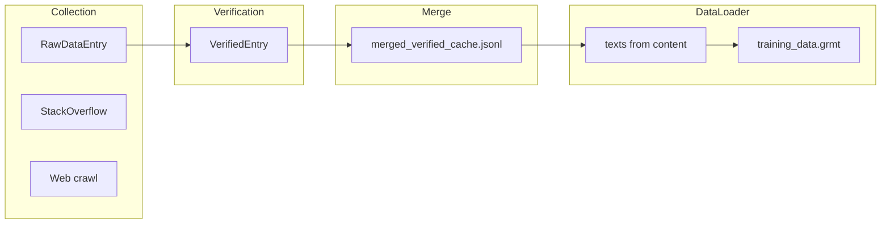

# Q/A and Conversational Training Data Plan

## Current data flow (unchanged)

**Where the merge runs and who creates the cache**

- **merged_verified_cache.jsonl** is produced only by the **merge step**: [DataCollection/grim_data_pipeline.cpp](DataCollection/grim_data_pipeline.cpp) `runMerge()` (writes the cache at ~1278–1314).
- That merge step is triggered by (1) **DataCollection UI**: "Merge Only" / "Force rebuild" → `startMergeOnly()` → `collectionManager->startCollection("merge")` → pipeline runs `runMerge()`; (2) **CLI**: `grim_data_pipeline merge ...` → same `runMerge()`.
- **All Q/A and conversational ingestion must be integrated inside this same merge path** so that when the user runs "Merge Only" from the UI, the resulting **merged_verified_cache.jsonl** already contains web + Q/A in one go. No separate post-merge step for the primary workflow.
- **Cache format**: One JSON object per line; DataLoader uses **only** the `"content"` field ([DataLoader.cu](resources/models/GRIM-text/Shared/DataLoader/DataLoader.cu) ~363–368). Any string we put in `content` becomes one training sequence (tokenized, then written to .grmt). No changes to .grmt format or the training loop are required.
- **Stack Overflow today**: Fetches question title + body only; stores `"Question: " + title + "\n\n" + body` ([web_collector.hpp](DataCollection/web_collector.hpp) ~1349–1352). No answers.
- **TrainingExample** FlatBuffer already has `input_text`, `target_text`, `context`, `prompt` but they are passed as `0` when saving ([web_collector.hpp](DataCollection/web_collector.hpp) ~2072) and the merge pipeline does not read FlatBuffer for building the cache; it uses verified JSONL and checkpoint content.

## Strategy: format in `content`, keep pipeline the same

Teach Q/A and conversation by **adding sequences whose `content` is already formatted** (e.g. `"Q: ...\n\nA: ..."` or `"Human: ...\n\nAssistant: ..."`). The model learns these patterns via standard next-token prediction; no new loss or DataLoader logic is needed.

---

## 1. Standard formats (recommended)

Use two fixed formats so the model sees consistent delimiters:

- **Q/A (single turn)**  
`Q: <question>\n\nA: <answer>`  
Use for single question–answer pairs (e.g. Stack Overflow, FAQ, external Q/A JSONL).
- **Conversational (multi-turn)**  
`Human: <turn1>\n\nAssistant: <turn2>\n\nHuman: <turn3>\n\nAssistant: <turn4>`  
Use for multi-turn chats; same pipeline, one sequence per conversation (or per N turns if you split long threads).

Optional: add a `"format_type": "qa"` or `"conversation"` field in the cache for analytics; DataLoader will ignore it.

---

## 2. Extend Stack Overflow (and Q&A sources) to include answers

**Where**: [DataCollection/web_collector.hpp](DataCollection/web_collector.hpp) — `fetchStackOverflow` (and any similar Q&A fetcher).

**Current**: Builds `content = "Question: " + title + "\n\n" + body` and does not fetch answers.

**Change**:

- When the source is configured as Q&A (e.g. filter or source_type like `stackoverflow` with `has_accepted_answer`), after fetching each question:
  - From the question object, read `accepted_answer_id` (Stack Exchange API returns it when using a filter that includes it, e.g. `filter=withbody` or a custom filter that includes `accepted_answer_id`).
  - If present, call the answers endpoint: `GET /2.3/answers/{ids}?site=stackoverflow&filter=withbody` (and optionally `body_markdown` via filter) to get the accepted answer body.
  - Strip HTML from the answer body (reuse existing `stripHtmlTags`/cleaning or the same pipeline used for question body).
  - Set:
    - `content = "Q: " + title + "\n\n" + question_body + "\n\nA: " + accepted_answer_body`
  - If no accepted answer, either skip the entry or keep current format `"Q: " + title + "\n\n" + question_body` (model still sees question format).

**Details**:

- Rate-limit: one extra request per question that has an accepted answer; consider batching answer IDs (e.g. `/answers/1;2;3`) to reduce calls.
- Reuse existing `extract("body")`-style parsing and HTML cleaning; ensure answer body is truncated or chunked if it exceeds your preprocessor’s `max_length` (e.g. first N chars or one paragraph), to avoid blowing sequence length later.

---

## 3. Optional: populate FlatBuffer Q/A fields for downstream use

**Where**: [DataCollection/web_collector.hpp](DataCollection/web_collector.hpp) — `saveToFlatBuffer` and any path that builds `TrainingExample` from `RawDataEntry`.

**Change**: When an entry is a Q/A pair (e.g. you store `question` and `answer` in `RawDataEntry` or infer from `content`), set:

- `input_text` = question (or prompt)
- `target_text` = answer  
- Optionally `context` if you have passage context

This does **not** change the current merge → cache → DataLoader path (which uses verified `content` only), but it makes FlatBuffer exports consistent with Q/A and allows future tools (e.g. a small script that reads FlatBuffer and writes cache lines) to regenerate `content = "Q: " + input + "\n\nA: " + target`.

---

## 4. External Q/A (and conversational) ingestion into the cache

**Goal**: Allow external JSONL Q/A (or conversation) datasets to be merged into **the same** `merged_verified_cache.jsonl` that the merge step produces when the user clicks "Merge Only" in the DataCollection UI. Ingestion must happen **inside the existing merge step** (`runMerge()`), not as a separate post-merge tool.

**Option A – Merge step in C++**: In [DataCollection/grim_data_pipeline.cpp](DataCollection/grim_data_pipeline.cpp), during `runMerge`, before or after writing `merged_verified_cache.jsonl`:

- Read an optional “Q/A JSONL” path from config or CLI (e.g. `--qa-jsonl path/to/qa.jsonl`).
- Each line: `{"question": "...", "answer": "..."}` or `{"conversation": [{"role": "human", "content": "..."}, {"role": "assistant", "content": "..."}]}`.
- For each line, build:
  - Q/A: `content = "Q: " + question + "\n\nA: " + answer`
  - Conversation: `content = "Human: " + turn1 + "\n\nAssistant: " + turn2 + ...`
- **Append these strings to `cleaned_texts`** (the same list that is later written to the cache), so they are written together with web content in a single pass to `merged_verified_cache.jsonl`. DataLoader then sees them as more `content` lines.

**Optional – Standalone script (secondary)**: A small Python (or C++) script that:

- Reads a JSONL with `question`/`answer` (and optional `context`).
- Writes lines of the form `{"content": "Q: ...\n\nA: ..."}` to a file.
- That file can be passed as “appends” `--qa-jsonl` to the merge step so merge appends into `cleaned_texts`, or used in a custom workflow.

The primary integration point is inside `runMerge()` so the DataCollection UI "Merge Only" workflow produces one cache file that includes web + Q/A in one run. An optional script can produce Q/A JSONL for use as `--qa-jsonl` input to the merge step.

---

## 5. Preprocessor / length and chunking

**Where**: [DataCollection/data_preprocessor.hpp](DataCollection/data_preprocessor.hpp) and merge logic in [grim_data_pipeline.cpp](DataCollection/grim_data_pipeline.cpp).

- Q/A and conversational sequences can be long. Reuse existing `chunkLongText` / `max_token_estimate_chars` so that a single `content` string is split only when necessary; avoid splitting mid-question or mid-answer when possible (e.g. split on `\n\n` so "Q: ..." and "A: ..." stay together until they exceed the max length).
- Optional: for Q/A, prefer one sequence per Q/A pair (no splitting) by truncating answer (or question) to fit `max_token_estimate_chars` instead of splitting, so the model always sees a complete "Q: ... A: ..." in one sequence.

---

## 6. Summary of changes (by component)

| Component                  | Change                                                                                                                                                                                                                                                                                               |
| -------------------------- | ---------------------------------------------------------------------------------------------------------------------------------------------------------------------------------------------------------------------------------------------------------------------------------------------------- |
| **web_collector.hpp**      | In `fetchStackOverflow` (and similar Q&A fetchers): fetch accepted answer via Stack Exchange API; set `content = "Q: " + title + "\n\n" + body + "\n\nA: " + answer_body`. Optionally add `question`/`answer` to `RawDataEntry` and set FlatBuffer `input_text`/`target_text` in `saveToFlatBuffer`. |
| **grim_data_pipeline.cpp** | Inside `runMerge()`: add optional Q/A JSONL input (config or `--qa-jsonl`); for each line build formatted `content` and **append to `cleaned_texts`** before writing `merged_verified_cache.jsonl`, so the UI-created cache includes Q/A in one run.                                                 |
| **DataLoader.cu**          | No change (already uses only `content`).                                                                                                                                                                                                                                                             |
| **New script (optional)**  | Optional: JSONL reader that produces Q/A-formatted lines for use as `--qa-jsonl` input to the merge step.                                                                                                                                                                                            |
| **Preprocessor**           | Prefer chunking that keeps "Q: ... A: ..." together (split on `\n\n`, truncate if needed).                                                                                                                                                                                                           |

---

## 7. Resulting behavior

- **Web scraping**: Continues as today; Q&A sources (e.g. Stack Overflow) additionally produce sequences like `Q: ... A: ...` in the same pipeline.
- **External Q/A**: Optional Q/A JSONL is ingested **inside the existing merge step** (runMerge); when the user runs "Merge Only" from the DataCollection UI, the resulting merged_verified_cache.jsonl contains web + Q/A in one file; they are mixed and tokenized the same way.
- **Conversation**: Same idea with `Human:` / `Assistant:` in `content`.
- **Training**: Unchanged; the model just sees more sequences that follow these patterns and learns to generate answers after "Q:" and assistant turns after "Assistant:".

This keeps your current training data structure (single `content` field → tokenize → .grmt) and adds Q/A and conversational capability by controlling the **shape** of the text in `content` only.