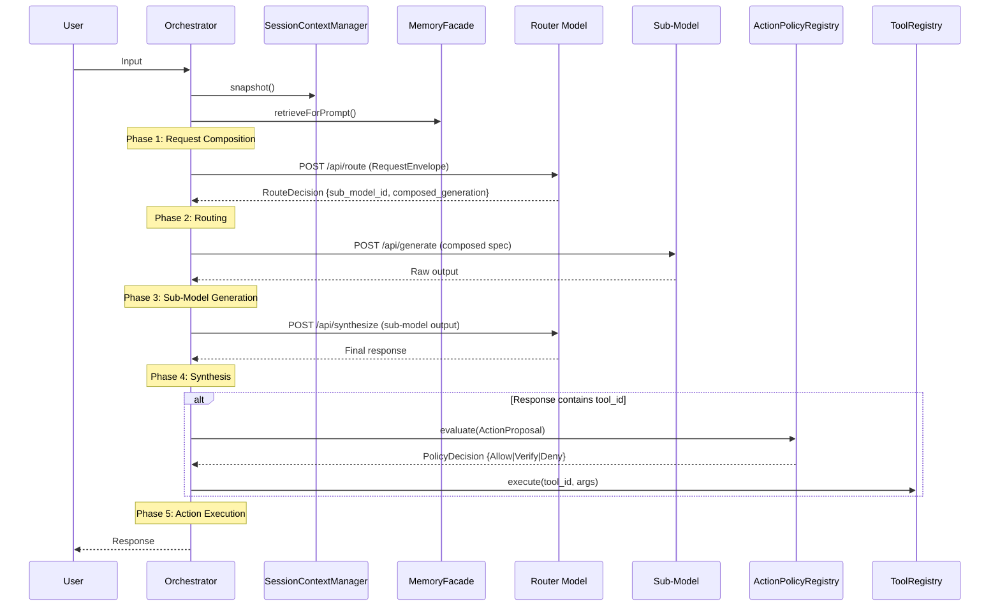

# G.R.I.M — General Request and Information Manager

**A modular, offline-first AI platform built in C++20 with custom CUDA kernels, multi-model orchestration, and a GPU-rendered UI.**

GRIM is a locally-hosted personal AI assistant that owns its entire stack — from a custom transformer model trained from scratch on raw CUDA, to multi-model routing, real-time perception, voice interaction, and a plugin-driven command system. Everything runs on your machine. No cloud. No telemetry. No API keys required for core functionality.

> **Status:** Active development. GRIM-text model training is the current focus. The MMO orchestration layer, all four model backends, resource management, Training Wheels safety gate, and the full UI framework are implemented and operational.

---

## Table of Contents

- [Architecture Overview](#architecture-overview)
- [Multi-Model Orchestration (MMO)](#multi-model-orchestration-mmo)
- [GRIM-text: Custom Transformer](#grim-text-custom-transformer)
- [Current Features](#current-features)
- [Roadmap](#roadmap)
- [Build & Run](#build--run)
- [Project Structure](#project-structure)
- [Dependencies](#dependencies)
- [Contributing](#contributing)
- [License & Contact](#license--contact)

---

## Architecture Overview

GRIM is organized into layered tiers, each with clear ownership boundaries:

```mermaid
graph TB
    subgraph Entry["Application Layer"]
        MAIN["main.cpp — Render loop & lifecycle"]
        BOOT["Bootstrap — Startup orchestration"]
    end

    subgraph MMO_TIER["Multi-Model Orchestration"]
        ORCH["Orchestrator — Pipeline & state"]
        ROUTER["ModelRouter — Route decisions"]
        LOADER["ModelLoader — Lifecycle state machine"]
        BACKENDS["Backends — GrimNative · Ollama · llama.cpp · External"]
    end

    subgraph RESOURCE["Resource Management"]
        HW["HardwareInventory — Immutable boot snapshot"]
        SIG["ResourceSignal — Live utilization sampler"]
        COORD["ResourceCoordinator — Admission control"]
    end

    subgraph AI_TIER["AI & Intent Pipeline"]
        NLP["NLP — Grammar parsing & annotation"]
        GATE["IntentGate — Confidence/risk classification"]
        PLANNER["TaskPlanner — Multi-step decomposition"]
        RL["RL Reward — PPO fine-tuning bridge"]
    end

    subgraph EXEC["Execution Layer"]
        CMD["CommandRegistry — 100+ commands"]
        PLUG["PluginManager — Hot-reload DLLs"]
        TOOL["ToolRegistry — Model-visible tool surface"]
        POLICY["ActionPolicyRegistry — Training Wheels gate"]
    end

    subgraph MEMORY["Memory System"]
        UNIFIED["UnifiedMemoryStorage — Persistent store"]
        ROTATE["MemoryBufferRotation — Hot → Working → Long-term"]
        FACADE["MemoryFacade — Unified retrieval surface"]
    end

    subgraph VOICE_TIER["Voice & Wake"]
        STT["Whisper.cpp — Speech-to-text"]
        TTS["Coqui XTTS — Voice synthesis & cloning"]
        WAKE["Porcupine — Wake word detection"]
    end

    subgraph PERCEPT["Perception & Vision"]
        CAPTURE["Screen Capture — Multi-monitor"]
        OCR["Tesseract — OCR"]
        YOLO["YOLO + OpenCV DNN — Object detection"]
        VISION_AI["Vision AI — Hybrid reasoning"]
    end

    subgraph UI_TIER["UI Framework"]
        UIROOT["UIRoot — Component tree (30+ widgets)"]
        BGFX["BGFX — GPU rendering backend"]
        POPUP["PopupWindow — Overlay animations"]
        THEME["UITheme — Styling system"]
    end

    subgraph TRAINING["Training Infrastructure"]
        GRIMTEXT["GRIM-text Server — Port 11435"]
        TRAIN["train_gpu.exe — Three-phase training"]
        DATA["DataCollection — Scraping & verification"]
        CONTROL["TrainingControlServer — FlatBuffer RPC"]
    end

    MAIN --> BOOT
    BOOT --> HW & SIG & COORD
    BOOT --> ORCH
    ORCH --> ROUTER --> BACKENDS
    ORCH --> LOADER --> COORD
    MAIN --> NLP --> GATE --> PLANNER
    GATE --> ORCH
    ORCH --> TOOL --> CMD & PLUG
    TOOL --> POLICY
    ORCH --> FACADE --> UNIFIED --> ROTATE
    MAIN --> UIROOT --> BGFX
    MAIN --> STT & TTS & WAKE
    MAIN --> CAPTURE --> OCR & YOLO & VISION_AI
    BACKENDS --> GRIMTEXT
    GRIMTEXT --> TRAIN
    DATA --> CONTROL --> TRAIN
```



### Core Design Principles

- **Offline-first** — All core functions (NLP, voice, inference, perception) work without internet. Only browser commands and external API integrations require connectivity.
- **Fail loud** — No silent fallbacks, no swallowed errors. Invalid state crashes immediately with a clear error message and file/line location.
- **Centralized resource ownership** — GPU resources, CUDA streams, cuBLAS handles, and model processes all route through single authorities (TrainingState, ResourceCoordinator, ProcessManager).
- **Safety-first AI** — The Training Wheels verification gate evaluates risk and confidence before executing any model-proposed action. Knowledge gaps lower confidence; they don't bypass safety.

---

## Multi-Model Orchestration (MMO)

The MMO layer is GRIM's model management brain. It routes user requests through a trainable **router model** (GRIM-text with LoRA personalization) to specialized **frozen sub-models**, then synthesizes their outputs into a final response.

### Pipeline



### Backend Types

| Backend | Protocol | Purpose |
|---------|----------|---------|
| **GrimNative** | HTTP → `grim_text_server.exe` | Custom GRIM-text model (router + sub-models) |
| **Ollama** | HTTP → `/api/chat` | Ollama-hosted models |
| **llama.cpp** | HTTP → `/v1/chat/completions` | llama.cpp server models |
| **External** | HTTP → arbitrary endpoint | Third-party model servers (OpenAI-compatible or raw) |

All backends implement the `IGenerationBackend` interface. Bootstrap creates one instance per model entry in `ai_config.json`.

### Resource Management

Resource management is a three-layer system that prevents contention and enables intelligent model residency:

| Layer | Role | Lifecycle |
|-------|------|-----------|
| **HardwareInventory** | Immutable snapshot of CPUs, GPUs (VRAM, driver, CUDA/Metal/ROCm), monitors, audio devices | Captured once at boot, never mutated |
| **ResourceSignal** | Live sampler — polls CPU, RAM, per-GPU utilization every 500ms | Background thread, publishes atomic `ResourceSnapshot` with `PressureState` (Healthy / Pressured / Critical) |
| **ResourceCoordinator** | Admission authority — evaluates `ResourceClaim` requests and returns `Allow / Defer / Throttle / EvictThenAllow / Deny` | All model loads, plugin loads, perception captures, and server startups submit claims here |

### Model Lifecycle

ModelLoader manages a **use-degrading** state machine. Frequently requested models stay resident longer:

```
Unloaded ──[load + claim approved]──→ Loading ──→ Loaded ──→ InUse
                                                      ↑        ↓
                                                      └── Idle (TTL)
                                                            ↓
                                                   EvictEligible (TTL expired)
                                                            ↓
                                                       Unloading ──→ Unloaded
```

Each request served increments a use counter and extends the idle TTL by `use_degrade_step_ms`, capped at `hot_ttl_cap_ms`.

### Training Wheels (ActionPolicyRegistry)

Every model-proposed action passes through the Training Wheels gate before execution:

- **Risk** is computed from tool metadata + proposal context (destructive operations, system commands, etc.)
- **Confidence** is computed from parse certainty, memory match quality, referent resolution, historical success, and router confidence
- **Verdict**: `Allow` (low risk, high confidence), `VerifyRisk` / `VerifyConfidence` / `VerifyBoth` (ask user), or `Deny`

The model can only invoke tools that exist in the **ToolRegistry**. If no matching tool exists, the model emits a **ToolGapProposal** instead of improvising — describing the missing capability for the user to review.

### Session Context

`SessionContextManager` tracks per-session state:

- **TurnRecords** — Full history with NLP summaries, router tags, selected routes, and outcomes
- **ReferentBindings** — Entity resolution (`"it"` → the app you just mentioned), with confidence and TTL
- **PendingInteractions** — Missing slots, clarifications, confirmations, corrections, follow-ups

---

## GRIM-text: Custom Transformer

GRIM-text is a custom autoregressive transformer, written from scratch in CUDA C++ with no framework dependencies (no PyTorch, no TensorFlow). It includes its own autograd system, fused kernels, and a custom tokenizer.

### Model Specifications

| Parameter | Value |
|-----------|-------|
| Hidden dimension (d_model) | 768 |
| Encoder layers | 12 |
| Attention heads (Q) | 12 |
| KV heads (GQA) | 4 (3:1 ratio — 3x KV cache reduction) |
| Head dimension | 64 |
| FFN hidden (d_ff) | 3,072 |
| Max sequence length | 2,048–8,192 |
| Normalization | RMSNorm (pre-norm architecture) |
| Activation | GELU (fused in FFN kernel) |
| Residual scaling | LayerScale (init = 1.0) |
| Positional encoding | ALiBi + RoPE hybrid (inside attention, not residual stream) |
| Weight tying | Embedding ↔ LM head (shared gradient buffer) |

### Flash Attention v2

Memory-efficient O(N) attention with BF16 compute. Auto-activated based on sequence length threshold with cuBLAS tiled-softmax fallback for short sequences. Supports causal masking and GQA head mapping.

The backward kernel includes the `flash_bwd_dot_do_o_kernel` preprocessing step (computes `dsoftmax_sum`) before the main `flash_bwd_dq_dk_dv_loop_kernel` — skipping it produces garbage gradients.

### Grouped Query Attention (GQA)

4 KV heads serve 12 query heads (3 Q heads per KV group). The backward pass applies `gqa_grad_scale = 1.0 / heads_per_kv_group` to dV/dK gradients in the reduction kernel.

W_qkv shape: `[(num_heads + 2 * num_kv_heads) * head_dim, d_model]` = `[1280, 768]`.

### Tokenizer: Unigram + Byte Fallback + Atom Detection

A three-component tokenizer providing 100% UTF-8 coverage:

| Token Range | Component | Purpose |
|-------------|-----------|---------|
| `[0–255]` | **Byte fallback** | Raw UTF-8 bytes — handles any character, emoji, or control code |
| `[256–511]` | **Atom placeholders** | Structural pattern tokens detected by Aho-Corasick |
| `[512+]` | **Unigram vocabulary** | Subword tokens via Viterbi optimal segmentation |

**Atom Detection** uses an Aho-Corasick DFA (O(n) multi-pattern matching) to identify structural patterns in input text:

| Pattern | Examples |
|---------|----------|
| URLs | `http://`, `https://`, `ftp://`, `www.` |
| Emails | `user@domain.com` |
| Numbers | Integers, floats, hex (`0x`), binary (`0b`) |
| File paths | `/path/to/file`, `C:\Users\...` |
| Dates | ISO 8601, US/EU date formats |
| Code literals | Hex sequences, special byte patterns |

### ScratchBlock Reasoning Layer

A structured reasoning layer that operates on atom-annotated input. It processes the embedding stream after atom detection, providing the model with explicit structural signals about numeric values, URLs, paths, and other patterns rather than treating them as opaque token sequences.

### Unified Loss System

All loss computation uses a single fused autograd kernel (`autograd::unified_loss()` in `AutogradLoss.cu`):

$$L = \alpha(1 - p_t)^\gamma \cdot \text{CE}_{\text{smooth}} + \lambda \cdot H(p)$$

- **Focal loss** ($\alpha$, $\gamma$) — down-weights well-classified tokens
- **Label smoothing** — prevents overconfident logits
- **Entropy regularization** ($\lambda$) — encourages exploration in output distribution

The kernel is numerically stable (log-sum-exp) and produces gradients in a single backward pass.

### Three-Phase Training Architecture

Training runs through three sequential phases, orchestrated by `train_gpu.cu` with all state flowing through a `TrainingContext` struct (no globals):

| Phase | File | Responsibilities |
|-------|------|-----------------|
| **Phase 1: Startup** | `Phase1_Startup.cu` | Load config, initialize tokenizer, load training data (.grmt format), allocate GPU buffers, create cuBLAS handle and CUDA streams, initialize AdamW optimizer state, setup TelemetryLattice |
| **Phase 2: Training Loop** | `Phase2_TrainingLoop.cu` | Batch packing (random / similarity-grouped), forward pass (fused QKV → Flash Attention → FFN → RMSNorm), backward pass with per-component gradient clipping (emb / encoder / numeric head), AdamW step with mixed precision, validation, checkpointing |
| **Phase 3: Cleanup** | `Phase3_Cleanup.cu` | Final checkpoint (FlatBuffers + Zstd compression), training summary, resource deallocation |

Training features include gradient accumulation via `GradAccumulationController`, sliding window overlap for long sequences, activation centering (column + row) before weight gradient GEMMs, and TelemetryLattice for hierarchical streaming metrics across 8 levels and 5 metric streams.

### Inference Server

GRIM-text runs as an HTTP server (`grim_text_server.exe`) on port **11435** with an Ollama-compatible API:

| Endpoint | Method | Purpose |
|----------|--------|---------|
| `/api/generate` | POST | Text completion |
| `/api/chat` | POST | Chat completion |
| `/api/tags` | GET | List available models |

The server is managed by `GRIMTextServerManager` in the main GRIM process, which handles auto-start, health checks, and lifecycle.

### Equation-Based Diagnostic Logging

All AI/ML operations use structured diagnostic logging for debugging:

```
[GRAD_A_EQUATION] grad_A = C^T @ B
  INPUT C^T: shape=[768, 512] min=-0.02 max=0.03 rms=0.008
  INPUT B:   shape=[512, 768] min=-0.01 max=0.02 rms=0.006
  ACTUAL grad_A: shape=[768, 768] min=-0.4 max=0.5 rms=0.12
```

This format is non-negotiable for training debugging — you cannot argue with hard mathematical facts.

---

## Current Features

### AI & Language
- Custom GRIM-text transformer (CUDA, no framework dependency)
- Multi-model orchestration with intelligent routing
- Intent classification (IntentGate — Command / Question / Banter / Unknown)
- Multi-step task planning and decomposition
- Reinforcement learning reward model (PPO via Stable-Baselines3)
- NLP grammar parsing with learned patterns and plugin-contributed rules

### Voice & Audio
- **Speech-to-text** — Whisper.cpp (offline, configurable model sizes)
- **Text-to-speech** — Coqui XTTS v2 (voice cloning, speaker switching, prosody control)
- **Wake word** — Porcupine engine (offline, configurable keywords)
- **Four wake stimulus types** — Voice, keyboard hotkey, motion sensor, alarm/timer

### Perception & Vision
- Real-time screen capture (multi-monitor aware, change detection)
- OCR via Tesseract
- Object detection via YOLO + OpenCV DNN
- Vision AI with multi-backend hybrid reasoning (ONNX Runtime GPU for local inference, Ollama LLaVA for vision-language)
- Fast vision interpreter with scene classification templates (CodeEditor, WebBrowser, Terminal, ChatApp, TextDocument)
- CUDA-accelerated inference with automatic CPU fallback

### Memory
- Unified persistent storage (FlatBuffer serialization)
- Three-tier rotation pipeline (hot → working → long-term)
- Memory types: Facts, Events, Commands, Status, Summaries, Learned Commands
- Source classification (user voice/text, system hardware/software, network, internal)
- Atomic writes for corruption-safe persistence

### UI
- Custom GPU-rendered component framework (BGFX backend)
- 30+ widget types (panels, buttons, sliders, graphs, text areas, dropdowns, scroll boxes, toggles, progress bars, layout containers)
- Domain panels: Console, Settings, Training, Data Collection, Model Management (three-tab: Browser/Creator/GapQueue), Vision Viewer
- **UISurfaceRegistry** — Runtime registry for model-mediated UI creation (`ui.create_surface`, `ui.update_surface`)
- **EmotionPresentationController** — Runtime-togglable expression layer (Text/Voice/Avatar channels) with mood-to-presentation mapping
- Popup overlay system with animations
- Theming engine
- Multi-monitor virtual screen support

### Commands & Plugins
- 100+ built-in commands across 20 categories (AI, filesystem, system, voice, UI, perception, OSINT, training, memory, alerts, tasks, timers, feedback, NLP)
- Hot-reloadable DLL plugin system with timestamp monitoring
- Plugin command registration with metadata (description, category, aliases, parameters, usage stats)
- OSINT via Sherlock integration

### Data & Training Infrastructure
- Data collection pipeline with full lifecycle management (200+ training checkpoints accumulated)
- Training control server (FlatBuffer RPC protocol)
- Automated HTML stripping, entity decoding, and whitespace normalization
- Training data in `.grmt` binary format (merged verified cache)
- RL-based command suggestion system (PPO via Stable-Baselines3 bridge with replay buffer)

### Resource Management
- **HardwareInventory** — Immutable boot snapshot (CPUs, GPUs with VRAM/driver/CUDA detection, monitors, audio devices)
- **ResourceSignal** — Live utilization sampler (CPU, RAM, per-GPU metrics at 500ms intervals with adaptive pressure-based polling)
- **ResourceCoordinator** — Admission control with claim/eviction protocol for all model loads, plugin loads, and perception captures
- **ResourceMonitor** — Process-level CPU and GPU usage tracking

### Networking
- WebSocket server for remote control and logging
- HTTP client/server (cpp-httplib) for model communication
- FlatBuffer-based binary protocols for training RPC

---

## Roadmap

| Feature | Status |
|---------|--------|
| MMO fan-out (multiple sub-models per request) | Planned — v1 routes to single sub-model |
| LoRA personalization training pipeline | Planned — config infrastructure in place, training/loading code not yet written |
| GRIM-audio model family | Planned |
| GRIM-voice model family | Scaffolded — directory structure and module layout exist, core TTS generation not yet implemented |
| Cross-session context persistence | Planned — SessionContextManager is in-memory only |
| Tool-gap scaffold/build/load automation | Partial — ToolGapPlanner detects gaps and produces structured proposals, automated creation not yet implemented |
| Device discovery (network scanning) | Planned — EDDloop interface defined, no implementation |

---

## Build & Run

### Prerequisites

- **CMake** 3.20+
- **C++20 compiler** — MSVC (Visual Studio 2022) recommended
- **vcpkg** — dependency manager (vendored at `external/vcpkg/`)
- **CUDA Toolkit 12.5** — optional, for GPU-accelerated Whisper, ONNX Runtime, and GRIM-text training
- **Python 3.12+** — for Coqui TTS, RL, and OSINT bridges

### Build GRIM (main application)

```powershell
# Configure and build with CMake presets (recommended)
cmake --preset=release
cmake --build out/build --config Release

# Or use Ninja for faster builds
cmake --preset=ninja-release
cmake --build out/build-ninja
```

Four presets are available: `debug`, `release`, `ninja-release`, `ninja-multi-release`. All presets configure vcpkg toolchain, CUDA 12.5 paths, and perception support automatically.

### Build GRIM-text (custom model training — separate build)

```powershell
cd resources/models/GRIM-text/training/TrainingLoop

# Build training executable
cmake --build build --config Release --target train_gpu

# Build inference server
cmake --build build --config Release --target grim_text_server

# Build tokenizer self-test (37 tests)
cmake --build build --config Release --target unigrambyte_self_test
```

> **Important:** GRIM-text is a **separate build** from the main GRIM application. It must not include headers from the main GRIM codebase.

### Run Training

```powershell
cd resources/models/GRIM-text/training
.\TrainingLoop\build\Release\train_gpu.exe
```

### Python Bridges

```powershell
pip install -r resources/python/requirements.txt
```

Bridges include: Coqui XTTS (TTS with voice cloning), Mistral via Ollama (intent classification), PPO RL (Stable-Baselines3), and Sherlock (OSINT).

---

## Project Structure

```
G.R.I.M/
├── ai/                     # AI backend, intent gate, task planner, RL reward, server managers
├── bootstrap/              # Startup orchestration, config loading, hardware inventory
├── commands/               # 20 command modules (AI, filesystem, voice, UI, OSINT, training...)
├── control/                # Training control server, data collection client, FlatBuffer RPC
├── core/                   # Platform abstraction: windows, plugins, input, clipboard, audio
├── memory/                 # Unified storage, buffer rotation, memory routing, atomic writers
├── MMO/                    # Multi-Model Orchestration framework
│   ├── Backends/           #   GrimNative, Ollama, LlamaCpp, External backends
│   ├── Core/               #   Orchestrator, ModelLoader, ResourceCoordinator, SessionContext,
│   │                       #   ToolRegistry, ActionPolicy, MemoryFacade, HardwareInventory
│   ├── Router/             #   ModelRouter, RouteDecision parsing
│   ├── Shared/             #   MMD containers, Contracts, request/response validation
│   └── UI/                 #   UISurfaceRegistry, UISurfaceSpec, EmotionPresentation
├── nlp/                    # Grammar parsing, NLP annotation, router metadata, fast classifier
├── perception/             # Screen capture, vision AI, OCR, multi-monitor, hybrid vision
├── vision/                 # Fast vision interpreter, hybrid vision processing
├── plugins/                # Hot-reloadable DLL plugins (osint_plugin, network_test_plugin)
├── voice/                  # TTS caching, voice streaming, Coqui XTTS bridge
├── wake/                   # Wake word (Porcupine), motion detection, alarm, voice activation
├── ui/                     # UI component framework (30+ widgets), BGFX rendering, theme engine
├── popup_ui/               # Overlay popup system with animations
├── helpers/                # Input handling, window/widget abstraction, color utilities
├── net/                    # WebSocket server for remote communication
├── personalize/            # User preference management
├── device_discovery/       # External device enumeration
├── device_setups/          # Audio device configuration
├── hardware/               # Hardware capability detection and profiling
├── DataCollection/         # Data scraping, merging, verification pipeline
├── Reward_Learning/        # RL training infrastructure
├── external_collector/     # External data pipeline integration
│
├── resources/
│   └── models/
│       ├── GRIM-text/      # Custom transformer (training, inference, tokenizer, autograd)
│       │   ├── training/   #   Three-phase training pipeline (Phases/, TrainingLoop/)
│       │   ├── Shared/     #   Autograd (TensorContract), loss, tokenizer (UnigramByte),
│       │   │               #   telemetry, streaming, gradients, checkpointing
│       │   ├── Layers/     #   Flash Attention, Encoding, FFN, RMSNorm
│       │   └── GRIM/       #   Model definition, inference, forward pass architecture
│       ├── llama.cpp/      # Vendored llama.cpp for external LLM support
│       ├── GRIM-voice/     # Voice model (scaffolded — module layout exists, core not yet implemented)
│       ├── GRIM-vision/    # Vision model (active — ONNX + LLaVA hybrid inference via perception/)
│       └── GRIM-audio/     # Audio model (planned)
│
├── external/               # Vendored deps: bgfx, flash-attention, Porcupine, Whisper.cpp, vcpkg
├── cmake/                  # Build system modules (Options, Sources, Config, Dependencies, Resources)
├── docs/                   # 70+ architecture docs, debugging guides, decision records
├── scripts/                # Training and deployment automation
├── data/                   # Training and validation datasets
│
├── ai_config.json          # Centralized configuration (model paths, training params, loss config,
│                           # MMO settings, server URLs, data collection limits)
├── CMakeLists.txt          # Main build definition
├── CMakePresets.json       # 4 build presets (Debug, Release, Ninja, Ninja Multi-Config)
├── vcpkg.json              # 20 managed C++ dependencies
└── main.cpp                # Entry point — bootstrap, render loop, lifecycle control
```

### Key Configuration

| File | Purpose |
|------|---------|
| `ai_config.json` | All model, training, loss, MMO, and data collection configuration |
| `CMakePresets.json` | Build presets with CUDA 12.5 and vcpkg paths |
| `vcpkg.json` | C++ dependency manifest (20 packages) |
| `resources/models/GRIM-text/training/schemas/grim_transformer_model.fbs` | FlatBuffer schema for model serialization |
| `control/training_control.fbs` | FlatBuffer schema for training RPC |
| `control/data_collection_protocol.fbs` | FlatBuffer schema for data ingestion |

---

## Dependencies

### C++ Libraries (vcpkg-managed)

| Category | Library | Purpose |
|----------|---------|---------|
| **Networking** | cpp-httplib | HTTP client/server for model APIs |
| **Networking** | curl, cpr | HTTP requests with SSL |
| **Networking** | uWebSockets | WebSocket server for remote control |
| **Vision** | OpenCV (DNN + contrib) | Image processing, object detection |
| **Vision** | Tesseract + Leptonica | OCR |
| **Vision** | ONNX Runtime GPU | Model inference (vision, TTS) |
| **Audio** | OpenAL Soft | Audio output |
| **Audio** | PortAudio | Audio input/capture |
| **Audio** | FFmpeg | Audio/video codec support |
| **Data** | FlatBuffers | Binary serialization (config, weights, RPC protocols) |
| **Data** | nlohmann-json | JSON parsing |
| **Data** | simdjson | High-performance JSON parsing |
| **Data** | libzip | Archive support |
| **Parsing** | Gumbo | HTML parsing |
| **Parsing** | Poppler | PDF parsing |
| **Tokenization** | SentencePiece | Tokenization (fallback) |

### Vendored (in `external/`)

| Library | Purpose |
|---------|---------|
| **bgfx** (+ bimg, bx) | GPU rendering backend for UI |
| **Whisper.cpp** | Local speech-to-text inference |
| **Porcupine** | Offline wake word detection |
| **flash-attention** | Reference kernels for Flash Attention v2 |
| **vcpkg** | C++ package manager |

### Python Bridges (in `resources/python/`)

| Bridge | Library | Purpose |
|--------|---------|---------|
| `coqui_bridge.py` | Coqui XTTS v2 | Text-to-speech with voice cloning |
| `mistral_bridge.py` | Ollama | Intent classification via local LLM |
| `rl_bridge.py` | Stable-Baselines3 | PPO reinforcement learning |
| `sherlock_sensitive_scanner.py` | Sherlock | OSINT username search and PII detection |

---

## Contributing

Contributions are welcome. A few guidelines:

### Core Principles

- **Offline-first** — All core features must work without internet. Cloud dependencies are only acceptable for features explicitly designed for web interaction.
- **Fail loud (Rule 20)** — No silent fallbacks. No swallowed errors. No backwards-compatibility shims. If something is wrong, crash immediately with a clear error message including file and line. Delete deprecated code instead of marking it.
- **Centralized ownership** — GPU resources, model processes, and system state flow through designated authorities. No ad-hoc allocations.

### Development Guidelines

- Open an issue to discuss larger changes before starting work.
- Follow C++20 style with precompiled headers (`pch.hpp`).
- Hot-reloadable plugins should be self-contained and minimize host dependencies.
- Use local models and inference wherever possible.
- If adding features that require licensed components (models, SDKs, proprietary binaries), document requirements in `docs/` or the relevant module folder.

### GRIM-text Contributions

GRIM-text is a separate build and must not include headers from the main GRIM codebase. Training modifications should target the appropriate phase file (`Phase1_Startup.cu`, `Phase2_TrainingLoop.cu`, `Phase3_Cleanup.cu`), not `train_gpu.cu`. All diagnostic logging must use the `[OPERATION_EQUATION]` format with input shapes, statistics, and expected vs actual values.

---

## License & Contact

No license file is currently included. If you intend to fork or distribute this project, add a license (e.g., MIT, Apache-2.0) as `LICENSE` in the repo root.

For questions, open an issue or create a pull request.
