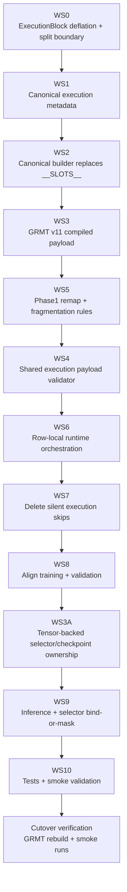
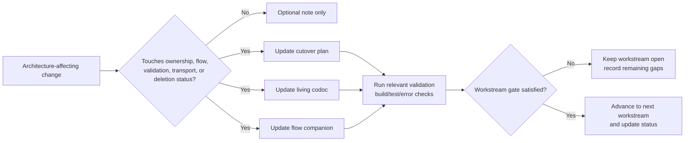
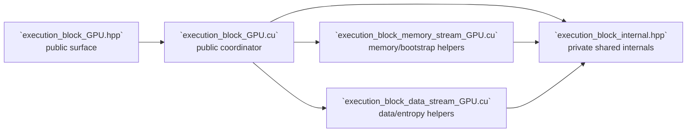

# ExecutionBlock Structured Execution Cutover Flow

> Maintained Mermaid flow companion for `EXECUTION_BLOCK_STRUCTURED_EXECUTION_CUTOVER_PLAN.md`.
>
> Update this file in the **same change** whenever workstream ordering, ownership boundaries, payload transport, validation gates, runtime execution flow, inference selector flow, or deleted legacy paths change.

## Mandatory maintenance rule

This file must reflect the **current enforced cutover flow**. It is not allowed to lag behind reality or preserve deleted legacy branches for nostalgia.

Every qualifying change must:

- update the affected Mermaid diagram(s)
- remove deleted nodes/edges immediately
- adjust labels to reflect current owner modules and gates
- record the diagram delta in `EXECUTION_BLOCK_STRUCTURED_EXECUTION_CUTOVER_PLAN.codoc.md`

## Status legend

- **Current path** = expected live cutover sequencing / enforced runtime path
- **Gate** = validation or completion checkpoint
- **Deleted path** = must be removed from the diagrams once actually deleted in code

## Workstream execution flow



## Same-change maintenance flow



## Structured execution cutover flow

```mermaid
flowchart TD
    subgraph Authoring[Canonical authoring + compilation]
        Record[StructuredExecutionRecord]
        Builder[ConceptExecutionSequenceBuilder]
        Compiled[CompiledStructuredExecutionPayload<br/>execution_active + token_exec_slots<br/>+ compiled_bootstrap_bindings<br/>+ teacher_steps<br/>+ slot_selection_targets]
        Record --> Builder --> Compiled
    end

    subgraph Dataset[Dataset + sequence transport]
        Sequence[TrainingSequence]
        Phase1[Phase1 remap<br/>BOS/EOS + padding +<br/>fragmentation rejection]
        SampleView[TrainingSampleView]
        Batch[BatchPayload]
        Compiled --> Sequence --> Phase1 --> SampleView --> Batch
    end

    subgraph Validation[Shared gate]
        Validator[ExecutionPayloadValidation]
        Batch --> Validator
    end

    subgraph Training[Training / validation runtime]
        LossPath[computeLossBatch]
        TrainPath[autogradTrainingStep]
        ExecBlock[ExecutionBlock row-local runtime]
        Validator --> LossPath
        Validator --> TrainPath
        TrainPath --> ExecBlock
    end

    subgraph Inference[Inference / generation]
        PromptMap[Explicit prompt slot map]
        Policy[DecodeTimeNumPolicy<br/>candidate set + fixed slot_features +<br/>null/ambiguity/bind-or-mask]
        Selector[DecodeTimeSlotSelectorLayer<br/>learned scoring over {NULL} ∪ L]
        Sampler[Sampler<br/>mask or bind <NUM> before sampling]
        PromptMap --> Policy
        Policy --> Selector --> Policy --> Sampler
    end

    Phase1 -. compiled metadata .-> Validator
    ExecBlock -. row-local memory/state .-> Policy
```

## Current artifact status

- **Workstream flow status:** Workstream 0 in progress
- **Maintenance flow status:** Active immediately
- **Structured execution flow status:** Target cutover contract established; initial ExecutionBlock deflation/split work has started

## Workstream 0 implementation note



## Diagram update checklist

When a future change lands, update the affected diagram(s) to reflect:

1. workstream status or ordering changes
2. renamed or split owner modules
3. new or removed payload fields
4. validator entry-point changes
5. runtime execution-routing changes
6. selector ownership or bind-or-mask flow changes
7. deleted fallback or compatibility branches
