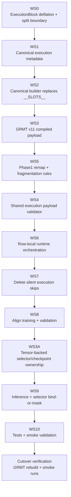
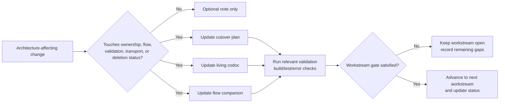
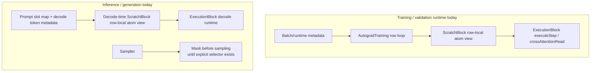
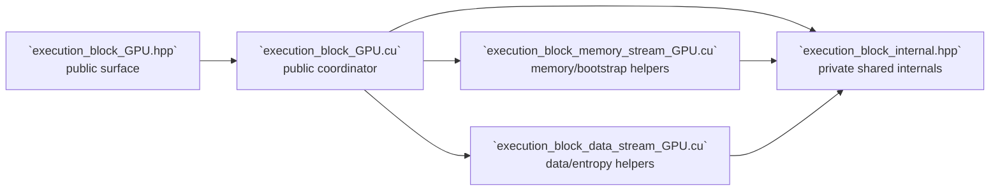
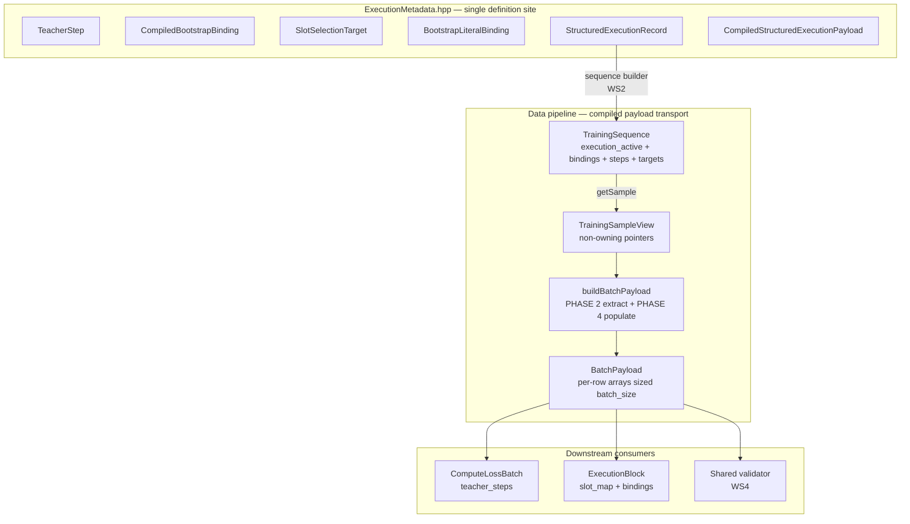

# ExecutionBlock Structured Execution Cutover Flow

> Maintained Mermaid flow companion for `EXECUTION_BLOCK_STRUCTURED_EXECUTION_CUTOVER_PLAN.md`.
>
> Update this file in the **same change** whenever workstream ordering, ownership boundaries, payload transport, validation gates, runtime execution flow, inference selector flow, or deleted legacy paths change.

## Mandatory maintenance rule

This file must reflect the **current enforced cutover flow**. It is not allowed to lag behind reality or preserve deleted legacy branches for nostalgia.

Every qualifying change must:

- update the affected Mermaid diagram(s)
- remove deleted nodes/edges immediately
- adjust labels to reflect current owner modules and gates
- record the diagram delta in `EXECUTION_BLOCK_STRUCTURED_EXECUTION_CUTOVER_PLAN.codoc.md`

## Status legend

- **Current path** = expected live cutover sequencing / enforced runtime path
- **Gate** = validation or completion checkpoint
- **Deleted path** = must be removed from the diagrams once actually deleted in code

## Workstream execution flow



## Same-change maintenance flow



## Current enforced runtime flow



## Current artifact status

- **Workstream flow status:** Workstream 1 complete; Workstream 2 next
- **Maintenance flow status:** Active immediately
- **Structured execution flow status:** Current enforced runtime reflects the locked Workstream 0 boundary with Workstream 1 metadata types canonicalized; compiled execution payload flows through TrainingSequence → TrainingSampleView → BatchPayload; future builder/format/selector workstreams are still pending

## Workstream 0 implementation note



## Current runtime-side Workstream 0 hardening

```mermaid
flowchart TD
    Scratch[ScratchBlock buffers\nbatch-global detect state]
    Extract[extractRowLocalAtomView(...)]
    Train[AutogradTraining row loop]
    Decode[Inference decode step]
    Exec[executeStep(...)]
    Generate[Generation sampler]
    MaskNUM[Mask <NUM>\nuntil explicit selector exists]

    Scratch --> Extract
    Train --> Extract --> Exec
    Decode --> Extract --> Exec
    Generate --> MaskNUM
```

## Workstream 1 — metadata ownership and batch transport



## Diagram update checklist

When a future change lands, update the affected diagram(s) to reflect:

1. workstream status or ordering changes
2. renamed or split owner modules
3. new or removed payload fields
4. validator entry-point changes
5. runtime execution-routing changes
6. selector ownership or bind-or-mask flow changes
7. deleted fallback or compatibility branches
