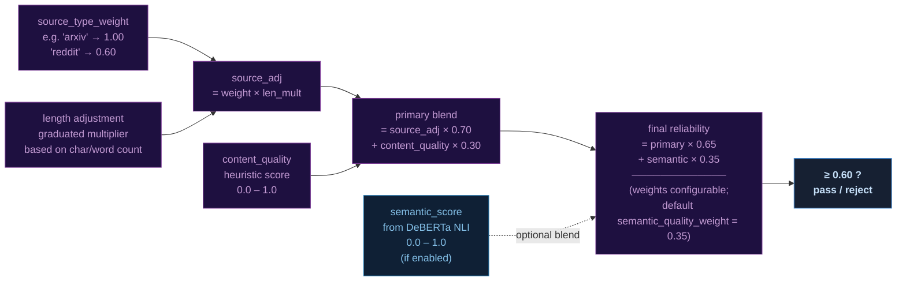

# GRIM Verifier — Pipeline Reference

Each entry passes through **6 sequential gates**, failing fast on the first rejection.
The semantic DeBERTa gate is **off by default** (`enable_semantic_model = false`).
Scoring is always computed for entries that survive the gates; only the semantic
blend step is conditional.

---

## Part A — Main Filter Pipeline

```mermaid
flowchart TD
    %% ═══════════════════════════════════════════════════════
    %% INPUTS
    %% ═══════════════════════════════════════════════════════
    subgraph SRC["📥  Inputs"]
        direction LR
        JSONL[/"input_dir  ✱.jsonl\n────────────────────\ncontent\nsource_url\nsource_type\nauthor\nmetadata"/]
        CFG[/"Config defaults\n────────────────────\nreliability_threshold  0.60\nhigh_quality_threshold  0.80\nmedium_quality_threshold  0.60\nmin_length  75  ·  max_length  75 000\nprogressive_filtering  true\nenable_semantic_model  false"/]
        MODEL[/"DeBERTa ONNX  (optional)\n────────────────────\nmodel.onnx  703 MB\nspm.model   2.3 MB"/]
    end

    SRC --> LOAD["load_unverified_entries()\n─────────────────────────────────────────────\nIterate all *.jsonl in input_dir\nParse each line as JSON object\nDrop records where content is empty"]

    %% ═══════════════════════════════════════════════════════
    %% GATE 1 — DUPLICATE DETECTION
    %% ═══════════════════════════════════════════════════════
    LOAD --> G1{"Gate ①\nDuplicate\nDetection"}
    G1 -- "hash(normalize\n  content[:500])\n  already seen\n  this session" --> R1[/"❌ duplicate_content\n── duplicate_rejected++"/]
    G1 -- "unseen → insert\nhash into set" --> G2

    %% ═══════════════════════════════════════════════════════
    %% GATE 2 — LANGUAGE DETECTION
    %% ═══════════════════════════════════════════════════════
    G2{"Gate ②\nLanguage\nDetection"}
    G2 -- "len ≥ 50 AND\nfewer than 4 of\n15 common EN words\nin first 500 chars" --> R2[/"❌ non_english_content\n── quality_rejected++"/]
    G2 -- "English\nconfirmed\n(or len < 50)" --> G3

    %% ═══════════════════════════════════════════════════════
    %% GATE 3 — PATTERN FILTER
    %% ═══════════════════════════════════════════════════════
    G3{"Gate ③\nLow-Quality\nPatterns"}
    G3 -- "spam phrase\nUI navigation artifact\nchar repeated ≥ 10×\nbad encoding (’ etc)" --> R3[/"❌ low_quality_patterns\n── quality_rejected++"/]
    G3 -- "clean" --> G4

    %% ═══════════════════════════════════════════════════════
    %% GATE 4 — DOMAIN WHITELIST
    %% ═══════════════════════════════════════════════════════
    G4{"Gate ④\nDomain\nWhitelist"}
    G4 -- "source domain\nnot in whitelist\n(only when whitelist\nis configured)" --> R4[/"❌ domain_not_approved\n── domain_rejected++"/]
    G4 -- "approved or\nno whitelist set" --> G5

    %% ═══════════════════════════════════════════════════════
    %% GATE 5 — LENGTH CHECK
    %% ═══════════════════════════════════════════════════════
    G5{"Gate ⑤\nLength\nCheck"}
    G5 -- "len < 75\n(hard limit)" --> R5A[/"❌ too_short\n── quality_rejected++"/]
    G5 -- "len > 75 000 AND\nprogressive_filtering\n= false" --> R5B[/"❌ too_long\n── quality_rejected++"/]
    G5 -- "within bounds,\nor progressive\nmode active" --> G6

    %% ═══════════════════════════════════════════════════════
    %% GATE 6 — SEMANTIC NLI  (OPTIONAL)
    %% ═══════════════════════════════════════════════════════
    G6{"Gate ⑥\nSemantic NLI\n(DeBERTa)"}
    G6 -- "enable_semantic_model\n= false  (default)" --> SCORING
    G6 -- "enable_semantic_model\n= true" --> NLI

    subgraph NLI["  DeBERTa-v3 NLI  (MoritzLaurer/deberta-v3-base-mnli)  "]
        direction TB
        NLI_TOK["SentencePiece encode  (spm.model)\n────────────────────────────────────────────────────────\n[CLS]  content_tokens  [SEP]  prompt_tokens  [SEP]  [PAD]×N\nmax_seq_length = 512  (type_ids: 0 = premise, 1 = hypothesis)"]
        NLI_IN["3 × ONNX input tensors   shape [1 × 512]\n────────────────────────────────────────────────────────\ninput_ids  ·  attention_mask  ·  token_type_ids"]
        NLI_FWD["DeBERTa forward pass  →  logits [3]\nsoftmax  →  probabilities [3]\n────────────────────────────────────────────────────────\n[0] contradiction  ·  [1] neutral  ·  [2] entailment"]

        subgraph PLOOP["Run for each positive prompt (default 2)"]
            PP1["'This passage is factual, high quality, and well-written.'"]
            PP2["'This passage would improve a language model's knowledge and reasoning.'"]
            PAVG["pos_avg = mean(entailment[2])"]
            PP1 & PP2 --> NLI_FWD --> PAVG
        end

        subgraph NLOOP["Run for each negative prompt (default 2)"]
            NP1["'This passage is spam, repetitive, or low effort content.'"]
            NP2["'This passage contains misinformation, hate, or unsafe instructions.'"]
            NAVG["neg_avg = mean(entailment[2])"]
            NP1 & NP2 --> NLI_FWD
            NLI_FWD --> NAVG
        end

        NLI_SCORE["semantic_score  =  pos_avg  ×  (1 − neg_avg)\nclamped to  [0.0,  1.0]"]
        NLI_TOK --> NLI_IN
        PAVG & NAVG --> NLI_SCORE
    end

    NLI --> SEMGAT{"semantic_hard_filter\n= true  AND\nsemantic_score\n< 0.55 ?"}
    SEMGAT -- "yes → drop" --> R6[/"❌ semantic_low_confidence\n── semantic_rejected++\n── quality_rejected++"/]
    SEMGAT -- "no → carry\nsemantic_score\nforward" --> SCORING

    %% ═══════════════════════════════════════════════════════
    %% RELIABILITY SCORING
    %% ═══════════════════════════════════════════════════════
    subgraph SCORING["  Reliability Scoring  "]
        direction TB
        SC_A["① Source-type base weight\n────────────────────────────────────────────\nacademic  ·  arxiv  ·  jstor_oa     →  1.00\nphilosophy  ·  logic  ·  theoretical →  0.95\ntechnical  ·  gutenberg  ·  open_books →  0.90\ngithub  ·  hardware_specs            →  0.85\nwikipedia  ·  speech_corpus          →  0.80\nstackoverflow                        →  0.75\nnews_api  ·  unknown                 →  0.70\nreddit                               →  0.60"]

        SC_B["② Progressive length adjustment\n────────────────────────────────────────────\nlen < min    →  × graduated 0.50–1.00\nlen > max    →  × 0.90\nword cnt < 10  →  × 0.60\nword cnt > 100 →  × 1.05\n────────────────────────────────────────────\nstrict mode (progressive_filtering = false)\nlen < min    →  × 0.70\nlen > max    →  × 0.80"]

        SC_C["③ Content-quality heuristic  (base 0.50, clamped [0, 1])\n────────────────────────────────────────────\n+0.15  sentence density ratio 0.5–1.5  (1 sentence per ~100 chars)\n+0.10  mixed case present\n+0.10  special-char ratio < 5 %\n+0.05  code blocks present  (``` or 4-space indent)\n−0.15  URL count > 5\n−0.20  special-char ratio > 15 %"]

        SC_D["④ Primary blend\n────────────────────────────────────────────\nreliability  =  source_adj × 0.70\n             +  content_quality × 0.30"]

        SC_E["⑤ Semantic blend  (only if enable_semantic_model = true)\n────────────────────────────────────────────\nweight  =  clamp(semantic_quality_weight, 0.05, 0.75)  →  default 0.35\nreliability  =  reliability × (1 − weight)\n             +  semantic_score × weight"]

        SC_A --> SC_B --> SC_D
        SC_C --> SC_D
        SC_D --> SC_E
    end

    %% ═══════════════════════════════════════════════════════
    %% FINAL THRESHOLD & TIER
    %% ═══════════════════════════════════════════════════════
    SCORING --> THRESH{"reliability_score\n≥ reliability_threshold\n(default 0.60) ?"}
    THRESH -- "no" --> R7[/"❌ low_reliability_score\n── failed_verification++"/]
    R7 -. "save_rejected\n= true" .-> REJF[("rejected/rejected_*.jsonl\n──────────────────────────\ncontent[:500]  source_url\nsource_type  reliability_score")]

    THRESH -- "yes\npassed_verification++" --> TIER{"Quality\nTier"}
    TIER -- "score ≥ 0.80" --> TH["⭐ HIGH\nhigh_quality_count++"]
    TIER -- "0.60 – 0.79" --> TM["🟡 MEDIUM\nmedium_quality_count++"]
    TIER -- "< 0.60 AND\n≥ threshold\n(threshold < 0.60)" --> TL["🟠 LOW\nlow_quality_count++"]

    TH & TM & TL --> VFILE[("verified_YYYYMMDD_HHMMSS.jsonl\n────────────────────────────────────────\ncontent  ·  source_url  ·  source_type\nauthor  ·  metadata\nreliability_score  ·  verification_time")]

    %% ═══════════════════════════════════════════════════════
    %% STATS OUTPUT
    %% ═══════════════════════════════════════════════════════
    R1 & R2 & R3 & R4 & R5A & R5B & R6 & R7 & TH & TM & TL --> WSTATS["writeSummaryToLog()"]

    subgraph SOUT["📤  Stats Outputs  (written after every run)"]
        WSTATS
        SL[("logs/verification_stats.log\nhuman-readable, append mode")]
        SB[("verification_stats.bin\nFlatBuffer binary → UI DataHub panel")]
        SJ[("verification_stats.json\nJSON sidecar → UI backward compat")]
        WSTATS --> SL & SB & SJ
    end

    %% ═══════════════════════════════════════════════════════
    %% STYLES
    %% ═══════════════════════════════════════════════════════
    classDef gate    fill:#162032,stroke:#4a90d9,color:#c5dff8,font-weight:bold
    classDef reject  fill:#3a1010,stroke:#e74c3c,color:#f5b7b1,font-style:italic
    classDef accept  fill:#0b2e1a,stroke:#27ae60,color:#a9dfbf,font-weight:bold
    classDef nlinode fill:#0f2035,stroke:#2980b9,color:#85c1e9
    classDef scoring fill:#1e1040,stroke:#7d3c98,color:#c39bd3
    classDef iofile  fill:#1c1c1c,stroke:#717d7e,color:#d5d8dc

    class G1,G2,G3,G4,G5,G6,SEMGAT,THRESH,TIER gate
    class R1,R2,R3,R4,R5A,R5B,R6,R7 reject
    class TH,TM,TL,VFILE accept
    class NLI_TOK,NLI_IN,NLI_FWD,PAVG,NAVG,NLI_SCORE,PP1,PP2,NP1,NP2 nlinode
    class SC_A,SC_B,SC_C,SC_D,SC_E scoring
    class JSONL,CFG,MODEL,REJF,SL,SB,SJ iofile
```

---

## Part B — Score Composition at a Glance

The final `reliability_score` is always a blend of two signals.
A third signal (semantic) is mixed in only when the DeBERTa gate is enabled.

---

## Legend

| Color | Meaning |
|---|---|
| 🔵 Blue border nodes | Decision gates — fail fast, entry advances only on the right branch |
| 🔴 Red nodes | Rejection terminals — stat counter incremented, entry dropped |
| 🟢 Green nodes | Acceptance paths and output files |
| 🟣 Purple nodes | Scoring internals |
| ⚫ Dark blue nodes | DeBERTa NLI internals (optional path) |
| ⬜ Dark grey nodes | File I/O |
| `-.->` dashed arrow | Conditional / optional connection |

---

## Rejection Reasons Reference

| Reason | Gate | Stat counter | What triggers it |
|---|---|---|---|
| `duplicate_content` | ① | `duplicate_rejected` | Content hash matches any prior entry in the current session |
| `non_english_content` | ② | `quality_rejected` | Fewer than 4 of 15 common English words appear in the first 500 chars (skipped if content < 50 chars) |
| `low_quality_patterns` | ③ | `quality_rejected` | Spam phrases, UI navigation text, a character repeated ≥10 times in a row, or known bad-encoding sequences |
| `domain_not_approved` | ④ | `domain_rejected` | Source URL domain is not in `domain_whitelist` — inactive when the whitelist is empty |
| `too_short` | ⑤ | `quality_rejected` | `content.length() < min_length` (default 75) — hard limit in all modes |
| `too_long` | ⑤ | `quality_rejected` | `content.length() > max_length` (default 75 000) — only in strict mode; progressive mode passes with a small score penalty |
| `semantic_low_confidence` | ⑥ | `semantic_rejected` + `quality_rejected` | DeBERTa NLI score < `semantic_min_score` (0.55) when `semantic_hard_filter = true` |
| `low_reliability_score` | Final | `failed_verification` | Blended reliability score below `reliability_threshold` (0.60) |

---

## Quality Tier Thresholds

| Tier | Condition | Default range |
|---|---|---|
| ⭐ HIGH | `score ≥ high_quality_threshold` | ≥ 0.80 |
| 🟡 MEDIUM | `score ≥ medium_quality_threshold` | 0.60 – 0.79 |
| 🟠 LOW | `score ≥ reliability_threshold` (and below medium) | only reachable when threshold < 0.60 |

> With default settings (`reliability_threshold = medium_quality_threshold = 0.60`),
> the LOW tier is never populated — every passing entry is at least MEDIUM.
> LOW becomes active if you lower `reliability_threshold` below 0.60.
