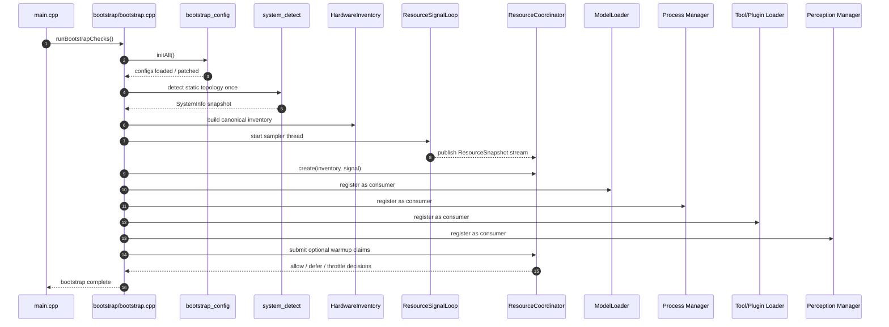
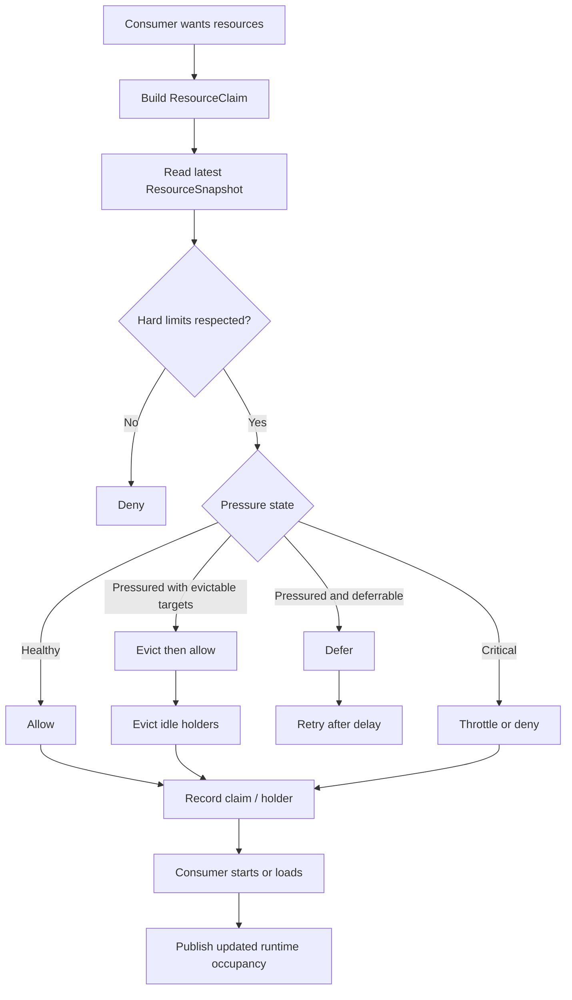
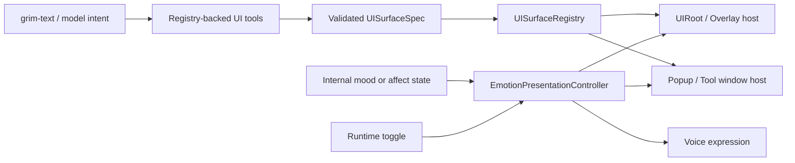
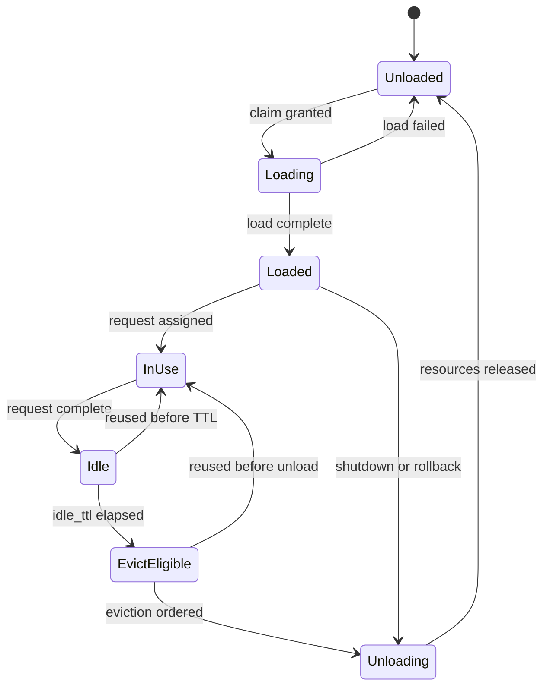
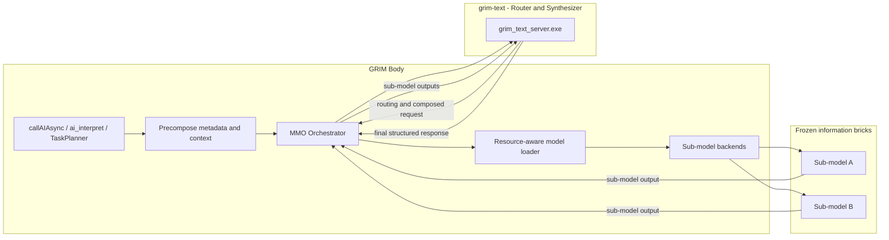
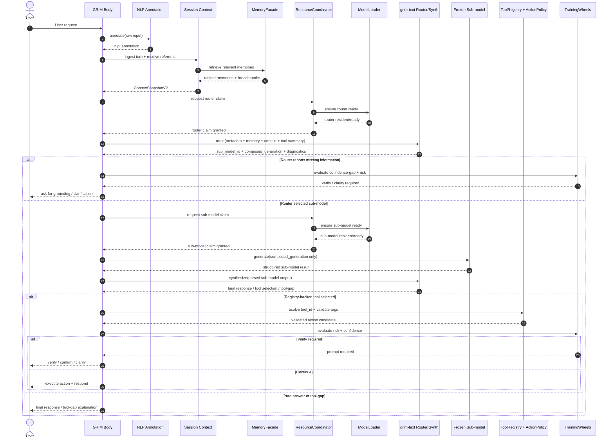
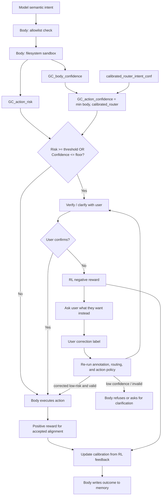

# Multi-Model Orchestration (MMO) Plan

> Living refactor companion: [`multimodelorchestrationintegration.codoc.md`](multimodelorchestrationintegration.codoc.md)
>
> When MMO-related systems are refactored, split, renamed, replaced, or deleted, update the companion doc in the same change so ownership boundaries and hook points stay explicit.

## Invariants (non-negotiable)

- **Base model weights are never modified.** No code ever touches the model’s internal (base) weights. All user- and environment-specific adaptation is done **only** via a **LoRA file**.
- **LoRA is the personalization bridge.** The LoRA file is trained/updated using GRIM’s **memory** and **RL weighting** system. It is the single bridge of personalization between GRIM and the user. Inference always runs base model + LoRA; training/update of the LoRA happens in a separate pipeline (e.g. train_gpu or a dedicated LoRA trainer) that writes the LoRA file; the runtime only loads it.
- **Sub-models receive only the generation.** Subject-based sub-models do not receive raw user input or full context. They receive only a **structured composed_generation** prompt (strict template below). **grim-text as router** is responsible for embedding enough constraints into that prompt so sub-models cannot go off the rails (no invented assumptions, required grounding, parseable output). Without a strict contract, sub-models would invent assumptions grim-text didn’t intend, omit citations/grounding, and return output that’s hard to synthesize reliably.
- **Sub-models are frozen information bricks.** Sub-models are **not** personalized; they have no LoRA and are not updated from user interaction. grim-text **pulls from** them as fixed knowledge/skill sources. Only grim-text (router) adapts via LoRA; sub-models are read-only, subject-specific bricks.
- **Sub-model output feeds back into grim-text for the final response.** The user-facing output is **not** the raw sub-model response. The body invokes sub-model(s), then passes their output(s) **back into grim-text**. grim-text synthesizes a **structured response** (e.g. unified format, confidence, intent) from these bricks. So on the “end side”: sub-models → feedback into grim-text → grim-text produces the final structured response to the body/user.
- **The model never writes to memory.** grim-text (and sub-models) are read-only consumers of memory context. All memory writes (short-term store, long-term sync, LoRA training data) are performed by the **body** (GRIM). The model receives precomposed memory context; it does not modify, create, or delete memory entries.
- **Actions hook into commands and plugins; no action JSON.** The model **never** outputs a freeform command string or "run this". The body’s **commands and plugin system** is the hook for the model’s semantic actions: grim-text may emit either a **registry-backed tool selection** (canonical `tool_id` + validated args/references) or a structured **tool-gap proposal**. The body resolves a selected tool through the body-owned **ToolRegistry**, validates availability / allowlist / sandbox / ActionPolicy / Training Wheels, then **invokes** via the existing command/plugin system. No separate action JSON — **registry-backed commands and plugins are the action interface**.

---

## Hardening decisions for v1

- **MMO v1 routes to exactly one sub-model per request.** Fan-out to multiple frozen bricks is explicitly out of scope until contracts, telemetry, and loader behavior are stable.
- **When MMO is enabled, in-scope text requests must go through the orchestrator or fail closed.** No per-request fallback to `resolveBackendURL()`, direct `/api/chat`, or the current `ai_interpret()` execution path. Cutover may use `mmo.mode = "shadow" | "enforced"`, but enforced mode is single-path.
- **Every request is versioned and correlated.** Route, sub-model, and synthesize payloads carry `schema_version`, `request_id`, `session_id`, and `turn_id`. The body rejects payloads missing or mismatching these fields.
- **Invalid contracts fail closed.** Unknown `sub_model_id`, malformed `composed_generation`, invalid output schema, or synthesize schema mismatch returns a structured MMO error to the body. The body does not silently retry on a different model.
- **Session state is body-owned, not process-global.** The MMO path must not use a global shared conversation vector like `g_conversationHistory`; history is keyed by session/request context.
- **Context state is unified and session-scoped.** Pending intent, pending clarification, pending confirmation, correction capture, active referents, and recent tool results must live under one session context authority. They must not remain fragmented across `ContextManager`, `commands_feedback.cpp`, and ad-hoc command handlers.
- **Context payload must distinguish visual sources.** The body-side context payload should explicitly carry both **physical visual semantic input** (real-world/camera/environment interpretation when available) and **digital visual input** (screen/monitor/window/OCR/object/UI state). These must not be collapsed into one vague `visual` field.
- **The action surface is registry-backed.** The model may only select tools that exist in a body-owned **ToolRegistry** spanning built-in commands and plugin-provided tools. No ad-hoc shell verbs, no invented hidden commands.
- **Tools are hot-swappable, but registry changes are atomic.** Plugin/tool load, unload, or reload must update the model-visible ToolRegistry atomically so the model, action policy, and execution path all see the same tool surface.
- **Unknown capability triggers a tool-gap flow, not improvisation.** If the model cannot map a request to a registry-backed tool, it must emit a structured tool-gap proposal and explain why current tools are insufficient. It must not pretend an unavailable tool exists.
- **Knowledge gaps use the same verification path as risk.** If the router lacks grounded information to answer or act, that is treated as a **confidence-gap / missing-information** condition feeding the same user-verification gate as high risk; it is not a separate hidden branch.
- **Bootstrap separates static inventory from live resource state.** Startup must capture one immutable hardware/topology snapshot (CPU, motherboard, RAM, GPUs, monitors, audio/network devices, etc.), then start a live resource-signal loop for utilization/availability. These are different concerns and must not be collapsed into one ad-hoc bootstrap blob.
- **Hardware/resource actions share one resource authority.** Model loading, tool/plugin loading, perception capture, server warmup, and similar hardware-affecting operations must consult the same body-owned resource signal/coordinator rather than probing availability independently at each use-site.
- **Emotion presentation is runtime togglable.** Any outward emotional layer (UI expression, avatar affect, voice styling, expressive overlays) must be switchable at runtime without changing routing, memory, safety, or tool/action policy.
- **UI is modular and surface-based.** The body UI must be composed from registrable surfaces/panels/popups rather than one hardcoded startup bundle in `main.cpp`.
- **UI creation is tool-mediated, not raw rendering intent.** If grim creates UI, it must do so through registry-backed UI tools and validated surface specs — not by emitting arbitrary draw commands or freeform UI code.
- **Router-only personalization.** `lora_path` and `hard_copy_path` are valid only on the router entry. Any sub-model config containing LoRA is invalid and must fail startup.
- **Process topology is explicit.** V1 uses one process per model / one port per process, because the current `grim_text_server.exe` is already process-scoped. In-process hot weight swapping is out of scope.
- **Writes are atomic and out-of-band.** LoRA and hard-copy updates happen outside inference, using write-temp + rename semantics so inference never reads partially written artifacts.

## Action boundary: commands and plugin system (body validates, then invokes)

The model does **not** output a raw command or a custom action JSON. The body’s **commands** and **plugin system** are the hook: semantic intent from grim-text must resolve to either a **ToolRegistry-backed tool selection** or a structured **tool-gap proposal**. If a tool is selected, the body pins the matching registry entry/version and uses that allowlisted tool surface as the only legal execution path. **No action JSON** — registry-backed commands and plugins **are** the action interface.

Each command/plugin has its own signature, args, and (where applicable) sandbox/risk policy; the body enforces those before invocation.

### Body-side validation

1. **ToolRegistry resolution**: Intent must resolve to an **available ToolRegistry entry** with a stable `tool_id` and concrete provider/version. No ad-hoc verbs or shell.
2. **Sandbox and preconditions**: Whatever the command or plugin defines (e.g. filesystem sandbox, preconditions) is enforced before invocation.
3. **Unified verification gate**: the body computes both confidence and risk, then uses one rule: verify with the user if the request is **too risky** or **not grounded enough**. Knowledge gaps / missing information therefore feed the confidence side of the same gate, not a separate flow.
4. **Unknown capability handling**: If no ToolRegistry entry can satisfy the request safely, the only valid outcome is a structured **tool-gap proposal**. The body does not improvise a hidden command.

### Execution

- Only after all checks pass does the body **invoke** the command or plugin via the existing command/plugin system. If the model emitted a tool-gap proposal instead, the body stays in the user-facing tool-gap flow and does **not** invoke anything. The model never emits shell strings or "run this"; it only contributes registry-bounded semantic intent.

### Blocking issue in current code

- The current `ai_interpret()` flow in `ai/ai.cpp` can execute `ActionExecutor::executeAction(...)` or `dispatchCommand(...)` directly from model output. MMO enablement is blocked until that path is removed or routed through a single **ActionPolicy + Training Wheels** gate.
- The existing plugin API already has permission bits (`GRIM_PERM_FILESYSTEM`, `GRIM_PERM_PROCESS`, etc. in `core/plugin_api.hpp`). MMO should reuse those as baseline policy inputs instead of inventing a second permission model.

## Tool registry and hot-swappable command/plugin system

This should become the **primary action path**. Commands and plugins are not separate worlds from the model’s point of view — they are all **tools** exposed through one body-owned registry.

The good news: the repo already has the beginnings of this.

- `commands/command_registry.*` already defines `ToolMetadata`, AI prompt generation, persistence, and usage analytics.
- `core/plugin_manager.*` already supports DLL discovery and hot reload by file change.
- `core/plugin_api.hpp` already exposes command registration, permissions, and reload hooks for plugins.

The bad news: these pieces are **not yet one authoritative system**. A hardened MMO plan needs one canonical **ToolRegistry** that the model, action policy, hot-swap manager, and training pipeline all share.

### Unified ToolRegistry (commands + plugins)

The ToolRegistry should unify:

- built-in commands,
- plugin-provided commands/tools,
- hot-swap state,
- policy metadata,
- training-facing tool semantics.

Minimum useful descriptor fields:

- `tool_id` — stable canonical identifier (not just display name)
- `display_name`
- `provider_type = builtin | plugin`
- `provider_name` / plugin name
- `version`
- `description`, `usage`, examples
- `category`
- `permission_bits`
- `needs_confirmation` / risk defaults
- `argument_schema`
- `preconditions`
- `context_requirements` — e.g. `app:blender`, `ui:selected_object`, `monitor:active`
- `affordance_tokens` — symbolic tool markers such as `<press_hold_drag>`
- `aliases`, `keywords`, `capability_tags`
- `hot_swap_state = loaded | loading | unloading | unavailable`
- `success_stats` / reward stats

Current `CommandRegistry::ToolMetadata` is the seed of this system, but it needs to become the **canonical registry contract**, not just a helper prompt generator.

### Hot-swappable tool rules

Hot-swapping is a first-class capability, not a dev-only afterthought.

- Built-in commands are static tools.
- Plugin tools are hot-swappable tools.
- Plugin load/unload/reload must update ToolRegistry **atomically**.
- In-flight tool calls must pin the exact `tool_id` + version/provider instance they started with.
- A hot reload must invalidate model-visible cached tool prompts / compact tool summaries so the router does not reason over stale tool surfaces.
- If a plugin unloads, its tools immediately become unavailable for new selection.

Current `PluginManager::checkForHotReload()` is a strong starting point, but MMO needs registry synchronization and version-aware execution semantics on top of it.

### Training-driven tool semantics

The model should not learn tool use from vague prose alone. Tool usage should be learned from **explicitly parsed training data**.

That means an offline parser should convert action-training examples into structured records such as:

- user utterance
- normalized utterance
- app/context tags
- referent bindings
- chosen `tool_id`
- chosen `affordance_token` (e.g. `<press_hold_drag>`)
- argument bindings
- preconditions
- expected outcome

This explicit parsing becomes the main entry point for learned tool use and tool creation semantics.

The model then learns patterns like:

- `move` in the right context can map toward `<press_hold_drag>`
- `mesh` in Blender implies a contextual 3D-object referent
- `to the right` becomes a direction argument / drag vector hint

So for your example:

- User: **"move this 3D mesh in Blender to the right"**
- NLP v2 early mapping: `move -> <press_hold_drag>` candidate affordance, `mesh -> entity:mesh`, `blender -> app:blender`, `right -> direction:right`
- Context system resolves **"this mesh"** using current referent / selection state
- Model selects the registry-backed tool corresponding to `<press_hold_drag>` and fills arguments from context
- Body validates Blender context, permissions, preconditions, and action policy before execution

That is the intended primary path: **training-derived tool selection over a registry-backed tool surface**.

### NLP v2 role: assist, don’t own

This tool system is an **addition to** the NLP regex/rule layer, but it should become the **primary** action-selection path.

NLP v2 should:

- provide early lexical-to-affordance mappings,
- emit candidate tool tokens,
- emit app/context hints,
- assist argument extraction,
- bias retrieval and tool ranking.

But NLP does **not** become the final tool chooser by itself. The model chooses over the ToolRegistry using training-derived semantics plus current context.

### Model-facing tool contract

The model should emit one of two bounded outcomes:

- **registry-backed tool selection** — choose an existing `tool_id` plus validated arguments/context references
- **tool-gap proposal** — declare that no current tool can safely satisfy the request

If serialized over the wire, this should be a **fixed registry-backed tool contract**, not an open-ended freeform action language. In other words: still no arbitrary shell commands and no unconstrained action JSON.

### Tool-gap detection and plugin creation flow

If the model has not seen an appropriate tool pattern — or if no registry entry actually matches the needed capability — it should not bluff. It should enter a **tool-gap** flow.

- **Step 1: tool-gap proposal** — Model emits a structured tool-gap proposal identifying why the current tool surface is insufficient, what missing capability is required, what permissions/policy envelope the new tool would need, and a proposed tool spec / affordance signature.

- **Step 2: user-visible rationale** — Body explains in plain language **why the task cannot be completed safely with current tools**.

- **Step 3: explicit user confirmation** — Only if the user confirms does the system enter **tool creation**.

- **Step 4: body-owned creation** — Tool creation is body-owned and policy-gated. The model may help author the tool spec, but it does not silently self-install arbitrary binaries.

- **Step 5: hot-load and retry** — Once created, the new plugin/tool is hot-loaded, ToolRegistry updates atomically, and the task may be retried through the same gate.

### Reality check: current repo vs desired plugin creation flow

Today’s repo can **hot-load DLL plugins**, but it does **not** yet have a full runtime plugin-generation/build pipeline. So the realistic near-term version of tool creation is:

- model proposes **ToolSpec**,
- user confirms,
- body generates a plugin scaffold / spec artifact,
- trusted builder/authoring flow compiles it,
- `PluginManager` hot-loads the resulting plugin,
- ToolRegistry updates,
- model can then use the newly registered tool.

That keeps the design grounded in the current codebase rather than promising magical runtime self-compilation that does not exist yet.

### Reward semantics for tool creation

Tool creation should be learnable, but the reward should be attached to the **right thing**:

- positive reward for correctly detecting a genuine tool gap,
- positive reward for explaining the gap and requested tool semantics clearly to the user,
- positive reward when a user-approved tool is created/loaded correctly,
- additional positive reward when the new tool later solves the task safely,
- negative reward if the model invents unnecessary tools, asks for tool creation when an existing tool already fits, or proposes a tool outside policy bounds.

This lets the model learn **proper tool creation semantics**, not just tool invocation.

---

## Sub-model contract: composed_generation and output format

Because sub-models **never see raw user input or full context**, grim-text (as router) must embed all necessary constraints into **composed_generation**. Without a **strict template**, sub-models will: invent assumptions grim-text didn’t intend, omit citations/grounding, and return output that’s hard to synthesize reliably.

### composed_generation: structured prompt template

The router (grim-text) fills a **strict structured prompt** when it produces `composed_generation` for a sub-model. The prompt is **tagged text or JSON** with required sections so sub-models know exactly what to do and what not to do. Minimum sections (names may be configurable per sub_model type):

- **TASK** – What to do in one sentence; no ambiguity.
- **SCOPE** – Boundaries (e.g. "only existing files in /docs", "do not infer user identity").
- **ALLOWED_ASSUMPTIONS** – What the sub-model may assume (e.g. "user meant current directory"); anything else is out of scope.
- **OUTPUT_SCHEMA** – Required shape of the response (e.g. JSON with keys `answer`, `citations`, `confidence`; or tagged sections ANSWER, CITATIONS, REFUSAL).
- **REFUSE_IF** – Conditions under which the sub-model must refuse or return a structured refusal (e.g. "if target path is outside SCOPE").
- **STYLE** – Tone/length (e.g. "one paragraph", "technical").
- **MAX_LENGTH** – Hard cap (tokens or characters).

### Canonical transport envelope (required)

The transport between body, router, and sub-model must be **JSON**, even if the router embeds tagged prompt text inside a field. Minimum required envelope fields:

- `schema_version`
- `request_id`
- `session_id`
- `turn_id`
- `target_model_id`
- `task`
- `scope`
- `constraints`
- `output_schema`
- `max_length`
- `payload`

The body validates this envelope **before** invoking any sub-model. If validation fails, the request stops there with a structured MMO error.

Example (tagged text):  
`TASK: Summarize the following path's contents.\nSCOPE: Path must be under C:\\Users\\...\nALLOWED_ASSUMPTIONS: Path exists.\nOUTPUT_SCHEMA: JSON { "summary": string, "citations": string[] }\nREFUSE_IF: Path outside SCOPE.\nSTYLE: One paragraph.\nMAX_LENGTH: 512\n\n---\n[router-injected context only]`

grim-text is responsible for populating these from precomposed metadata and context (it sees user input + memory); sub-models see **only** this composed prompt.

### Sub-model output: machine-parseable

Sub-models **must** return **machine-parseable** output so grim-text can synthesize reliably. Acceptable formats:

- **JSON** conforming to the OUTPUT_SCHEMA specified in composed_generation (preferred when possible).
- **Tagged sections** (e.g. `ANSWER: ...`, `CITATIONS: ...`, `REFUSAL: ...`) when the sub-model cannot guarantee valid JSON.

The body and grim-text must be able to **parse** sub-model responses into a canonical structure (e.g. extract answer, citations, refusal reason). Freeform-only blobs that omit citations or are impossible to parse reliably are **out of scope**; sub-models that cannot comply with OUTPUT_SCHEMA/REFUSE_IF should return a structured refusal.

Minimum required output envelope fields:

- `schema_version`
- `request_id`
- `target_model_id`
- `status` = `ok | refuse | error`
- `result` (when `status = ok`)
- `refusal` (when `status = refuse`)
- `error` (when `status = error`)

The body must reject outputs whose `request_id`, `schema_version`, or `target_model_id` do not match the in-flight request.

### Synthesis

Grim-text receives one or more such parsed sub-model outputs and produces the **final structured response** plus, when needed, either a **registry-backed tool selection** or a structured **tool-gap proposal**. Because inputs are structured, synthesis is deterministic and reliable.

---

## Context: Body vs Brain

- **GRIM (body)**: Main app — `main.cpp`, `ai/`, `control/`, `perception/`, memory, RL. Owns UI, voice, task planning, intent, **precomposed metadata and context** sent to the brain, and which sub-model to call after the router responds. Does not touch model weights; drives LoRA training via memory and RL signals.
- **GRIM (body)**: Main app — `main.cpp`, `ai/`, `control/`, `perception/`, memory, RL. Owns UI, voice, task planning, intent, **precomposed metadata and context** sent to the brain, and which sub-model to call after the router responds. That precomposed context should include both **physical visual semantic input** and **digital visual input** when available. The body does not touch model weights; it drives LoRA training via memory and RL signals.
- **grim-text (brain, router model)**: The **router model**. It receives **precomposed metadata and context** from the body and, based on that metadata, **chooses which sub-model to use** (and may output a composed generation request). It does not perform all end-user generation itself; it routes to subject-based sub-models. Stays lightweight. Base weights frozen; only LoRA is user-specific.
- **Sub-models**: Subject-based, **frozen information bricks**. They receive **only the generation** (the composed prompt/instruction); they do not adapt (no LoRA). grim-text **pulls from** them. Their output is **fed back into grim-text**; grim-text then produces the **final structured response** to the body/user. Loaded on a per-use, resource-aware basis (see Model loading).

Orchestration flow: **Body** → precomposed metadata + context → **grim-text (router)** → routing decision + composed request → **Body/MMO** invokes chosen **sub-model(s)** with that generation → sub-model(s) generate → **sub-model outputs feed back into grim-text** → **grim-text synthesizes final structured response** → body/user.

---

## Memory design

**Ownership: body writes, model reads.** The model (grim-text router and sub-models) **never writes to memory**. All memory storage, routing, indexing, decay, and sync operations are performed by the body (GRIM). The model receives a **read-only precomposed memory context** as part of its input.

### Canonical memory façade (required)

The current codebase has both `memory/memory_storage.hpp` and `memory/unified_memory.hpp`, while `ContextManager` still depends on the older `MemoryStorage` surface. MMO must not talk to both storage APIs directly. Add a single body-side `MemoryFacade` / adapter that is the only interface the orchestrator uses for:

- retrieval (`search`, `getByTag`, `getByTags`, semantic retrieval),
- current-session snapshot (`ContextManager::getSnapshot()`),
- post-response writes,
- post-action reward / memory updates.

If both memory backends are queried independently from orchestration code, relevance ranking and post-action writes will drift.

### ContextManager redesign: the session-state authority

This is arguably the **most important body-side component** in MMO. Right now the code has pieces of context, but not a real context authority:

- `memory/context_manager.cpp` keeps static process-wide state (`recentContext`, one `PendingIntent`, and a raw `MemoryStorage*`).
- `ContextSnapshot` only exposes a tiny projection: recent intents, recent commands, mood, conversation depth, `lastNlpCategory`, consecutive commands, and last command time.
- `commands_feedback.cpp` separately owns `g_pendingClarifyCmd` and `g_pendingFeedbackCmd`, so clarification/confirmation state is split away from the main context system.
- `commands/commands_core.cpp` still resolves references with hardcoded cases like `"that app"` / `"it"`, which means referent tracking is not truly centralized.
- `ai/fast_classifier.cpp` only gets `lastNlpCategory`, which is too lossy to represent real conversational/task context.
- There is also a separate `PerceptionContextManager`, so the current name `ContextManager` is already overloaded and easy to misread.

For MMO, `ContextManager` should become the body’s **session-scoped interaction state authority**. It may be worth renaming it to `SessionContextManager` or `InteractionContextManager` during migration to avoid confusion with `PerceptionContextManager`, but regardless of the final name, there should be **one canonical owner** of live conversational/task context.

#### What the ContextManager must own

- **Turn journal** — append-only records of user turn, NLP annotation, router decision, proposed action, final action, and outcome.
- **Referent / working set** — the active apps, files, paths, URLs, people, windows, tasks, and other entities that pronouns like `it`, `that file`, or `same folder` should resolve against.
- **Pending interaction state** — one typed structure for `missing_slot`, `clarification`, `confirmation`, `correction`, and `follow_up`, instead of separate globals scattered across modules.
- **Action episode state** — the last proposal, its risk/confidence, whether confirmation was requested, user correction text, final accepted action, and execution result.
- **Memory retrieval breadcrumbs** — which memories were pulled, why they matched, and what tags/entities justified them.
- **Compact perception/resource summaries** — the current relevant perception snapshot, active window/app, and resource pressure summary, but only as compact metadata rather than raw screenshots or bulky blobs.

#### Visual context split: physical semantics vs digital visual state

The context payload should explicitly separate two kinds of visual context:

- **Physical visual semantic input**
  - Semantic interpretation of the real world / camera-facing environment when available.
  - Examples: detected person/object/activity, room/desk state, physical tool present, physical gesture/event, or a compact scene summary.
  - This should be stored as **semantic output**, not raw camera frames, inside the session context / router payload.
- **Digital visual input**
  - On-screen and desktop-derived context from the current perception stack.
  - Today this is the stronger existing surface in the repo: `PerceptionContextManager::VisualContext` already tracks active window/process, monitor selection, OCR text, detected on-screen objects, scene classification, and Vision-AI summaries.
  - This belongs in the context payload as a compact structured summary, not as raw screenshots unless a specialized downstream tool explicitly requires them.

The router-facing context contract should therefore carry a unified `visual_context` object with **two distinct branches** such as:

- `visual_context.physical_semantics`
- `visual_context.digital_visual`

This matters because the system should be able to reason differently about:

- something the user is physically looking at or holding,
- versus something currently visible on a monitor / UI / desktop.

Blending those together would make routing, referent resolution, and action policy worse rather than better.

#### What the ContextManager must not own

- Long-term persistence policy — that belongs to `MemoryFacade` / storage layers.
- Actual command/plugin execution — that belongs to the action path.
- Raw perception captures or other large artifacts — it should store references/summaries, not become a dumping ground.

#### Required core structures

- **`TurnRecord`**
  - `session_id`, `turn_id`, timestamps
  - `user_input.raw`, `user_input.normalized`
  - `nlp_annotation_summary`
  - `router_tags`, `memory_tags`, `risk_tags`
  - selected route / proposed command / final outcome
- **`ReferentBinding`**
  - canonical entity id/value
  - entity type (`app`, `file`, `path`, `url`, `person`, `window`, etc.)
  - source turn, confidence, expiry/TTL
- **`PendingInteraction`**
  - `kind = missing_slot | clarification | confirmation | correction | follow_up`
  - original proposal / missing fields / prompt shown to user
  - expiry and session ownership
- **`ActionEpisode`**
  - proposed command/plugin
  - `GC_action_risk`, `GC_action_confidence`
  - whether the user rejected/corrected it
  - final accepted action and outcome
- **`ContextSnapshotV2`**
  - the compact projection consumed by `FastClassifier`, router metadata builder, memory retrieval, and Training Wheels.

#### `ContextSnapshotV2` must include more than the current snapshot

Minimum useful fields:

- `session_id`, `turn_id`, `active_task_id` / workflow id
- recent turn summaries, not just recent command strings
- latest `NlpAnnotation` summary and utterance priors
- active referents / working-set entities
- pending interaction state (confirmation, clarification, correction, missing-slot)
- recent tool results / action outcomes / correction tuples
- memory retrieval breadcrumbs and context tags
- `visual_context.physical_semantics` — compact semantic summary of camera / real-world input when available
- `visual_context.digital_visual` — compact summary of monitor/window/OCR/object/UI state
- current mood, compact perception summary, and resource summary
- risk summary for the current turn

`lastNlpCategory` alone is not enough. That field can remain as a temporary compatibility projection, but it should be derived from the richer annotation state, not treated as the real context model.

#### Turn lifecycle owned by ContextManager

1. **Ingest turn** — create a `TurnRecord` with raw input, normalized text, and `NlpAnnotation`.
2. **Resolve referents** — use `ReferentBinding` / working set instead of hardcoded `"that app"` logic.
3. **Drive retrieval** — derive query tags/entity filters and call `MemoryFacade`.
4. **Build router-ready snapshot** — produce `ContextSnapshotV2` / router metadata, including separate physical-visual semantics and digital-visual state.
5. **Track pending state** — if the system needs clarification, confirmation, or correction, store it as `PendingInteraction` in the same session context.
6. **Record action episode** — proposed action, risk/confidence, user answer, correction text, final outcome.
7. **Compact + expire** — apply TTL/decay per field type (referents, pending state, tool results), not one blunt erase over a single vector.

#### Design rules for the redesign

- **Session keyed, not process-global** — no single static `recentContext` shared across all users/turns.
- **Typed state, not stringly state** — avoid overloading fields like `lastNlpCategory` as the main context signal.
- **One pending interaction owner** — move `g_pendingClarifyCmd`, `g_pendingFeedbackCmd`, and `PendingIntent` under the same session context authority.
- **Compatibility bridge first** — keep `ContextManager::getSnapshot()` alive during migration, but make it a projection from the richer state rather than the primary model.
- **Perception is an input, not the owner** — `PerceptionContextManager` stays separate and feeds compact summaries into the session context.
- **Physical and digital visuals stay distinct** — physical-world visual semantics and digital/on-screen visual context are both payload inputs, but they must remain separately labeled inside the session context and router contract.
- **Training Wheels uses context episodes** — confirmation, rejection, correction, and accepted action should all be recorded as part of the same `ActionEpisode` / `TurnRecord`.

### Short-term: rotating 3-buffer design

1. **Working buffer** – The model’s current working memory (active context for the current request/session).
2. **Preprocessing buffer** – Incoming data is staged here before being merged into working memory or synced to long-term.
3. **Sync-and-clear buffer** – After preprocessing, short-term memory is synced to long-term here; then this buffer is cleared. So: preprocess → sync to long-term → clear.

Rotation: data flows working ↔ preprocessing → sync-and-clear → long-term; after sync, the cleared buffer becomes available again for the next cycle.

### Long-term: two structure points

1. **LoRA file** – The persistent personalization adapter (trained from GRIM memory and RL weighting). This is what gets updated over time; base weights are never written.
2. **Hard copy** – The persistent store that the LoRA is trained on (the canonical data/snapshot used to adapt the LoRA to the environment and user). This is the “source of truth” for what the LoRA was trained on; LoRA training reads from here and writes only the LoRA file.

So long-term memory is: (1) the LoRA file (adaptation weights), (2) the hard copy (training data / persistent context the LoRA adapts to).

### Memory context retrieval (body to router)

The body uses the existing 3-tiered memory system (`UnifiedMemoryStorage` in [memory/unified_memory.hpp](memory/unified_memory.hpp), `MemoryStorage` in [memory/memory_storage.hpp](memory/memory_storage.hpp), `ContextManager` in [memory/context_manager.hpp](memory/context_manager.hpp)) to **find memories relevant to the current context and user input**. In MMO, this should be driven by the richer session-state model above, not only by the current thin snapshot. Retrieval is done entirely by the body before calling the router:

1. **Query**: Body takes the user's input + current `ContextSnapshotV2` (or a compatibility projection of it from `ContextManager::getSnapshot()`) and queries memory via `UnifiedMemoryStorage::search(query)`, `getByTag(tag)`, `getByTags(tags)`, or `semanticSearch(query)` (when implemented).
2. **Filter**: Results are filtered by relevance (text match, tag match, recency, confidence score). The existing `MemoryRouter::evaluate()` priority scoring (in [memory/memory_router.hpp](memory/memory_router.hpp)) can be reused for ranking.
3. **Compose**: Found memories are serialized into a **precomposed memory context** payload (e.g. JSON with relevant memory entries, retrieval breadcrumbs, context tags, environment tags, current confidence state from `Confidence::GC` in [Reward_Learning/grim_confidence.hpp](Reward_Learning/grim_confidence.hpp), the active referent/interaction summary from `ContextSnapshotV2`, and a split `visual_context` containing both physical visual semantics and digital visual input summaries). This payload is sent to the router model alongside the user's input/metadata.
4. **Read-only contract**: The router receives this payload as context. It uses it for routing decisions and composed generation. It **never returns memory-write instructions**; the body handles all memory mutations post-response (e.g. storing the interaction, updating confidence, RL feedback via `GRIM::RL::processCommandResult` in [ai/ai_rl.hpp](ai/ai_rl.hpp)).

---

## Bootstrap and resource signal

The current bootstrap is usable, but it mixes too many concerns: config loading, alias init, hardware detection, voice/RL startup, model/server startup, and warmup. For MMO and hot-swappable tools, bootstrap needs a cleaner split.

### 1. Static hardware inventory at startup

At bootstrap, the body should capture and store one immutable **HardwareInventory** snapshot describing the machine and topology for the current run. This is where we store things like:

- CPU package/model, core/thread counts
- motherboard / chipset identity
- total RAM and, where available, module layout
- GPU inventory (device IDs, VRAM, driver, compute backend/capabilities)
- monitor topology and virtual desktop layout
- audio input/output device inventory
- network / Wi-Fi adapter presence and similar platform capabilities

This is a **capability/topology snapshot**, not a live utilization feed. It should be collected once during startup, stored centrally, and reused by downstream systems instead of re-detecting hardware ad hoc.

Today’s `detectSystem()` / `SystemInfo` already approximates part of this for OS, CPU, RAM, GPU, monitors, audio output, Wi-Fi, and location. The hardened plan should evolve that into a richer bootstrap-owned inventory rather than treating `detectSystem()` as the entire resource story.

### 2. Live resource signal loop

Separate from the static inventory, the body should run a long-lived **ResourceSignalLoop** / **ResourceMonitor** that periodically samples what is currently in use and what is still available.

Minimum useful live signals:

- CPU utilization / pressure
- RAM used / free / reserved
- GPU utilization and VRAM used / free per device
- model occupancy (which models are loaded, warming, in-use, idle)
- tool/plugin process occupancy and external helper usage
- perception/capture load (continuous capture, OCR, vision jobs)
- monitor activity / active display context when relevant to scheduling

This loop is the source of truth for **current availability**. No subsystem should repeatedly perform its own full “can I use the GPU right now?” probe at every call-site when the body can maintain a shared live signal instead.

### 3. Resource coordinator: the hook for model and tool loading

On top of the live signal, the body should expose one **ResourceCoordinator** (or equivalent authority) that all hardware/resource actions go through.

That includes:

- model load / unload / warmup
- tool/plugin load / unload / hot-reload when resource-sensitive
- GRIM-text / sub-model server startup
- perception continuous capture throttling
- other future hardware-bound workloads

The coordinator should own:

- resource reservations / claims
- admission decisions (allow, defer, throttle, evict, deny)
- current holders / consumers of GPU, RAM, process slots, etc.
- shared pressure states such as `healthy`, `pressured`, `critical`

The important separation-of-concerns rule is: **bootstrap builds the inventory and starts the signal loop; resource consumers do not become their own hardware-monitoring systems**.

### Bootstrap sequence after the refactor

1. `bootstrap_config` loads/patches configs only.
2. Hardware inventory detection runs once and stores the machine snapshot.
3. Resource signal loop starts and begins publishing live `ResourceSnapshot`s.
4. ResourceCoordinator is created from inventory + live signal.
5. ModelLoader, plugin/tool loading, perception capture, and process managers register as consumers.
6. Warmup/preload requests go through the coordinator instead of inline one-off checks in bootstrap.

### Design rules

- `system_detect.*` should become primarily the **static inventory detector**.
- Live resource monitoring should move to a separate service, not be hidden inside `detectSystem()`.
- `bootstrap/bootstrap.cpp` should orchestrate phases, not own per-subsystem runtime policy.
- ModelLoader and future tool loaders should consult the shared resource coordinator/signal rather than probing hardware independently on each use.

### Optimal lightweight definition (recommended v1)

If the goal is **modular**, **performance-light**, and still feature-complete enough for MMO/tool loading, the best v1 shape is this:

#### Module split

1. **`HardwareInventory`** — immutable startup snapshot
2. **`ResourceSignal`** — one shared live snapshot publisher
3. **`ResourceCoordinator`** — admission / reservation / pressure authority
4. **resource-aware consumers** — `ModelLoader`, process manager, plugin/tool loader, perception manager

That is enough. Do **not** start with a sprawling micro-framework of ten resource subsystems.

#### Minimal contracts

```text
HardwareInventory
  - machine_id
  - cpu
  - motherboard
  - ram_total_mb
  - gpus[]
  - monitors[]
  - audio_devices[]
  - network_adapters[]
  - static_capabilities

ResourceSnapshot
  - timestamp
  - cpu_utilization_pct
  - ram_used_mb
  - ram_available_mb
  - gpus[] { utilization_pct, vram_used_mb, vram_free_mb }
  - model_runtime_state
  - tool_runtime_state
  - perception_runtime_state
  - pressure_state

ResourceClaim
  - consumer_id
  - claim_kind = model_load | model_resident | tool_load | process_start | perception_job
  - cpu_pct
  - ram_mb
  - vram_mb
  - preferred_gpu
  - priority
  - can_defer
  - can_evict

ResourceDecision
  - action = allow | defer | throttle | evict_then_allow | deny
  - reason
  - retry_after_ms
  - eviction_targets[]
```

#### Runtime shape

- **One bootstrap inventory pass**
  - expensive hardware/topology queries happen once at startup
  - refresh only on genuine topology-change events (monitor hotplug, GPU reset, audio device arrival, etc.)

- **One shared sampler loop**
  - one background thread / service owns dynamic sampling
  - publish the latest `ResourceSnapshot` atomically
  - consumers read the latest snapshot cheaply; they do not trigger expensive probes themselves

- **One admission authority**
  - `ResourceCoordinator` decides whether a model/tool/process may start, should wait, or must evict/throttle something first
  - loaders and managers submit claims; they do not reinvent policy

#### Performance-light rules

- **No WMI / DXGI / full hardware scans in hot paths**
  - startup inventory only
  - runtime loops sample lightweight counters only

- **Single sampler thread, not one thread per subsystem**
  - model loading, tools, and perception should consume the same snapshot

- **Adaptive polling**
  - idle/default: slower polling (e.g. 500–1000 ms)
  - pressured/loading: faster polling (e.g. 100–250 ms)
  - return to slow polling after stabilization

- **Event-assisted refresh when possible**
  - local state changes (model loaded, tool started, capture enabled) should update runtime occupancy immediately
  - OS topology changes should trigger inventory refresh only when needed

- **Atomic snapshot reads**
  - consumers should read `ResourceSnapshot` without heavy locking
  - reserve locks/mutexes for claim mutation/admission decisions, not read-mostly observation

- **Reservations, not guesses**
  - before a model or tool starts, request a claim with estimated RAM/VRAM/CPU needs
  - after start, actual usage can update the runtime state

#### Best modular boundary

The cleanest boundary is:

- `system_detect.*` → **builds `HardwareInventory`**
- `ResourceSignal` → **samples live counters and publishes `ResourceSnapshot`**
- `ResourceCoordinator` → **answers “may I load/start this?”**
- `ModelLoader` / tool/process/perception managers → **submit claims and obey the answer**

That keeps the system lightweight because each layer has exactly one job.

#### What not to do

- do **not** let every loader/tool manager query hardware independently
- do **not** put runtime policy back into `bootstrap.cpp`
- do **not** make `detectSystem()` both the inventory detector and the live monitor
- do **not** create separate GPU/CPU/RAM managers unless the shared snapshot/coordinator actually proves insufficient later

#### Recommended v1 defaults

- inventory capture once at startup
- resource snapshot poll interval: `500 ms`
- pressured poll interval: `100–250 ms`
- inventory refresh: event-driven only
- one coordinator mutex for claim mutation
- lock-free / atomic latest-snapshot reads for everyone else

This is the sweet spot: **cheap in the hot path, modular in structure, and still rich enough to support model loading, tool loading, perception throttling, and future hardware-aware scheduling**.

### Detailed bootstrap and resource coordination





---

## UI layer and runtime-togglable emotions

The body already owns real UI surfaces today (`WindowManager`, unified overlay, `UIRoot`, built-in panels, and a separate popup UI). The plan should harden that into a **modular UI layer** and a separate **runtime-togglable emotion presentation layer**.

### Current repo reality

- `main.cpp` currently creates the overlay window, initializes `UIRoot`, manually instantiates built-in panels (`ConsolePanel`, `UISettingsMenu`, `UITrainingPanel`, `UIDataCollectionPanel`), and launches a separate popup UI.
- `ui/ui_root.hpp` already provides a usable host shell with named panels, z-order, visibility control, queued tasks, renderer access, and input routing.
- `ui/ui_panel.hpp` already provides a reusable panel base with chrome, dragging/resizing, and overlay drawing hooks.
- The **emotion** concept is not yet a dedicated layer. Today it mostly appears as `ContextSnapshot.currentMood` and optional mood-based reward shaping in `ai/ai_reward.cpp`.
- `ai_config.json` currently has only a minimal `ui` section, so the UI layer exists in code but is not yet expressed as a clean runtime contract.

### Internal affect vs external presentation

The system should separate:

- **internal affect / mood state** — a context, reward, or personalization signal that may still influence response style and learning
- **emotion presentation** — the outward UI, avatar, popup, overlay, and voice expression of that state

This split matters because the user must be able to turn the **presentation** on or off at runtime without destabilizing routing, memory, action policy, or Training Wheels.

### Emotion presentation controller

Add a body-owned `EmotionPresentationController` (or equivalent) with runtime modes such as:

- `disabled` — no emotion-driven UI styling, avatar expression, voice affect modulation, or expressive overlays
- `passive` — subtle expression only
- `full` — all enabled presentation channels

At minimum, the presentation layer should support runtime toggles for:

- UI expression / visual styling
- voice expression / prosody hints
- avatar / popup / overlay emotion rendering

Hard rule: **disabling emotion presentation must not alter memory writes, action policy, ToolRegistry behavior, routing correctness, or safety decisions**. It is a presentation concern, not an execution authority.

### Modular UI surface model

The UI should be treated as a set of **surfaces** hosted by the body, not as one fixed startup screen bundle.

Recommended split:

- `UIRoot` / overlay host = base shell
- `UISurfaceRegistry` = canonical registry of live UI surfaces
- `UISurfaceSpec` = validated description of what a surface is
- surface hosts = overlay panel, popup, modal, toast, inspector, tool window, etc.

Each surface should carry at least:

- `surface_id`
- `surface_kind = overlay_panel | popup | modal | toast | tool_window | inspector`
- `title`
- `host_target`
- `layout_spec`
- `widget_spec[]`
- `data_bindings`
- `action_bindings`
- `lifetime_policy`
- `visibility_state`
- `monitor_target`
- `input_policy`

That gives the body one common contract for both built-in UI and tool-created UI.

### Tools that let grim create UIs

Grim should not directly “draw UI.” Instead, the model should use **registry-backed UI tools** that operate on validated surface specs.

Useful v1 tool surface:

- `ui.create_surface`
- `ui.update_surface`
- `ui.show_surface`
- `ui.hide_surface`
- `ui.destroy_surface`
- `ui.bind_surface_data`

These tools should:

- validate the target `UISurfaceSpec`
- enforce allowed widget and layout types
- enforce lifetime and placement policy
- route through the same ToolRegistry / ActionPolicy / Training Wheels path as other tools

So if grim wants to create a task panel, inspector, progress view, or lightweight workflow UI, it uses a **UI tool**, not raw rendering instructions.

### Plugin/UI relationship

Plugins may contribute:

- new UI-capable tools
- new approved surface or widget types
- new popup or panel implementations

But the body should still keep one authoritative UI registry and surface contract. Plugin UI should register into that model rather than creating unmanaged windows that bypass the body.

### Performance-light UI rules

- If no dynamic tool-created UI is visible, the UI system should stay cheap and mostly idle except for the normal overlay frame.
- If emotion presentation is `disabled`, skip emotion-specific UI, avatar, and voice presentation work.
- UI tools should prefer updating existing surfaces over constantly spawning new windows.
- Popup and overlay hosts should share the same surface-registry model even if their render backends differ.

### Key rule

The body owns the UI shell. The model may request **validated UI surfaces through tools**, and the body may optionally render an **emotion presentation layer**, but the model does not directly own rendering, window creation policy, or emotional presentation state.



---

## Model loading: resource-aware state machine, use-degrading

- Models (router + sub-models) are loaded **on a per-use, resource-aware** basis. The system does not keep every model in GPU memory at once.
- **Use-degrading**: The longer a model is used (session length or cumulative use), the longer it stays in GPU memory before being eligible for eviction. So: recent or long sessions → keep in memory; idle or short one-off use → evict sooner. This can be implemented as a state machine (e.g. loaded → in_use → idle → evict_eligible) with timers or use counters that delay eviction for “hot” models.
- State machine states (conceptual): **unloaded** → **loading** → **loaded** (in GPU) → **in_use** (request in flight or recent) → **idle** (no recent use; use-degrading timer running) → **evict_eligible** → **unloading** → **unloaded**. Transitions are resource-aware (e.g. do not load if GPU memory is above threshold unless evicting another model).
- Resource-aware decisions should be driven by the shared **ResourceSignalLoop + ResourceCoordinator**, not by repeated one-off hardware checks inside each loader call path.

### V1 loader requirements

- Loader operations are serialized under a loader mutex; two requests must not race to load or evict the same model.
- The loader must expose explicit limits: `max_loaded_models`, `vram_reserve_mb`, `load_timeout_ms`, `idle_ttl_ms`, and `hot_ttl_cap_ms`.
- A load failure returns `ERR_MMO_MODEL_UNAVAILABLE`; it does **not** silently reroute to another model.
- An in-use model must never be evicted. Eviction is only legal from `idle` / `evict_eligible`.

### Detailed model residency lifecycle



---

## Current State

- **Body backend selection** — `[ai/ai.cpp](ai/ai.cpp)`: `resolveBackendURL()` returns one backend; `callAIAsync()` branches on it. In the `grim_native` branch it posts directly to `grim_text_url`; it does **not** go through an MMO orchestrator today.
- **Bootstrap today is mixed-concern startup glue.** `runBootstrapChecks()` in `[bootstrap/bootstrap.cpp](bootstrap/bootstrap.cpp)` currently bundles config bootstrap, aliases init, font lookup, system detection, voice init, RL bridge startup, GRIM-text server startup, model warmup, and Whisper preload into one function.
- **Bootstrap duplication already exists.** `[main.cpp](main.cpp)` calls `runBootstrapChecks(...)` and then separately calls `aliases::init()` again, which is a concrete sign that bootstrap responsibilities are not yet cleanly partitioned.
- **Body → grim-text** — `[ai/grim_backend.cpp](ai/grim_backend.cpp)`: HTTP client wrapper to `grim_text_url` exists, but the main `callAIAsync()` path currently talks to GRIM-text directly. `[ai/grim_text_server_manager.cpp](ai/grim_text_server_manager.cpp)`: starts/stops a **single** `grim_text_server.exe`.
- **UI shell exists, but it is manually assembled.** `[main.cpp](main.cpp)` creates the overlay, initializes `UIRoot`, manually adds a fixed set of panels, and launches a separate popup UI. The rendering shell is real, but it is not yet expressed as a modular surface registry.
- **Emotion is only a thin signal today.** `[memory/context_manager.hpp](memory/context_manager.hpp)` exposes `currentMood` in `ContextSnapshot`, and `[ai/ai_reward.cpp](ai/ai_reward.cpp)` applies small mood-based reward adjustments, but there is no dedicated runtime-togglable emotion presentation controller.
- **MMO stubs** — `[MMO/Shared/MMD.hpp](MMO/Shared/MMD.hpp)`: `MMD::ModelInfo` (ID, name, Version, Subject, model_path, SubjectTags, Usage_Weight). `getSubjectTags(RawInput)` declared. `[MMO/Router/ModelRouter.hpp](MMO/Router/ModelRouter.hpp)`: empty.
- **Call sites** — `callAIAsync` used from: `[ai/ai.cpp](ai/ai.cpp)` (chat, interpret, process, warmup), `[ai/task_planner.cpp](ai/task_planner.cpp)`, `[ai/lm_intent.cpp](ai/lm_intent.cpp)`, `[voice/voice_speak.cpp](voice/voice_speak.cpp)`. All use the single resolved backend.
- **Brain** — One model per server process; current GRIM-text server exposes `/api/generate` and `/api/chat`, not route/synthesize endpoints. `[ScratchBlockPool_GPU.hpp](resources/models/GRIM-text/Shared/ScratchBlock/ScratchBlockPool_GPU.hpp)` mentions multi-model for buffer sharing but no higher-level orchestration.
- **System detection is static, not live.** `[system_detect.cpp](system_detect.cpp)` / `[system_detect.hpp](system_detect.hpp)` currently produce one `SystemInfo` snapshot (OS/arch, CPU, RAM, GPU, monitors, audio output, Wi-Fi/location), but there is no long-lived resource signal loop tracking current usage/availability.
- **Tool metadata registry exists, but is not yet authoritative.** `[commands/command_registry.hpp](commands/command_registry.hpp)` / `.cpp` already define `ToolMetadata`, AI prompt generation, persistence, and basic analytics.
- **Plugin hot reload exists, but it is not yet unified with tool metadata.** `[core/plugin_manager.hpp](core/plugin_manager.hpp)` / `.cpp` already scan DLLs and support file-change reload via `checkForHotReload()`.
- **Plugin commands currently bypass the metadata registry.** `[core/plugin_api_impl.cpp](core/plugin_api_impl.cpp)` registers plugin commands directly into `commandMap`; it does not currently populate `CommandRegistry`, even though `ToolMetadata` already has `fromPlugin` / `pluginName` fields.
- **Context state today is fragmented** — `[memory/context_manager.cpp](memory/context_manager.cpp)` keeps static `recentContext` + one `PendingIntent`, `[commands/commands_feedback.cpp](commands/commands_feedback.cpp)` separately stores pending clarification/feedback, `[commands/commands_core.cpp](commands/commands_core.cpp)` still hardcodes referent resolution for strings like `"that app"`, and `[ai/fast_classifier.cpp](ai/fast_classifier.cpp)` only consumes `lastNlpCategory` as its context signal.
- **Visual context today is mostly digital.** `[perception/perception_context.hpp](perception/perception_context.hpp)` already exposes `VisualContext` for monitor/window/OCR/object/scene state, but the MMO payload should reserve a separate branch for future or optional **physical visual semantic input** instead of stuffing everything into one undifferentiated visual blob.


---

## Critical gaps to close before coding

- **Direct model-to-action execution exists today.** `ai_interpret()` can call `ActionExecutor::executeAction(...)` or `dispatchCommand(...)` directly. This must be replaced by a single gated action path before MMO is trusted.
- **Conversation history is global.** `g_conversationHistory` in `ai/ai.cpp` is process-global and not session-safe; MMO needs request/session-scoped history.
- **Bootstrap concerns are not separated yet.** Config loading, hardware detection, subsystem init, model/server startup, and warmup are mixed in one startup path rather than split into phased bootstrap responsibilities.
- **There is no central hardware inventory authority yet.** `SystemInfo` is a useful start, but it is still a thin one-shot structure rather than the canonical machine/topology record for the run.
- **There is no live resource signal service yet.** Current code detects hardware once, but does not maintain a shared loop for CPU/GPU/RAM/process usage and availability.
- **There is no shared resource coordinator for model/tool loading yet.** Resource-sensitive actions risk becoming independent per-use checks instead of going through one admission/reservation authority.
- **The UI is not yet modular at the architecture level.** `UIRoot` and panels exist, but panel registration is still hardcoded in startup rather than driven through a canonical surface registry/spec model.
- **There is no runtime-togglable emotion presentation layer yet.** Mood exists as a small signal, but there is no dedicated controller that can turn outward expression on/off without affecting core behavior.
- **There is no validated UI-tool contract yet.** The plan has tool creation, but not yet a specific registry-backed path for grim to create, update, and destroy UI through validated surface specs.
- **The server manager is single-instance.** `GRIMTextServerManager` manages one `grim_text_server.exe`; resource-aware multi-model loading needs a model-keyed process manager.
- **The server contract is too thin.** `grim_text_server.cpp` only supports Ollama-style `/api/generate` and `/api/chat`; MMO needs explicit route and synthesize contracts with schema validation.
- **The memory layer is split.** `ContextManager` still uses the older `MemoryStorage` surface while the newer `UnifiedMemoryStorage` exists separately. Orchestration must sit on a single façade.
- **The context layer is fragmented and too thin.** `ContextManager` is currently static/global, stores one `PendingIntent`, and exposes a tiny snapshot; `commands_feedback.cpp` owns separate pending states; `commands_core.cpp` still does ad-hoc pronoun resolution. MMO needs one session-scoped interaction context authority.
- **There is no unified authoritative ToolRegistry yet.** Built-in tool metadata lives in `CommandRegistry`, while plugin commands register straight into `commandMap`; the model-facing tool surface is therefore split.
- **Hot reload is not yet model-aware.** Plugins can reload at the DLL level, but registry updates, cached AI tool prompts, version pinning, and action-policy synchronization are not formalized.
- **There is no explicit training parser for tool semantics.** The repo does not yet parse training data into structured tool exemplars / affordance-token mappings.
- **There is no guarded tool-creation pipeline yet.** The repo can hot-load DLL plugins, but it does not yet have a body-owned ToolSpec → scaffold → build → load flow for user-approved tool creation.
- **Current stubs are not implementation-ready.** `MMO/Shared/MMD.hpp` and `MMO/Router/ModelRouter.hpp` need to become clean contract/types first, not just placeholders.

## NLP overhaul: tagger-first, not decider

The current NLP stack is still partly a **decision system**: it helps classify intent, learns executable patterns, biases command routing, and indirectly participates in action execution. In the MMO architecture that is too much authority in the wrong layer. NLP should remain, but its role changes from **hardcoded command chooser** to **annotation and metadata producer**.

### What NLP keeps doing

- Normalize user utterances into a stable surface form for downstream systems.
- Extract **tags, entities, slots, and atoms** that are useful for memory retrieval and router metadata.
- Provide low-cost **utterance priors** such as command/question/banter likelihood, but only as hints.
- Annotate short-term memory writes with semantic tags so retrieval becomes more precise.
- Annotate current requests with metadata that the router model can use for routing and synthesis.
- Produce explicit confidence/coverage signals so the body knows how much trust to place in the annotation.

### What NLP must stop doing

- It must **not** directly select the final action or command to execute.
- It must **not** mutate executable behavior by teaching phrase → command/action mappings that bypass policy.
- It must **not** directly call or imply `ActionExecutor` / `dispatchCommand` semantics.
- It must **not** be the authoritative arbiter for routing, memory writes, or command execution.
- It must **not** encode executable policy in ad-hoc regex patterns that the rest of the system silently treats as truth.

### Current coupling that must be unwound

- `ai/ai.cpp` currently calls `g_nlp.learnPattern(input, suggested)` after AI-suggested actions/commands, which turns model output into future executable matching behavior.
- `commands/commands_core.cpp` still uses `g_nlp.parse(...)` as part of dispatch routing, so NLP is in the execution path instead of the annotation path.
- `ai/fast_classifier.cpp` uses `NLPGrammarProvider`, so the classifier derives routing weights from executable grammar/rule definitions.
- `memory/context_manager.cpp` only carries forward a narrow `lastNlpCategory`, extracted from command tags rather than a richer annotation payload.
- `nlp/nlp.cpp` has stubbed `loadLearnedRules(...)` / `saveLearnedRules(...)`, which means memory integration is conceptually present but not trustworthy yet.
- `nlp/grammar_parser.cpp` still has placeholder template matching, so the grammar system is not strong enough to own hard decisions even if we wanted it to.

### Target NLP outputs

The body should move from `Intent parse(...)` as the main product to a richer `NlpAnnotation` payload. Minimum useful fields:

- `normalized_text`
- `language`
- `utterance_priors` — e.g. command/question/banter probabilities
- `entities` — apps, files, paths, URLs, emails, dates, times, numbers, locations, person names, plugin/command mentions
- `action_affordances` — tags like `open`, `search`, `navigate`, `edit`, `inspect`, `dangerous_delete`
- `candidate_tool_tokens` — early affordance candidates such as `<press_hold_drag>`, `<open_app>`, `<click_ui>`, `<type_text>`
- `tool_context_hints` — tool-relevant app/UI/workflow hints such as `app:blender`, `selection:mesh`, `viewport:3d`
- `memory_tags` — tags optimized for storage and retrieval
- `router_tags` — tags optimized for subject-model selection
- `context_tags` — task/domain/environment labels such as `coding`, `filesystem`, `web`, `system`, `ui`, `voice`
- `references` — pronouns / deictic references such as `that file`, `it`, `same folder`
- `ambiguities` — unresolved spans, competing interpretations, low-confidence slots
- `risk_tags` — destructive/system/network/credential-sensitive/etc.
- `confidence_summary`

Where practical, entity/atom categories should align with GRIM-text’s existing atom concepts (`numbers`, `URLs`, `emails`, `paths`, `dates`, code-like literals) so the body and router speak one semantic language instead of two.

### NLP and memory

NLP is especially important on the memory boundary.

- On **memory ingress**, the body tags every stored memory item with `memory_tags`, entities, references, and risk/context tags.
- On **memory retrieval**, the body derives query tags and entity filters from the current `NlpAnnotation` before searching.
- `ContextManager` should evolve from storing mainly recent commands + `lastNlpCategory` to storing the latest **annotation summaries, referents, pending interaction state, and action episodes** relevant to routing.
- Learned NLP state should be about **tagging quality** and **annotation accuracy**, not executable aliasing.
- Memory should store both the raw utterance and the annotation output that justified retrieval or action gating.

### NLP and router metadata

The router should receive NLP output as structured metadata, not just a hidden side effect of previous routing code. The request body sent to grim-text should include something like:

- `user_input.raw`
- `user_input.normalized`
- `nlp_annotation`
- `memory_context`
- `context_snapshot`
- `visual_context.physical_semantics`
- `visual_context.digital_visual`
- `confidence_snapshot`
- `action_policy_hints`

`nlp_annotation` is one of the most important fields in the router payload because it gives the model compact, structured semantics without forcing the model to rediscover everything from raw text on every turn.

### NLP and action policy

NLP should inform action policy, not replace it.

- NLP may emit `action_affordances` and `risk_tags`.
- NLP may emit `candidate_tool_tokens` and `tool_context_hints` as early mappings into the ToolRegistry.
- The router may use those hints to decide what kind of response or action intent to produce.
- The body’s `ActionPolicyRegistry` remains the canonical source for whether a command/plugin may run, how arguments are validated, and whether confirmation is required.
- If NLP sees something risky (`delete`, `credentials`, `outside_workspace`, `system_shutdown`), that becomes policy metadata, not permission to execute.
- Regex/rule NLP is therefore an **assistant** to tool selection, not the final owner of it.

### IntentGate and FastClassifier after the overhaul

- `IntentGate` should remain only as a **cheap prior generator** / traffic shaper.
- `FastClassifier` should become a source of **utterance priors**, not a source of final command routing.
- `NLPGrammarProvider` should feed tagging/classification priors, not executable command semantics.
- Any cache in `IntentGate` should cache annotation priors, not authoritative command outcomes.

### Suggested NLP architecture changes

- Keep `nlp/nlp.*`, but split its responsibilities into clearer subcomponents:
  - `nlp/NlpAnnotation.hpp` / `.cpp`
  - `nlp/EntityTagger.hpp` / `.cpp`
  - `nlp/MemoryTagger.hpp` / `.cpp`
  - `nlp/RouterMetadataBuilder.hpp` / `.cpp`
  - `nlp/UtterancePriorClassifier.hpp` / `.cpp` (can wrap the current fast classifier / intent gate behavior)
- `Intent` can remain as a compatibility type for older code during migration, but the long-term contract should be `NlpAnnotation`.
- `learnPattern(...)` should migrate toward learning **tagging patterns** or annotation hints, not executable intents.
- Add a training-data parser for explicit tool exemplars / affordance-token mappings so NLP hints and model-learned tool use share the same symbolic vocabulary.

### Migration rules for the NLP overhaul

- No new code should add direct NLP → command execution coupling.
- No new code should teach NLP executable actions from AI output.
- Every existing NLP consumer should be classified as one of:
  - `annotation consumer`
  - `prior consumer`
  - `legacy execution consumer` (must be removed)
- The first migration milestone is: **NLP output is consumed by memory and router metadata even if command execution still temporarily uses legacy paths**.
- The second migration milestone is: **all execution paths use policy + registry-backed tool decisions, while NLP only supplies metadata and priors**.

## Goals for MMO

1. **grim-text as router and synthesizer** – Body sends precomposed metadata and context to grim-text; grim-text selects which subject-based sub-model(s) to use and outputs a composed generation request. Sub-model outputs **feed back into grim-text**; grim-text produces the **final structured response** (not raw sub-model output). No routing or final response that bypasses grim-text.
2. **Sub-models as frozen information bricks** – Sub-models get only the **structured composed_generation** (strict template: TASK, SCOPE, ALLOWED_ASSUMPTIONS, OUTPUT_SCHEMA, REFUSE_IF, STYLE, MAX_LENGTH); they are **frozen** (no LoRA). grim-text embeds all constraints so sub-models don’t invent assumptions or omit grounding; sub-model output must be machine-parseable (JSON or tagged sections) for reliable synthesis.
3. **Sub-models receive only the generation** – They do not see raw user input or full context; they see only the composed prompt. grim-text (router) is responsible for filling the template so that is sufficient.
4. **Frozen base weights; LoRA-only adaptation (grim-text only)** – Only grim-text is personalized via one LoRA file (trained from GRIM memory and RL weighting); sub-models are fixed. No code path writes to base model weights.
5. **Resource-aware loading with use-degrading** – Load router and sub-models on demand; keep models in GPU longer when they are used more, using a shared bootstrap-owned resource signal rather than per-use availability checks.
6. **Single config and API** in the body: registry of router + sub-models, memory (3-buffer + LoRA/hard copy), and Training Wheels; all call sites go through the orchestrator.
7. **NLP as annotation infrastructure** – NLP remains in the system as the body-side tagger for memory context, retrieval hints, utterance priors, and router metadata. It is no longer the authoritative action/command decision layer.
8. **Hot-swappable tool ecosystem** – Commands and plugins are unified under a ToolRegistry that the model learns against, while plugin/tool load/unload/reload updates that tool surface atomically.
9. **Extensibility** for future subject-based frozen bricks and future tools/plugins without rewriting call sites.

---

## Architecture (High Level)




- **Body** builds **precomposed metadata and context** (from memory, intent, task, user context) and sends it to **grim-text (router)**. The router runs **base + LoRA** (LoRA = personalization bridge); it **never** has its base weights written.
- **grim-text (router)** returns a **routing decision** and **composed generation request**. The body/orchestrator invokes the chosen **sub-model(s)** (frozen information bricks) with **only that generation**. Sub-models have **no LoRA**; grim-text **pulls from** them.
- **Sub-model output feeds back into grim-text.** The body passes sub-model response(s) **back to grim-text**. grim-text **synthesizes the final structured response** (unified format, confidence, intent) from these bricks. The user/body receives this **grim-text output**, not raw sub-model output.
- **ModelRegistry**: Holds `MMD::ModelInfo` for router + each sub-model; sub-models are **frozen** (no lora_path). Only the router has LoRA.
- **Hardware inventory + resource signal**: bootstrap captures static machine topology once, then a live resource loop tracks current CPU/GPU/RAM/process pressure.
- **UI shell + emotion presentation**: the body hosts modular UI surfaces and may optionally render an emotion presentation layer; both remain body-owned even when grim requests UI changes through tools.
- **Resource-aware loader**: State machine with use-degrading. Orchestrator uses loader for router and sub-models, and loader consults the shared resource coordinator rather than probing hardware independently.
- **Orchestrator**: Builds precomposed context → calls router → gets routing + composed request → invokes sub-model(s) with only that generation → **passes sub-model output(s) back to grim-text** → grim-text returns **final structured response** → orchestrator returns that to the body. Session/history and 3-buffer memory in body; long-term = LoRA file + hard copy.

---

## Phase 0: Hardening before implementation

- Clean up `MMO/Shared/MMD.hpp` and `MMO/Router/ModelRouter.hpp` into compilable, minimal contract types. Add `MMO/Core/Contracts.hpp` for route/synthesize/sub-model request/response envelopes plus validators.
- Add `MMO/Core/RequestContext.hpp` containing `request_id`, `session_id`, `turn_id`, timeout/deadline, and session-scoped history handles. The orchestrator receives this on every call.
- Add `MMO/Core/MemoryFacade.hpp/.cpp` to unify `MemoryStorage`, `UnifiedMemoryStorage`, `ContextManager`, and `MemoryRouter` behind one retrieval/write surface.
- Add `MMO/Core/HardwareInventory.hpp/.cpp` plus a richer bootstrap-owned inventory contract that extends today’s `SystemInfo` into the canonical machine snapshot for the run.
- Add `MMO/Core/ResourceSignal.hpp/.cpp` and `MMO/Core/ResourceCoordinator.hpp/.cpp` so bootstrap can start a live resource loop and expose one admission/reservation authority for model loading, tool loading, process startup, and perception capture.
- Add `MMO/UI/UISurfaceSpec.hpp/.cpp`, `MMO/UI/UISurfaceRegistry.hpp/.cpp`, and `MMO/UI/EmotionPresentationController.hpp/.cpp` so UI surfaces and emotion presentation become first-class runtime contracts rather than ad-hoc startup wiring.
- Rework `memory/context_manager.*` into the session-scoped interaction authority (or rename it to `SessionContextManager`), with `TurnRecord`, `ReferentBinding`, `PendingInteraction`, `ActionEpisode`, and `ContextSnapshotV2`. Keep `getSnapshot()` as a compatibility projection during migration.
- Define the context payload contract so `ContextSnapshotV2` and router metadata include both `visual_context.physical_semantics` and `visual_context.digital_visual`, with current repo support coming primarily from the digital side (`PerceptionContextManager::VisualContext`).
- Add `MMO/Core/ToolRegistry.hpp/.cpp` as the canonical registry over built-in commands and plugin tools, replacing the current split between `CommandRegistry` metadata and plugin direct registration.
- Add `MMO/Core/ToolTrainingParser.hpp/.cpp` (or equivalent offline pipeline) to parse explicit tool-usage training data into symbolic exemplars / affordance-token mappings.
- Add `MMO/Core/ToolGapPlanner.hpp/.cpp` for structured tool-gap proposals and user-approved tool creation flow.
- Add registry-backed UI tools (e.g. `ui.create_surface`, `ui.update_surface`, `ui.show_surface`, `ui.hide_surface`, `ui.destroy_surface`) so grim can request UIs through validated specs rather than raw rendering commands.
- Add `MMO/Core/ActionPolicyRegistry.hpp/.cpp` mapping command/plugin → risk, confirmation rule, permission bits, argument validator, and sandbox policy. All AI-proposed actions must go through this before Training Wheels.
- Add `nlp/NlpAnnotation.hpp/.cpp` and `nlp/RouterMetadataBuilder.hpp/.cpp` so the new NLP contract exists before routing code starts depending on it.
- Refactor `bootstrap/bootstrap.cpp` into explicit phases: config bootstrap, hardware inventory capture, resource signal start, subsystem registration, and optional warmup scheduling. It should stop acting as an all-in-one startup catch-all.
- Extend `GRIMTextServerManager` into a model-keyed process manager. Startup is invalid if two models claim the same port, executable, or identity.
- Generalize `core/plugin_manager.*` so DLL hot reload is synchronized with ToolRegistry updates and model-visible tool-surface invalidation.
- Add `mmo.mode = "shadow" | "enforced"`. Shadow mode may log routing/synthesis decisions for comparison, but it must never execute shadow actions or mutate memory/LoRA differently from the live path.

---

## Phase 1: Body – Backend abstraction and registry

**1.1 Unified backend interface (body)**  

- Add `ai/backends/IGenerationBackend.hpp`: interface with `generate(prompt, max_tokens, options)`, `generateWithHistory(prompt, history, max_tokens)`, `isAvailable()`, `getBackendId()`. All backends are read-only from the model’s perspective (no weight writes; LoRA loading is separate).
- The generation options passed through this interface should already contain the body-built `nlp_annotation`, the router metadata envelope, the split visual-context payload (`physical_semantics` + `digital_visual`), and a compact ToolRegistry/tool-surface summary.
- Implement:
  - **Router backend** (grim-text): `GrimNativeRouterBackend` – HTTP to grim_text_url; sends **precomposed metadata and context**; expects response with **routing decision** (sub-model id) and **composed generation** for that sub-model. Uses existing grim_text_server_manager. Router runs base + LoRA (LoRA path from config); server loads LoRA, never writes base weights.
  - **Sub-model backends**: e.g. grim-text sub-model server or Ollama/LocalAI. They expose `generate(composed_prompt_only, ...)` – they **receive only the generation**, not raw user context.
- LoRA path and hard-copy path in config; inference only loads LoRA; training/update of LoRA is a separate pipeline (memory + RL → trainer → writes LoRA file only).

**1.2 Model registry and config**  

- Implement `MMO/Core/ModelRegistry.hpp/.cpp`: load **router** (single) and **sub-models** (list), each with `MMD::ModelInfo` plus backend type, URL/path, and subject tags. `lora_path` / `hard_copy_path` are router-only fields.
- Extend `ai_config.json`: `mmo`, `router`, `sub_models`, `routing`, `model_loader`, and `action_policy`. When `mmo.enabled=true`, missing `router` or empty `sub_models` is a startup error. Sub-model entries must not accept `lora_path`.
- Add NLP config sections for annotation and tagging, e.g. `nlp.annotation`, `nlp.memory_tags`, `nlp.router_tags`, `nlp.priors`, and `nlp.risk_tags`. These are configuration for metadata generation, not command execution.
- Add UI and emotion config sections so modular UI surfaces and runtime presentation toggles are body-owned runtime settings instead of hardcoded startup behavior.
- Add tool-system config sections such as `tools.registry`, `tools.hot_reload`, `tools.learning`, and `tools.creation` for registry persistence, hot-swap policy, explicit training parser inputs, and user-approved tool creation workflow.
- Implement `MMD::getSubjectTags` in `MMO/Shared/MMD.cpp`: keyword/tag extraction for subject-based routing.

**1.3 Router and synthesizer API (body → grim-text)**  

- **grim-text is the router and the synthesizer.** Body sends precomposed metadata + context to the router backend; grim-text returns structured response: `{ "sub_model_id": "...", "composed_generation": "..." }`. Body then invokes the selected sub-model (frozen brick, no LoRA) with **only** `composed_generation`. Body’s `ModelRouter` is thin: parse router response. (2) Body sends sub-model output(s) back to grim-text (synthesize call); grim-text produces the final structured response (e.g. response text, confidence_correctness, confidence_user_intent, intent). That synthesized response is what is returned to the user; sub-models are frozen information bricks, only grim-text adapts via LoRA.

### Detailed orchestration sequence



---

## Phase 2: Body – Resource-aware loader, orchestrator, memory integration

**2.1 Resource-aware model loader (use-degrading state machine)**  

- Add `MMO/Core/ModelLoader.hpp/.cpp`: per-model state machine **unloaded → loading → loaded → in_use → idle → evict_eligible → unloading → unloaded**. Resource-aware transitions (e.g. do not load if GPU memory above threshold without evicting). **Use-degrading**: longer or more recent use keeps model in GPU longer (e.g. last-use timestamp + session-use counter; evict_eligible only after idle timeout that increases with recent use). Orchestrator requests “router” or “sub_model_id” from loader; loader returns handle and marks in_use; caller signals when done so loader can transition to idle.
- Router (grim-text) and each sub-model are tracked by the loader. Sub-models may be separate processes (e.g. grim_text_server per port) or one server with model id; “load”/“unload” means ensure this model is in GPU / eligible for eviction.
- Loader behavior must be request-safe: deduplicate concurrent loads for the same model, reject invalid state transitions, attach request IDs to load/unload logs, and use the shared ResourceCoordinator rather than re-running full hardware availability checks at each decision point.

**2.2 MMO orchestrator**  

- Add `MMO/Core/Orchestrator.hpp/.cpp`: owns registry, **router backend** (grim-text), **sub-model backends** (map sub_model_id → backend; all **frozen**), and **ModelLoader**.  
- API: `generate(prompt, options)` with precomposed **metadata and context** in options. Flow: (1) Build precomposed payload from prompt + options. (2) Get router from loader; call router backend with precomposed metadata + context. (3) Parse response → sub_model_id + composed_generation. (4) Get that sub-model from loader; call sub-model backend with **only** composed_generation (frozen brick). (5) **Pass sub-model output(s) back to grim-text** (synthesize call). (6) grim-text returns **final structured response**; orchestrator returns that to the body/user. No weight writes in this path. User never sees raw sub-model output; they see grim-text’s synthesized response.
- **3-buffer memory**: Working, preprocessing, and sync-and-clear buffers live in the body (e.g. memory/ or MMO/memory). Precomposed context is built from working + preprocessing; after sync phase, short-term syncs to long-term (hard copy / LoRA training input) and sync-and-clear is cleared. Orchestrator receives “current context” from the body; it does not implement buffers. Long-term = **LoRA file** + **hard copy** (config paths); only the training pipeline writes them; orchestrator only reads.
- The orchestrator validates **every** boundary: route response schema, `sub_model_id` registry membership, sub-model output schema, synthesize response schema, and request/session correlation IDs.
- Before route invocation, the orchestrator should call the new NLP annotation pipeline so the router always receives structured body-side metadata instead of relying on ad-hoc parsing in downstream components.
- The orchestrator should consume the richer `ContextSnapshotV2` / interaction state, not just `recentCommands` + `lastNlpCategory`, when building router payloads and memory queries. That includes both physical visual semantic input and digital visual input when available, plus the current tool-surface summary / registry state.

**2.3 Lifecycle**  

- Orchestrator init in bootstrap: after config bootstrap, hardware inventory capture, and resource signal startup, build registry (router + sub_models), create router backend, register sub-model backends, and bind loader/process management to the shared ResourceCoordinator. Start grim-text router server if config uses it. Loader starts with all models unloaded; router may be preloaded or loaded on first use.
- Shutdown: stopGRIMTextServer(); loader unloads all models; orchestrator destructor clears backends.

**2.4 Replace direct backend use with orchestrator**  

- Replace `resolveBackendURL()` + branching in `callAIAsync` with: build precomposed metadata + context (from 3-buffer / memory), then orchestrator.generate(prompt, options). Same for ai_interpret, ai_process, warmup – pass intent/role in options. Sub-models receive only composed_generation.
- `ai_interpret()` must stop executing model-suggested actions directly. In MMO mode it may only return structured intent to the action gate.

---

## Phase 3: Config, routing response contract, and observability

**3.1 Config schema**  

- Document in `ai_config.json` (and in docs):
  - **mmo**: `{ "enabled", "mode", "schema_version" }` where `mode` is `shadow` or `enforced`.
  - **nlp**: annotation-focused config only. Examples: `entity_extractors`, `memory_tag_rules`, `router_tag_rules`, `risk_tag_rules`, `prior_classifier`, `compat_legacy_intent_bridge`.
  - **router**: `{ "id", "backend", "url", "lora_path", "hard_copy_path" }` – single router model (grim-text). Base weights never written; only LoRA (and hard copy for training input) are user-specific.
  - **sub_models**: array of `{ "id", "name", "backend", "url"|"path", "subject_tags" }`. Sub-models are **frozen** (no `lora_path`). They receive only **composed_generation** (strict template); they must return **machine-parseable** output (JSON or tagged sections per OUTPUT_SCHEMA). Their output feeds back into grim-text for synthesis.
  - **routing**: `{ "max_submodels_per_request", "route_timeout_ms", "synthesize_timeout_ms" }`. For v1, `max_submodels_per_request = 1`. Missing or unknown `sub_model_id` is an error, not a default route.
  - **model_loader**: `{ "max_loaded_models", "vram_reserve_mb", "load_timeout_ms", "idle_ttl_ms", "hot_ttl_cap_ms" }`.
  - **resource_monitor**: `{ "poll_interval_ms", "cpu_reserve_pct", "ram_reserve_mb", "gpu_reserve_mb", "pressure_thresholds", "enable_process_tracking", "enable_monitor_activity_tracking" }`.
  - **ui**: `{ "overlay_enabled", "popup_enabled", "surface_limits", "tool_ui_enabled", "default_host", "monitor_placement_policy" }`.
  - **emotion_presentation**: `{ "enabled", "mode", "runtime_toggle_allowed", "ui_channel", "voice_channel", "avatar_channel" }`.
  - **memory**: optional paths for 3-buffer and long-term: working/preprocessing/sync buffer sizes or paths, **lora_path** (persistent LoRA file), **hard_copy_path** (persistent store LoRA is trained on).
  - **action_policy**: per command/plugin risk and validation metadata; used by the action gate before Training Wheels.
  - **context_manager**: `{ "max_turns", "max_referents", "referent_ttl_ms", "pending_interaction_ttl_ms", "tool_result_ttl_ms", "include_perception_summary", "include_resource_summary", "include_physical_visual_semantics", "include_digital_visual_input" }`.
  - **tools**: registry persistence, tool-surface prompt generation, hot reload policy, tool-learning corpus/parser inputs, and tool-gap / tool-creation workflow settings.

**3.2 Router and synthesizer response contract**  

- **Route call**: grim-text returns a versioned envelope such as `{ "schema_version", "request_id", "session_id", "turn_id", "status", "sub_model_id", "composed_generation", "confidence_correctness", "confidence_user_intent", "diagnostics" }`. `diagnostics` should be able to carry structured **missing_information / knowledge_gap** hints when the router is under-informed. When `status = ok`, `sub_model_id` and `composed_generation` are required. When `status = refuse | error`, no sub-model is invoked.
- **Sub-model call**: body sends the validated route envelope plus the canonical `composed_generation` payload. The sub-model must return a versioned envelope with matching `request_id` and `target_model_id`.
- **Synthesize call**: Body sends **parsed and validated** sub-model output(s) (machine-parseable: JSON or tagged sections per OUTPUT_SCHEMA) back to grim-text; grim-text returns the **final structured response** in a versioned envelope. When the response involves an **action**, the body resolves it through **ToolRegistry** to a registered command/plugin, validates (allowlist, sandbox, ActionPolicy, Training Wheels), then invokes. If no suitable registry tool exists, the only valid alternative is a structured **tool-gap proposal**. If the router/synthesizer is still missing enough grounded information to answer confidently, that missing-information signal feeds the same user-verification path as high risk rather than a separate knowledge-gap branch. No arbitrary shell and no unconstrained action language.
- **Contract rule**: schema mismatch, missing correlation IDs, or unknown fields in required sections returns a structured MMO error and stops the request.

**3.3 Logging and debugging**  

- Log per request: router used, sub_model_id and backend selected, and that sub-model received only composed_generation. Expose in command/settings: current router, last sub-model, loader state (loaded/idle/evict_eligible) per model.
- Expose resource observability too: static hardware inventory, latest resource snapshot, pressure state, and the current resource holders (which models/tools/processes currently own GPU/RAM/process claims).

---

## Failure handling and refusal semantics

- **Fail closed, not sideways.** If routing, schema validation, model load, or synthesize fails, the body returns a structured refusal/error to the caller. It does not silently invoke another model.
- **Bounded retries are transport-only.** Process startup / HTTP transport may use bounded retries inside the loader or process manager. Contract violations are never retried automatically.
- **Knowledge gap is not a hard failure class.** If the router lacks enough information to answer or act safely, the body enters the same user-verification / clarification path driven by the unified confidence+risk gate. Hard refusal is reserved for policy denial, contract failure, or unavailable models.
- **Recommended error codes**:
  - `ERR_MMO_CONFIG_INVALID`
  - `ERR_MMO_ROUTE_CONTRACT`
  - `ERR_MMO_UNKNOWN_SUBMODEL`
  - `ERR_MMO_MODEL_UNAVAILABLE`
  - `ERR_MMO_SUBMODEL_CONTRACT`
  - `ERR_MMO_SYNTH_CONTRACT`
  - `ERR_MMO_ACTION_DENIED`
- **User never sees raw sub-model output on failure.** They receive either grim-text’s synthesized response or a body-generated structured refusal/error.

---

## Phase 4: Training Wheels Protocol (unified verification gate)

The Training Wheels Protocol is the **guard between manual actions and autonomous ones**. High risk and low confidence / insufficient knowledge should **not** fork into two unrelated paths. The system computes both, then uses **one verification decision**.

### 4.1 Unified verification gate (confidence + risk)

Before the body emits an answer or invokes any **command or plugin** (after resolving intent to a registered command/plugin and validating allowlist/sandbox), the system computes **both** `GC_action_risk` and `GC_action_confidence`.

- **Risk signal**
  - **GC_action_risk** is body-owned and derived from `ActionPolicyRegistry`, plugin permission bits, target/resource sensitivity, side-effect scope, reversibility, and any destructive/system/network flags.

- **Confidence signal**
  - **GC_action_confidence** captures how grounded the current answer/action is.
  - It must drop when the router lacks enough information, when retrieval coverage is weak, when slots/referents are unresolved, when tool preconditions are uncertain, or when output grounding is incomplete.
  - In other words, the **knowledge-gap edge case is represented as a confidence-gap**, not a third gate.

- **Primary inputs (body-side)**  
  - **Command/router parse certainty** – How confident the body is that the current user intent and slots were parsed correctly.  
  - **Memory match quality** – Relevance/strength of retrieved memories for this context.  
  - **Tool preconditions satisfied** – Whether the chosen action’s preconditions (e.g. file exists, app installed) are met.  
  - **Referent resolution quality** – Whether `it`, `that file`, `this mesh`, etc. resolved cleanly.  
  - **Grounding coverage** – Whether the router has enough retrieved facts / context to answer without inventing.  
  - **Historical success rate** for this action + context similarity – From RL/feedback history: success rate for the same or similar buckets.  
  - **User friction cost** – Estimated cost of asking the user to verify.
  These are combined into **GC_body_confidence**. Body owns this as the main grounding estimate.
- **Router confidence as weak, calibrated input**  
  - The router’s self-reported intent/confidence (e.g. `confidence_user_intent`) is **not** trusted raw. It is **temperature-scaled** and **bucket-calibrated** using **RL feedback history** so that over time, "0.7 from the router" reflects actual correctness in that bucket.  
  - **Calibrated_router_intent_conf** = bucket-calibrated (and optionally temperature-scaled) router confidence, using RL feedback history per (action_bucket, context_similarity) or similar.
  - **Warm-up rule**: until a bucket has enough labeled outcomes, ignore router confidence for gating and use body-side confidence only. Do not let uncalibrated router scores lower or raise the bar.
- **Unified confidence value**  
  - **GC_action_confidence = min(GC_body_confidence, calibrated_router_intent_conf)**  
  - Body confidence is the ceiling; router confidence (after calibration) can only lower the bar.
  - If you want the exact non-inverted pseudocode shape, define `GC_confidence_gap = 1.0 - GC_action_confidence`.
- **Single verify rule**
  - Positive-confidence form:
    - `if (GC_action_confidence <= min_confidence_floor || GC_action_risk >= applicable_risk_threshold) VerifyWithUser(); else continue;`
  - Confidence-gap form (same rule, same behavior):
    - `GC_confidence_gap = 1.0 - GC_action_confidence;`
    - `if (GC_confidence_gap >= confidence_gap_threshold || GC_action_risk >= applicable_risk_threshold) VerifyWithUser(); else continue;`
  - This is the intended architecture: **one verify gate, two inputs**.

### 4.2 User verification flow

When the unified verification gate fires because of **high risk**, **low confidence / missing information**, or both:

1. Body presents a **verification prompt** appropriate to the reason:
   - **risk-dominant**: confirmation prompt, e.g. "I want to run [command] with [args]. Is this what you want?"
   - **confidence-gap / knowledge-gap dominant**: clarification / grounding prompt, e.g. "I don’t have enough information to finish this safely. Did you mean X, or can you provide Y?"
   - **both**: combined verify + clarify prompt.
   No freeform "run this" is ever shown or executed.
2. **User confirms (yes)**: Body executes the action (allowlist + sandbox already validated). RL receives a **positive reward** via `GRIM::RL::processCommandResult()` and `GRIM::RewardLearning::sendCommandFeedback()`. Outcome is used to update **calibrated_router_intent_conf** (bucket calibration) and LoRA training data.
3. **User rejects (no / not what I wanted)**: The originally proposed action is **cancelled**. RL receives a **negative reward (punishment)** for that rejected proposal. This negative signal belongs to the misaligned proposal, not to the entire interaction.
4. **Correction capture**: After rejection, the body must immediately ask a supervised follow-up such as: "What do you want me to do instead?" The user’s answer becomes a **correction label** for the same context/turn. That correction is sent back through the normal NLP annotation → router/action-policy path and must pass the **same** validation / risk / confidence gate; it is **not** executed raw.
5. **Corrected alignment reward**: If the corrected intent resolves cleanly to a valid command/plugin and the user accepts or the corrected action completes successfully, that corrected alignment receives a **positive reward**. In other words: rejected proposal = negative reinforcement; user-supplied correction that leads to the right action = positive reinforcement.
6. **Learning artifact**: The body stores the tuple **(original context, rejected proposal, user correction, final accepted action, outcome)** in memory / training data. This is more valuable than a plain thumbs-down because it teaches both what was wrong and what the intended alignment should have been.
7. Post-feedback, the body writes the outcome to memory (working buffer → hard copy). The model never writes to memory.

If the unified verification gate does **not** fire, the system continues without asking the user. If verification fires repeatedly and the user still does not supply enough grounding, the body may finally refuse with an explicit missing-information explanation.

### 4.3 Progressive autonomy (intent alignment over time)

- As calibration and LoRA adapt from reward/punishment, **calibrated_router_intent_conf** and body-side success rates improve. The system clears the unified verification gate more often for well-aligned, well-grounded (action, context) buckets and stays strict where feedback was negative or grounding stayed weak — "training wheels come off" only where warranted.
- Rejection is only half the learning loop. The stronger signal is the **correction pair**: what the model proposed versus what the user actually wanted. Over time, these correction examples should improve routing, command selection, and confirmation phrasing much faster than punishment-only feedback.
- Thresholds are **per-risk category** (e.g. `destructive` higher than `search`). Confidence thresholds/floors are likewise configurable and should be logged for observability. The key rule is unified: **verify if risk is too high or confidence/grounding is too low**.

### 4.4 Integration points

- **Commands/plugins only**: Model semantic actions hook into the **commands and plugin system**. Body resolves intent through **ToolRegistry** to an available command/plugin entry, validates (allowlist, sandbox as defined by command/plugin), then applies the **unified verification gate**. If no registry tool fits, emit a structured tool-gap proposal instead of improvising. No freeform shell or "run this"; no action JSON.
- **GC_action_confidence = min(GC_body_confidence, calibrated_router_intent_conf)**. Body computes GC_body_confidence from parser certainty, memory match quality, referent resolution, grounding coverage, tool preconditions, historical success rate for (action, context), and similar factors. Router intent confidence is **temperature-scaled and bucket-calibrated** using RL feedback history. Knowledge gaps lower confidence and therefore feed the same verification gate as risk.
- **Router response**: Router may still emit a weak confidence signal (e.g. `confidence_user_intent`) plus structured missing-information diagnostics for calibration / verification input; it does **not** drive the gate by itself.
- **Config**: `ai_config.json` → `training_wheels`: `risk_threshold`, `per_category_risk_thresholds` (e.g. destructive, system, search), `min_confidence_floor` (or equivalent `confidence_gap_threshold`), `enabled`, and calibration/bucket config for router intent.
- **RL feedback**: `GRIM::RL::processCommandResult()` and reward learning feed **calibration** (so calibrated_router_intent_conf improves) and LoRA training. User confirm = positive; reject = negative for the bad proposal; user-provided correction that survives the same gate and leads to the accepted action = positive for the corrected alignment example.
- **Context ownership**: pending confirmation, clarification, correction, and final accepted-action state should be owned by the session context authority, not split between `ContextManager` and `commands_feedback.cpp` globals.




---

## Phase 5: Brain-side options (optional / later)

**5.1 Router and synthesizer (grim-text)**: LoRA-only, no weight writes  

- grim_text_server loads **base model (read-only) + LoRA file**. All personalization is in the LoRA; base weights are never written. LoRA file path from config; updates to LoRA come from a **separate training pipeline** (GRIM memory + RL weighting → trainer → writes LoRA file only). Optionally server reads **hard copy** for context; hard copy is written by the body/training pipeline, not by inference.
- **Route endpoint**: Accepts precomposed metadata + context (including found memories); returns `{ "sub_model_id", "composed_generation", "confidence_correctness", "confidence_user_intent" }`. Routing logic lives inside grim-text.
- **Synthesize endpoint**: Accepts **parsed sub-model output(s)** (JSON or tagged sections per composed_generation’s OUTPUT_SCHEMA). Grim-text produces the **final structured response**. When the response includes an action, grim-text may emit either a **ToolRegistry-backed `tool_id` selection** or a structured **tool-gap proposal**; the body then resolves the selected tool through ToolRegistry / ActionPolicy / Training Wheels. Optional weak confidence fields feed body-side calibration; body owns the action gate. No action JSON. Sub-models never return freeform-only blobs; output must be parseable for reliable synthesis.

**5.2 Sub-model servers (frozen information bricks, body-managed, resource-aware)**  

- Sub-models can be multiple grim-text or Ollama/LocalAI instances. They are **frozen** (no LoRA, no adaptation). Body starts sub-model servers via extended server manager; **ModelLoader** controls load/unload (use-degrading). Each sub-model: base only, **no weight writes**. Output is returned to the body, which passes it back to grim-text for synthesis.
- Config: per sub_model id, port/url; no lora_path. Router selects sub_model_id; body invokes that sub-model with only composed_generation; body then sends sub-model output to grim-text synthesize endpoint.

**5.3 Long-term memory and LoRA training**  

- **LoRA file** and **hard copy** are the two long-term structure points. Hard copy is the persistent store the LoRA is trained on (environment + user adaptation). A separate pipeline (not in the inference path) runs training: reads from memory + RL signals (including Training Wheels reward/punishment signals and correction tuples) and hard copy, **writes only the LoRA file**. Inference path only **loads** LoRA and optionally reads hard copy for context; it never writes base or LoRA weights.

---

## File and dependency summary

- **Contracts** — `MMO/Core/Contracts.hpp`, `MMO/Core/Contracts.cpp` (route/synthesize/sub-model envelopes, schema validation, structured errors).
- **Request context** — `MMO/Core/RequestContext.hpp`, `MMO/Core/RequestContext.cpp` (`request_id`, `session_id`, `turn_id`, deadlines, session-scoped history).
- **Session/interaction context** — rework `memory/context_manager.hpp/.cpp` (or rename to `MMO/Core/SessionContextManager.*`) so it owns `TurnRecord`, `ReferentBinding`, `PendingInteraction`, `ActionEpisode`, and `ContextSnapshotV2`, with a compatibility bridge for existing `getSnapshot()` consumers.
- **Hardware inventory** — `MMO/Core/HardwareInventory.hpp`, `MMO/Core/HardwareInventory.cpp` (canonical immutable machine/topology snapshot for the current run; extends today’s `SystemInfo`).
- **Resource signal / coordinator** — `MMO/Core/ResourceSignal.hpp`, `MMO/Core/ResourceSignal.cpp`, `MMO/Core/ResourceCoordinator.hpp`, `MMO/Core/ResourceCoordinator.cpp` (live resource loop, pressure evaluation, reservations/claims, and admission hooks for model/tool/process loading).
- **UI surface model** — `MMO/UI/UISurfaceSpec.hpp`, `MMO/UI/UISurfaceSpec.cpp`, `MMO/UI/UISurfaceRegistry.hpp`, `MMO/UI/UISurfaceRegistry.cpp` (validated UI surface contract + runtime registry over overlay/popup/modal/tool surfaces).
- **Emotion presentation** — `MMO/UI/EmotionPresentationController.hpp`, `MMO/UI/EmotionPresentationController.cpp` (runtime-togglable outward emotion layer for UI/voice/avatar channels, separated from internal mood state).
- **Tool registry** — `MMO/Core/ToolRegistry.hpp`, `MMO/Core/ToolRegistry.cpp` (canonical registry across built-in commands and plugin tools, including metadata, versioning, hot-swap state, and model-visible summaries).
- **Tool training parser** — `MMO/Core/ToolTrainingParser.hpp`, `MMO/Core/ToolTrainingParser.cpp` (explicit parser for tool-usage exemplars / affordance-token mappings extracted from training data).
- **Tool gap planner** — `MMO/Core/ToolGapPlanner.hpp`, `MMO/Core/ToolGapPlanner.cpp` (structured tool-gap proposals, user-confirmed tool creation flow, and retry semantics).
- **NLP annotation core** — `nlp/NlpAnnotation.hpp`, `nlp/NlpAnnotation.cpp` (canonical annotation payload shared by memory + router metadata).
- **NLP metadata builder** — `nlp/RouterMetadataBuilder.hpp`, `nlp/RouterMetadataBuilder.cpp` (builds router-facing metadata from annotations + context).
- **NLP taggers** — `nlp/EntityTagger.*`, `nlp/MemoryTagger.*`, and compatibility wrappers around current `nlp/nlp.*`, `ai/intent_gate.*`, and `ai/fast_classifier.*`.
- **Backend interface** — `ai/backends/IGenerationBackend.hpp`, router backend (precomposed in → route response; synthesize(sub_model_outputs) → final structured response), sub-model backends (frozen bricks, composed_generation in only).
- **MMD** — `MMO/Shared/MMD.hpp` (existing), `MMO/Shared/MMD.cpp` (`getSubjectTags`).
- **Registry** — `MMO/Core/ModelRegistry.hpp`, `MMO/Core/ModelRegistry.cpp` (router + sub_models, router-only `lora_path` / `hard_copy_path`).
- **Router (thin)** — `MMO/Router/ModelRouter.hpp`, `MMO/Router/ModelRouter.cpp` (parse grim-text router response).
- **ModelLoader** — `MMO/Core/ModelLoader.hpp`, `MMO/Core/ModelLoader.cpp` (use-degrading state machine, resource-aware load/unload driven by ResourceCoordinator).
- **Process manager** — Generalize `ai/grim_text_server_manager.*` into a model-keyed process manager for router + sub-model servers.
- **Bootstrap / detection** — refactor `bootstrap/bootstrap.cpp` into phased startup orchestration and evolve `system_detect.hpp/.cpp` into the static hardware inventory detector rather than the entire resource story.
- **UI host** — refactor `ui/ui_root.*`, `ui/ui_panel.*`, and `popup_ui/*` so built-in panels and popup windows register into one modular UI-surface model instead of staying as manual startup wiring.
- **Plugin manager** — generalize `core/plugin_manager.*` so DLL hot reload is synchronized with ToolRegistry updates and tool-surface invalidation.
- **Orchestrator** — `MMO/Core/Orchestrator.hpp`, `MMO/Core/Orchestrator.cpp` (memory retrieval + precompose, including split physical/digital visual context → router → sub-model with only composed_generation → synthesize).
- **Memory façade** — `MMO/Core/MemoryFacade.hpp`, `MMO/Core/MemoryFacade.cpp` (adapter over `MemoryStorage`, `UnifiedMemoryStorage`, `ContextManager`, `MemoryRouter`).
- **Memory retrieval** — Body-side: uses existing `UnifiedMemoryStorage::search/getByTag/getByTags/semanticSearch`, `ContextSnapshotV2` (with compatibility via `ContextManager::getSnapshot()` during migration), and `MemoryRouter::evaluate()` for relevance. Composes found memories plus retrieval breadcrumbs and split visual context into the precomposed payload. Model never writes.
- **Perception / visual context** — `perception/perception_context.hpp/.cpp` currently provides the digital visual side (`VisualContext`: monitor, window, OCR, scene, detected objects, AI description). The MMO context contract should add a parallel branch for physical visual semantic input.
- **NLP compatibility bridge** — compatibility layer so legacy `Intent` consumers keep working while new orchestration consumes `NlpAnnotation`.
- **Action policy** — `MMO/Core/ActionPolicyRegistry.hpp`, `MMO/Core/ActionPolicyRegistry.cpp` (command/plugin risk, permission bits, arg validation, sandbox policy).
- **Action/tool boundary** — model chooses registry-backed tools (or emits tool-gap proposals), not freeform commands. NLP may suggest affordance tokens, but ToolRegistry + ActionPolicy remain canonical.
- **UI/tool boundary** — if grim creates or changes UI, it does so through registry-backed UI tools and validated `UISurfaceSpec`s; it does not directly emit arbitrary rendering code.
- **Training Wheels** — `MMO/Core/TrainingWheels.hpp`, `MMO/Core/TrainingWheels.cpp`: compute `GC_action_risk` and `GC_action_confidence`; if `risk >= threshold || confidence <= floor` (or equivalently `confidence_gap >= threshold`), verify with the user; otherwise continue. Router confidence stays bucket-calibrated from RL, and knowledge gaps are represented as low confidence / high confidence-gap rather than a separate branch.
- **Action boundary** — **Commands and plugin system** are the hook for model semantic actions. Body resolves intent to registered command/plugin (allowlist), validates sandbox/preconditions, Training Wheels gate, then invokes. No action JSON; no freeform shell or "run this".
- **Sub-model contract** — **composed_generation**: strict template (TASK, SCOPE, ALLOWED_ASSUMPTIONS, OUTPUT_SCHEMA, REFUSE_IF, STYLE, MAX_LENGTH); grim-text fills it. Sub-model output: machine-parseable (JSON or tagged sections). Parser/schema in router-synthesizer path.
- **3-buffer memory** — Body memory module (working, preprocessing, sync-and-clear); long-term = LoRA file + hard copy; orchestrator receives context, does not implement buffers.
- **RL integration** — `Reward_Learning/grim_rl.hpp/.cpp` (existing), `ai/ai_rl.hpp` (existing) extended to accept Training Wheels confirmation/rejection/correction signals, including the `(rejected proposal → user correction → accepted action)` learning tuple.
- **Confidence** — `Reward_Learning/grim_confidence.hpp/.cpp` (existing) with router confidence scores integrated into gating only after calibration warm-up.
- **Integration** — `ai/ai.cpp` (orchestrator.generate with precomposed context + memory), `bootstrap/bootstrap.cpp` (config bootstrap + hardware inventory + resource signal + orchestrator/loader/Training Wheels init), `main.cpp` (shutdown).
- **Config** — `ai_config.json`: `mmo`, `router`, `sub_models`, `routing`, `model_loader`, `resource_monitor`, `ui`, `emotion_presentation`, `memory` (lora_path, hard_copy_path, buffer config), `training_wheels` (`risk_threshold`, `per_category_risk_thresholds`, `min_confidence_floor`, enabled, calibration), `action_policy`, `tools`, sandbox (paths).


---

## Implementation order (suggested)

1. **Phase 0** – Contracts and safety rails first: `Contracts`, `RequestContext`, `MemoryFacade`, `HardwareInventory`, `ResourceSignal`, `ResourceCoordinator`, the session-scoped `ContextManager` redesign (`TurnRecord`, `ReferentBinding`, `PendingInteraction`, `ActionEpisode`, `ContextSnapshotV2`), `UISurfaceSpec`, `UISurfaceRegistry`, `EmotionPresentationController`, `ToolRegistry`, `ToolGapPlanner`, `ActionPolicyRegistry`, `NlpAnnotation`, `RouterMetadataBuilder`, and model-keyed process management.
2. **Phase 0.1** – Bootstrap separation: split startup into config bootstrap, static hardware inventory capture, live resource-signal startup, subsystem registration, and coordinator-driven warmup scheduling.
3. **Phase 0.25** – Tool-surface unification: merge `CommandRegistry` + plugin-registered commands into one authoritative ToolRegistry with atomic hot-reload semantics.
4. **Phase 0.5** – NLP decoupling: stop teaching executable actions into NLP, classify legacy NLP consumers, keep `IntentGate` / `FastClassifier` as priors only, and add candidate tool-token / tool-context outputs.
5. **Phase 0.75** – Context migration: move pending clarification/feedback/confirmation/correction state out of `commands_feedback.cpp` globals and ad-hoc command handlers into the session context authority; keep `ContextManager::getSnapshot()` as a compatibility projection while migrating call sites.
6. **Phase 1.0** – Tool-learning pipeline: implement explicit training-data parsing for tool exemplars / affordance-token mappings and align that symbolic vocabulary with NLP v2 outputs.
7. **Phase 1.1** – Backend interface: router backend (precomposed in → route response with **structured composed_generation** per template; synthesize(parsed sub-model outputs) → final response) and sub-model backend (receives only composed_generation; returns machine-parseable output). No weight writes.
8. **Phase 1.2** – ModelRegistry + config: `mmo`, `router`, `sub_models`, router-only `lora_path` / `hard_copy_path`, loader/action policy config, NLP annotation config, context-manager config, UI/emotion config, tool config, and explicit physical/digital visual payload flags.
9. **Phase 1.3** – Thin ModelRouter: parse router response → sub_model_id + composed_generation + confidence scores.
10. **Phase 2.1** – ModelLoader: use-degrading state machine, resource-aware load/unload for router and sub-models.
11. **Phase 2.2–2.4** – Orchestrator with NLP annotation + rich context + memory retrieval, including both physical visual semantic input and digital visual input in the router payload, plus the current tool-surface summary, then: router → frozen sub-model with composed_generation → sub-model output back to grim-text → grim-text final structured response; 3-buffer memory integration, bootstrap init, replace `callAIAsync` / call sites.
12. **Phase 3** – Config schema docs, explicit route/synthesize contracts, structured error codes, context-manager contract, NLP metadata contract, ToolRegistry contract, logging, and shadow-mode observability.
13. **Phase 4** – **Action boundary**: Commands and plugin system only; body resolves intent through ToolRegistry to command/plugin, ActionPolicy, sandbox (per command/plugin), then applies one Training Wheels verification gate: verify with the user if risk is above threshold or confidence/grounding is below floor; otherwise continue. If no tool exists, emit tool-gap proposal instead of improvising. `GC_action_confidence = min(GC_body_confidence, calibrated_router_intent_conf)` remains the unified grounding/confidence term after calibration warm-up; before that, body-side confidence only. All confirm/reject/correct state is stored in the same context authority.
14. **Phase 5** – grim-text router + synthesizer: LoRA-only loading; route endpoint (metadata+context+memories+`nlp_annotation`+rich context snapshot+split visual context (`physical_semantics`, `digital_visual`)+tool-surface summary → routing + **composed_generation** using strict template TASK/SCOPE/ALLOWED_ASSUMPTIONS/OUTPUT_SCHEMA/REFUSE_IF/STYLE/MAX_LENGTH + confidence); **synthesize endpoint** (parsed sub-model outputs, machine-parseable → final structured response with registry-backed tool selection or tool-gap proposal); sub-model servers as **frozen** bricks with parseable output; LoRA training pipeline (memory + RL + Training Wheels + correction tuples + tool-usage exemplars → trainer → LoRA file + hard copy only).

Invariants throughout: base model weights never written; model never writes to memory; personalization only via LoRA (grim-text only); sub-models are frozen bricks with **no LoRA**; MMO requests are versioned/correlated; invalid contracts fail closed; NLP remains as a **tagger/annotation layer** for memory context and router metadata, not as an authoritative execution layer; the session context authority owns referents, pending interaction state, action episodes, and router-facing context instead of scattering them across globals; context payloads explicitly separate **physical visual semantic input** from **digital visual input**; the action/tool surface is registry-backed and hot-swappable; the model may only select registry-backed tools or emit structured tool-gap proposals; **composed_generation** is a strict structured prompt (TASK, SCOPE, ALLOWED_ASSUMPTIONS, OUTPUT_SCHEMA, REFUSE_IF, STYLE, MAX_LENGTH), grim-text fills it so sub-models don’t see raw input; sub-model output is **machine-parseable** (JSON or tagged sections) for reliable synthesis; **actions hook into commands and plugins** through ToolRegistry and ActionPolicy rather than freeform commands; UI remains body-owned and modular even when grim creates surfaces through tools; the emotion presentation layer is runtime togglable and presentation-only; high risk and low confidence / missing information feed the **same user-verification gate**; knowledge gaps are represented as confidence-gap / grounding-gap, not a separate hidden branch.
