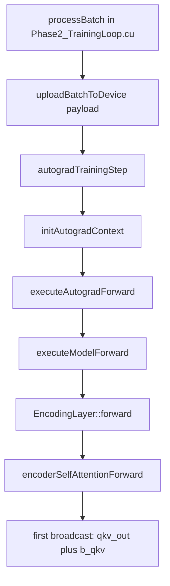
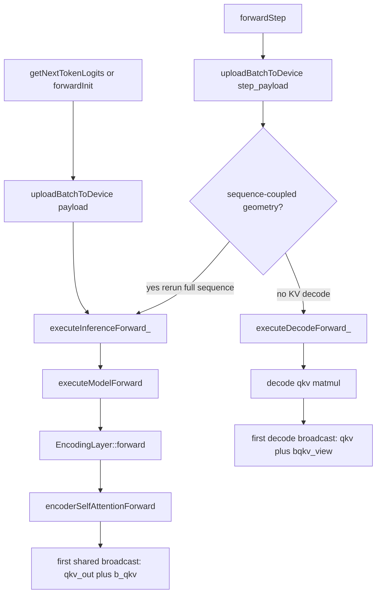

# Forward Chronology

Scope: record the chronological call paths from batch processing / inference entry into the first forward bias-broadcast operations.

This doc is intentionally concrete. It answers two questions:

1. Where does a training microbatch enter the graph?
2. Where does an inference call enter the graph?

The target is not abstract architecture; the target is the real call chain in the current code.

Related docs:

- [GraphStateOwnership.md](GraphStateOwnership.md) — phase ownership doctrine
- [TrainingArchitecture.md](TrainingArchitecture.md) — Phase 2 orchestration ownership
- [InferenceBoundary.md](InferenceBoundary.md) — shared forward vs inference boundary plan
- [ForwardReadOnlyPlan.md](ForwardReadOnlyPlan.md) — read-only forward cleanup plan

## What counts as the first forward broadcast

For the shared full-sequence graph, the first explicit forward broadcast reached from both training and inference-prefill is the QKV bias add in encoder self-attention:

- `Layers/FlashAttention/EncoderSelfAttention_GPU.cu`
- `intermediates.qkv_out = autograd::broadcast_add(intermediates.qkv_out, weights.b_qkv, request.stream);`

For the decode-only KV-cache path, the first explicit broadcast is the local decode QKV bias add:

- `training/Inference_GPU.cu`
- `qkv = ag::broadcast_add(qkv, bqkv_view, stream);`

## Training chronology

Training enters at the Phase 2 microbatch boundary and then routes into the shared full-sequence forward graph.

### Chronological steps

1. **Phase 2 microbatch owner**
   - File: `training/Phases/Phase2_TrainingLoop.cu`
   - Function: `processBatch(...)`
   - Role: owns one microbatch forward/loss/backward pass

2. **Upload the prepared batch payload**
   - File: `training/Phases/Phase2_TrainingLoop.cu`
   - Call: `ctx.model->uploadBatchToDevice(payload)`
   - Result: `BatchDeviceBindings`

3. **Enter the training autograd boundary**
   - File: `training/Phases/Phase2_TrainingLoop.cu`
   - Call: `GRIM::Autograd::autogradTrainingStep(...)`

4. **Build/validate the training runtime context**
   - File: `training/Autograd/AutogradTraining.cu`
   - Function: `autogradTrainingStep(...)`
   - Call: `initAutogradContext(...)`

5. **Training forward adapter**
   - File: `training/Autograd/AutogradTraining.cu`
   - Call: `executeAutogradForward(ctx)`

6. **Shared full-sequence graph entry**
   - File: `training/Autograd/AutogradTraining.cu`
   - Call: `Forward::executeModelForward(request, runtime_payload)`

7. **Encoder-layer forward**
   - File: `Shared/Forward/ModelForward_GPU.cu`
   - Call inside encoder loop: `enc_layer->forward(...)`

8. **Attention facade**
   - File: `Layers/Encoding/Encoding_GPU.cu`
   - Call: `Attention::encoderSelfAttentionForward(...)`

9. **First forward broadcast**
   - File: `Layers/FlashAttention/EncoderSelfAttention_GPU.cu`
   - Call: `autograd::broadcast_add(intermediates.qkv_out, weights.b_qkv, request.stream)`

### Training flow chart

## Inference chronology

Inference has two chronological shapes:

- **shared prefill / full-sequence inference**, which rejoins the same shared forward graph as training,
- **KV-cache decode**, which uses a separate decode implementation and hits its own local broadcast site.

### Public inference entrypoints

Current public inference entrypoints are:

- `Common/grim_language_model_gpu.cu`
  - `LanguageModel::getNextTokenLogits(const BatchPayload& context_payload)`
- `training/Inference_GPU.cu`
  - `LanguageModel::forwardInit(const BatchPayload& prompt_payload)`
  - `LanguageModel::forwardStep(const BatchPayload& step_payload)`

There are also higher-level generation wrappers in `Common/grim_language_model_gpu.cu`:

- `LanguageModel::generate(...)`
- `LanguageModel::generateStream(...)`
- `LanguageModel::generateSequenceGPU(...)`

Those do **not** introduce separate forward math paths. They route into the same inference entrypoints above:

- prompt prefill → `forwardInit(...)`
- autoregressive continuation → repeated `forwardStep(...)`

### Shared-prefill chronology

This is the inference path that reuses the shared full-sequence graph.

1. **Public inference entry**
   - `getNextTokenLogits(...)` or `forwardInit(...)`

2. **Upload the inference payload**
   - Call: `uploadBatchToDevice(...)`
   - Result: `BatchDeviceBindings`

3. **Inference forward adapter**
   - Call: `executeInferenceForward_(payload, bindings, ...)`

4. **Shared full-sequence graph entry**
   - Call: `Forward::executeModelForward(request, runtime_payload)`

5. **Encoder-layer forward**
   - Call: `enc_layer->forward(...)`

6. **Attention facade**
   - Call: `Attention::encoderSelfAttentionForward(...)`

7. **First shared forward broadcast**
   - Call: `autograd::broadcast_add(intermediates.qkv_out, weights.b_qkv, request.stream)`

### Decode chronology

This is the inference path used by `forwardStep(...)` when sequence-local geometry permits KV-cache decode.

1. **Decode entry**
   - `forwardStep(step_payload)`

2. **Upload the current-sequence payload**
   - Call: `uploadBatchToDevice(step_payload)`

3. **Branch on geometry**
   - If `sequenceCoupledGeometryRequiresFullPrefill(config_)` is true, call `executeInferenceForward_(...)` and rejoin shared-prefill chronology
   - Current full-rerun predicates are:
     - `center_encoder_residuals`
     - `lm_head_center_hidden_states`
     - `project_out_pc1`
   - Otherwise: call `executeDecodeForward_(step_payload, bindings, token_pos)`

4. **Decode-local QKV projection**
   - File: `training/Inference_GPU.cu`
   - Local call: `qkv = ag::matmul(ln1_out, wqkv_view, ...)`

5. **First decode broadcast**
   - File: `training/Inference_GPU.cu`
   - Local call: `qkv = ag::broadcast_add(qkv, bqkv_view, stream)`

### Inference flow chart

## Current architectural reading

Chronologically, training and inference-prefill already converge on the same shared full-sequence graph at:

- `Shared/Forward/ModelForward_GPU.cu`
- `Forward::executeModelForward(...)`

That is the strongest candidate for the one canonical graph runner.

The remaining divergence is decode:

- `training/Inference_GPU.cu`
- `executeDecodeForward_(...)`

So the present codebase reads as:

- one shared full-sequence graph,
- one separate decode graph,
- multiple orchestration wrappers above them.

That is why the graph-unification work is still not complete.

## Code verification status

The chronology above was checked against the current implementation, not just intended architecture.

### Verified canonical callsites

- `Forward::executeModelForward(...)` currently has exactly **two** implementation callers:
   - `training/Autograd/AutogradTraining.cu` → `executeAutogradForward(...)`
   - `training/Inference_GPU.cu` → `executeInferenceForward_(...)`
- `Attention::encoderSelfAttentionForward(...)` currently has exactly **one** implementation caller:
   - `Layers/Encoding/Encoding_GPU.cu` → `EncodingLayer::forward(...)`

### Verified first-broadcast sites

- Shared full-sequence path:
   - `Layers/FlashAttention/EncoderSelfAttention_GPU.cu`
   - `intermediates.qkv_out = autograd::broadcast_add(intermediates.qkv_out, weights.b_qkv, request.stream);`
- Decode-local KV path:
   - `training/Inference_GPU.cu`
   - `qkv = ag::broadcast_add(qkv, bqkv_view, stream);`

### What this means

As of this verification, the forward chronology is real:

- training has one full-sequence route,
- inference prefill has one full-sequence route that rejoins the same shared graph,
- `forwardStep(...)` is the only public inference wrapper that still branches between:
   - full-sequence rerun, and
   - decode-local KV-cache execution.

So the system is **not** “many hidden forward implementations” today. It is “one shared full forward, one separate decode forward, plus several wrappers that feed them.”

## Review checklist

When tracing future regressions, ask these questions in order:

1. Did the call enter through `processBatch(...)`, `forwardInit(...)`, `forwardStep(...)`, or `getNextTokenLogits(...)`?
2. Did it pass through `uploadBatchToDevice(...)` exactly once before forward math?
3. Did it route into the shared full-sequence graph (`executeModelForward(...)`) or the decode-specific graph (`executeDecodeForward_(...)`)?
4. Which first broadcast site did it hit?
   - shared full-sequence QKV bias add, or
   - decode-local QKV bias add

If that answer is unclear during debugging, the boundary has become too implicit again.
