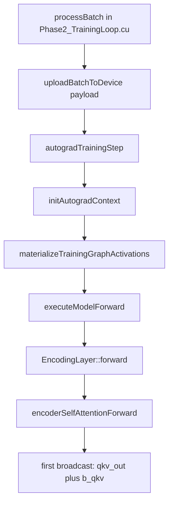
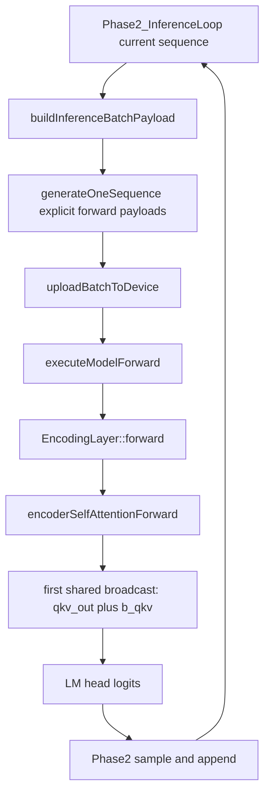

# Forward Chronology

Scope: record the chronological call paths from batch processing / inference entry into the first forward bias-broadcast operations.

This doc is intentionally concrete. It answers two questions:

1. Where does a training microbatch enter the graph?
2. Where does an inference call enter the graph?

The target is not abstract architecture; the target is the real call chain in the current code.

Related docs:

- [GraphStateOwnership.md](GraphStateOwnership.md) — phase ownership doctrine
- [TrainingArchitecture.md](TrainingArchitecture.md) — Phase 2 orchestration ownership
- [InferenceBoundary.md](InferenceBoundary.md) — shared forward vs inference boundary plan
- [ForwardReadOnlyPlan.md](ForwardReadOnlyPlan.md) — read-only forward cleanup plan

## What counts as the first forward broadcast

For the shared full-sequence graph, the first explicit forward broadcast reached from both training and Phase2 inference is the QKV bias add in encoder self-attention:

- `Layers/FlashAttention/EncoderSelfAttention_GPU.cu`
- `intermediates.qkv_out = autograd::broadcast_add(intermediates.qkv_out, weights.b_qkv, request.stream);`

The decode-only KV-cache path was deleted; inference no longer has a second local QKV bias-add site.

## Training chronology

Training enters at the Phase 2 microbatch boundary and then routes into the shared full-sequence forward graph.

### Chronological steps

1. **Phase 2 microbatch owner**
   - File: `training/Phases/Phase2_TrainingLoop.cu`
   - Function: `processBatch(...)`
   - Role: owns one microbatch forward/loss/backward pass

2. **Upload the prepared batch payload**
   - File: `training/Phases/Phase2_TrainingLoop.cu`
   - Call: `Batching::uploadBatchToDevice(model.getConfig(), model.getTrainingState(), payload)`
   - Result: `BatchDeviceBindings`

3. **Build/validate the training runtime context**
   - File: `training/Phases/Phase2_TrainingLoop.cu`
   - Call: `initAutogradContext(...)`

4. **Shared full-sequence graph entry**
   - File: `training/Phases/Phase2_TrainingLoop.cu`
   - Call: `Forward::executeModelForward(request, runtime_payload)`

5. **Enter the autograd loss/backward boundary**
   - File: `training/Phases/Phase2_TrainingLoop.cu`
   - Calls: `computeAutogradLoss(...)`, `executeAutogradBackward(...)`

6. **Encoder-layer forward**
   - File: `Shared/Forward/ModelForward_GPU.cu`
   - Call inside encoder loop: `enc_layer->forward(...)`

7. **Attention facade**
   - File: `Layers/Encoding/Encoding_GPU.cu`
   - Call: `Attention::encoderSelfAttentionForward(...)`

8. **First forward broadcast**
   - File: `Layers/FlashAttention/EncoderSelfAttention_GPU.cu`
   - Call: `autograd::broadcast_add(intermediates.qkv_out, weights.b_qkv, request.stream)`

### Training flow chart

## Inference chronology

Inference has one chronological shape: Phase2 owns the autoregressive generation loop and repeatedly scores the current full context through the same shared forward graph used by training/eval.

### Inference entrypoints

The public orchestration entrypoint is trainer-owned:

- `training/Phases/Phase2_InferenceLoop.cu`
   - `executePhase2TextInference(...)`

Phase2-local inference primitives used by Phase 2 are:

- `training/Phases/Phase2_InferenceLoop.cu`
   - `generateOneSequence(...)`

It does **not** introduce a separate forward math path or model-owned generation session. Phase2 does:

- prompt payload → explicit `ModelForwardRequest` / `ModelForwardRuntimePayload`
- sample token → append to Phase2-owned sequence vectors
- rebuilt current-sequence payload → explicit `ModelForwardRequest` / `ModelForwardRuntimePayload`

### Shared-prefill chronology

This is the inference path that reuses the shared full-sequence graph.

1. **Public inference entry**
   - `generateOneSequence(...)`

2. **Upload the inference payload**
   - Call: `Batching::uploadBatchToDevice(...)`
   - Result: `BatchDeviceBindings`

3. **Shared full-sequence graph entry**
   - Call: `Forward::executeModelForward(request, runtime_payload)`

4. **Encoder-layer forward**
   - Call: `enc_layer->forward(...)`

5. **Attention facade**
   - Call: `Attention::encoderSelfAttentionForward(...)`

6. **First shared forward broadcast**
   - Call: `autograd::broadcast_add(intermediates.qkv_out, weights.b_qkv, request.stream)`

### Inference flow chart

## Current architectural reading

Chronologically, training and inference converge on the same shared full-sequence graph at:

- `Shared/Forward/ModelForward_GPU.cu`
- `Forward::executeModelForward(...)`

That is the canonical graph runner. The old `training/Inference_GPU.cu` / `scoreNextTokenWithKvCache_(...)` decode graph and model-owned `primeGenerationSession()` / `continueGenerationSession()` wrappers were deleted so Phase2 inference is the generation-session boundary.

## Code verification status

The chronology above was checked against the current implementation, not just intended architecture.

### Verified canonical callsites

- `Forward::executeModelForward(...)` currently has exactly **two** implementation callers:
   - `training/Phases/Phase2_TrainingLoop.cu` → explicit training forward before autograd loss/backward
   - `training/Phases/Phase2_InferenceLoop.cu` → `generateOneSequence(...)`
- `Attention::encoderSelfAttentionForward(...)` currently has exactly **one** implementation caller:
   - `Layers/Encoding/Encoding_GPU.cu` → `EncodingLayer::forward(...)`

### Verified first-broadcast sites

- Shared full-sequence path:
   - `Layers/FlashAttention/EncoderSelfAttention_GPU.cu`
   - `intermediates.qkv_out = autograd::broadcast_add(intermediates.qkv_out, weights.b_qkv, request.stream);`
- Decode-local KV path: deleted. There is no second QKV bias-add site for inference.

### What this means

As of this verification, training and inference both have one full-sequence route into `executeModelForward(...)`. Phase2 inference owns both the token-by-token session and the explicit forward request/runtime payloads that feed shared forward.

## Review checklist

When tracing future regressions, ask these questions in order:

1. Did the call enter through `processBatch(...)` or `generateOneSequence(...)`?
2. Did it pass through `Batching::uploadBatchToDevice(...)` exactly once before forward math?
3. Did it route into the shared full-sequence graph (`executeModelForward(...)`)?
4. Did it hit the shared full-sequence QKV bias add?

If that answer is unclear during debugging, the boundary has become too implicit again.
