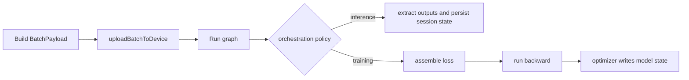

# Graph State Ownership

Scope: define the single graph ownership model for GRIM-text runtime execution.

This doc is the architecture rule behind the forward-boundary cleanup work. It is intentionally short and blunt:

- there is one graph,
- orchestration decides which phases to run,
- phase ownership is strict.

Detailed boundary cleanup plans still live in [InferenceBoundary.md](InferenceBoundary.md), [ForwardReadOnlyPlan.md](ForwardReadOnlyPlan.md), [Autograd.md](Autograd.md), and [Optimizer.md](Optimizer.md). The concrete chronological training/inference call traces live in [ForwardChronology.md](ForwardChronology.md).

## Core rule

GRIM-text must converge on one canonical graph runner.

That graph runner consumes:

- model/layer state,
- uploaded batch inputs,
- explicit per-call runtime payloads,
- explicit execution-plan inputs.

Orchestration above the graph decides whether the call is:

- inference/prefill,
- decode,
- training,
- training with backward,
- training with backward plus optimizer step.

The graph itself must not own those orchestration decisions.

## Phase ownership

### Upload stages input state

`LanguageModel::uploadBatchToDevice()` is the explicit H2D sync boundary.

It translates host `BatchPayload` into device `BatchDeviceBindings` backed by reusable runtime buffers. Upload stages the current call's input state; it does not define model semantics.

### Forward reads state

Forward is a read of state.

Forward may:

- read durable parameter state,
- read uploaded device inputs,
- read execution-plan inputs,
- construct Category 1 graph/intermediate tensors,
- write explicit per-call outputs and caller-owned runtime sinks.

Forward must not:

- mutate durable parameter values,
- mutate parameter metadata (`requires_grad`, shape, ownership flags, tie relationships),
- mutate hidden process-global state,
- mutate durable training/session state as an implicit side effect,
- decide whether backward or optimizer will run.

Short rule: **forward reads state; it does not author durable state.**

### Execution and inference use state

Execution and inference are uses of state.

They may:

- choose the execution plan,
- decide whether to run full-sequence forward or decode-time execution,
- extract logits or session outputs,
- persist explicit session-owned state such as KV cache or generation traces,
- stop after forward when no training phase follows.

They must not:

- create a second conceptual model graph,
- redefine parameter semantics separately from forward,
- mutate durable model state from ordinary forward execution.

Short rule: **execution/inference use state; they do not redefine the graph.**

### Loss scores outputs

Loss consumes forward outputs and prepared supervision payloads.

It adds scalar training objectives and any required Category 1 loss-time tape state. Loss is not a model-state writer.

### Backward measures change

Backward measures what changed in state sensitivity and how state should change.

Backward may:

- traverse the graph,
- compute local derivatives,
- accumulate into persistent gradient buffers,
- emit gradient diagnostics.

Backward must not:

- update parameter values,
- update optimizer moments,
- perform optimizer/state-write policy.

Short rule: **backward does not write model state; backward writes gradient state.**

### Optimizer writes state

Optimizer/update is the durable model-state writer.

Optimizer may:

- read parameters,
- read accumulated gradients,
- read/write optimizer slots and moments,
- update parameter values,
- update durable training state such as step counters and EMA.

Short rule: **optimizer writes state.**

## Canonical execution chain

The canonical ownership chain is:

$$
\text{upload} \rightarrow \text{forward} \rightarrow \text{loss} \rightarrow \text{backward} \rightarrow \text{optimizer}
$$

Not every caller runs every phase.

- Inference normally runs: upload $\rightarrow$ forward
- Training normally runs: upload $\rightarrow$ forward $\rightarrow$ loss $\rightarrow$ backward
- Optimizer window runs after backward when the orchestration policy says a write phase should occur

That means training vs inference is an orchestration choice above the graph, not a separate graph definition.

## One-graph contract

The codebase should read as if there is one graph runner and several orchestration policies around it.

The desired layering is:

Corollaries:

- no separate training-only model semantics,
- no separate inference-only model semantics,
- no optimizer logic inside backward,
- no durable model-state mutation inside forward,
- no hidden runtime-owner reach-through from the graph.

## Current architectural direction

Today the closest thing to the canonical full-sequence graph entry is the shared forward primitive in `Shared/Forward/ModelForward_GPU.{hpp,cu}`.

That boundary should continue to absorb model-execution semantics, while orchestration above it decides:

- whether the call is training or inference,
- whether loss is assembled,
- whether backward runs,
- whether optimizer/update runs,
- whether session outputs such as KV cache are committed.

Any adapter that merely repackages the same graph inputs into a second forward concept is architectural debt.

## Review checklist

When reviewing future changes, apply these questions in order:

1. Is this change part of upload, forward, loss, backward, or optimizer?
2. If it is in forward, does it only read durable state and write explicit per-call outputs?
3. If it is in backward, is it writing only gradient state rather than model state?
4. If it writes durable parameter values or optimizer slots, why is it not in optimizer/update ownership?
5. Is training vs inference being decided by orchestration above the graph, or is a second graph being smuggled in?

If the answer to question 5 is "a second graph", the change is architecturally wrong.

## Non-goals

- This doc does not require duplicate CUDA kernels.
- This doc does not require removing explicit runtime payloads.
- This doc does not require inference and training to share identical orchestration.

It requires only that there be one graph ownership model, and that every phase respect its mutation boundary.
