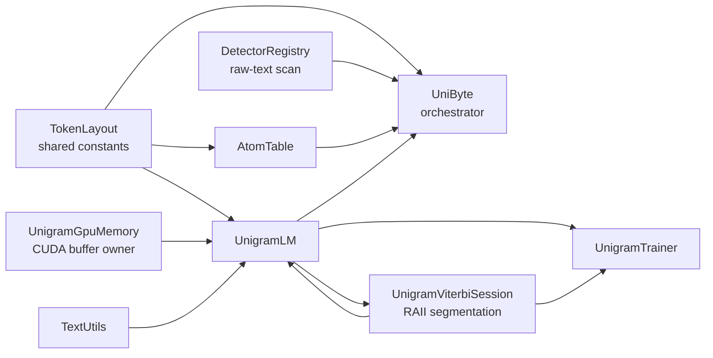
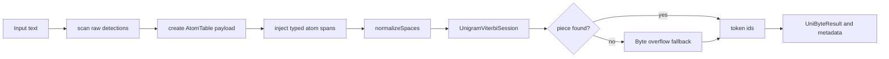
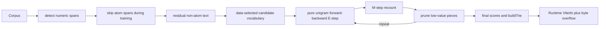

# UnigramByte Tokenizer — Codeboard

> A readable map of the tokenizer code after the refactor.
> If you only need the public API, start with `UniByte.hpp`.

---

## What this tokenizer is

`UnigramByte` is a composed tokenizer with four jobs:

1. `Detectors/DetectorRegistry` scans raw text for numeric atoms and non-token text features.
2. `AtomTable` stores parsed numeric values and per-entry numeric decomposition metadata (`AtomEntry::arg_number`) as a separate auxiliary target while the model-visible value remains between typed boundary tokens.
3. `UnigramLM` does learned subword tokenization on the residual non-atom text.
4. `TokenLayout.hpp` owns the byte-token IDs and conversion helpers used when finalized unigram coverage overflows to raw bytes.

The top-level class is `UniByte`. Everything else exists to support it.

### Intended order, clearly

The intended tokenizer pipeline is:

1. **Pull atoms out first and fully deal with them.**
2. **Run the full unigram training/segmentation loop on what remains.**
3. **Only then overflow uncovered residual bytes into byte fallback tokens.**

So byte fallback is runtime coverage policy, not unigram-training probability mass. If you see fallback threaded through training telemetry or the forward-backward lattice, that is debt from the bolted-on implementation, not the target design.

It does **not** own training sequence layout. `BOS`/`EOS` insertion belongs to `SlidingWindow.cu`; padding and target masking belong to `BatchPayload.cu`. The tokenizer only knows special tokens as reserved layout metadata and writes those records into saved vocab files. `UniByte` intentionally has no batch encode API; corpus batching and window materialization must route through the startup data path.

The public encode/decode surface is intentionally narrow:

- `UniByte::encode(text)` — one high-level ID-only wrapper.
- `UniByte::tokenizeWithMetadata(text)` — metadata tokenization for atom side channels; not another `encode*` overload.
- `UniByte::decode(DecodeRequest)` — one high-level decode primitive. ID-only, tokenizer-result atom side-channel, and Phase2 generated numeric side-channel decode all flow through `DecodeRequest`; do not add local append/decode wrappers.
- Standalone `ByteEncoder` has been removed; byte/unigram/atom branching is handled by small primitives inside the orchestrator plus `TokenLayout.hpp` byte helpers.
- `UnigramLM::decode()` decodes only byte fallback and learned unigram IDs. It must fail loudly on any token outside that primitive range; only `UniByte::decode(DecodeRequest)` is layout-aware.
- `UniByte::vocabSize()` is the only public tokenizer vocab-size API. It returns the full token ID space that `DataLoader.cu` writes into `.grmt` headers. Learned subword count is `UnigramLM::pieceCount()` and is never a model/GRMT vocab size.
- `TokenLayout` is the only token-range classifier. Do not re-add `UniByte` token-type wrappers or token-string wrappers; diagnostics should derive layout with `tokenLayoutFromActualVocabOrThrow(tokenizer.vocabSize(), caller)` and use direct `UnigramLM::getPiece(token_id)` lookups.

---

## Start here

Read the tokenizer in this order:

1. `UniByte.hpp` / `UniByte.cu` — top-level orchestration and public API
2. `Unigram.hpp` / `Unigram.cu` — learned vocab, trie construction, encode/decode wrappers
3. `UnigramViterbi.hpp` / `UnigramViterbi.cu` — RAII Viterbi segmentation session
4. `VocabWriteOp.hpp` — the only primitive allowed to mutate learned unigram vocab storage/indexes
5. `UnigramGpuMemory.hpp` / `UnigramGpuMemory.cu` — durable CUDA buffer ownership for `UnigramLM`
6. `AtomTable.hpp` / `AtomTable.cu` — parsed numeric atom registry
7. `Detectors/` — `RawTextDetector` parent class, registry, numeric detectors, and text-feature detectors
8. `TokenLayout.hpp` — token IDs, special-token metadata, and byte-token helpers
9. `TextUtils.hpp` / `TextUtils.cu` — normalization and UTF-8 helpers
10. `UnigramTrainer.hpp` / `UnigramTrainer.cu` — training pipeline only
11. `Training/SubwordMining.hpp` / `Training/SubwordMining.cu` — training-only subword candidate mining and atom-aware count aggregation
12. `Training/UnigramForwardBackward.hpp` / `Training/UnigramForwardBackward.cu` — training-only true Unigram forward-backward expected-count estimator over learned-piece paths on non-atom residual spans

If you read it in a different order, the code starts to feel like a haunted house.

---

## High-level architecture

### The mental model

- `TokenLayout.hpp` is the shared foundation.
- `UniByte` composes the rest; it should not re-implement their logic.
- `UnigramTrainer.cu` is training-only; inference wrappers live in `Unigram.cu`, Viterbi segmentation lives in `UnigramViterbi.cu`, and soft EM expected-count math lives in `Training/UnigramForwardBackward.*`.
- The intended split is Phase-2-style: atoms are resolved before unigram, `UnigramTrainer` owns the pure unigram training loop over residual text, and Viterbi + byte overflow are the runtime siblings that consume the finalized tokenizer state.
- `Detectors/TokenizerDetector.hpp` is the parent interface for detectors that operate on raw text byte offsets only.
- `Detectors/DetectorRegistry.*` owns detector registration, longest-match scanning, and atom `StructuralSpan` extraction; `UniByte.cu` only consumes registry-owned results.

---

## Token layout

The live layout comes from `TokenLayout.hpp`.

| Range | Meaning | Notes |
|---|---|---|
| `0..3` | reserved layout special tokens | `UNK=0`, `PAD=1`, `BOS=2`, `EOS=3`; metadata lives in `TokenLayout.hpp` |
| `4..259` | byte fallback tokens | one token per raw byte |
| `ATOM_TOKEN_OFFSET..UNIGRAM_VOCAB_OFFSET-1` | atom tokens | typed opening/closing boundaries |
| `UNIGRAM_VOCAB_OFFSET+` | learned unigram pieces | subword pieces only |

### Vocab-size ownership

- `UniByte::vocabSize()` = full tokenizer token-space size (`UNIGRAM_VOCAB_OFFSET + pieceCount`). This is the value saved to the `.grmt` header during data preparation.
- `UnigramLM::pieceCount()` = learned subword count only. It is allowed for diagnostics/layout summaries, not for model embedding allocation.
- `VocabWriteOp.hpp` is the sole learned-piece write primitive. Call it for append/upsert/compaction; never push into `pieces_` or rebuild `piece_to_id_` by hand.
- `UnigramLM::writePiece()` is intentionally removed. Do not recreate a public/manual vocab-builder wrapper; call `VocabWriteOp.hpp` directly at trainer/artifact boundaries until the remaining class shell is removed.
- `pieces_` and `piece_to_id_` are temporarily public only so callers can form `UnigramVocabWriteTarget`; treating that visibility as permission for direct mutation is a Rule 20 split-vocab violation.
- Config-driven learned-vocab limits come from `GRIM::HyperParameters::TokenizerHP` in `HyperparameterGroupings.hpp`.
- `vocab.bin` contains a serialized record count for file I/O plus a token-space consistency check. Phase 1 startup does not use `vocab.bin` to choose final model vocab size.
- `Shared/GRMT/GrmtFormat.hpp` owns `.grmt` magic/header read, validation, and write helpers. Do not duplicate header structs or magic/version checks in loaders, diagnostics, or subprocess tools.
- `Shared/TokenizerArtifacts/TokenizerArtifactBundle.*` owns the cache-pair load/save functions (`vocab.bin` + `training_data.grmt`). Those functions consume `TokenizerHP` directly; data prep must accept or rebuild that pair as a unit and must not reuse a lone vocab with a missing/stale GRMT.
- Phase 1 startup loads the tokenizer artifact bundle and then immediately calls `UniByte::initGPU()` before Phase 2. Training data rows are already tokenized, but sample inference and diagnostics may tokenize fresh text; they must not be the first code path to discover that the loaded trie was never uploaded.
- `Shared/TokenizerArtifacts/GrmtCorpusIO.*` owns GRMT row save/load. Runtime loaders and diagnostics must use its RAII reader/writer instead of open-coded seeks through the row layout.
- `Shared/TokenizerArtifacts/VocabArtifactIO.*` is the bundle-internal KTMG read/write helper; do not call it as an independent tokenizer artifact path.
- Text vocab files are human-readable exports only. Binary KTMG is the only vocab load path.
- Phase 1 startup reads final training vocab size from the validated `.grmt` header and stores it on `ctx.data.vocab_size` before syncing `ctx.config.vocab_size`.

### Masking rule

- Never predict `UNK`, `PAD`, or `BOS`.
- `EOS` **is** a valid target.
- Byte, atom, and unigram tokens are content-bearing tokens.
- `BatchPayload.cu` owns this masking rule; tokenizer encode does not apply it.

---

## Encode flow

### What actually happens

1. `DetectorRegistry::scan()` finds raw detections; `UniByte` passes them to `createAtomTableFromRawTextDetections()`.
2. `createAtomTableFromRawTextDetections()` allocates the per-sequence `AtomTable`, registers each atom-emitting detection exactly once, and stores numeric `arg_number` / `DigitBinding` metadata on the deduped `AtomEntry` itself before returning `AtomTokenizationPayload` records.
3. Each atom payload carries the finalized `StructuralSpan`, matching opening/closing token IDs, `atom_entry_id`, packed numeric value, atom flags, and atom mask used by the merge step.
4. The original text is segmented around atom spans; non-atom gaps go through unigram segmentation, while atom gaps emit the returned atom payload directly.
5. Text normalization happens before unigram segmentation of each non-atom gap.
6. `UnigramLM::encode()` creates a `UnigramViterbiSession` over the normalized gap text.
7. Any residual byte sequence not covered by the finalized learned-piece segmentation overflows to raw byte tokens through `TokenLayout.hpp` byte helpers.
8. `UniByteResult` is assembled and `validate()` checks that every parallel array matches `token_ids.size()`.

`AtomNumberPopulationPayload` is now summary-only diagnostics. The durable numeric decomposition lives on `AtomEntry::arg_number`, which means deduped atom entries also dedupe their digit bindings and AtomTable save/load persists them with the entry.

Atoms never reach the byte-overflow step because they were already extracted and handled before unigram segmentation started.

No step injects `BOS`, appends `EOS`, pads, or mutates targets. Those are downstream layout responsibilities.

### The main result object

`UniByteResult` is the handoff object used by downstream code.

| Field | Purpose |
|---|---|
| `token_ids` | final token stream |
| `atoms` | detected source spans |
| `is_byte_fallback` | marks tokens created by byte fallback |
| `token_numeric_values` | per-token numeric payload |
| `token_atom_flags` | per-token atom flags |
| `token_atom_mask` | whether a token is an atom |
| `atom_entry_ids` | per-token index into `atom_table` |
| `atom_table` | parsed atom registry shared by the sequence |

---

## Training flow

### Ownership split

- Byte-fallback enablement is `TokenizerHP` / `UniByte` ownership. Construct `UnigramLM` with the desired mode and pass `TokenizerHP` into vocab-load helpers; do not reintroduce public `UnigramLM` setter/getter accessors for this config bit.
- `UnigramLM::trainFromCorpus()` is declared in `Unigram.hpp` and owns the raw-text detector prepass for training. Parseable atom spans are detected there from `TokenizerHP` before delegating to the atom-aware overload; do not recreate a `UniByte::trainFromCorpus()` wrapper.
- The actual training orchestration lives in `UnigramTrainer.cu`.
- Subword mining/count aggregation lives in `Training/SubwordMining.hpp/.cu`. `UnigramTrainer.cu`
   calls `mineUnigramSubwordsFromTrainingUnits()` once, consumes the returned
   `UnigramSubwordMiningResult`, and must not rebuild mining spans or worker-local
   candidate-count maps inline.
- True Unigram soft-EM math lives in `Training/UnigramForwardBackward.hpp/.cu`; training must use posterior expected counts from forward-backward over learned-piece paths only, not Viterbi hard-EM counts.
- `UnigramLM::trainFromCorpus()` fails at entry for invalid `target_vocab_size`,
   `character_coverage`, `min_subword_freq`, or `subword_mining_workers`; do not rely on
   later shrink/EM code to discover malformed hyperparameters.
- Original atom spans are validated before logging byte totals or calling
   `normalizeWithSpans()`. Span size mismatches, reversed spans, out-of-bounds spans, and
   overlapping/unsorted spans must fail before any normalization can rewrite offsets.
- Atom spans are skipped during training so numeric internals do not contaminate vocab statistics.
- Byte fallback is not part of the intended unigram training objective. The forward-backward
   lattice, posterior expected counts, shrink ranking, and cleanup decisions are supposed to
   be learned-piece-only decisions over the residual non-atom text. If current code still
   threads byte fallback through training telemetry or E-step bookkeeping, that is
   architectural drift to remove, not the target contract.
- Step-2 character seeds are transient bootstrap/coverage diagnostics only. They must not be
   emitted as learned pieces, must not pre-seed structural dedup, must not suppress mined
   one-character candidates from competing normally, and must not receive pruning protection.
   Once candidate mining starts, training should treat those seeds as spent.
- Subword mining must admit one-character candidates through the ordinary mined-subword path
   even when a normalized segment has no atom spans. Character coverage diagnostics are not a
   second learned-vocab construction path.
- Vocab-character validation must use `utf8DecodeAt()` for the single-codepoint decode.
   Do not hand-decode multi-byte candidates; continuation-byte checks, overlong rejection,
   surrogate rejection, truncation checks, and max-codepoint validation belong to `TextUtils`.
- Candidate selection is corpus/data driven: subwords must pass the frequency, validity,
   repetition-noise, and structural-dedup filters. `target_vocab_size`
  is only the final learned-piece cap used by pruning; do not derive a seed-vocab size
  or candidate-selection cap from it.
- Do not reject prefix-extension candidates before EM. Equal corpus counts do not prove
   redundancy; longer pieces may still earn their slot through better likelihood/compression.
   Let forward-backward EM and posterior-mass pruning decide.
- Shrink pruning ranks pieces by posterior expected mass plus expected compression gain from
   the converged E-step: `posterior_count + posterior_count * max(piece_bytes - 1, 0)`.
   Do not normalize the compression gain by expected byte span, because that gives rare long
   pieces an almost free ratio bonus. Do not use `count * abs(score)` as a marginal-value
   proxy; it can overprotect rare low-probability pieces that soft segmentation barely uses.
- User-defined learned pieces are protected explicitly: insert all user-defined indices
   into the shrink keep set first, then fill remaining slots by posterior mass. Never rely
   on a max-value sort sentinel, because more protected pieces than `keep_count` must still
   all survive.
- Final dead-token cleanup must fail before compaction if the dead set would delete every
   learned piece. Do not rewrite `pieces_` to empty and let Phase-D fail later during
   forward-backward lattice construction; that indicates the pure-unigram objective/candidate
   set is broken, not something byte overflow should rescue.
- Subword mining counts must be `uint64_t`/overflow-checked and exact after global merge.
   Large corpora can exceed signed `int`; never store candidate counts in signed 32-bit
   containers.
- Structural dedup keys are comparison-only. They may trim structural edge whitespace/format
   codepoints, but must never trim SentencePiece `▁` (U+2581): `▁word` and `word` are
   distinct because word-initial position is semantic. Accepted candidates must store the
   original mined subword text, not the edge-trimmed dedup key, so learned pieces keep their
   exact boundary markers and bytes.
- Subword mining byte caps must use deterministic byte-proportional spans distributed across
   each full normalized document. Do not sample only prefixes: EM trains on full documents,
   so prefix-only candidate mining starves late-document patterns and creates a false
   candidate/EM mismatch. Sampled spans carry `MAX_PIECE_LENGTH - 1` bytes of UTF-8-snapped
   context overlap around the intended span, and miners must only count candidate starts
   inside the intended span so boundary-crossing pieces can be discovered without inflating
   sampled-start coverage.
- Subword mining must preserve exact global counts. `tokenizer.prune_during_mining`
   is a no-op compatibility flag: do not prune worker-local maps or any pre-merge counts,
   because candidates that are individually rare per worker can be globally valid after merge.

---

## File ownership

Use this table as the “who owns what?” map.

| File | Owns | Should not own |
|---|---|---|
| `TokenLayout.hpp` | token constants, special-token metadata, `AtomType`, byte-token helpers, token-id helpers | runtime parsing, CUDA state, sequence/window layout |
| `TextUtils.hpp/.cu` | UTF-8 helpers, SentencePiece-style whitespace normalization | tokenizer orchestration |
| `Detectors/TokenizerDetector.hpp` | raw-text detector parent class and detection result types | token ID classification, token assembly, atom storage |
| `Detectors/DetectorRegistry.hpp/.cu` | detector registration, priority ordering, longest-match raw-text scan | tokenizer HP ownership, token IDs |
| `Detectors/AtomDelimiterDetector.hpp/.cu` | authored typed-delimiter atom-span placement | AtomTable parsing, token emission |
| `Detectors/TextFeatureDetectors.hpp/.cu` | whitespace and uppercase raw-text feature detection | atom token emission, unigram segmentation |
| `AhoCorasick.hpp/.cu` | multi-pattern prefix matching DFA | full numeric parsing, tokenizer output assembly |
| `AtomTable.hpp/.cu` | parsed atom storage, dedup, GPU packing, numeric value access | subword segmentation |
| `Unigram.hpp/.cu` | learned vocab semantics, trie construction, encode/decode wrappers | raw learned-vocab vector/map mutation, Viterbi DP state, artifact file I/O, detection policy, top-level orchestration, training boundary-token injection |
| `UnigramViterbi.hpp/.cu` | CUDA-backed production Viterbi session, per-segmentation launch/backtrack validation, SentencePiece-style subword path selection, Viterbi CUDA kernels | learned-vocab mutation, durable CUDA buffer lifetime, artifact serialization, detector policy, hard-coded punctuation splitting |
| `Training/SubwordMining.hpp/.cu` | tokenizer-training subword candidate mining, deterministic byte-proportional sampling, atom-aware count aggregation, validator/noise gates, overflow-checked count math | EM posterior math, learned-vocab mutation, shrink/cleanup ranking, runtime encode path |
| `Training/UnigramForwardBackward.hpp/.cu` | training-only log-space forward-backward lattice and posterior expected-count accumulation for true Unigram EM on learned-piece paths over non-atom residual spans | production encode path, CUDA Viterbi workspace ownership, byte-overflow policy, learned-vocab mutation |
| `VocabWriteOp.hpp` | append/upsert/rewrite of learned unigram pieces plus `piece_to_id` synchronization and token-ID validation | training scoring, Viterbi, artifact serialization, model/GRMT vocab-size authority |
| `UnigramGpuMemory.hpp/.cu` | `UnigramLM` CUDA buffer lifetime, transactional GPU upload, Viterbi workspace ownership, device pointer cleanup | vocab semantics, Viterbi scoring, token assembly, training |
| `UnigramTrainer.hpp/.cu` | unigram training implementation | runtime encode path |
| `UniByte.hpp/.cu` | composition layer, public API, metadata assembly | low-level detector implementations, training internals, `BOS`/`EOS`/`PAD` layout policy |
| `TokenizerArtifacts/TokenizerArtifactBundle.hpp/.cu` | `TokenizerHP`-driven vocab+GRMT save/load validation functions | tokenization, vocab training, GRMT row byte layout, tokenizer path payload ownership |
| `TokenizerArtifacts/GrmtSequence.hpp` | canonical GRMT row payload type (`GrmtSequence`) with atom/execution side channels | file I/O orchestration, tokenizer cache validation |
| `TokenizerArtifacts/GrmtCorpusIO.hpp/.cu` | RAII GRMT row reader/writer, temp-file cleanup, row serialization/deserialization | vocab training/loading, model allocation, train/val splitting |
| `TokenizerArtifacts/VocabArtifactIO.hpp/.cu` | KTMG vocab read/write used by the bundle | public tokenizer load/save API, GRMT row byte layout |

---

## Main types you need to know

| Type | Defined in | Why it matters |
|---|---|---|
| `UniByte` | `UniByte.hpp` | top-level tokenizer class |
| `GRIM::HyperParameters::TokenizerHP` | `HyperparameterGroupings.hpp` | runtime tokenizer HP snapshot stored by `UniByte` |
| `TokenLayout` | `TokenLayout.hpp` | runtime view of token-region boundaries |
| `StructuralSpan` | `Detectors/StructuralSpan.hpp` | registry-owned atom span metadata consumed by tokenization |
| `UniByteResult` | `UniByte.hpp` | validated encode result passed downstream |
| `AtomType` | `TokenLayout.hpp` | shared atom type enum |
| `AtomSpan` | `Unigram.hpp` | training-only “skip this byte range” marker |
| `UnigramPiece` | `Unigram.hpp` | one vocab piece with score |
| `UnigramViterbiSession` | `UnigramViterbi.hpp` | RAII owner for one Viterbi segmentation pass |
| `UnigramGpuMemory` | `UnigramGpuMemory.hpp` | RAII owner for `UnigramLM` device buffers and upload state |
| `AtomEntry` | `AtomTable.hpp` | cache-aligned stored atom record |
| `AtomValue` | `AtomTable.hpp` | parsed value variant for atoms |
| `AhoCorasickMatch` | `AhoCorasick.hpp` | prefix-match result for detector dispatch |

---

## Detection stack

Raw-text detection is registry-driven:

1. `RawTextDetector` is the parent class for detectors that scan source byte offsets.
2. `DetectorRegistry` owns registered detectors, priority ordering, and longest-match scanning.
3. `DetectorRegistry::scan()` is the single registry traversal API. It returns authored typed atom spans, whitespace, uppercase runs, and future source-text features. Plain numbers do not emit atom detections.
4. `UniByte` and tokenizer training both consume `DetectorRegistry::scan()` directly and filter atom-emitting detections locally before `AtomTable` / `AtomSpan` work.

Detector purpose is split deliberately:
- atom-emitting detectors identify raw text that should collapse to one atom token plus side-channel metadata;
- non-atom detectors identify raw source features without creating token IDs.

All concrete detectors must be registered in `makeDefaultRawTextDetectorRegistry()`. `UniByte.cu` must not contain detector-like kernels, local scanner functions, public detector methods, or hard-coded pattern checks.

Current detector surface:

| Detector | Emits atom? | Example inputs |
|---|---:|---|
| `AtomDelimiterDetector` | yes (authored type) | `<INT>42</INT>`, `<FLOAT>-2.5</FLOAT>` |
| `WhitespaceDetector` | no | space, tab, newline runs |
| `UppercaseRunDetector` | no | `HTTP`, `USA`, `GPU` |

Current parser surface in `AtomTable`:

| Function | Purpose |
|---|---|
| `parseInteger` | decimal integer parsing |
| `parseFloat` | float parsing |
| — | hex/binary parsing is not active |

Atom emission is placement-only: the authored delimiter determines the atom type and exact content bounds.

---

## Invariants you must not break

1. **Token IDs for unigram pieces are positional.**
   `token_id = UNIGRAM_VOCAB_OFFSET + index_in_pieces_`.

2. **`buildTrie()` and runtime finalization must happen before non-empty encode.**
   Load or train vocab first, build the trie, then upload the trie/workspace. `UnigramLM::initGPU()` is only the default-capacity initializer for generic/server use.
   Tokenizer training uses CPU log-space forward-backward for pure unigram EM and must call `UnigramLM::initGPUForMaxSequenceLength(longest_normalized_training_segment)` after the final `buildTrie()` so normalized corpus spans larger than the default workspace still use the reusable CUDA Viterbi buffers at runtime instead of failing at encode time.

   Training is the production-runtime finalization owner. `UnigramLM::trainFromCorpus()` returns a populated `UnigramTrainingRuntimeReport` only after the uploaded generation matches the live trie and the workspace is large enough for the training corpus envelope. GRMT/DataLoader paths must assert `tokenizer.unigramLM().requireRuntimeReadyForLastTraining(...)` after training, not repair training with generic `initGPU()`.

   The trie mirrors the current learned-piece set. Rebuild it after load/train mutations only; do not add post-load vocab capping paths.

   Production CUDA Viterbi walks the uploaded forward trie from each reachable start position (`text[pos]`, then `text[pos + 1]`, ...). The GPU upload is not a reverse trie; reverse-scanning candidate pieces breaks normal tokens like `ab`.

   ASCII spacing bytes are rewritten by `TextUtils::normalizeSpaces()` before unigram segmentation: `' '`, `\t`, `\n`, `\r`, and CRLF all become the shared SentencePiece `▁` marker, with CRLF collapsed to one marker. This is an intentional rewrite, not a detector decision. Decode maps the marker back to plain space, so the tokenizer no longer preserves the exact source kind for tabs/newlines/carriage returns.

   GPU trie uploads are generation-checked. If `buildTrie()` or score mutation advances the live trie generation, CUDA Viterbi must fail loudly until the runtime finalization path refreshes the uploaded generation.

   `UnigramGpuMemory` is the tokenizer runtime-state owner, not upload scratch. Runtime upload uses a file-local RAII transaction that owns partial CUDA allocations until commit under the Viterbi workspace mutex. Do not reintroduce `UnigramGpuMemory` move assignment for upload staging.

   Punctuation is ordinary normalized text in this SentencePiece-style tokenizer. Do not add hard Viterbi punctuation boundaries. A punctuation mark may be a learned piece by itself, part of a larger learned piece, or a byte fallback only if no selected learned piece covers it.

3. **Byte fallback is the post-unigram coverage guarantee.**

   Byte fallback is deliberately raw byte-level fallback with an unnormalized fixed per-byte penalty, not UTF-8-character fallback and not part of the learned-piece probability distribution.
   It is the overflow path taken only after atoms are already removed and the finalized learned-piece model has no covering piece for the residual bytes.

   With byte fallback enabled, each fallback transition advances exactly one raw byte and emits the raw byte token (`BYTE_TOKEN_OFFSET + byte`), not `UNK_TOKEN_ID`. A multibyte UTF-8 codepoint therefore produces one fallback transition/token per byte if no learned piece covers it. Forward DP stores `d_viterbi_prev_is_fallback[end]` on the selected backpointer, and backtrack marks per-byte fallback metadata from that explicit flag only. Forward-DP candidate fallback edges are not proof that the final segmentation emitted a byte token, and token ID range must not be used as a fallback-selection proxy.

   `UNKNOWN_SCORE` in `TokenLayout.hpp` is the only unnormalized per-byte fallback penalty source. CUDA Viterbi/runtime segmentation must use it directly and apply it once per raw fallback byte; do not add caller-provided unknown-score overrides to kernel signatures, launch helpers, or encode APIs. Scores are initialized with `kViterbiUnreachableScore`, but reachability is not inferred from score values: position `0` is reachable by definition, and every other position is reachable only when `viterbi_prev[pos] >= 0`. If training code consumes `UNKNOWN_SCORE` inside the unigram EM lattice, that is architectural drift.

   Exact-score tie-breaking is part of production behavior: learned-piece transition beats fallback transition, longer span beats shorter span, and lower token ID breaks any remaining tie. Keep `shouldReplaceViterbiTransition()` and this invariant in sync.

   Do not reintroduce standalone greedy trie lookup kernels for production segmentation. A local best trie match ignores accumulated path score, fallback cost, and tie policy; Viterbi-compatible behavior requires the forward DP plus backtrack kernels.

   CUDA Viterbi kernels use explicit `error_code` status reporting for logical validation failures. Device `assert()` is not a correctness mechanism here because it can disappear by build mode or surface far from the root cause. Backtrack must hard-report `kUnigramViterbiCudaOutputBufferTooSmall` when `count > max_tokens`, keep a safety counter, and leave host callers/tests responsible for sync + status copy + fail-loud handling.

   Punctuation-heavy structures that should not influence subword mining belong in detector/training skip-span policy, not in Viterbi punctuation splitting.

4. **Atom spans are skipped during training.**
   Training should not learn internal numeric formatting as normal subwords.

5. **Special tokens are layout metadata, not tokenizer sequence policy.**
   `UnigramLM` saves reserved special records in vocab files, but literal strings like `<s>` are normal text if learned. `SlidingWindow.cu` owns `BOS`/`EOS`; `BatchPayload.cu` owns `PAD` and target masking.
   `UnigramLM::decode()` must not display or skip layout tokens; it rejects anything outside byte/unigram primitive ranges.

6. **Batch/window materialization is outside `UniByte`.**
   Do not add `UniByte::encodeBatch()` or vector-of-vector tokenization shortcuts; the active training path uses `DataLoader.cu` plus `SlidingWindow.cu` so boundaries, overlap, and target masking stay centralized.

7. **`UniByteResult` arrays are parallel.**
   If one per-token field has length `n`, all per-token fields must have length `n`.

8. **The raw-text detector registry is built eagerly.**
   `UniByte` owns the `DetectorRegistry` and prepares it up front.

9. **`UniByte` composes; it should not absorb other layers.**
   Keep detector logic in `Detectors/`, training logic in `UnigramTrainer`, and subword logic in `Unigram`.

10. **GPU memory is not tokenization logic.**
    `UnigramGpuMemory.*` owns raw CUDA pointers, cleanup, and upload transactions. Do not put raw `cudaMalloc` / `cudaFree` blocks or device-buffer structs back in `Unigram.hpp` or `Unigram.cu`.

11. **Token classification has one owner.**
   Use `TokenLayout` for special/byte/atom/unigram range checks. `UniByte` must not grow convenience `is*Token` or `tokenToString` methods; those turn the layout into a shadow API.

12. **Final vocab size has one owner.**
   Training may prune learned pieces before saving. After save/load, the final token space comes from the saved artifacts and `.grmt` header; do not mutate the tokenizer with a late cap.

---

## If you need to change something, go here

| Change | Primary file(s) |
|---|---|
| Add or change raw-text detection | `Detectors/*`, `UniByte.cu` |
| Add a new atom type | `TokenLayout.hpp`, `Detectors.*`, `AtomTable.*`, `UniByte.*` |
| Change token-id ranges | `TokenLayout.hpp` |
| Change training sequence boundaries or target masking | `SlidingWindow.cu`, `BatchPayload.cu` |
| Change normalization behavior | `TextUtils.cu` |
| Change unigram segmentation | `Unigram.cu` |
| Change `UnigramLM` CUDA buffer ownership/upload | `UnigramGpuMemory.hpp`, `UnigramGpuMemory.cu` |
| Change subword mining/counting | `Training/SubwordMining.cu`, `Training/SubwordMining.hpp` |
| Change vocab training | `UnigramTrainer.cu` |
| Change encode metadata layout | `UniByte.hpp`, `UniByte.cu` |
| Change atom GPU packing | `AtomTable.cu` |

---

## Minimal verification

After tokenizer changes, verify at least:

1. the tokenizer still builds,
2. `unigrambyte_self_test` still passes,
3. encode/decode behavior did not drift unexpectedly,
4. training still feeds into `buildTrie()` and the inference path unchanged.

---

## One-line summary

`UniByte` is the orchestrator: detectors/atoms resolve structure first, `UnigramLM` learns and segments the residual text, and byte overflow is emitted directly through `TokenLayout.hpp` byte-token helpers after unigram coverage runs out.
