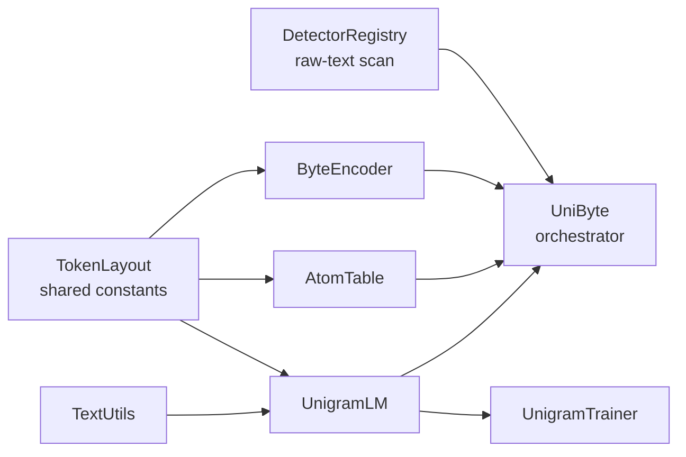
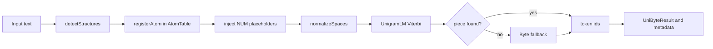
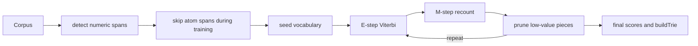

# UnigramByte Tokenizer — Codeboard

> A readable map of the tokenizer code after the refactor.
> If you only need the public API, start with `UniByte.hpp`.

---

## What this tokenizer is

`UnigramByte` is a composed tokenizer with four jobs:

1. `UnigramLM` does normal subword tokenization.
2. `ByteEncoder` guarantees 100% UTF-8 coverage when no unigram piece matches.
3. `Detectors/DetectorRegistry` scans raw text for numeric atoms and non-token text features.
4. `AtomTable` stores parsed numeric values so the model can keep a placeholder token and still recover the real value.

The top-level class is `UniByte`. Everything else exists to support it.

It does **not** own training sequence layout. `BOS`/`EOS` insertion belongs to `SlidingWindow.cu`; padding and target masking belong to `BatchPayload.cu`. The tokenizer only knows special tokens as reserved layout metadata and writes those records into saved vocab files. `UniByte` intentionally has no batch encode API; corpus batching and window materialization must route through the startup data path.

The public encode/decode surface is intentionally narrow:

- `UniByte::encode(text)` — one high-level ID-only wrapper.
- `UniByte::tokenizeWithMetadata(text)` — metadata tokenization for atom side channels; not another `encode*` overload.
- `UniByte::decode(DecodeRequest)` — one high-level decode wrapper. `decode(ids)` and `decode(result)` both flow through `DecodeRequest`.
- `ByteEncoder` and `UnigramLM` each expose one `encode` and one `decode`; byte/unigram/atom branching is handled by small primitives inside the orchestrator, not by public overload chains.

---

## Start here

Read the tokenizer in this order:

1. `UniByte.hpp` / `UniByte.cu` — top-level orchestration and public API
2. `Unigram.hpp` / `Unigram.cu` — vocab, trie, Viterbi encode/decode, vocab I/O
3. `AtomTable.hpp` / `AtomTable.cu` — parsed numeric atom registry
4. `Detectors/` — `RawTextDetector` parent class, registry, numeric detectors, and text-feature detectors
5. `Byte.hpp` / `Byte.cu` — byte fallback
6. `TextUtils.hpp` / `TextUtils.cu` — normalization and UTF-8 helpers
7. `UnigramTrainer.hpp` / `UnigramTrainer.cu` — training pipeline only

If you read it in a different order, the code starts to feel like a haunted house.

---

## High-level architecture

### The mental model

- `TokenLayout.hpp` is the shared foundation.
- `UniByte` composes the rest; it should not re-implement their logic.
- `UnigramTrainer.cu` is training-only; inference lives in `Unigram.cu`.
- `Detectors/TokenizerDetector.hpp` is the parent interface for detectors that operate on raw text byte offsets only.
- `Detectors/DetectorRegistry.*` owns detector registration and longest-match scanning; `UniByte.cu` calls the registry and only converts atom-emitting raw detections into `StructuralSpan`s.

---

## Token layout

The live layout comes from `Byte.hpp` and `TokenLayout.hpp`.

| Range | Meaning | Notes |
|---|---|---|
| `0..3` | reserved layout special tokens | `UNK=0`, `PAD=1`, `BOS=2`, `EOS=3`; metadata lives in `TokenLayout.hpp` |
| `4..259` | byte fallback tokens | one token per raw byte |
| `260..261` | atom tokens | currently `ATOM_NONE` and `ATOM_NUM` |
| `262+` | unigram vocab | learned subword pieces |

### Masking rule

- Never predict `UNK`, `PAD`, or `BOS`.
- `EOS` **is** a valid target.
- Byte, atom, and unigram tokens are content-bearing tokens.
- `BatchPayload.cu` owns this masking rule; tokenizer encode does not apply it.

---

## Encode flow

### What actually happens

1. `UniByte::detectStructures()` finds numeric spans.
2. Each span is registered in `AtomTable` and gets metadata.
3. The original text is rewritten with numeric placeholders before unigram segmentation.
4. Text normalization happens before unigram segmentation.
5. `UnigramLM` runs Viterbi over the normalized text.
6. Any miss falls back to raw bytes through `ByteEncoder`.
7. `UniByteResult` is assembled and `validate()` checks that every parallel array matches `token_ids.size()`.

No step injects `BOS`, appends `EOS`, pads, or mutates targets. Those are downstream layout responsibilities.

### The main result object

`UniByteResult` is the handoff object used by downstream code.

| Field | Purpose |
|---|---|
| `token_ids` | final token stream |
| `atoms` | detected source spans |
| `is_byte_fallback` | marks tokens created by byte fallback |
| `token_numeric_values` | per-token numeric payload |
| `token_atom_flags` | per-token atom flags |
| `token_atom_mask` | whether a token is an atom |
| `atom_entry_ids` | per-token index into `atom_table` |
| `atom_table` | parsed atom registry shared by the sequence |

---

## Training flow

### Ownership split

- `UniByte::train()` orchestrates the training workflow.
- `UnigramLM::trainFromCorpus()` is declared in `Unigram.hpp`.
- The actual training implementation lives in `UnigramTrainer.cu`.
- Atom spans are skipped during training so numeric internals do not contaminate vocab statistics.

---

## File ownership

Use this table as the “who owns what?” map.

| File | Owns | Should not own |
|---|---|---|
| `TokenLayout.hpp` | token constants, special-token metadata, `AtomType`, token-id helpers | runtime parsing, CUDA state, sequence/window layout |
| `Byte.hpp/.cu` | byte token mapping and byte fallback encode/decode | unigram logic, atom parsing |
| `TextUtils.hpp/.cu` | UTF-8 helpers, SentencePiece-style whitespace normalization | tokenizer orchestration |
| `Detectors/TokenizerDetector.hpp` | raw-text detector parent class and detection result types | token ID classification, token assembly, atom storage |
| `Detectors/DetectorRegistry.hpp/.cu` | detector registration, priority ordering, longest-match raw-text scan | tokenizer HP ownership, token IDs |
| `Detectors/NumericDetectors.hpp/.cu` | integer/float raw-text atom detection | AtomTable parsing, token emission |
| `Detectors/TextFeatureDetectors.hpp/.cu` | whitespace and uppercase raw-text feature detection | atom token emission, unigram segmentation |
| `AhoCorasick.hpp/.cu` | multi-pattern prefix matching DFA | full numeric parsing, tokenizer output assembly |
| `AtomTable.hpp/.cu` | parsed atom storage, dedup, GPU packing, numeric value access | subword segmentation |
| `Unigram.hpp/.cu` | learned vocab, trie, Viterbi, vocab load/save, unigram GPU encode/decode | detection policy, top-level orchestration, training boundary-token injection |
| `UnigramTrainer.hpp/.cu` | unigram training implementation | runtime encode path |
| `UniByte.hpp/.cu` | composition layer, public API, metadata assembly | low-level detector implementations, training internals, `BOS`/`EOS`/`PAD` layout policy |

---

## Main types you need to know

| Type | Defined in | Why it matters |
|---|---|---|
| `UniByte` | `UniByte.hpp` | top-level tokenizer class |
| `GRIM::HyperParameters::TokenizerHP` | `HyperparameterGroupings.hpp` | runtime tokenizer HP snapshot stored by `UniByte` |
| `TokenLayout` | `TokenLayout.hpp` | runtime view of token-region boundaries |
| `StructuralSpan` | `UniByte.hpp` | raw detected structure before or during placeholder injection |
| `UniByteResult` | `UniByte.hpp` | validated encode result passed downstream |
| `AtomType` | `TokenLayout.hpp` | shared atom type enum |
| `AtomSpan` | `Unigram.hpp` | training-only “skip this byte range” marker |
| `UnigramPiece` | `Unigram.hpp` | one vocab piece with score |
| `ViterbiNode` | `Unigram.hpp` | dynamic-programming state during segmentation |
| `AtomEntry` | `AtomTable.hpp` | cache-aligned stored atom record |
| `AtomValue` | `AtomTable.hpp` | parsed value variant for atoms |
| `AhoCorasickMatch` | `AhoCorasick.hpp` | prefix-match result for detector dispatch |

---

## Detection stack

Raw-text detection is registry-driven:

1. `RawTextDetector` is the parent class for detectors that scan source byte offsets.
2. `DetectorRegistry` owns registered detectors, priority ordering, and longest-match scanning.
3. `UniByte::detectRawText()` returns raw detections for numbers, whitespace, uppercase runs, and future source-text features.
4. `UniByte::detectStructures()` filters that raw detection stream down to atom-emitting spans before placeholder/AtomTable work.

Current detector surface:

| Detector | Emits atom? | Example inputs |
|---|---:|---|
| `FloatDetector` | yes (`ATOM_FLOAT`) | `3.14`, `.5`, `-2.5e10` |
| `IntegerDetector` | yes (`ATOM_INT`) | `42`, `-17`, `+5` |
| `WhitespaceDetector` | no | space, tab, newline runs |
| `UppercaseRunDetector` | no | `HTTP`, `USA`, `GPU` |

Current parser surface in `AtomTable`:

| Function | Purpose |
|---|---|
| `parseInteger` | decimal integer parsing |
| `parseFloat` | float parsing |
| — | hex/binary parsing is not active |

Right now the active emitted atom types are numeric: `ATOM_INT` and `ATOM_FLOAT`.

---

## Invariants you must not break

1. **Token IDs for unigram pieces are positional.**
   `token_id = UNIGRAM_VOCAB_OFFSET + index_in_pieces_`.

2. **`buildTrie()` must happen before encode.**
   Load or train vocab first, then build the trie.

3. **Byte fallback is the coverage guarantee.**
   If a piece is not found, tokenization must still succeed.

4. **Atom spans are skipped during training.**
   Training should not learn internal numeric formatting as normal subwords.

5. **Special tokens are layout metadata, not tokenizer sequence policy.**
   `UnigramLM` saves reserved special records in vocab files, but literal strings like `<s>` are normal text if learned. `SlidingWindow.cu` owns `BOS`/`EOS`; `BatchPayload.cu` owns `PAD` and target masking.

6. **Batch/window materialization is outside `UniByte`.**
   Do not add `UniByte::encodeBatch()` or vector-of-vector tokenization shortcuts; the active training path uses `DataLoader.cu` plus `SlidingWindow.cu` so boundaries, overlap, and target masking stay centralized.

7. **`UniByteResult` arrays are parallel.**
   If one per-token field has length `n`, all per-token fields must have length `n`.

8. **The raw-text detector registry is built eagerly.**
   `DetectorState` owns the `DetectorRegistry` and prepares it up front.

9. **`UniByte` composes; it should not absorb other layers.**
   Keep detector logic in `Detectors/`, training logic in `UnigramTrainer`, and subword logic in `Unigram`.

---

## If you need to change something, go here

| Change | Primary file(s) |
|---|---|
| Add or change raw-text detection | `Detectors/*`, `UniByte.cu` |
| Add a new atom type | `TokenLayout.hpp`, `Detectors.*`, `AtomTable.*`, `UniByte.*` |
| Change token-id ranges | `Byte.hpp`, `TokenLayout.hpp` |
| Change training sequence boundaries or target masking | `SlidingWindow.cu`, `BatchPayload.cu` |
| Change normalization behavior | `TextUtils.cu` |
| Change unigram segmentation | `Unigram.cu` |
| Change vocab training | `UnigramTrainer.cu` |
| Change encode metadata layout | `UniByte.hpp`, `UniByte.cu` |
| Change atom GPU packing | `AtomTable.cu` |

---

## Minimal verification

After tokenizer changes, verify at least:

1. the tokenizer still builds,
2. `unigrambyte_self_test` still passes,
3. encode/decode behavior did not drift unexpectedly,
4. training still feeds into `buildTrie()` and the inference path unchanged.

---

## One-line summary

`UniByte` is the orchestrator, `UnigramLM` is the subword engine, `ByteEncoder` is the safety net, `DetectorRegistry` finds raw-text structure/features, and `AtomTable` keeps numeric atom values behind placeholder tokens.
